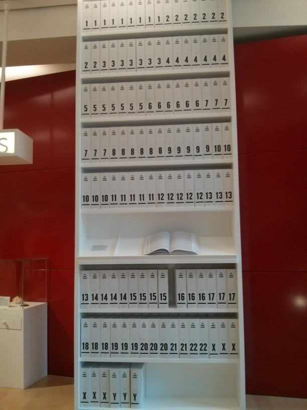
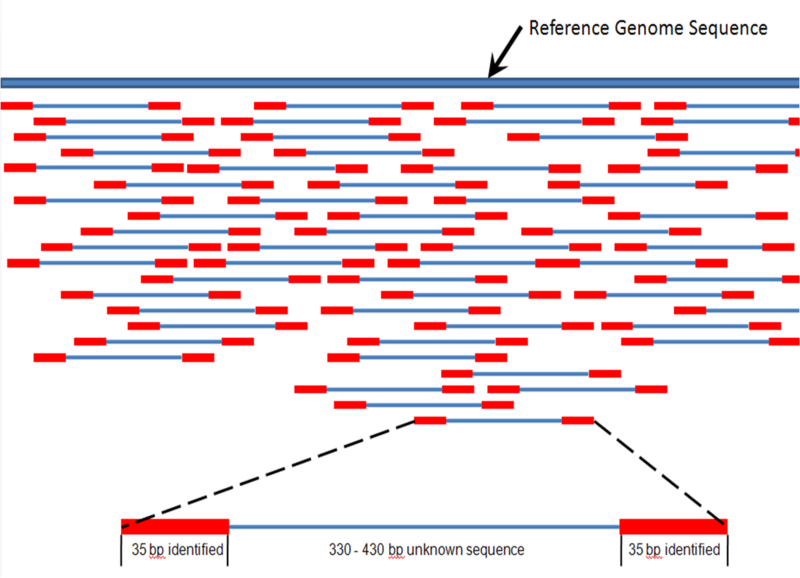
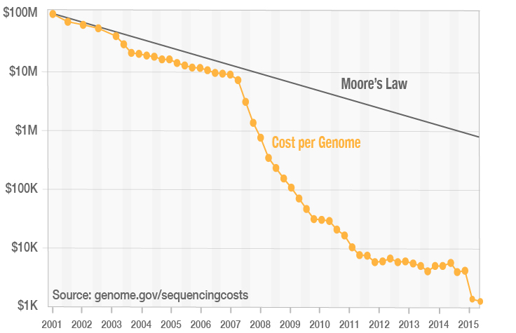

# BIOINFORMATIKA
Bio + informatika, presek biologije i informatike.  
Jako širok pojam. Učićemo o ljudskim ćelijama, DNK, RNK.  
Šta čovek i banana imaju zajedničko? 50% DNK.
- mačke imaju 70ak% ajedničkog dnk sa ljudima, a krave 80ak%.  

Dva čoveka imaju oko 99,99% zajedničkog DNK.   
RNK - Ribonukleinska kiselina.  
DNK - Dezoksiribonikleinska kiselina.  
- sadrži uputstvo a pravilno fukcionisanje organizma
- sastoji se iz parova nukleinskih kiselina
    - Adenin - Timin
    - Citozin - Guanin
- milijarda ovakvih parova
- parovi su kao merdevine, i one se uvijaju u dvostruki heliks. Dvostruki heliks se umotava dalje i transformiše i formira hromozome.
- hromozomi se nalae u jezgru jedru ćelije
- broj, veličina i oblik se razlikuju od vrste do vrste
- ljudi imaju 46 hromozoma, odnosno 23 para hromozoma, oni sadrže naš genom

Genom čini sav genetski materijal organizma.  
Geni su delići genoma i sadrže uputstvo za pravljenje proteina.  
Od par stotina do par miliona parova, 20-25000 gena.  
Možemo da gledamo kao kuvar:
- jelo je protein
- genom je recept za pravljenje
  
Geni često rade zajedno u grupama.  
Genom određuje osobine:
- da li ćemo imati duge trepavice
- daltonizam
- funkcionalnost sa manjkom sna, neko funkcioniše sa 3 sata sna
- super snaga, dobri u sportu
- razne bolesti

DNK se u računaru čuva kao niska karaktera (actg).  

### Kako se od nečega u jezgru ćelije napravi string u računaru?  
U početku je hemijskim reakcijama gledano kako raguju.  
Aparati sekvenceri iz uzorka (krvi, pljuvačke) ubacuju podatke  računar. Proces se naziva sekvenciranje.   
Pošto se zna koji se uparuju AT i CG nije potrebo čuvati oba, već samo jedan. Memorijska ušteda 50%.  

Human genom project
- cilj je bio prvi put dobiti sekvenca ljudskog genoma od početka do kraja
- primitivne tehnologije
- težak projekat
- 15ak godina i 4-5 milijardi $
- 1990-2003
- privatne komapneije pomogle
- dobili 1 ljudski genom
- prvi referentni genom 
- stampano fontom 4 u više od 130 tomova, 43 hiljade slova po strani
- 
- 3 biliona parova, oko 3GB prostora

Mašine koje prebacuju DNK u digitalnu reprezentaciju - illumnia, Oxford ... ? TODO  
Takmiče se koja će prva da napravi tačnu sekvencu, ali brzo.
Veličina aparature od pola sobe do manje od šake (minion).  
Ni jedna sekvenca ne može da se sekvencira od početka do kraja, već svi proizvoe deliće od par stotina do par hiljada parova.  
Ili će naći precizniji niz od par stotina parova, ili manje precizan niz od par hiljada manje preciznih parova.  

Reads - delići genoma, sekvenca nukleotida (actg) dužine oko par stotina. Readove sa svih živih hromozoma treba spojiti u kompletan genom, i to je glavni problem. Jako puno readova izađe, neki se preklapaju, ima duplikata, grešaka...  

Dva načina sastavljanja readova u genom:
* Assembley
    - kako su readovi stringovi možemo da poredimo svaki sa svakim
    - kao da slažemo slaglicu
    - izuzetno zahtevno, kvadratna složenost
    - praktično preklapamo dobijene readove i pokušavamo da ih složimo
* Aligment
    - koristi činjenicu da su ljudi slični 99.99%
    - iskoristimo referentni genom
    - tražimo mesto reada u referentnom genomu
    - manje zahtevan O(mn)
    - danas se koristi

Ako nemamo referentni model za neki organizam onda moramo assembley. 

### Šta kad imamo konkretnu sekvencu?
Varijante su razlike u odnosu na referentan model. To je jedna od 3 miliona razlika, jer ljudi ipak nisu skroz isti. Te ralike su mutacije.

- Single nucleotide variation
- Copy number variant
- Deletion
- Insertion
- Translation
- Whole geno duplication
- Duplication  

### Šta prouzorkuje ove razlike? Šta analiziramo?
Bionorm app za obradu i analizu podataka.  
Readovi nemaju 3GB kad izađu iz sekvencera, ima ih više da bi detektovali greške i lakše sklopili sekvencu, Preko 300GB. Zato se i radi na cloud-u.   
Troškovi po genomu kroz istoriju:

Danas se može dobiti za par stotina \$.  
Bila akcija 259\$ za sekvencu ljudskog genoma, tu dobijemo skupove podataka, readove i report.

Bioinformatikom se bave:
- inženjeri
- informatičari
- matematičari
- statističari
- genetičari