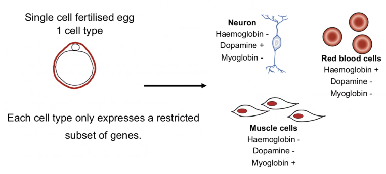
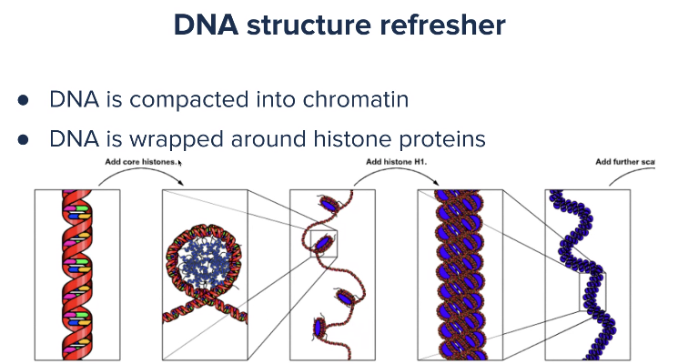
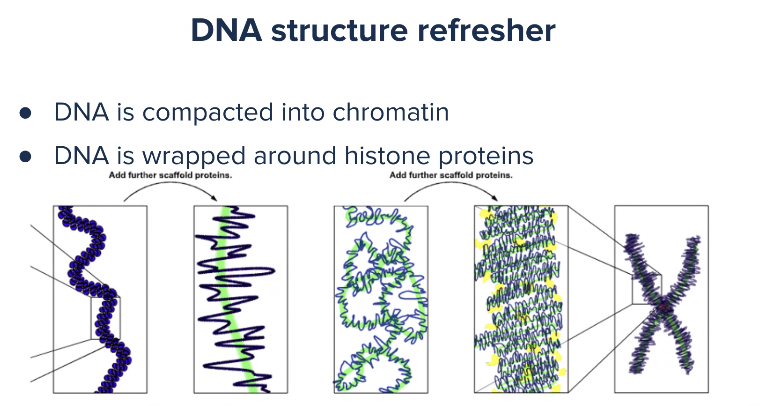
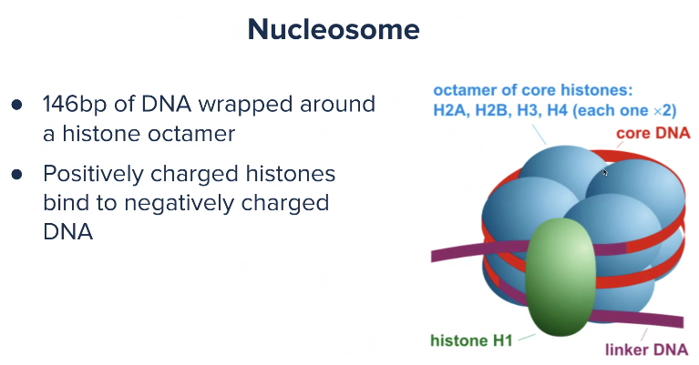
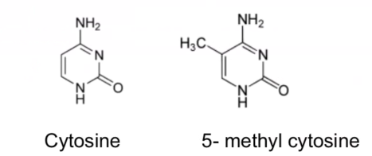
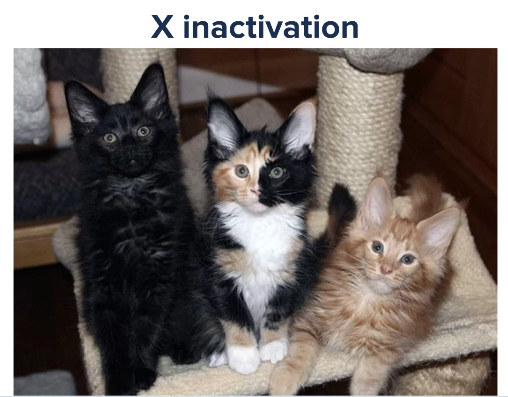

## ISPIT
- prvo teorija pola sata, 10-15 pitanja
- onda pola sata na računaru 
- 31.5

# Epigenetic controč - Epigenetika
- do sad je bila genetika
- epigenetika traži odgovor na pitanje kako je moguće da imamoisti genom u svim ćelijama jednog organizma a da se te ćelije ponašaju i izgledaju drugačije
- kako isti genom daje različite ćelije, tkiva i organe
- početak ogovora je da dnk nije ono što dirketno objašanjava funkciju ćelije, postoje međukoraci od dnk do funkcije ćelije
- centralna dogma molekularne biologije
- dnk se čita, dobija se RNK, pa se ti molekuli prevode u proteini, a proteini imaju funkcionalnu ulogu u ćelije
- koji proteini postoje u ćelije i kako interaguju
- gledamo gde se u lancu dn i rooteina dešavaju stvari koje uzokuju različit izgled i ponašanje
- nije dnk=funkcija
- imamo tri ćelije različitih ćelija
    - mišićna
    - neuron
    - crvena kvrna ćelija

- na koje tačke u proesu se može uicati
- ekspresija gena, u kojim slučajevima će neki gen biti očitan, u kojim neće i koliko sve to često
- počevši od polimeraze, ako oni ne mogu da nađu gen on neće biti pročitan
- na neki način sakrijemo početke i krajeve gena
- dnk je ogroman molekul, dužina 300 miliona širine 2, i on se nekako skladišt u nukleusu ćelija
- sam način organizacije unutar ćelije može iamti uticaj na ekspresiju gena
- sakrivneiji i naglašeniji geni se češće pronalaze
- imamo aktivne i utišane gene - do njih polimeraza ne može da dođe

### DNnk struktura
- dnk se veže za hisone, koji su drugi proteini
- 8 histona, za jedan se veže 140ak parova DNK
- nakon vezzivanja za istone je dnk eć nekako upakovan

- dodavanje histona H1 so dobijaju jš glomaznnije strukture
- postoji jako širok rapon strukturnih proteina

- nisu svi isprepletani u haosu već je ssitem manje haotičan, to se postiže odvanjem scafola proteina
- ceo proces pakovanja zavisi od drugih proteina
- različite koncentracije proteina mogu da utiču na to da li su neki geni dostupni, tj aktivni ili utišani

- nucleosom je pozitivn naelektrisan, a dnk negativna, pa se lepe jedni za druge
- sastoji se od 8 histona
- nucleoson ima repove, koji su ako bitan pri regulaciji ekspresije

### Hetero i eurohromatin
- u različitim ćelijama su delovi genoma dostupni a neki ne
- da bi neki gen bio dostupan mora da bude u delu ćelije gde je manje gusto
- ako je deo ćelije mnogo gust proteini za transkripciju neće moći da nađu gde da se zakačeza deljenje
- hromatin - glomaznija struktura za gradjenje dnk, više hromatina
- heterohromatin - gust napakovan
- euhromatin - manje gusto napakovan
- a od gustine zavis de li se neki geni čitaju ili ne
- nije u svim ćelijama isti hetero i euhromatin
- fakultativni heterohromatin - razlikuje su u različitim vrstama ćelija i tkiva, može se menjati tokom vremena
    - promena tokom vremene
    - npr promena boje kose, potamni od kad smo se radili, to je promena heterohromatina u vremenu
    - suncokret se okreće ka suncu
    - otvaranje i zatvaranje cveta
    - menjanju ekspresiju gena vremenom
- konsttutivni heterohromatina
    - delovi genoma koji su uvek gusto napakovani
    - centromere i telomere
    - središnji delovi hromozom i repovi hrromozoma
    - bitna strukturna uloga
    - x i y polni hromozomi
    - kod žena xx, jedna kopija je gusto napaovana a ostali se ponašaju kao ostale

## Epigenetske modifikacije
- ima ih puno
- moraju biti nasledne, tj moraju se održati pri deobi ćelije, i to epigenetiku čini pananom geneika
- ako je u jednoj ćeliji gen inaktiviran kada se podeli i dalje mora biti inaktivirna, u supotnom bi bilo mnogo haotično
- prve dve su najbolji istražene
- DNK metilacija - menja irektno dnk
- Modifikaacija histon - promene samih histona
- chromatin remodelling
- histone variation - imaju H1, H2 ... histoni, ako se zamene histoni u oktameru to može biti nasledno
- nonocoding RNAs 
    - ne kodiraju proteine, mRNA kodira, ali ima dosta drugih RNK
- nastajemo od jedne ćelije, i od jedne ćelije nastaje gomila tkiva i organa

## DNK metilacija
- dodvanje metil grupe na citozin, na peti molekul u prstenu
- 5 methyl cytosine

- bilo koji citzozin može biti metilovan, ali se najčešće metiluje citozin pored guanina
- pa se još naziva CpG 
- imamo 16 različih dinukleotida, AA, AC...
- očekujemo da su svi jednako učestali, ali su GC nukleotidi dosta ređi od očekivano, to je zato što metilovani citozini lako mutiraju u uracil
- U DNK je timi a u RNK uracil ?
- molekul uracila u deobi ćlija se prevodi kao timin
- postoje raznimehanizmi koji popravljaju takv greške, lociraju timin i amene ga uracio - popravka dnk
- neke te eške prolaze nepopravljneje
- vremenom su se citozini koji se lako metiluju izgubili, a to su citozini u gc
- metilacija je pristrasna
- učestalost cg je dosta manje od očekivanog, ali je dosta pristuna oko transcripton start mesta
- metilacija zgušnjava molekul dnk, tamo gde je puno metilovanih je molekul dosta gušći
- ako se radi metilacija onda se metiluje se ceo region, to su CG ostrva
- nalaze se oko početka gena 
- akao je molekul zgousnut ne može doćido ekspresije gena

### Inaktivancija X hromozoma
- jedan X hromozom je utišan, to je inaktive
- to se dešava na nivou kada jedinka ima još samo 16-32 ćelija organizma
- hromozom se utišava metilacijom CG nukleotida, i to svi hromozomi na jednom X
- boja dlake mačaka je na X hromozom, pa se vidi:

- kako je utišan x različitim ćlijama, daljim deljenjem imamo šarene mačke 
- kaliko mačke
- ako mačka ima bar tri boje onda je sigurno ženska mačka

- Cpg nukleotidi su na početku gena, ako su metilovani ne može da počne litanje gena
- što je dnk gušći to je stailniji, tj manje podložan raspadu
- sve nestabilne regije su uglavnom metilovane, to su repetitivni regije
- metilovani delovi se teže raspadaju
- funkcija DNK metilacije
    - prekidači za različite gene
    - održavaju stabilnost genoma
    - sprečavaju transpozicije
    - onkogeni metilovani - utišana ekspresija

### DNK metilacija i rak
- ako posmatramo genom ćelija raka i tražimo mutacije koje su dovele do astanka rak tj nekontrolisane deobe ćelije ima jako malo mutacija
- 5-6 mutacija je dovoljno da od zdrave ćelije da dođe do ćelije reka
- epigenom je potpuno rezličit
- utišavanje tumor supresora, aktivacija onkogena, nekontrolisano deljenje ćelija
- metilacija bolesne ćelije je sada obrnuta, cepanje ostrva, repetitivne ćlije

- zadatak: posmatranjem metilacije cpg ostrva otkriti koja je zdrava ćelija a koja bolesna

### Metilacija tokom starenja
- ne menja se geneski materijal
- menja se epigenetska slika
- epigenetečko reprogramiranje je proces menjanja epigena
- u početku se gameti kompresovano i metilovano
- spematozoid je totalno metilovan
- sama metilacija je zgušnjavanje
- nakon oplodnje kreće epigenetsko reprogramiranje, neka ostrva se demetilu
- već je kodirano šta će biti demetilovano a šta ne
- ponovna metilacija se javlja nastankom polnih ćelija
- potpuna demetilacija se događa u pluripotentnim ćelijama - od nje mogu da nastanu sve ćelije
- epigenetskim reprogramiranjem će se formirati ostale ćelije
- pluripontentne ćelije su primordijalne ćelije - od njih nastaju janjne ćelije i spermatozoidi
- pluripotentne ćelije su jako bitne u medicini
- nervne ćelije se ne dele, one nastaju od nekih pluripotentnih ćelija
- postoje mehanizmi da se od neke ćelije napravi pluripotentna ćelija, ili određeno tkivo
- izvadimo ćelije osobe, napravimo pluripotenteu, i napravimo tkivo, a dalje se pravi organ koji se može koristiti pri translatancija
- već se radi na tome 
- time organizam neće odbacivati organ

### Bisulfitno sekvenciranje
- sekvenciranje se i dalje vrši istom mašina
- jedina razlika je ...
- ... TODO
- uracil nastaje direktno 
- uracil se prevodi u tim 
- imamo miliardu kopija već nakon 30 ciklusa
- metilovani citozini su otporni na tretman bisulfitom
- svi citozini su u originalnom uzorku bili metilovani
- sekvenciranje je isto do na tretiranje bisulfitom
- 