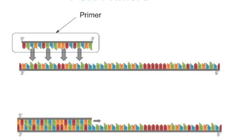
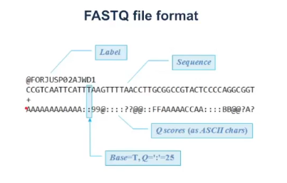

# Sekvenciranje
- centralna dogma molekularne biologije
    - proteini nastaju prevođenjem RNA molekula
    - RNA molekuli nastaju čitanjem DNK sekvenci
    - DNK sekvnce mogu da se umnožavaju replikacijom
    - translation: RNA -> proteini
    - transcription: DNA -> RNA
    - replication DNA -> DNA

Sekvenciranje
- digitalizacija genomsih podataka
- krenemo od grupe ćelija i završimo sa nizom karaktera

Zašto sekvencirati?
- geni - delovi genoma koji kodiraju proteine

BRCA1 i BRCA2
- tumor supresori, jedni od mnogih
- signaliziraju prestanak razmnožavanja kod kojih se javi greška, ukoliko ima neka kritična mutacija
- tumori - preterano deeljenje ćelija
- jedan se dobija od oca a drugi od majke
- jedna kopija je većinom dovoljna ako dođe do mutacije
- mutacija na BRKA genu uzrokuje rak dojke
- ako se sumnja na rak vrši se sekveniranje i gleda se da li ima mutacija

Sekvenciranjem se gleda da li ima mutacija ćelija.  
Gomila bolesti koje su uzrokovane mutacijama se rano otkrivaju bolesti i podložnost istim.  
Sekvenciranjem se širi znanje o organizmima.

Jedan DNK molekul u ćeliji se sastoji od 3 milijarde nukleotida.  
Ako odštampamo genom:
- 1 strana sa 3000 slova fonta 10
- kao 3000 knjiga GoT
- 10 000 knjiga UOR1 - Mitić
- 30 000 knjiga Mali princ 

Praktično nemoguće analizirati ručno.

Digitalizacija i obrada su praktično poslednji koraka sekvenciranja.  

DNK replikacija je prvi otkriven proces.

1956- Artur Karnberg
- otkrio kako se ćelije razmnožavaju, kako se nasleđuju
- prvi izolovao DNK polimerazu
- za samo 3 godine dobio Nobelovu nagradu za medicinu
- pokazao da imamo jednolančani deo DNK heliksa, na njega prikačimo kratku komplementarnu sekvencu - prajmer, prazan jednolančani ostatak se dopunjava

- enzimi su podskup svih proteina koji učestvuju u nekim hemijskim reakcijama
- u replikaciji učestvuje dosta enzima

Helikaza - razdvaja dvolanlčani DNK na dva jednolančana.  
DNK polimeraza - dopunjava jednu stranu.  
Neki dodatni enzimi popunjavaju eventualne rupe nakon dopunjavanja.  
Neki enzimi stavljaju prajmer. 

PCR - Polimerasa Chain Reaction.  
Razne polimeraze su izdvojene, imaju različite osobine ali istu svrhu.  
Taq polimeraza je otporna na visoke temperture.  
Molekuli teže da se raspadaju na višim temperaturama. Lanci DNK su povezazni slabim vezama. Na oko 80-90 stepeni celzijusa se raspada dosta proteina, i ljudska polimeraza. 

PCR postupak
- povećavamo temperaturu
- dvolančani DNK se razdvaja na dva jednolančana
- ubacimo polimerazu
- dobijaju se dva dvolančana DNK
- broj DNK molekula se duplirao
- nakon svakog ciklusa se broj molekula duplira, tj broj eksponencijalno raste
- dobijamo milijarde molekula sa kojima možemo nešto da radimo
- fragmeni od interesa se umnožavaju ovim postupkom
- u praksi se kreće sa 10ak hiljada molekula, a ne jednim

Krenemo od uzorka, i njega izdvojimo DNKa i ubacimo ga u PCR mašinu i koje dobijamo umnoške našeg ragmenta. U mašinu se ubacuje uzorak, preajmere, neukelotide, polikmeraza.  
Ubačene polimeraze odgovraju konkretnom delu DNKa. Umnožava se konkretna _sekvenca od interesa_. Povećamo temperaturu da se razdvoji DNK, smanjimo temperaturu da sa prikači prajmer, pa povećamo da bi radila polimeraza. Broj sekvenci koje nisu od interesa ne rate tako brzo.

Sekvenciranje celog genoma:
1. Fragmentacija
    - razbijamo DNK na manje sekvence
    - sonifikacija - tehnika razbijanja DNK zvukom
    - postoje i hemijske tehnike
2. Ligacija
    - nadovežemo deo poznate sekvence za koju znamo prajmer
    - ako ne znamo sekvencu unapred, npr za covid, vršimo PCR testiranje. Time saznajemo sekvencu virusa za koji ćemo dizajnirati prajmer.

Gel Elektroforeza
- sortiramo fragmene po dužini
- svaki fragment ima svoje naelektrisanje
- imamo nekoliko traka sa gelom na pločici
- prikačimo katodu i anodu
- fragmenti se kreću ka pozitivnom kraju (katodi)
- manji se kreću brže jer su lakši, a duži sporije jer su teži

Tehnike koje služe za modifikaciju nukleotida
- Labeliranje - obeležavanja
    - za nukleotid vežemo fluorescentan molekul, on emituje svetlost na nekoj talasnoj dužini
    - uperimo laser u naš uzorak a on emituje svetlos određene talasne dužine
- NGS
    - na bazu dodamo OH grupu - dobijamo dideoksi nukleotid
    - koristi se da ugradi dideoksi nukleotid u DNK lanac, on će se onda otkači i neće moći da nastavi replaikaciju
    
Dideoksi nukleotidim kontrolišemo kada prestajemo sa replikacijom DNK. Labeliranjem gledamo da li su se ugradili u našu sekvencu

Sanger sequencing
- odradimo PCR i dobijemo milijare fragmenata
- podelimo uzorak na 4 fragmenta
- u svakoj smeši od 4 radimo opet PCR
- dodamo dideoksi labelirane nukleotide - ddATR, ddCTP,ddTTP, ddGTP (adenin, citozin, timin, guanin)
- svi su hidroksilirani
- pored običnih će se ugraditi i labelirane baze, i kad se ugrade onda će prestati spajanje
- dalje vršimo elektroforezu
- stavimo smese u 4 trak i pustimo struju, najlakši će stići najdalje
- sada možemo da pročitamo našu DNK sekvencu
- jer na prvu se ugradio npr dideoksi Adenin, kad se ugradio prestalo je ugradjivanje, sekvenca je ostala jako kratka, pošto je kratka najbže će se kretati i stići će do vrha, identično za sve će se napraviti sekvence koje će se razslojiti po dužini
- tehnika se koristila 30ak godina
- dobro ako imamo kratke sekvence, ali ako su sekvence slične dužine nije dobro jer ih nećemo razlikovati na pločici

Sekvenciranje naredne generacije
- od 2000tih
- ne radi se ručno sekvenciranje fragmenata
- paralleno se sekvenciraju milioni fragmenata
- illumina - glavna firma koja pravi sekvncere
- kod ove tehnologije se na kraj molekula ne dodaje samo prajmer kao kod PCR, već sadrrže i neke indekse i komplementrne regije koje se kače na neke podloge
- Illumina flow cell - danas ima do 64 traka, svaka traka sadrži ogroman broj bunarčića, u svakom bunarčiću su sekvence u kojima se nalaze molekuli za koje će sa de zakači naš kraj molekula
- u svakom bunaru imaju jednolančani lanci DNK za koje će da se prikače naši molekuli preko adaptera
- čim se zakači fragment kreće polimeraza
- nee sekvenciramo ceo fragment, već u ciklusima dodajemo nukleotide, jedan će se zakačiti, kad dodamo slikamo i otkinemo hidroksi grupu da bi se nastavilo spajanje
- čita se sa obe strane 
- sekvenciramo da bi utvrdili sekvencu čoveka
- pri sekvenciranju dobijamo milione malih sekvenci - readova
- te readove treba da sklopimo u celu sliku
- neke sekvence se često ponalvjaju
- imamo npr sekvecnu 500 nuklotida, čitamo 100 s jedne i 100 s druge strane npr
- znamo iz kog bunarčića dolaze dva rida, tj da su upareni

Ilummeina sekvenceri
- dodajemo indekse sa prajmerima i ostalim
- možemo različite indekse za različite ljude ili različita tkiva odjednom

Izlaz je tekstulani fajl.  
Nakon svakog ciklusa slikamo u 4 boje - hvatamo fluoroscenciju jedne baze. Svaka od mrd ćelija mora da bude pokrivena sa nekoliko piksela. To sve je nekoliko terabajta. Osim boje viđene u nekoj ćeliji se čua i koliko smo sigurni da je to ta boja. Jer kroz cikluse signal ostaje sve zašumljeniji i zađumljeniji, jer se u jedan bunarčić zakači više boja, a može da se zakači  ipogrešna boja.
- Phread scoring: Q = -10 log10 P

Ovo sve se čuva u fajlu formata FASTQ.

Pored Illumine postoje i druge komapnije.
- Pacific Bioscinences koristi SMRT/ZMV Sequencing
    - čita jedan po jedan molekul, česte su greške pri sekvenciranju
    - češće greške
- Oxford Nanaope Techologies
    - umesto da slika propušta jednolančanu DNK kro neki protein i generiše neki električni signal koji beležimo
    - velike greške ali jeftine
    - jako mala sprava - prvo sekvenciranje u svemiru