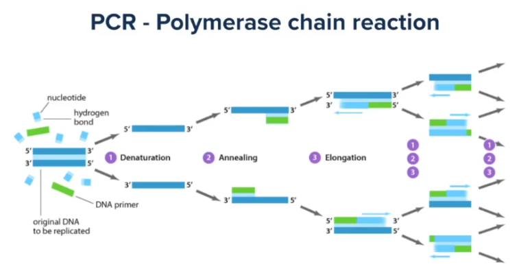

# Human genom project

Metoda umnožavanja DNK, jer nam je pri sekvecniranju bolje da imamo više DNK. 
Od male količne DNK se pravi puno.
Imeđu 20 i 40 ciklusa:
1. Denaturation - agrevamo DNK, pucaju veze i dobijamo dva lanca
2. Anneling - spusta se temperatura, na razdvojene DNK lance se kače male sekvence - prajmeri
3. Elongation - povećava se temperatura ali ne kao u prvom koraku, stvraju se uslovi za kačenje polimeraze, koja će omogućavati dodavanje komplementranih molekula, da bi dobili puni DNK.

U svakom ciklusu se pravi duplo više molekula. Krenomo od 1 molekula, nakon 30 ciklusa ćemo imati 2 na 30 molekula.

PCR greške
- AT veze su dvovodonične
- GC povezane sa dve vodonične veze što ih čini jačim
- to može da urokuje grešku
- polimeraza može da napravi grešku, 1 baza u 10000 pogrešno
- greška u prvom ciklusu uzrokuje greške dalje

Sekvencer izbacuje kraće readove.  
Ne postoji još uvek sekvencer koji će samo izbaciti celu sekvencu.
Parovi readova - sekvencer izbaci po read sa početka i kraja sekvence, znamo otprilke koji je razmak između njih:

Analogija onoga šta radimo:

Sastavljamo deliće...

Šta dalje?  
Povezujemo readove i pokušavamo da ih složimo po redu.

Genom Assembly
- Assembler
    - Greedy algoritam
    - gledamo koji parovi se najviše preklapaju, njih spojimo i nastavljamo postupak
    - jako zahtevno jer je ogoman broj sekvenci
    - treba jak računar i puno vremena
- Aligner
    - Referentni genom reprezentativan za vrstu
    - koristi čnjenicu da su dva ljudska genoma 99.995% slični
    - za čoveka je prvi izdvojen, kasnije su izdvojene sekvence i za druge vrste
    - referentni genom se sastoj od genoma 15ak ljudi
    - svaka individua se razlikuje
    - slažemo u odnosu na referencu
    - ide dosta brže
    - neće se svi poklapati, ali da u dovoljnom broju

## Human Genom Project

Internacionalna naučna inicijativa koja je imala za cilj da napravi prvi referentan ljudski genom. Tada je referernciranje bilo jako skupo.  
- 1990 - 2003
- najveća biološka saradnja ikada
- preko 3 mrd dolara
- 70% prvog genoma je došlo od iste osobe, čovek donirao DNK
- isti DNK je paralelno sekvenciran svuda po svetu
- želeli su da objav ljudski genom da bi pomogli celoj nauci
- paralelno je privatna kompanija Celera Corporation pokrenula identičan projekat, ali oni su želeli da ga patentiraju i trkali su se sa Human Genom Project-om
- privatni su želeli da patentiraju da svako ko koristi ovaj genom mora da im plaća, bili su svesni koristi
- tom trkom je projekat i ubrzan
- 7.7.2000. je objavljen prvi draft genom

Human genom:
- svaki genom se sastoji iz 23 para hromozoma
    - 22 autozoma
    - muškarci imaju 23. par XY, a žene XX
- postoji mitohondrijalni DNK
- od 3mrd baznih parova
- na tome je 20 000 gena koji kodiraju proteine, to je 2% genoma 
- egzom - deo genoma koji kodira proteine
- HG38 je aktuelna verzija, i dalje se korsiti 37
- stalno se apdejtuje, i dalje nije 100% sekvencirati

File formati
- FASTA file format
    - ekstenzija .fasta
    - tu se čuvaju reference
    - sastoji se iz dve linije:
    1. znak > i ime sekvence u narednoj liniji
    2. sekvenca, ACTGGCATC...
    - A - adenin
    - C - citozin
    - T - timin
    - G - guanin
    - U -uracil može da se nađe
    - R - ako nismo sigurni da li je A ili G
    - Y - ako nismo sigurni da li je C, T ili U
    - N - ako ne znamo koja je
    - hromozomi se labeliraju sa 1, 2, 3... ili chr1, chr2, chr3...

- FASTA index 
    - ekstenzija fai
    - često ide uz fasta fajl
    - da znamo na kojoj linija fajla se nalazi koja sekvenca
    - da bi brže pristupili sekvenci željenog hromozoma, jer je sam fajl 3GB
- FASTQ file format
    - za čuvanje redova koji izlaze iz sekvencera
    - stadardno 4 linije:
    1. @ ime reada
    2. sekvenca
    3. \+ neke dodatne informacije
    4. kvalitet sekvence - sigurnost da je dobro pročitano

Pysam - Python fasta interface
- modul koji omogućava lakše baratanje genomskim fajlovima
- napravimo parser: 
    - fasta = pysam.Fastafile(path)
- nazivi sekvnci 
    - fatsa.references
- duzine sekvenci
    - fasta.lengths
- dohvatanje sekvenci
    - fast.fetch(sequence_name, start, stop)
- brojanje od 0

CGC
- Allow internet acces - da bi mogli da instaliramo pysam
- instaliranje: !pip install pysam
- ! kao da koristimo linux terminal
- import pysam
- 