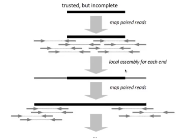

# Genom Assembly

- sklapanje sekvence

Recap:
- PCR - Polimerase Chain Reaction, metoda umnozavanja delova sekvence
- Flow Cell - staklena pločica na kojoj se dešava sekvenciranje
- Pair-end reads
- Sequnece reads možemo asemblovati i align-ovati
- Human Genom Project - jedna od najvećih naučnih inicijativa koja je imala za cilj da sekvencira prvi ljudski genom
- Koliko hromozoma imaju ljudi? 23 para, 22 para utozoma i 23. par XY za muškarce i XX za žene
- Centralne dogma: DNK pravi RNK, a RNK pravi proteine
- Geni su delovi genoma koji kodiraju proteine.
- Exom je eo genoma, 2%, kodira proteine
- FASTA file - fajl u kom se čuvaju referentni genomi
- FAI - indeksi da bi brže pristupali željneim delovima
- FASTQ file - za čuvanje readova kad izađu i sekvencera

## De novo assembly
- iy sekvencera ne iylayi cela sekvnca već manji delovi koji se ponavljaju i perklapaju
- sekvence koje dobijamo moramo da procesiramo
- asseembly je metod sklapanja velike sekvence od manjih readova, koristi se preklapanje
- u najboljem slučaju poredimo svaki par i tražimo preklapanje - za n readova to je $O(n^2)$
- jako zahtevno za veliki broj readova i readove velikee dužine
- gledamo preklpanje svaka dva reada koja imamo
- repeats - readovi koji se ponavljaju, su najveći problem ovde, 
    - npr sekvence ACTACTACTACT se teško sklapa jer ne namo gde je preklapanje

- error corrector uklanja greške koje su očigledne i koje je sekvencer napravio
    - jako bitan korak
- popravljeni readovi idu dalje, indeksiraju se a zatim asembluju

- mali readovi se preklapaju i spajaju u veće
- contig - sekvenca nastala preklapanjem sirovih readova
- i oni su razdvojenni
- scaffolding koristi informacije o pair-ends
- dalje gap closing

### Terminologija
- kidamo DNK na segmente i umnožavamo ih PCRom
- ne sekvenciraju se celi fragmeni, nego sekvenciramo sa jedne i sa druge strane freagmenta, a znamo koliki je razmak između delova
- paired end reads - ramak između read1 i read2 je manje od 500 banih parova
- Mate pair reads - ako je razmak veći od 1000 banih parova
- i jedni i drugi pomažu kasnije u asemblovanju
- k-mer - sekvenca dužine k
- k-mer dužine 3 jer tri-mer
- contig - sekvenca bez rupa, kontinualna
- scaffold - sekvenca dobijena asemblovanjem, ali može da sadrži rupe

Uticaj greške:
- kod aligmenta
    - ako imamo jednu bazu koja se ne slaže sa refrencom prettpostavićemo da je to greška sekvencera ili mutacija, i alignovaćemo taj segment
- assembly
    - greške kvare preklapanje, ako tražimo 100% preklpanje odgovarajući segmenti se možda ne preklope zbog greške sekvencera
    - poremeti se više od alligment-a

Readove iz sekvenera podelimo u neke k-mere, trebalo bi da imamo gausovu raspodeleu koliko se svaki k-mer pojavljuje.  
  
Možeo da pretpostavimo da je ova sekvenca koja se pojavila jednom greška, jer se 43x pojavila sekvenca koja se razlikuje za samo jednu bazu.  
Nekad se ovi readovi otstrane samo, ali bolje ih zadržati jer je bolje više podataka.

## Grafovi
- skpovi čvorova i grana
- usmereni ili neusmereni
- koriste se u algoritmima za genom assembly
- Najzastupljeniji tipovi grafova:
    1. de Brujin graph 
        - jednostavniji za računar i algoritme
        - zastupljenij kada se radi sa kraćim readovima
        - illumina
        - trenutno su učestaliji
    2. string graph 
        - jednotaniji za čoveka
        - češći za duže readove
        - pack bio

## De Brujin graphs
- za fiksan ceo broj k
    - čvorovi su svi k-1-meri u readu
    - grane - povezuju prefiks i sufiks k-mera
- k treba da bude neparno
    - jer se pored sekvence čuva i obrnuto komplementarna sekvenca
    - pa da bi znali u koju stan da gledamo, centralna baza pravi razliku
  
    
   

Nepovezan De Brujin graf 
  

Redudantnost:  
  

Ako se javi greška pri sekvenciranju:
  

  
- imamo petlju i ne znamo koliko puta ćemo prolaziti kroz nju  

Za jendu sekvencu i k može da se napravi samo jedan graf.  
U drugom semru ne važi, od jednog De Brujin grafa možemo da napravimo više sekvenci. Osim ako taj graf nije baš jednostavan.  
Kako izabrati k da bude brz a da dobro asembluje?  
- postoje alati koji izvrše asemblovanje dela podataka sa jednim k, tako za različite k pa predlože najbolje
- zahteno odrediti
- veće k će teže rešiti neku grešku, opasnost da graf bude slabo povezan, dosta odvojenih grafova
- za manje k dosta čvorova i dosta ivica, dosta ispovezanih ali onda ne znamo kojim putem ići
  

## Overlap graphs
- graf preklapanja
    - čvorovi - readovi
    - grane - povezuju čvorove koji se preklapaju
- kod overlap i string grafova ne moraju svi čvorovi da sadrže readove iste dužine 
- zadamo p - minimalna dužina preklapanja

  

## String graphs
- modifikacija ovrlap grafa
    - uklonimo redudantnosti u grafu
        - uklonimo readove koji se sadrže u drugom readu
   
    - uklanjanje tranzitivnih ivica
        - ako imamo x->y i y->z onda zadržimo samo x->z

## String & De Brujin graphs
- De Brujin je uniformniji, svi su iste dužine
  
- String je donji, a gornji De Brujin
- De Brujin grafovi se lako zakomplikuju

## String vs De Brujin graphs
- ako imamo grešku 
  
- De Bruijn graf pravi novu granu koja 'e verovatno imati malu težinu, lakše će izvršiti korekciju greške
- kos string grafa nema veze jer nemamo overlap, algoritam ne bi prepoznao grešku

### Dalje se pravi contig za graf
- prvo odredimo siguren contig-e, kuda graf sigurno mora da ide
  

  

- težina u grafu - koliko puta se pojavljuje sekvenca

Problem je ponavljanj, pa imamo potencijalne assemblie
  

### Dalje od contiga treba da napravimo scaffold-e
- oni imaju rupe za razliku od contiga
- uzimamo contige i koristimo informacije o paired i mate pair reads
- znamo koliki je razmak između parova
  
- znamo da su upareni i znamo koji je razmak između njih
- znamo da idu jedan do drugog iako ne znamo šta je u rupi

### Gas closing / contig extension
- isto korisimo informacije o pair endovima
- malo po malo proširujemo contig i zatvaramo prazninu
  

## Metrike
- assembly je dosta komplikovan pa je bitno da kad dobijemo reultat na kraju znamo koliko je dobar
- dve kategorije
1. Poredimo sa referencom
    - imamo referentan ljudski genom
    - internal consistency - procenat onih koji su se lepo uklopili
        - happy pairs
    - coverage - procenat baza koje su se alignovale na referencu
2. Nemamo referencu
    - NX, NGx of contigs / scaffolds
    
### Nx / NGx of contigs / scaffolds
- medijana - nije baš dobra metrika
- Nx vrednost - kao da oborimo sekvence, nadjemo sredinu i na koji contig pokazuje polovina to je vrednost Nx
  

- NGx prvo skalira sekvencu na procenjenu dužinu celog genoma pa onda radi Nx

- Asemblaton - takmičenje poput hakatona