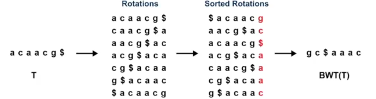
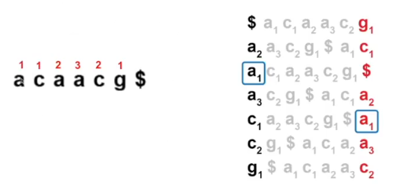
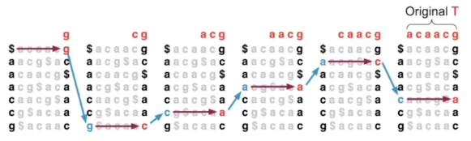
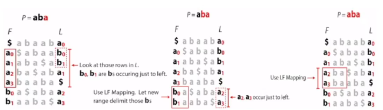
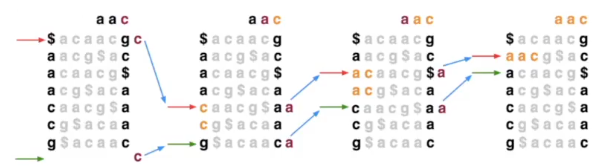
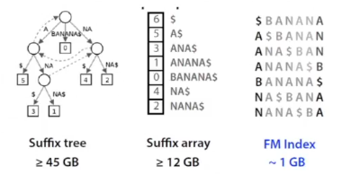
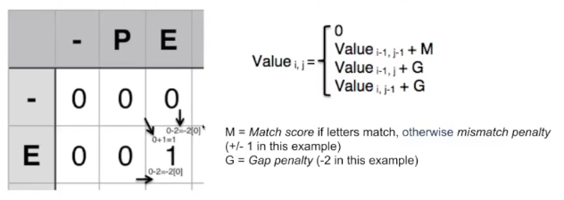
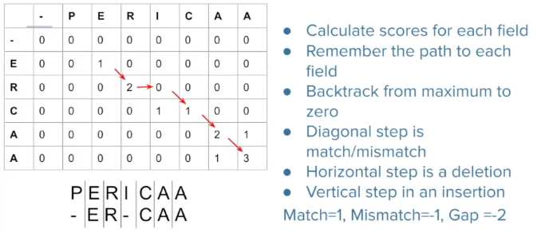
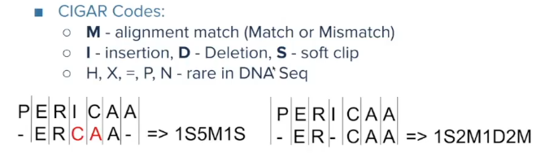

# Short read alignment

- DNA Sequencing - digitalizacija našeg referentnog genoma i uzorka koji zelimo da poravnamo na referentni genom

1. ekstrakcija DNK materijala iz uzorka
2. DNK se cepka - radi se fragmentcija, seče se na manje delove koje sekvencer može da koristi
3. denaturiacija dvostrukog heliksa
4. ligacija adaptera - dobijaju se sekvencijalni adapteri da bi se sekvence nakacile na flow cell
5. očitavanje baza, uglavnom se dodaju fluoroscentni nukleotidi, emituje se neka svetlost

Readovi se upisuju u FASTQ file.

Zadatak poravnanja je da se odredi pozicija našeg reada u referentnom genomu, i kako se taj read poravnava.
- read može perfektno da se poravnava, kada se sve baze poklope
- naš read se mapira na više lokacija
- read se ne mapia perfektno, već postoje razlike koje mogu biti posledica greške sekvenciranja, ili zbog same razlike između ljudi

### Kako ovo odraditi najefikasnije?

Problemi:
- komputaciono zahtevan
    - 1mrd readova a 1 ljudki genom
    - 3mrd baznih parova je Human Genom fasta
- Imamo dve sekvence: read i referentni genom
- trazimo gde se read pozicionira u referentom

1. Brute force - gruba sila
    - gledamo na svakoj poziciji kako se poravnava
    - ponavljamo dok ne nađemo perfektno poravnjanje
    - $O(n*m)$
    - (n-m+1)*m poravnjanja, tj poređenja
    - dosta sporo i neefikasno

2. Siffix arrays
    - razbijamo reference na n sufiksa koje na kraju sortiramo leksikografski
    - kako da pronalazimo u sufix array? Binarna pretraga
    - $O(m*log_2n)$ - vremenski dosta bolje
    - ali memorijski zahtevnije

3. Hash map
    - pravi se na osnovu k-mera (niske određene dužine)
    - za svaki k-mer se dodeljuje određenom bucketu
    - bucketi sadrže linked liste, gde je čvor svake liste jedan k-mer
    - ne moraju da se čuvaju svi mogući k-meri, već samo oni koji se javljau u sekvenci, što je dosta bolje
    - postoje razne hash funckcije, ali kod svake će se javiti kolizije
    - tj u jednom bucketu ćemo imati više k-mera
    - kreiramo hash tabelu, u buckete ubacujemo k-mere i njiove offsete u odnosu na referencu
    - kada gledamo naš read pokušavamo da ga smestimo u neki bucket
    - konstrukcija: $O(n)$
    - pretraga: $O(1) + O(z)$, z je pretraga linked liste u bucket-u

4. Burrows-Wheeler Transformation (BWT)
    - kompleksan algoritam, ne dolaiz na finalnom testu
    - prevashodno korišćen za kompresiju teksta
    - raspišemo sve ciklične rotacije, pa ih sortitamo
    
    - BWT je poslednja kolona ovako sortiranog
    - pri kompresiji $aaa$ možemo da zamenimo sa $3a$
    - ponavljanja su česta pa je zato velika primena
    - bitna karakteristika je LF (Last-First) mapping
    - Rank perserving property - svaki karakter ima određen rang prebrojavanjem koliko puta su se pojavili do neke pozicije
    
    - iako se redosled karaktera promenio redosled rangova ostaje isti
    - tj u prvoj koloni imamo $a_1a_2a_3$ kao i u poslednjoj
    - BWT je reverzibilna
    
    - g je pre $, pa gledamo g u prvoj koloni, pa šta je pre njega...
    - potreban nam je index transforma da bi mogli da pretražimo tekst
    - FM index - uz BWT uključuje još neke pametne strukture podataka, kao što je sufix array i tabelu checkpoint-a
    
    - tražimo u kojim sve redovima se nalazi aba patern u transformisanom tekstu, krenemo od najkraćeg sufiksa, i produžavamo ga dok ne prođemo kroz sve sufikse ili sve redove
    - ovim smo identifikovali da se naš red poravnava
    - još jedan primer
    
    - kako ubravamo pretragu narednog karaktera?
        - izračunamo broj pojavljivanja baza u poslednjoj koloni, možemo pariodično jer imamo LF karakteristiku
    - kako da nađemo poziciju ako se naš read alignuje?
        - na osnovu uzorka naše reference se pravi sufix array, mogu se koristiti svaki drugi red, jer imamo LF karakteritstiku

    - FM index se sastoji od:
        - BWT - dužina kao referenca
        - suffix array sample - 50% dužine reference
        - checkpoints - 15% dužine reference za svaki 448. red

Poređenje algoritama:

Do sad su bili algoritmi za exact match, ali to se uglavnom ne dešava. Ali većinom se readovi neće savršeno poklopiti pre svega zbog genomskih varijacija (prirodne, usled bolesti...).

Aligneri uglavnom koriste scored-based pristup
- računa odstojanje našeg reada od reference
- traži se pozicija koja maksimizuje scor
- uvek je kompromis brzine i memorije

Ovi aligneri se nazivaju još i two-step aligneri jer se sastoje iz dva koraka: seed and extend
- seed pronalazi okvirne pozicije na genomu gde se nalazi
    - iskoristi neku strukturu podataka, read se razdvoji na k-mere i koristi se za poravnanje
    - dobija se lista pozicija na koje se k-mer poravnava 
- extend detaljnij proerava kako se read alignure, tj dodeljuje određene scor-ove
    - kvalitativno opisuje kako se read poravnao
    - bazirano na dinamičkom programiranju, na osnovu rešenja podproblema sklapa rešenje glavnog problema
    - primer ovog koraka je Smith-Waterman aligner
        - baziran na dinamičkom proramiranju
        - popunjava tabelu
        - u polje moyemo da dodjemo dijagonalno, odozgo ili sa leve strane
    
        - G je gap penalty
        - tražimo max vrednost
    
    - CIGAR stringovi se koriste za opisivanje alignmenta
    
