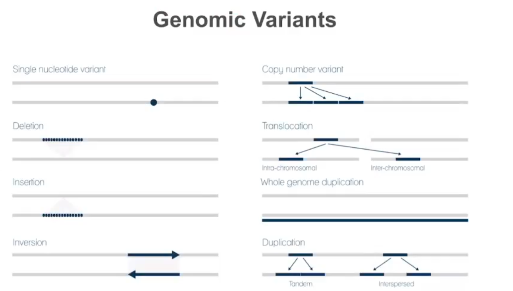

# Variant Calling

Korak u bioinformatičkim analizama ngs podataka koji dolazi nakon alligmenta/poravnjanja.
Alignmnet se korsiti u goto svim analizama ngs podata, neophodan je za sve analize, a sta se dalje radi zavisi od cilja naseg istraživanja.

Podsednik:
- sekvenciranje se sastoji od nekoliko koraka
- ekstrahujemo dnk-a iz uzorka
- mašina čita sekvence samo određene duzine a ne ceo genom, pa zato seckamo genom na fragmente
- na fragment dodajemo adaptere, sekvence koje reaguju sa flow cell i kače sa na nju
- baze na fragmentu intereaguju sa fluoroscentinm bazama i mi očitavamo signal koji emituju
- očitane skevence su i FASTQ fajlovi
- sekvenceri daju u kvalitet - pouzdanost očitane baze - korsino za dalju analizu
- tokom sekvnciranja kvaliteti baze mogu da opadaju, kako se prilazimo kraju sekvence, zbog nesavršenosti sistema, signal teze propagira kad smo vec popunili baze, zbog tog variranja signala dajemo quality scorove
- kvalitet baze - logaritam verovatnoce da dođe do greške
- 
- kada dobijamo fastq fajlove radimo poravnanje readova na referentni genom
- možemo imati jedinstveno ili multimapiranje- kada se jedna sekvenca može mapirati na više mesta
- kada imamo odsuptanja pri alignovanju to je potencijalna varijanta, i posmatramo kvalitet mapiranja

### Vrijante
- varijanta je odstupanje od originalne sekvence
- 

- može biti posledica mutacija, greška pri kopiranju - geška dnk polimeraze, može biti zbog dima ciareta ili uv zračenja
- dnk polimeraza - 1 greska u 100 000 baza, ali ima puno baza, pri svakom repliciranju 120 000 gresaka - varijanti
- 

- postoje dva tipa mutacija
1. nastale prirodno - germ-line mutaution, nasleđene
2. somatske mutacije - kancerogene, deluju na jedan deo tela

### Variant calling
- nema dobrog prevoda na srpski
- proces pronalaženja razlika referentnog genoma i posmatranog uzorka
- trebaju nam alignovani readovi da bi tražlili varijante
- postoje različiti tipovi varijate
- 

    - single nuclotid variant - single nucleotie polimorfizam - bar u 1% populacije
    - delecije - izbrisan deo sekvence koji postoji u referentom genomu, do 50 parova
    - insercije - dodatni deo koji ne postoji u referentnom genomu, isto do 50bp
    - inversion - postoji u referentnom genomu ali u obrnutom resledu
    - copy member variant - deo sekence koji se replicira nekoliko puta
    - trasnlokacije - delovi sekvence postoje u genomu ali u dva različita hromozoma
    - whole genom duolication - ceo hromozom se duplicira, duplaikacijea 21 hromozoma je Daunov sindrom
    - Duplication
- mogu postojati i komvbinacije ovih varijanti

- nisu sve mutacije loše, neke doprineose fenotipu, bolji sportisti, duže trepavice, manje sna
- neke muacije su poznate u populaciji

- Centralna dogma molekularne biologije
- dnk se transkripcijom prebacuje u i-rnk, a translacijom se formira protein
- a bez proteina ne bi funkcionaisali
- obrnut proces nije moguć
- egzom - deo dnk koji se prebacuje u i-rnk, deo rnk koji se koristi za proteine
- RNK kodira odredjenu aminokisleina, 
istu aminokislinu mogu da prave različiti tripleti
- codon table - kombinacije kodona i aminokisleine koju kodiraju
- 
 

- mutacije - do 50 bp su mutaicju
- preko 50 bp su strukturne mutacije
- kada se govori o variant callingu pre svega se misli na nalaženje SNV-ova i INDELS-a
- SNV - Single Nucleotide Variant
    - Bezznačajne 
        - Silent - prave se iste aminokiseline i ako ima izmena u kodu
    - Štetne
        - menja se amino kiselina
        - Missense
        - Nonsense
- Insertions/Deletions - INDELS
    - In frame - npr delecija ne uzrokuje promenu kodirane aminokiseline
    - Out of frame - menja aminokislinu koja se kreira

- 

- pileup - veliki broj readova se poravnava na referentni genom
- plavo - coverage, broj readova mapiranih na jednom mestu,
- posmtaramo celu sekvecnu mapiranu na genom
- ako gledamo vertikalno, po poziciji, idemo od n-te pozicije, gledamo sve baze mapirane na tu poziciju, pa pređemp na pozicju n+1 - gledamo pileup

-variant calling - provera da li se sve varijante mapirane na jendu poziciju poklapaju sa referentnim genom
- rezultat variant callinga se čuva se VCF formatu
- REF - Reference suporting reads, oni koji se poklapaju
- ALT - Variant (Alternative) supporting reads, alternativni, ne poklapaju se
- Depth/Covergae = REF + ALT (broj referenci koji pokrivaju datu pozciju)
- Variant Allele Frequency = ALT / (REF+ALT) - broj alateranivnih kroz broj ukupnih

- Genotip
    - ljudski genom - diploidan - 2 hromozoma
    - mutacije se mogu naći na oba hromozoma, ne jednom ili ni jednom, imamo ralzičite vrednosti koje mogu biti zadate u fajlu
    - 0/0 - oba se poklapaju sa referencom, homozigot
    - 0/1 - mutacija postoji na jednom, ali ne znammo na kom - heterozigotna mutacija
    - 1/1 - ista mutacija na oba hromozoma, homozigot
    - 1/2 ralziičite mutacij na oba hromozoma, heterozigot

- nacin mapiranja redova na referentni genom
- u idelanoj situaciji bi imali jednaku distribuciju readova - ali to nije tako u realnim slučajevima 

- 

- krećemo od prve pozicije hromozoma u referenci - tu je timin
- identifikujemo baze koje su se poravnale da zahvataju naše pozicije u referenci
- zaključujemo da nema mutacije jer se u referenci i readovima nalazi ista baza t
- 

    - contig - deo hromozoma
    - pos- pozicija na hromozoma
    - ref - baza na referenci
    - alt - baza koju smo očitali u readovima - ista u svim pa -
    - genotip - 0/0 - homozigot

- na pozocijama 2 i 3 imao istu bazu u readovima i na referenic, isto kao 1
- na pozciji 4 imamo mutaciju iz C u T
- posto je u svim readovima možemo reći da je sa sigurnošću na oba hromozoma mutacija, imamo homozigotnost
- 
- isto na 5oj i 6oj poziciji
- na 7oj poziciji je okej kao u prvoj
- pozicija 8 - pola readova ima dugačiju bazu u odnosu na referencu, daje genotip 0/1 - heterozigot
- 

- 9 međusobno različite, ali različite i od referente, heterozigot 1/2, različite mutacija na oba hromozoma
- 

- ljudi su diploidni organizmi
- 2 alela po pozicije, dve moguće varijante gena po poziciji, dve moguće mutacije po poziciji
- ako imamo 3 greške onda su dve mutacije a treća je greška sekvenciranja
- ako su sve baze iste u pileup imamo homozigot
- ako su iste a ne poklapaju se sa referencom 
- ostaviti za kasnije filtiranje

- 15 A baza i 15 T - heterozigot
- 1 timin baza i 29 A - verovatno greška sekvencera
- ako imamo 5-7, kako znamo koja je greška
- ako imamo dva slova, b i b', one pripadaju skupu baza
- n - ukupno baza
- k - broj b' baza
- mogući slučajevi:
    1. genotip je bb - k baza su greške a n-k je tačno
    2. genotip je b'b' - k baza je tačno a n-k baza je netačno
    3. genotip je bb' - sve baze su tačne
- treba naći verovatnoće za sva tri slučaja i izabrati najverovatniju opciju

- ispratiti pre-procesing korake pre variant callinga, oni mogu da poboljšaju rezultat
    - mark duplicate reads - markiramo pcr duplikate nastale pri inicijalnom dupliranju readova, jer se pcr duplikacijom eksponencijlano uvćavamo broj fragmenata
    - realignemnt - imamo neke poznate indele, pomereanje u zavsnosti od ekserimenta
    - rekalibracija baza, jer smo rekli da na krajevim opada kvalitet

- 

- posle rekalibracije su bolji kvaliteti
- 

- razulatat je VCF fajl, sadrži informacije o potencijalnim mutacijama
    - jednostavan format
    - sa \## počinju headeri
    - u liniji mogu biti informacije o više od jednog uzorka
- tabelarni prikaz VCF fajla

- example callers - softveri
- 

Softveri koji se koriste za variant calling:

- GATK Caller 
- DeepVariant caller - baziran na neuronskim mrežama
- Strelka2Germline
- VarScan2CopyNumber

- postoje tri tipa sekvenciranja koje daju odgovore na pitanja u zavisnosti od naše studije ili projekta
1. whole genom sequencing
    - sekvenciramo ceo genom
    - prosečan coverage je 30
    - možemo da otrkivamo nove varijante
2. whole exom sequencing
    - sekvnicranje dela genoma koji se koisit za kodiranje proteina
    - prosečan coverage je 100
3. targeted sequencing
    - podskup Exom sequencing
    - sekvenciraju se samo odeđeni delovi kodirajućeg genoma