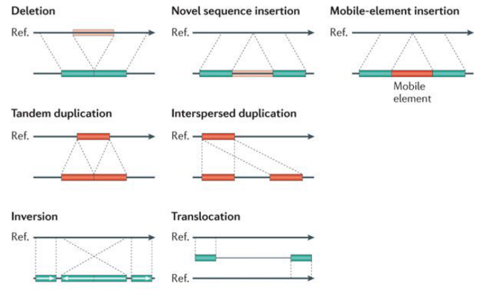

# Strukturne varijante

- genomske varijacije - bilo koja razlika između genoma jedinke i referentnog genoma, kao mutacije
- centralna dogma molekularne biologije
- 
- razlika u genoma nije uzrok različitog ponašanja ćelija, kada se gen prepiše u RNA varijanta će da se prenese, kada se konstruišu proteini nastaje problem
- jer proteini su ono funkcionalno u ćeliju, on vrši određenu funkciju

- različite trojke baznih parova kodiraju različite aminokiseline koje grade proteine

- SNV - Single Nuclotide Variants 
    - izmene koje utiču na jedan nukleotid
    - 8-10 puta više od kratkih INDELa
    - 
- INDELS - Small Insertions / Deletions
- SV - Structural Variations
    - utiču na više od 50 uzastopnih baznih parova
    - 10 puta ređe od indela
    - ređe ali obugvataju vise parova

- što je varijanta manja to je češća, veća je šansa da će jedan biti izmenjen
- 1 u 1000 nukelotida će se razlikovati od osobe do osobe kao posledica SNV
- 25% bolesti je povezano sa SNVevima i INDELIima
- dok je 20% poremećaja povezan sa strukturnim varijantama

- heterozigot - jedan od dva dnk lanca sadrži varijantu 
- homozigot - oba uparena lanca imaju tu varijantu

- nisu sve varijante mutacije
- da bi varijanta bila mutacija mora da se nađe u nekoj kodirajućoj regiji, da ima neki uticaj na izgled proteina
- procenat varijanti u kodirajućim regionima je manji od procenta kodirajućih regiona u genomu zbog survivorship bias - ako imamo varijanu koja ozbiljno utiče na organizam taj organizam neće ni postojati
- samo to što organizam postoji znači da varijanta nema strašno bitan uticaj, najopasnije varjante ne mogu da postoje

Strukturne varijrante su varijante duže od 50 parova, možda i hiljade parova.
20% bolesti u razvoju potiče od strukturnih varijanti.
1 u 1000 varijanti je SNV, 3 mrd bp, 3 miliona snv varijanti kod svake osobe.

### Tipovi strukturnih varijanti
1. Deletions
2. Insertions
    - ako su duži od 50bp onda su stukturne varijente
3. Mobile-element insertions
    - elementi koji lako prelaze se jednog mesta na drugo pri deobi ćelija
4. Duplications
    - može da se umnoži više puta, ne nužno 2
    - jedan niz umnožen više puta
    - može biti tandemski ili raspršeno
5. Inverzije
    - sekvenca se izvrne u odnosu na smer DNK lanca
6. Translokacija
    - ako dva hromozoma puknu pa se ne spoje kako su bili nego drugačije

- 

- copy number variante - duplikacije i delecije, menja se broj umnožaka

Strukturne varijante imaju veći uticaj od ovih manjih.  
Jedna strukturna varijanta može da znači gubitak regiona ili gena. Ako dođe do neke duplikacije onda možemo imati više gena pa i viška proteina koji može dovesti do problema. Ćelija ima izuzetno balansiranu koncentraciiju različiith proteina.

Sam procec čitanja genoma je kontrolisan loklanim i globalnim interakcijama u genomu. Da bi se genom pročitao prvo mora da se zakači RNK polimeraza, da bi počela da čita za nju moraju da se zakače neki enzimi. Stukturne varijante mogu da poremete globalne i lokalne interakcije.

Da bi se desila transkripcija potreban nam je TATA box, konkretna sekvenca za koju polimeraza može da se zakači, ako tu imamo varijante polimeraza se neće zakačiti.
Proximalni regiona - za njih se kače enzimi koji pomažu. 
SNV mogu da utiču na sva tri regiona koja su bitna.
Loklane se nalaze blizu početka čitanja gena.

- 
- 

Globalne interakcije, ne nalaze se blizu početka gde se kači polimeraza. Mogu biti proizvoljno daleko, ali je problem kada SV menja tu udaljenost. Kratki indeli i SNVevi ne mogu značajno da promene tu udaljenost. Promenom udaljenosti utičemo na to koliko će se često čitati deo.

Lokalne i globalne interakcije su otkrivene u poslednjih 20ak godina. Pre se mislilo da se genom deli u gene i junk dnk, posle je otkrivena važnost globalnih interakcija.

### NGS sekvenciranje sa kratkim readovima
- genetski materijal koji je izvučen iz tkiva se razbija na manje fragmente, dužine 400-700bp
- sa svakog kraja fragmena se čita 100-150bp
- znamo da dva para readova dolaze sa jednog fragmenta
- to koristimo pri mapiranju
- ako nam se jedna strana dobro mapira i znamo dužinu fragmenta, znamo ge se nalazi drugi read iako se ne mapira tako dobro

- 
- 

- exomi - kodirajuće regije, čine 1.5% dnk
- regulatorne sekvence čine 5%
- introni 
- 60% su repetitivne sekvence, mogu biit kratke ili dugačke, npr ogroman niz ACT-ACT... se teško mapira

Detekcija SV-a je teža od detekcije SNVeva i indela.

### Algoritmi za detekciju strukturnih varijanti
- ima ih 4 i oni se kombinuju 
- 
1. Read pairs
    - imamo dva reada koja znamo da dolaze sa istog fragmenta, znamo dužinu fragmenta
    - dužina fragmenta se često koristi
    - ali ako imamo deleciju ili inserciju to se poremeti
2. Read depth
    - signal koji govori koliko readova se mapira ne jednu koordinatu
    - znamo otprlike koju dubinu sekvenciranja vršimo, to varira, može 20-30
    - ako imamo deleciju dubina pada na 0, a ako imamo inserciju ona skače
3. Split reads
    - metod podeljenih readova
    - read se ne mapira  kompletnu na određenu sekvencu referentnog genoma, već se jedan deo mapira na jednu koordinatu a drugi deo na drugu
    - analizom ovoga možemo da vidimo ima li strukturnih varijanti
4. Assembly
    - isti metod kao sastavljanje readova kada nemamo referentni genom
    - ako imamo gomilu readova koji se nigde ne mapiraju, radimo assembley da bi dobili scafold, dugačka sekvenca koja se sastoji od readova koji se nisu dobro mapirali. ta veći read pokušamo da mapiramo

Zapis strukturnih varijanti:
- mogu biti jako dugačke
- VCF format nam je poznat
- 3 načina zapisa
1. Upišemo celu varijantu u VCF fajl   
    - u info se upisuje tip varijante i dužina
2. Iz info polja možemo sve da zaključimo
    - npr piše delecija dužine 105bp
3. Insericje ne mogu da se rekonstuišu iz podataka u info polju
- 

### SV Classification
- Balanced SVs
    - ne utiču na dužinu genoma
    - inverzije i translokacije
- Unbalanced SVs
    - utiču na dužinu genoma
    - insercije, delecije
    - CNV - copy number variation - deletions, duplications

## SV - Deletions
- read pair
    - razmak između readova raste
    - prividna dužina fragmenta raste
    - ako se poveća prividna dužina fragmenta to je indikacija da imamo deleciju
- read depth
    - manje readova
    - odokativno, ne dobijamo tačne koordinate SVa
- split read method
    - jedan read se "merguje" segmentima koji okružuju delecijom
- Assembley - javlja se praznina
- 

## SV - Insertions
- read pair
    - prividna dužina fragmenata opada
- read depth
    - ne mogu da se registruju ovim metodama
- split read method
    - jedan deo read se lepo mapira, i drugi, ali sredina ne
    - jako problematično ako imamo inserciju koja je duža od dužine reada 
- Assembley
- 

## SV - Inversion
- read pair 
    - nepravilno mapiranje i distance između parova
- read depth - ne može se primeniti
- split read method
    - jedan read se odeljen u dva segmenta od kojih je jedan okrenut
- Assembley
- 

## SV - Duplication
- red pair
    - nepravilno mapiranje i distance između parova
- read depth - povećava se
- split read
    - read podeljen u dva??
- assembley
- 

Danas su češće metode koje koriste duže readove
- jako korisne kada imamo strukturne varijante koje mogu biti jako dugačke
- glavni problem ovde je što je veliki error rate
- kod kraćih readova je manji error rate
- ovo je problem za detektovanje kraćih varijacija
- ovde su uglavnom single lengt readovi, nema uparenih, pa ne mogu da se detektuju inverzije, nemamo orijenataciju sa koje strane čitamo

###  CNV - copy number variants
- delecije i duplikacije
- zanima nas koliko umnožaka određene regije imamo, a ne nužno gde počinje i gde se završava
- dobra detekcija gledanjem dubine pokrivenosti readova

### Generalna procedura
- sira od samog zadatka
- read depth signal je jako veliki, info za svaki nukleotid, koliko se readova mapira na njega
- cnv calleri ne posmatraju pojedinačne pozicije već gledaju u prozorima
- neki moving average, gledamo koliko se radova mapira na svaki prozor
- ne znamo gde počinje i gde se završava varijanta, ali dovoljno da znamo okvirno da li je neki genom kopiran
- read depth nije isti u celom genomu, neki regioni se čitaju lakše a neki teže
- GC sadržaj - udeo guanina i citozina, ima ulogu u tome koliko se neki region teško čita
- GC bias, AT se vetuju sa 2 vodonične veze, a CG sa 3
- pri PCRu stalno razvdajamo dnk povećanjem temparture, to je stohastičan proces
- kao kod ključanja vode, stohastički se određuje koji molekul vode će preći u paru
- identično pri denaturciji proteina
- GC veze će teže da se razdvoje, tj trebaće im više vremena da se razdvoje, a radi se u više ciklusa iste dužine, pa će manje GC veza da se razdvoji
- regija sa AT npr ima coverage 30, a CG 15

Strukturne varijante su najčeše izolovane, tj nastaju nevezano a druge varijante. 
Hromoanegenza - u stanjima stresnim za ćeliju hromozom pukne i onda ga mehanimi u ćeliju nekako sastave. Tim sastavljanjem se javlja dosta translokacija. Tipovi raka koji dovode do hromoanegeneze se lakše leče jer je moguće napraviti ciljanu terapiju. Hemoterapija nije selektivna već gađa sve ćelije koje se brzo dele.
Hromotripsis je jedna vrsta hromoangeneze.
- 
