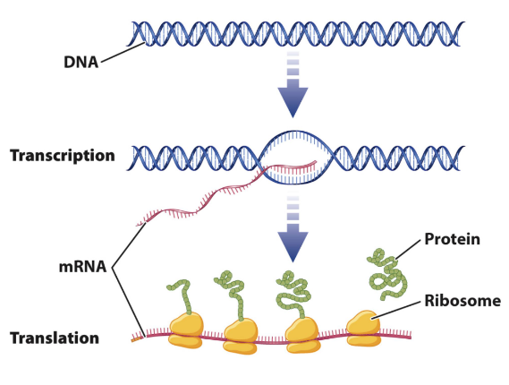

# Intro to RNA-seq

Cetralna dogma molekularne biologije
- na koji način od DNKa dobijemao proteine
- transkripcija - od dela DNK dobijamo molekul informacione RNKa
- translacije - informacione rnk se prevode na protein
- replikacija - dešava se svaki put kada se ćelija deli
- dnk materijal se udvostruči, dve identične kopije molekula dnk
- ćelija se dalje deli
- jedan organizam, svaka ćelija ima identičan dnk
- jedro svake ćleije je isto
- a nastali smo od zigota jedne ćelija pa svaka naša ćelija ima isti dnk

- ako svaka naša ćelija ima isti dnk, kako onda imamo različite ćelije, ćelija kose nije ist kao ćelija jetre
- kako se onda razlikuju?
- struktura rnk se razlikuje od ćelije do ćelije
- svaka ćelija ima različite biološke mehanizme koji definišu šta će ćelija da bude
- replikacija je važna jer skreće pažnju na važnost RNK
- različite ćelije imaju različitu zastupljenost RNK molekula

### RNK vs DNK
- RNK
    - makromolekul
    - jednostruki lanac
    - riboza umesto dezoksiriboze
    - Uracil umesto Timin
- DNK
    - dvostruki lanac
    - dezoksiriboza kao šećer u stastavu
    - dvostruki heliks koji održavaju veze AT CG

Postoje tipovi DNK.  
## Tipovi RNK melekula
- infomraciona rnk - messenger rnk
    - molekul rnk koji nosi kod za sintezu proteina koji će se sintetisati
- ribozomalna rk
    - ribozoi - organele u cizoplazmi
    - ulazi u sastav ribozoma
- transferna rnk
    - za prenos aminokiselina u procesu sinteze proteina

Protein
- protein je polpeptidni lanc sačinjem od različitih aminkiselina
- čovoek ima 24 različite aminokiseline
- aminokiseline se kače jedna na drugu i one prave polipepdidni lanac

### Transkripcija
- centralna dogma govori na koji način iz onoga u genima, tj dnk, nas čini ono što jesmo
- dogma opsiuje transkripciju i translaciju
- proces transkripcije podrazumeva generisenje molekula informacione rnk na osnovu koda iz dnk
- kada ćelija dobij signal da treba da sintetiše protein ona zna odakle da uzme informaciju za sintezu
- dnk se takoreći otvori gde treba, malo više sa obe strane
- enzim rnk polimeraza se zakači i prolazi kroz strand lanca i pravi komplementaran lanac
- 

- proces traje dok polimeraza ne naiđe na stop signal
- terminacija - otakči se rnk od dnk
- dnk se ponovo spoji kako je bio
- kada posmatramo strukturu gena, ona se sastoji od više delova
- egzoni su delovi bitni za sintezu proteina
- introni - delovi koji nisu važni za sintezu proteina, oni su između genoma
- rnk polimeraza prepisuje redom, pa će prepisati  introne, a oni nisu značajni za sintezu proteina pa treba da ih izbacimo
- automatski se izbacju introni koji nisu značajni za sintezu proteina
- preinformaciona rnk - inicijalan proizvod transkripcije, pre isecanja intrtona
- 

- ovakav lanac prolazi kroz ribozom i sintetiše se protein
- naši geni su postavljeni da jedan gen može da sintetiše više različitih proteina
- ovim podstičemo raznovrsnost procesa u organizmu
- ceo ovaj proces se naziva alternativni splicing - to je kombinovanje
- imamo 5 egzona, a za jedan protein možda nije potrebno svih pet već neka kombinacija
- rnk napusti jedro i ide u citoplazmu
- kada radimo transkripiciju redom prepisujemo baze na egzonima i intronima, introni nas ne zanimaju, ali zbog alternativnog splicinga mogu da se izbace i neki nebitni egzoni
- ne ide hajde da sve prepišemo pa izbacimo
- dok se drugi deo prepisuje na već prepisanom delu se već vrši splicing
- kompleksno i kad se uprosti
- informaciona rnk da bi napustila jedro mora da se sačuva od degradacije, jer su jedro i citoplazma jako reaktivna 
- dodaje se 5' kapa, a na kraj ide poli a rep, nešto kao zaštitni deo da bi čuvao lanac od degradiranja, da bi lakše došli do ribozoma
- 

- svaki molekul irnk koji je nastao kao proizvod transkripcije se naziva transkript
- sa jednog gena mogu da nastani različiti proteini, te različite forme se nazivaju izoforme, tj protini A, B i C
- 

- za sintezu proteina se koriste geni
- kod čoveka imamo regione koji se ne prpeisuju, plavi, nekodirajuci delovi koji se ne korise, tu su intrnoi, delovi zaduženi za kodiranje, najmanje su zastupljeni za čoveka
- koda bakterija je dosta drugačiji odnos, kod bakterije je mnogo kraći
- ovo što se ne prepisujue
    - dugo se mislilo da je to smeće, i da je nepotebno
    - otkriva se da ti delovi imaju regulatornu ulogu
    - delovi genoma koji učestvuju u procesima raznih regulacija
- 

### Transalcija
- proces u kom  na osnovu iRNK izvršavamo sintezu proteina
- 
- prepisali u jedru, imamo iRNKa, izbacili višak, zaštitili lanac, molekul napušta jedro i ide u citoplazmu
- u citolplzami prolazi kroz ribozom - ćelijske organele za sintezu poteina
- lanac prolazi između male i velike jedinice ribozoma, tu dolazi do sinteze proteina
- protein je polipeptidni lanac sačinjen od aminokiselina
- prplazi lanac, čita tri po tri baze i određuje koja aminiokisleina treba da se ugradi u polipeptidni lanac
- triplet se naziva kodon - na osnovu njega se određuje aminokiselina
- svaki kodon određuje aminokisleinu
- imamo odvojene signale za start i stop, start i stp kodona
- 
- ribozom čita triplete a ima 64 različite kombinacije
- imamo 24 aminokiseline
- različiti kodoni kodiraj istu aminokiselinu
- prostorna konformacija proteina je značajna, jer tek kad zauzmu položaj mogu da vrše svoju ulogu

#### GTF - gene transfer format
- jedan od formata za čuvanje RNK podataka
- oni prethodni, fasta, fastq, čuva podatke za čuvanje DNK
- a GTF je za rnk
- imamo kolone sa informacijama
    - na kom su hromozoma
    - odakle potiču
    - da li je egzon, start, stop, ...
- ima veliki broj različitih formata, nema neke standardizacije, zavisi od problema na kom radimo

### RNA-seq
- šta radimo sa podacima kada ih dobijemo
- sekvnciranje i alignment kod RNK
- sekvenciranje RNK
    - šta se nalazi u ćeliji od RNK materijala
    - izolujemo RNK iz ćelije - oni su jako dugi molekuli za naše tehologije sekvenciranje
    - dugačak molekul razbijemo na manje segmente - slično sekvenciranju DNK
    - konverzija RNK u DNK
    - to se radi jer je DNK stabilniji jer je dvostruki lanac
    - a imamo razrađene metode za sekvenciranje DNK
    - rutinski se radi, od RNK se pravi DNK
    1. Izoluje se RNK iz ćelije
    2. Rabiji RNK u manje fragmente
    3. RNK fragmenti se konvertuju u DNK
    4. dalje se dodaje adapter na ekvence, da bi mašina za sekvenciranje prepoznala
    5. PCR amplifikacija, umnožavanje moleklula
    6. isčitavanje baza
    - QC - provera kako nam je ceo proces prošao

### RNK alignment
- izolujemo DNK, sekenciramo da vidimo koje su baze koje smo upecali, izolovane fragmente alignujemo na referentni genom i gledamo odakle dolaze
- slično se radi za rnk, samo je za rnk kompleksnije
- nezrela rnk, ima egzone, introne
- onda rnk sazreva, tj zadržava neke egzone, neke egzone izbacujemo
- pa taj zreo rnk iseckamo da bi mogli da sekvenciramo
- tehnički imamo problem kako alignovati
- možemo da vidimo šta se nalazi u delićima koji smo sekvencirali
- možemo da posmatramo transkriptom - skup različitih transkripata koji mogu da dodju do dnk lanca, prilično pravolinijski i čist
- imamo određen broj transkripta koji se lepo mapira, a određen broj readova se nigde ne mapira, njih ne možemo mapirati na transkriptom, probamo da ih mapimo na genom, svaki od tih malih readova mapiramo na delove genoma koji su egzoni
- od nemapiranih readova dobijamo readove koji se mapiraju na egzone, deo readova ostaje nemapiran
- genom je takav da ima egzone i introne, nemapirane spanuje nekoliko egzona, ne može se mapiati na sam genom
- splice aware alignment - nepamirane readove iseckamo što sitnije, vidimo sa kog gena dolaze
- vidimo da se jedan deo mapirao na jedan egzon a drugi na drugi
- možemo da detektujemo ako je došlo do velike insercije ili delecije

- transkripton - skup svih transkrpata koji mogu da se jave u ljudskom organizmu
- transkrpton se dobija asemblijem kao i kod dnk

dajana.panovic@sbgenomics.com