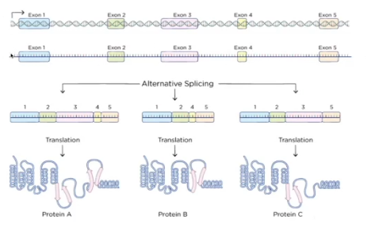
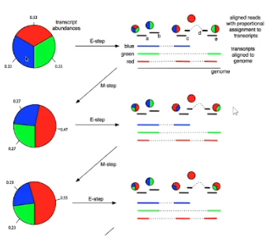

# RNA-seq analysis

- centralna dogma molekularne biologije
- imamo dvolančani DNA koji je približno isit u svakoj ćeliji organizma
- na osnovu informacija u dnk se pravi iRNK, tj informaciona rnk
- na osnovu iRnk je kasnije sintetišu proteini
- 
- pojednostavljen tok šta nastaje od čega
- proteini su katalizatori biohemijskih procesa,  obaljvaju strukturnu, regulaornu, transportnu ulogu...
- funkcija proteina je određena njegovom strukturom
- strukturu proteina određuje niz aminokisleina
- a niz aminokiselina je posledica koda u iRNK, koji dolai iz DNK
- protok ovih informacija je opisan centralnom dogmom
- DNK oređuje RNK, a oni određuju proteine, a proteini nas grade
- transkripcija - kopiranj informacija na iRNK posredstvom enzima polmeraze
- ne učestju sve RNK u transkriicij, neke imaju regulatornu ili gradivnu ulogu
- translacija
- splice nije na slici, proces uklanjanja introna, tj intronskih regiona iz pretprocesorske RNK

- 
- dvolančani niz DNK, imamo smer čitanja, na koju stranu ide gen
- čine ga egzoni, a neuokvireno su tzv introni
- region se prvo doslovno prepiše u prekursorku rnk
- sada je jednolančani niz identičan jednom od dva lanca DNK
- imamo intronske regije, i one se uklanjanju splicngom
- kao finalni rezultat nije bukvlano cut and paste egzonskih regiona
- neki egzonski regioni mogu biti preskočeni, i tako nastaju različiti transkripti, tzv izoforme
- transkript je jedna varijante gena
- translacijom od tri različita transkipta nastaju tri rzličite izoforme koje su tri varijante istog proteina
- proteini A, B i C mogu biti isti, ali različite varijante

- tri uzastopna nukleotida kodiraju istu aminokislinu, 
- rade manje istu stvar ali su neke fome efikasnije od drugih, jer različite aminokisline mogu da grade isti protein

- isti uređaj se koristi za čitanje DNK i RNK
- retko se radi variant calling za RNK
- još ređe se radi assembly transkriptoma
- transkriptom je katalog skvih transkripata u ćeliji organizma, kao genom gena
- asembly se radi ako radimo na nekom novom organizmu, novoj vrsti
- ako radimo sa humanim semplovima, ako istražujemo neke pacijente onda ćemo koristiti gotove referentne fajlovi

- RNA-seq se koristi za utvrđivanje relativne zastupljenosti različih gena ili transkripata u semplovima
- možemo da tražimo one koji su diferencijalno eksprimirani
- gen je eksprimiran ako smo detektovali rnk doijen prepisavanje sa tog gena
- diferencijalno eksprimovan - kada primetimo statistički značajnu razliku u ekspresiji u odnosu na drugu grupu semplova 
- nprpostoji neka fenotipska karakteristika koja će na podeliti semplove u neke grupe
- npr radimo klinička ispitavanja leka i imamo grupu pacijentata koji unose neku supstancu A, i neki dobijaju placebo 
- gledamo da li ima razlike u ćelijama ciljanog tkiva, tj koji geni se  transkribuju i ispoljavaju u vidu proteina

- DNK je relativno nepromenljiva
- imaju kompanije kojima pošalemo uzorak a one ga sekvenciraju
- jednom možemo da sekvenciramo genom i da ga čuvamo na eksternom hard diskom, pa da ga kasnije koristimo

- RNA je dinamička sekvenca
- RNA ma dosta menje semplova, njih smo generisali u nem konkretnom trenutku u cilju nekog istraživanja
- dok dnk ima dosta više semplova

### zašto kvantifikacija?
- želimo da vidimo čega koliko ima
- zanima nas npr razlika bolesnog i zdravog tkiva, pravih i placebo pac ijenta

## Transcriptmics
### Quantification
- 
- semplovi su redovi,a kolone featuri, npr istražujemo cene nekretnina u Bg, kolone su cena, kvadatura, broj soba, br kupatila...
- mi radimo sa velikim podatcima, tj semplovima pa ima mnogo više redova nego kolona
- kod genomskih podatak obično imamo feature kao redova, a samplovi su kolone
- kvantifikujemo uzorak RNK 
- imamo preko 50-60 hiljada gena
- sekvencianje postaje sve jeftinije, ali dalje skupo
- 50 hiljada gena, 15 semplova
- matriac kvantifikacija za neki dataste
- jedan element matrice ima ekspresiju izraženu nekim brojem gena u redu i u semplu j
- heat mapa kvantifikacija na nekom datasetu
- klasterovano po genima, vrući geni desno, a hladni levo, neam neke sredine, sve je više eksprimovano, što nije tako u prirodi

- očekujemo da će bit isti broj down regulated i up regulated 
- nije prikazana velika većina gena na slici

### Problemi kvantifikacije
- ono što izađe sa sekvencera ide FASTQ fajlove a to se onda alignuje na neku referencu, dobijamo VAM fajl
- za svaki read imamo gde bi se mapirao, tj od koje do koje pozicije na nekom hromozomu
- ako imamo read koji pada na egzom lako utvrdimo da se tu mapira, 
- ali nismo sigurni da li pripada transkriptu C1 ,x2 ili x3
- 

- kada nas zanima kvantifikacija na nivou transkripta, koliko ima kog transkripta
- koristi se expectaion Maximization algoritam koji se (ELM) često koristi u geomici
- ovde se korisi za kvantifikaciju nivoa transkripta
- koristi Maximum likelihood estimation
- numeričko rešavanje problema kvanitifkacije
    - imamo tri transkripta, plavi, zeleni i crveni
    - imamo readove a, b, c, d, e
    - vidimo da je d splicovano mapirano
    - 
    - krenemo od pretpostavke da se svaka javlja sa jednakom verovatnoćom pa korigujemo
    - vidimo da se read A mapira na deo koji je prisutan u sva tri transkripta, pa nam to ništa ne znači i prepisujemo prajera
    - read b olazi sa plavog ili zelenog 
    - c može sa plavog ili crvenog
    - i tako dalje
    - nakon ovoga sumiramo i normalizujemo prajer
    - dobijamo modifikova prajer i nastavljamo iterativno
    - u nekom trenutku konvergira
- problema normalizacije, svodi se na pitanje da li možmo da poredmo ekspresiju gena između jednog ili grupe semplova 
- 
    - jedan sample a dva gena
    - gde je jedan gen duplo duži
    - za duži niz dobijamo više framenata
    - ne možemo na osnovu sirovih kvantifikacija da kažemo da je transkript 1 više eksprimovan, jer je sam molekul dosta duži
    - moramo da ramotrimo i koliko smo duboko sekvencirali, jer smo negde možda generisali više readova
    - moramo da normaliujemo u odnosu na dužinu gena i library size (koliko readova je generisano)

### Normalizacija podataka
- možemo da imamo kratak transkript i veliki coverage, možemo da imamo kratak transkript...
- 
- izražananje Fragments per KiloBase Milion Reads, tj broj fragmenata po kilobazi, gleda se na hiljadu baza
- 
- jedina razlika je  redosledu
- poredimo nivoe između semplova
- gledamo da li je u jednoj grupi en eksprimovan više ili manje

### Diferencijalna ekspresija
- naš problem je da identifikujemo one gene od 10ina hiljada gena koje smo kvanitifkovali koji su zapravo diferencijalno ekspirmovani, nivo ekspresije gena je slučajna varijabla
- nije nam dovoljno da izmermi na jednom i drugom mestu, nađemo razliku, već nas zanima i neka statistička sigurnost, koliko je robusan zzaključak i da li bi moagao da se ponovi za novi sampleiz iste populacije
- imamo dva uzorka ćelija, jedan su normalne ćelije a drugi mutirane ćelije
- zanima nas koji su geni najviše ugroženi i koji je su uzrok i posledica, koji bi marker mogli da pratimo
- talasići su kao regioni u hromozomu
- 
- u nekim mutiranim ćelijama imamo veliku ekspresiju nekog gena

- klaično testiranje hipoteze u statistici
    - nulta hipoteza kaže da nema razlike u nekim srednim vrednostima između populacije
    - a ralika je posledica eksperimentalne greške
    - p definišemo kao neku verovatnoću
    - ako odbacimo nultu hipotezu onda važi alternativna

- u _human_hg19_2015.gtf_ se nalai oko 26 hiljada gena i 54 hiljade transkripata
- ako imamo 1200 od 20 000 gena pronađeni statistički načajno sa trasholdom 0,05, bez korekcije možemo da očekujemo da je 0.05*20 000 = 1000 false pozitivnih, loš rezultat
- rešenje je multiple testing
- Bonferroni pomnoži p_value*total_of_tests_performed
    - jako konzervativan, sakriće neka otkrića