# ISPITNA PITANJA


### `1` Komponente mreže, tipovi veze, primeri mreža, mreže prema dimenziji, međumreže.

Komponente mreže su:
- Aplikacija koja korisit mrežu (Skype, browser, Amazon...)
- Računar - završni čvor mreže koji podržava aplikaciju (laptop, desktop, tablet, mobilni...)
- Ruter - unutrašnji čvor mreže, ili usmerivač, proslđuje poruke između čvorova (uređaji kojima pristupamo mreži, pristupne tačke, kablovski, DLS modemi)
- Veze/ kanali - žičano ili bežično spajaju čvorove mreže

Tipovi veze:
- Puni dupleks - u oba smera istovremeno veza, karakterisitična za današnju komunikaciju, mobilna telefonija, komunikacioni kanali paralelno ili pseudoparalelno šalju u oba smera, mogu se koristiti različite frekvencije.
- Polu-dupleks - šalje u oba smera ali ne istovremeno, naizmenično se šalje signal kada je potrebna dvosmerna komunikacija, voki-toki, policija, brodovi; jedna frekvnecija u oba smera, konvencija stop
- Simpleks - jedan smer kretanja podataka, nekad je dovoljno, npr radio samo emituje saržaj, tv signal, nema povratnih informacija

Primeri mreža:
- WiFi (korisiti tehnički standard 802.11) - mreža malog dosega (stan, kuća), sistem baziran na mikrofrekvencija, slabi prolaskom kroz zidove
- Ethernet - žičana realizacija lokalne računarkse mreže, podrazumeva manji prostor, najpouzdanija
- ISP - Internet Service Provider, mrežna infrastruktura u vlasništvu neke kompanije, koja povezuje male mreže u veći celinu; mts, sbb... Naplaćuju opremu u zavisnosti od količine saobraćaja; korisnici plaćaju lokalnim porvajederima, a loklani hijerarhijski globalnim
- Mobilna telefonija - 2G, 3G, 4G
- Bluetooth - bežična mreža vrlo malog dosega
- Telefonska mreža
- Mreža satelita

Mreže prema dimanziji:
- PAN - Personal Area Network, neposredna blizina, relativno slab prenosni kapacitet, jedan ili dva uređaja se neposredno povezuju; Bluetooth (dva telefona, telefon-racunar, slušalice, miš), NFC.
- LAN - Local Area Network - jako široko rasprostranjena, mreža unutar institucije, zgrade... ne mora da ima izlaz na internet, npr pristup loklanoj bazi firme; WiFi, Ethernet
- MAN - Metropolitan Area Network, mreža većeg gabarita, gradsko područje; Kablovska, DSL.
- WAN - Wide Area Network, mreža na nivou države, veliki ISP, Telekom, SBB.
- Internet - mreža svih mreža, na nivou planete

Međumreže - internet
- Dobija se povezivanjem više različitih mreža, konglomerat više lokalnih mreža
- The Internet - internet koji svi koristimo, mreža svih mreža

--- 

### `2.` Protokoli i slojevi
Protokoli i slojevi su glavni mehanizam struktuiranja koji mreži daje modularnost.  
Pri raslojavanju svi slojevi moraju biti poređani u nekom redu i svaki sloj ima jasnu ulogu. Viši slojevi su bliži aplikaciji a niži su bliži hardveru.  
Svaka instanca protokola komunicira sa svojim parnjakom (peer) upotrebom odgovarajućeg metoda. U stvarnosti ne komunicairaju direktno već svaka instanca koristi usluge (servise) sloja ispod.
Protokoli su horizontalni a slojevi vertikalni
```
|                       |  
X <-------------------->X  
|                       |  
Y <-------------------->Y  
|                       |  

```
X-evi su parnjaci i oni mređusobno komuniciraju, 
Y-i nude servise X-evima, jer oni ne mogu direktno da komuniciraju, npr jedan govori engleski drugi nemački a oba govore jezik filozofije i mogu da filozofiraju na svojim jezicima. Y prevodi na neki međujezik i Y-i se međusobno razumeju, a onda svaki Y prevodi na jezik svog X-a. X i Y su protokoli. Y je donji sloj i nudi usluge gornjem.  
Protokol je konvencija, način njihove komunikacije.  
Npr jedan šalje nešto drugom, ta poruka ide niz slojeve i kao da se pakuje u kovertu, onda se to zapakovano pošalje. Na drugoj strani se poruka otpakuje i pomera naviše.  

Poznati protokoli: TCP, IP, 802,11, Ethernet, HTTP, SSL, DNS...   
Protokol stek - skup protokola u upotrebi. Npr za pregledač: HTTP, TCP, IP, 802.11.  
Enkapsulacija - mehanizam slaganja slojeva protokola. Kada poruka pređe na naredni sloj dodaju joj se informacije kao omotač, svaki sloj dodaje svoje zaglavlje.  
Sadržaj nižih slojeva je bliži spoljašnsti poruke, HTTP se umotava u TCP koverat, pa se dalje pakuje u IP koverat, pa u 802.11 koverat, i tako se šalje. Na drugoj strani se otpakuje.  
Pristigla poruka se prosleđuje protokolima koje koristi, jer se na istom sloju mogu koristiti različiti protokoli.  

Prednst raslojavanja - bolja organizacija, podela posla, lakše održavanje, prikrivanje informacija i ponovna upotreba, povezivanje različitih sistema.  
Konverzija poruka je prednost, npr browser salje http zhatev preko WiFi na server koji koristi Ethernet.

Mane raslojavanja - memorijski troškovi - jer se poruka napakuje pa svaki sloj košta, prikrivanje infomracija, ali aplikativni sloj možda želi da zna da li se šalje žično ili bežično.

--- 

### `3.` Referentni modeli protokola i slojeva, jedinice podataka, organizacije za standarde

OSI model sa 7 slojeva se ne koristi previše u praksi:
1. Aplication - funkcije za rad sa porukama za korisnika, krajnja poruka na viberu npr
2. Presentation - konverzija za različite reprezenacije, npr da nije bitan format
3. Session - upravljanje sesijom, uspostavlja i održava sesiju između pokrenutih programa na predajnoj i prijemnoj strani
4. Transport - dostavlja segmetne, uspostavlja komunikaciju izmeđ aplikacija zadnjeg sloja i potvrđuje prijem poruke
5. Network - radi sa paketima, adresiranje, rutiranje, kontrola saobraćaja
6. Data link - slanje okvira - skupova podataka sa dodatnim informacija za detekciju greške
7. Physical - slanje bitova putem realnih fizičkih kanala, žično ili bežično.

U praksi se koristi model sa četiri sloja:  
1. Aplikativni - programi koji korisit usluge mreže
    - SMTP, HTTP, HTTPS, RTP, DNS
2. Transportni - zadužen za razmenu podataka imeđu čvorova
    - TCP, UDP
3. Internet - slanje paketa putem raznorodnih mreža
    - IP
4. Veza - fizičko slanje podataka putem medijuma.
    - Etherent, 3G, Cable, DSL, 802.11

Jedinice podataka u različitim slojevima
- Aplikativni - poruka
- Transporni - segment
- Mrežni - paket
- Sloj veze - okvir
- Fizički - bit

Organizacije i standardi:
1. ITU - Internet Telekomunicatin Union za telekomunikacije
    - ADSL, MPEG4, G.992
2. IEEE - za komunikacije
    - 802.3, Eternet, 802.11, WiFi
3. IETF - za intenet
    - RFC, DNS, HTTP/1.1
4. W3C - za veb
    - HTML5, CSS

--- 

### `4.` Fizički sloj, uloga, pojednostavljne model, kašnjenje, BDP, primeri

Fizički sloj služi za slanje poruka putem komunikacionog kanala. Šalje ANALOGNI signal, fizičku veličinu (svetlo, električnu struju, zvuk...). Nemamo informaciju o bitovima koji su digitalni. Digitalno je zapravo interpretacija analognog.    

Pojednostavljen model:  
Imamo uopšten fizički kanal kog karakterišu:
- Protok (brzina, kapacitet) - meri se bitovima u sekundi b/s, interpretirana posledica fizičke veličine.
- Kašnjenje u sekundama, vreme od kad poruka krene dok ne stigne, deli se na kašnjenjne prenosa i propagacije.  
Druge karakteriste komunikacionog kanala: da li emituje ili ne, raspodela verovatnoće greške, otpornost na šum i spoljne ili unutrašnje uticaje...

Kašnjenjen - vreme potrebno da poruka stigne na odredište.
- Kašnjenje prenosa (Transmission delay) - Vreme potrebno da se M bitova postavi na komunikacioni kanal, brzina apsorpcije bitova, brzina generisanja fizičke veličine koja će predstavljati bitove u komunikacionom kanalu 
    - T-delay = M(b) / B(b/s) = M / B (s)
- Kašnjenje propagacije (propagation delay) - vreme potrebno da bitovi prođu kroz komunikacioni kanal
    - P-delay = dužina_kanala / brzina_signala(2/3c) = X s
    - c - brzina svetlosti, nije svuda ova brzina, zavisi od medijuma - WiFi, optika...

- Ukupno kašnjenje: L = T + P = M/B + P
- Kašnjenje uzrokuje dugačka veza ili mali protok, uglavnom je jedna faktor dominantan

BDP - Bandwidth-Delay Product  
Protok-kašnjenjenje proizvod. Količina podataka prisutna na kanalu u nekom momentu.  
Ako poredimo sa vodovodnom cevi, B je površina cevi a D je dužina cevi: BDP = BxD je zapremina.  
Meri se u bitovima b/s x s = b.  
Mali za kanale u loklanim mrežama poput WiFia, a velika za velike debele kanale.

Priemer BDP:  
Slanje od A do B dugačkim optičkim kablom  
B = 40Mb/s - protok  
D = 50ms - kašnjenjne  
BDP = 40 * 10^6 b/s * 50 * 10^-3 s = 2 000 000b = 2000Kb = 250KB - ovo je veliki BDP  

Primer kašnjenja:  
P = 5ms = 5 * 10^-3 s - propagation  
B = 56kb/s = 56 000 b/s  
M = 1250B = 10 000b  
L = P + D = P + M/B = 5 * 10^-3 s + 10 000/56 000s = 5 * 10^-3 s + 0,1789s = 184ms

--- 

### `5.` Žičani i optički komunikacioni medijumi.
Komunikacioni medijum propagira signal sa informacijama u vidu bitova.  
Žičani medijum  
- kroz njega protiče električni signal - struja

- Upredene parica
    - čest iako prvi nastao, korisit se za LAN kablove i telefonske linije, UTP (Unshielded Twisted Pair) kabl
    - uvrnute bakrane žice, uvrtanjem se smanjuje šum
- Koaksijalni kabl
    - čest, bolja zaštita i bolje performanse, deblje žice
    - nastao za potrebe prenosa slike, kablovksi operateri
    - metalna mrežica kao faradjeve kavez da signali ne mogu da uđu ni da izađu
- Instalacije za prenos struje
    - praktične jer već postoje, ali imaju jako loše osobine
    - veliko rasipanje i šum, možemo slati redudantno i vršiti korekciju, ali podaci uglavnom stižu neupotrebljivi
    - pouzdanost može da se poveća logički i tehnološki

Optički medijum
- protiče svetlost odbijajući se o zidove
- dugačka, tanka i čista staklena vlakna obložna reflektujućim premazom
- ogroman protok zbog opsega frekvencija
- dobro se prenosi na velike udaljensoti zbog malog slabljenja 
- višemodlano vlakno - kraće i jeftinnije, deblje pa se svetlost sudara sa zidovima
- unimodalno vlakno - duže i skuplje, toliko tanko vlakno da svetlost praktično ide pravo
- ceo svet je povezan ovako
- velika količina kablova povećava kapacitet
- komunikacija između kontinenata, kablovi u okeanu
- interes je naplaćivajne ovih usluga prenosa

--- 


### `6.` Bežični komunkacioni medijumi
Pošiljalac emituje signal u svim pravcima kroz prostor.  
Laser je bežični ali se ne koristi jer je usmeren pa je previše teško uhvatiti signal.  
Potencijalno veliki broj primalaca signala, problem je mešanje bliskih signala kod primalaca ako su slične frekvncije.  
Može se posmatrati ili opseg frekvencija (broj promena u jedinici vremena) ili talasnih dužina (koliko pređe za jednu periodu) - dve obrnuto proporcionalne veličine.  
Koriste se određeni opsezi elektromagnetnog spektra. 
- Radio talasi  
    - dosta otporni na prepreke, niske frekvencije
    - zemlja ih apsorbuje
    - što više antene bolje zobilaze zakrivljenje Zemlje
    - mogu koristiti i dupleks, ne samo simpleks, brodski sistemi
    - može da se šalje signal da se odbija o jonosferu
- Mikrotalasi - najveći broj tehnologija se zasniva na njima
    - slabo prolaze kroz prepreke
    - talas gubi na jacini 
    - može da se odbije o prepreku, vrati i poveća ili poništi signal, nestabilni prenosnici
    - za WiFi, 3G i satelite
- Infracrveni talasi
- UV - vidljivi spektar
    - svetlost, vrlo usmeren i velika frekvencija
    - lasri i fotodetektori
    - nije mobilno jer gađamo jednu tačku usmerenom antenom
    - veliki prenosni kapacitet kao i optičko vlakno ali ga apsorbuje i najmanja prepreka
- X-ray - potencijalno jako dobar prenos ali su štetni

Da bi se izbeglo mešanje signala opsezi elektromagnetnog spektra se pažljivo dodeljuju, prodaju se i na aukcijama. Vojska i policija imaju svoje opsege.  
Postoje opsezi dostupni za razne namene.  
Veće frekvencije se loše ponašaju pri prolasku kroz zidove.  
Širina opsega je u direktnoj vezi sa kapacitetom prenosa.  
Interesantni delovi spektra - bandovi - mikrotalasi, 3G i nelicencirane frekvencije (ISM) - obično zbog fragmentacije drugih bandova - npr WiFi.

--- 


### `7.` Komunikacioni sateliti.
Uređaji koji se lansiraju u orbitu i krećus se sa Zemljom.  
Efikasni za emitovanje signala bilo gde i bilo kad. Dobar prenosni opseg. Dominantni za simpleks komunikaciju - emitovanje signala. Postoji i dvosemerna komunikacija preko satelita - satelitski telefoni, gps.  
Tipovi satelita:
- Geostacionarni - GEO - 35 000km
    - idu najviše, brže rotraju od Zemlje zato
    - potrebna samo tri ova da bi se pokrila zemlja
    - VSAT dobija i šalje signal ka centralom uređaju - habu postoje i bez centralnog
    - Hab može da odašilja TV progrm ka GEO, a on emituje u delu zahvaćene zemljine teritorije, ka svim pripadajućim VSAT uređajima.
    - nema memoriju ni podatke, pasivan uređaj, prima i emituje signal
- Srednje-orbitni - MEO
    - brži odziv od geostacionarnih
    - potrebno ih je više da bi pokrili celu zemlju
    - koriste se za GPS
    - na isini od oko 20 000km
- Nisko-orbitni - LEO
    - pokrivaju manje regione jer su na manjim visinama
    - brži odziv jer su bliže Zemlji
    - ispod 2000km visine
- između su Van-Alanovi pojasevi - svemirski otpad

Prednosti: bzo se uspostavlja veza nakon lansianja, emituje na velika područja, jeftini su  
Mana: ograničen protok i mešanje signala, jedina zaštita je enkripcija, svi vide šta stiže  
Cena prenosa ne zazvisi od udaljenosti

--- 


### `8.`  Signali, prenos, frekvenciona reprezentacija, signal u žičanim, optičkim, bežičnim medijumima

Signal se prenosi preko medijuma i to analogno. 
Analogni signal jedini ima fizičku materijalizaciju, a digitalno je naša reprezentacija. U pozadini je pretvaranje jedne fizičke veličine u drugu, jer se i u računaru čuva analogno. Flip flopovi čuvaju napon koji se posle interpretira u digitalno.

Frekvenciona reprezentacija:  
Signal se kroz vreme može predstaviti pute svojih frekvencijskih delova.  
Furijeova analiza - svaka funkcija se može transformisati u sumu sinusa i kosinusa. 
Koristimo periodične funkcije da bi smo predstavili ciljni signal.   
`g(t) = 1/2c + sum(1, inf) an*sin(2*pi*n*ft) + sum(1, inf) b2n*cos(2*pi*n*ft)`  
Što je veće n suma ovakvih periodičnih funkcija sve više teži ciljnom digitalnom signalu, to je bolja reprezentacija signala. n je broj harmonika i odgovara širini frekvencionog opsega.  
n=10 - frekvencija od 2pi ft do 20pi ft, iskoristi se za frekvencioni opseg.  
Manji skup frekvencija = manji protok  
Manje hamonika - manje verna reprezentacija. 
Komunikacioni kanal ima fiksiran opseg frekvencija, pa možemo da šaljemo ili više manje preciznih ili manje precinihij signala. Ako saljemo malo neispravnih onda ćemo morati retransmisiju. pa ispada da je isto kao da smo slali puno ispravnih.   
Maksimizovati prenos bitova po sekundi. Uskladiti mogučnosti prijemnika.  


Signal u žičanim medijumima  
- signal kasni - 2/3c
- signal slabi sa porastom udaljensoti, trebaju nam pojačivači
- frekvencija iznad neke granice brže slabe - neke frekvencije treba posebno pojačavati
- javlja se šum usled spoljnih uticaja - potpuno nedeterministički slabi ili pojačava signal, usled toplote, kosmičkog zračenja... možemo da poboljšamo izolaciju i da detektujemo greške ali ne potpuno da eliminišemo  
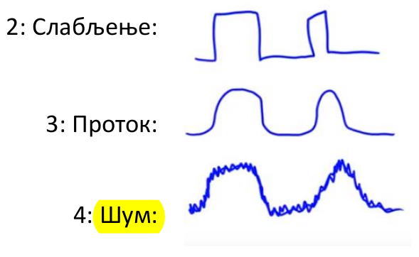

Signal u optičkim medjumima
- prenosi sa veoma malim gubitcima u tri široka frekvenciona opsega
- signal minimalno slabi sa udaljenošću, db/km
- postoje nepovoljni delovi spektra- npr lokalni max između crvene i zelene boje

Signal u bežičnim medijumima  
- zbog visokih frekvencija nije moguće digitalni signal kodirati direkto u analogni -> korišćenje signala nosača
- signal slabi sa kvadratom rastojanja, jer šaljemo u svim pravcima
- treba voditi računa da se signali ne mešaju kod primaoca, signli istih frekvencija se mogu sabirati ili potirati, koristi različite frekvencije za bliske emitere
- propagacija bežičnog signala je složena i zavisi od okruženja
- karakteristike zavise od frekvencije, niže frekvencije lakše prolaze kroz prepreke
- sabiranje odbijenih signala kod mikrotalasa je problem

--- 


### `9.` Modulacija i multipleksianje signala
Modulacija - dogovr dve strane kako će se "digitalni" talasi konvertovati u fizičku veličinu.  
- jednostavna modulacija - NRZ - Non Return to Zero
    - visoki napon 1, nizak napon 0, taj napon se drži neko delta t
    - dobro za računarski sistem - prenos na malim udaljensotima, matična ploča
    - možemo imati i više opsega napona, npr za kodiranje 00, 01, 10, 11
    - problem: niz nula i jedinica, može neka da se zagubi
    - Rešenja
        - 4B/5B - svaka 4 bita kodiramo sa 5 bitova (postoji tabela), inverzija signala na jedinici kako bi se izbegli dugački nizovi jedinica, najviše 3 uzastopne nule, overhead je 25%, što je bolje od nekih drugih
- Modulacija preko nosača - passband (prethodno je bilo direktno baseband)
    - prethodno nije moguće kod optike i bežičnog signala jer rade na velikim frekvencijama
    - koristi indirektnu reprezentaciju signala
    - imamo talas - signal nosač- koji osciluje na željenoj frekvenciji a mi kodiramo 0 i 1 menjanjem frekvencije, faze ili amplitude
    - može kombinovano sa različitim amplitudama i uglovima početka faze

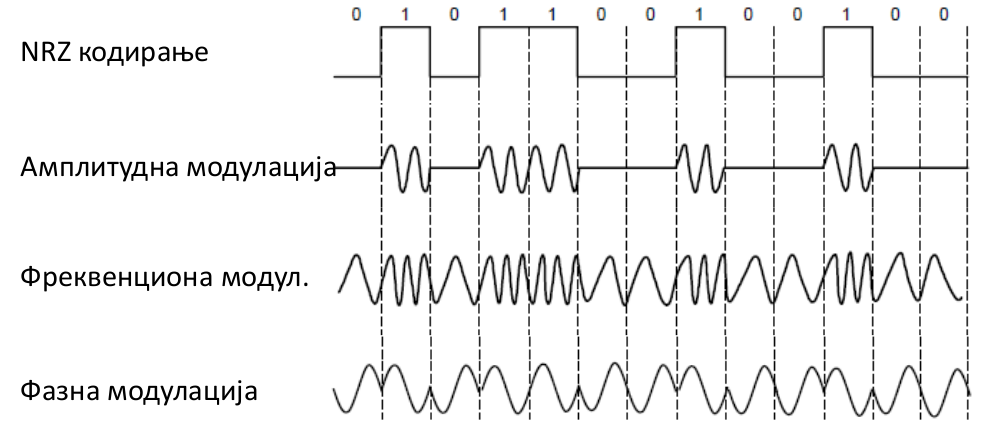

Inverzno je demodulacija, na drugoj strani iz analognog izvlačimo digitalno.  

Multipleksiranje  
Bavi se deljenjem kanala između više korisnika. 
Zamislimo da puno ljudi priča u sobi.
- Prvo
    - telefonske centrale, sve žice idu u centralu i tu operater prespoji žice
- Frekvenciono multipleksiranje (FDM)
    - različiti korisnici koriste raličite opsege frekvencija
    - slušamo ljude koji pričaju jako sporo, ili jako brzo
- Vremensko multipleksiranje (TDM)
    - vremesnki delimo kanala, timesharing iz os
    - za fiksnu i mobilnu telefoniju
    - svako dobije delta t da priča, što je to manje komunikacije ide tečnije
    - ljudi pričaju na smenu
- Multipleksiranje zasnovano na kodovima (CDMA)
    - korisnicima se dodeljuju međusobno ortogonalni ključevi
    - na originalni signal se primenjuje ključ - sklarni proizvod
    - kroz kanal protiče jedan ukupan signal
    - prijem - vršimo skalarni proizvod sa svojim ključem
    - značilo bi da ljudi pričaju različitim jezicima


--- 

### `10.` Prirodna ograničenja prenosa signala.

Za prenos signala su ključni
- Protok B
    - karakteristika kanala
    - Ograničava brzinu promena - frekvenciju
- Jačina signala S
    - karakteristika primaoca
    - ograničava broj razlučivih nivoa signala
- Jačina šuma N

Najkvistov limit
- Maksimalan broj promena simbola je 2B
- svaka promena je kodirana jednim bitom
- ako je frekvencija 10Hz, pp da je ovo 1s na vremenskoj osi, kapacitet prenosa 20 bitova,
- 2B promena i u svakoj možemo da kodiramo 0 ili 1, 20 bitova u s
- ako postoji V nivoa signala onda je maksimalan protok u bitovima: `R = 2B log2 V b/s`

Šenonov kapacitet
- Broj različitih nivoa signala zavisi od odnosa jačine signala i jačine šuma S/N
- SNR - signal-šum odnos, meri se u decibelima
- SNR db = 10 log10 S/N
- logaritamska skala jer S/N može jako mnogo da varira
- šum je slučajan signal
- Formula za Šenon kapacitet: `C = B log2 (1+S/N) b/s`
- broj različitih signala se dobija iz odnosa `(S+N)/N = 1+S/N`  

Realni sistemi su dobri ako nisu mnogo daleko od ovih ograničenja.
TODO???

Za žicu i optiku se može prjektovati za ciljni SNR i B, samim tim ciljni prenos u b/s.  
Za bežični kanal za dato B SNR drastično varira, čak do 60db, nije isplativo projektivati najgori slučaj, mora se živeti sa visokim varijacijama prenosa.

--- 


### `11.` Pregled relevantnih sistema komunikacije

Sistem fiksne telefonije
- hijerarhijski sitem za prenos govora
- u mestu najčešće upredene parice
- između mesta optički kablovi u zadnje vreme
- centrale preusmeravaju i održavaju konekciju
- ovim sistemom se realizuje i DSL (Asimetrični DSL) - Digital Subscriber Line, veci deo opsega se koristi za internet
- DSL - tehnologija koja omogućava digitalnu razmenu podataka preko postojećih upredenih parica

Sistem mobilne telefonije
1. 1G 
    - analogni glas, ni u jednom trenutku se ne interpretira kao digitalni, zvuk se konvertuje direktno u elektromagnetni talas
    - FM modulacija kao kod radija
    - Odvojene frekvencije za slanje i primanje govora
2. 2G
    - digitalni glas, vrši se semplovanje/uzorkovanje, svaki uzorak dobija broj - amplitudu u nekom momentu, ta amplituda se transformiše u odgovarajući elektromagnetni talas
    - QPSK modulacija
3. 3G 
    - digitalni glas i podaci
    - koristi CDMA - multipleksiranje zasnovano na kodovima
    - UMTS - Universal Mobile Telecomunications System
4. 4G 
    - digitalni glas i podaci
    - OFDM modulacija, napredna varijanta FDM - multipleksiranje zasnovano na frekvencijama
- Kod mobilne telfonije imamo geografske jedinice - bazne stanice. Svaki mobilni korisnik koristi ćelijsku frekvenciju, pri napušanju jedne ćelie prelazi u drugu - handoff, iste frekvencije mogu da se koriste u nesusednim ćelijama. Kao sistem saća.

Internet preko kablovske
- internet kabl koristi postojeću infrastrukturu za kablovsku televizuju.
- drugačija topologija u odnosu na telefonski sistem - ovde topologija podseća na topologiju magistrale, tj deljeni kanal
- koriste frekvencione opsege koji se ne koriste za gledanje TV-a

Kablovski
- koristi koaksijalne kablove pa je dobar protok
- podaci idu preko zajedničke magistrale pa nije bezbedno, protok dele korisnici pa može da varira  

ADSL (Asimetrični DSL)
- protok posvećen svakom korisniku, ne može da emituje kao kablovska
- niži protok zbog korišćenja upredenih parica

--- 


### `12.` Sloj veze, uloga, komunikacija sa slojem ispod i iznad, kratko objašnjenje spiska aktivnosti na sloju veze

Ovo je logički sloj (!=softverski).  
Prenosi okvire putem jednog ili više povezanih komunikacionih kanala, a naslanja se na fizički sloj.  
Uloga:
- unapređuje komunikaciju
- povećava pouzdanost

Ovaj sloj prima podatke sa fizičkog sloja, pakuje u kovertu, tj dodaje dodatne informacije i prosleđuje ih mrežnom sloju. I obrnut smer.

Aktivnosti na sloju veze:
- Uokvirivanje - poruci dobijenoj sa mrežnog sloja se dodaje zaglavlje i završetak okvira, i to se dalje prosleđuje fizičkom sloju
- Detekcija i korekcija greške
    - detekcija - samo kaže da se greška javila
    - korekcija - detektuje greška i zna gde je, pa samo taj bit invertuje
- Retransmisija i kontrola toka
    - ponovno slanje u slučau gubitka
    - razrešavanje duplikata
    - usaglašavanje brzine primaoca i pošiljaoca

--- 

### `13.` Uokvirivanje u sloju veze
Od fizičkog sloja dobijamo tok podataka - sekvencu moduliranih bitova. Od toga dalje pravimo okvire fiksne ili promenljive dužine.  
U teoriji fizički sloj ne vidi uokvirivanje, a praksi fizički sloj pomaže identifikaciji okvira.

Standardni pristupi:
- Brojenje bajtova
    - Potpuno nepouzdano
    - Prvo šaljemo dužnu okvira pa bajtove koji čine okvir
    - Nije veliki problem ako se javi greška na nekom bajtu okvira, veliki problem je ako dođe do greške u bajtu za dužinu okvira, onda se javlja domino efekat i dalji okviri se ne čitaju lepo, jer ne pročitamo dobro veličinu narednog okvira.
- Umetanje bajtova
    - Umetnemo identifikatorsku oznaku za početak i kraj okvira
    - Ako se taj identifikator nalaziu podacima eskejpujemo ga, a ako se escape nalazi u podacima i njega eskejpujemo. ESC je kao konačni automat, kada pročitamo esc prelazimo u stanje u kom naredni pročitani bajt ne tumačimo na specijalni način. Prijemnik kad pročita esc ne tumači ono što ide posle ni na kakav specijalan način.
- Umetanje bitova
    - ušteda prostora
    - identifikator može biti npr 5 uzastopnih jedinica, ako se u podacima nadje 5 uzastopnih jedinica nakon njih se postavlja 0, a kada se čita onda se karakter nakon 5 jedinica briše.

--- 

### `14.` Kodiranje grešaka u sloju veze
Možem duplo poslati poruku, ako se razlikuju došlo je do greške. Ali je ovako neefikasno slati duplo.  
Kodna reč se sastoji iz D bitova i R kontrolnih bitova:  
```
--------------------------
|       D       | R=f(D) |
-------------------------- 
```

Kontrolni bitovi su funkcija od bitova podataka.  
Pošiljac šalje D+R. Primalac to prihvati sa potencijalnim grešaka na bilo kom od bitova. Primalac računa R1 kontrolnih bitova na osnovu D po istom algoritmu kao pošiljlac. Do greške je došlo ako se R i R1 razlikuju.

Od kvaliteta funkcije za grešku sve zavisi. 
Ako je funkcija id ona se praktično šalje duplo. Može neka heš funkcija. Funkcija za grešku treba da daje što manje bitova a da radi što bolje.

Ideja: skup validnih reči treba da bude dosta manji od skupa svih mogućih reči. Da bi bila što manja šansa da se malom greškom pređe u drugu validnu reč i time ne detektuje greška.

Hamingovo rastojanje - minimalan broj inverzija bitova potrebnih da se od jedne reči dobije druga.  
Hamingovo rastojanje koda - minimalno rastojanje između svih parova validnih reči. 

Želimo da maksimizujemo Hamingovo rastojanje koda.  
Obično su u delu za podatke moguće sve kombinacije, dok je skup kontrolnih bitova ograničen. Može se čuvati skup validnih reči, ili funkcija koja proverava da li je reč validna (npr paran broj jedinica). 

Da bi pouzdano otkrili do d grešaka Hamingovo rastojanje koda mora bit d+1, jer onda sa d inverzija ne možemo da pređemo u drugu validnu reč.  
Ako je Hamingoo rastojanje 2d+1, a  javlja se najviše d grešaka, možemo pretpostaviti da je poslata najbliža validna reč.


--- 

### `15.` Detekcija grešaka u sloju veze.
Detekcija samo otkriva da je došlo do greške, ne može da popravi već zahteva retransmisiju.

- Provera parnosti 
    - dodajemo 1 bit koji će sumu činiti parnom
    - detektuje samo neparne greške, ne može parne
    - Hamingovo rastojanje je 1
    - rafalne greške se javljaju sa visokom učestalošću na uzastopnim pozicijama, ovim se slabo detektuju
    - slabo se koristi
- Kontrolni zbirovi
    - često se koristi u TCP i UDP
    - po kolonama vršimo proveru parnosti
    - bolje detektuje od prethodnog
    - iako lošiji koristi se na višim slojevima, IP, TCP, UDP
- Internet kontrolni zbir
    - računa se u artmetici nepotpunog komplementa, ima dve nule a jednu ćemo koristit zao onaku da kontrolni zbir ne postoji
    - kontrolni zbir ima 16 bitova i predstvlja nepotpuni komplement reči po kolonama
    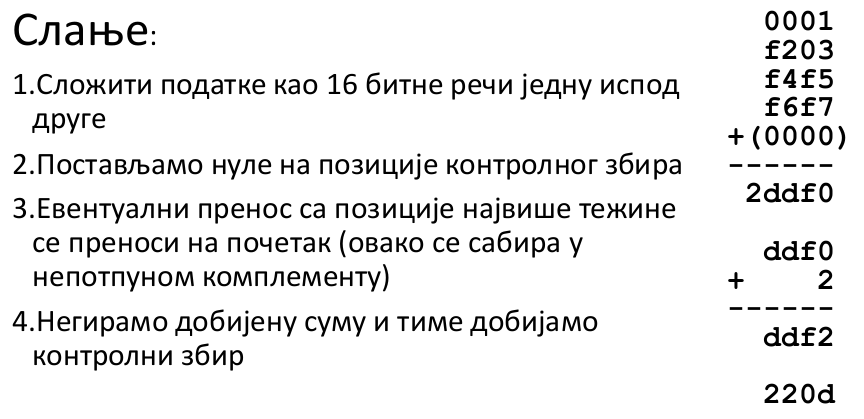
    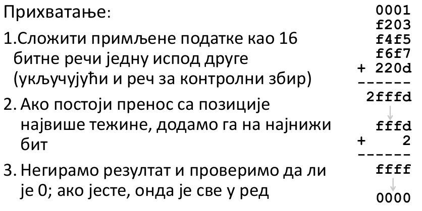
- Ciklična provera redudantnosti CRC
    - gledamo niz bitova kao polinom čiji su koeficijenti nule i jedinice
    - za datih n bitova pdoataka generišeo k kontrolnih bitova tako da n+k bude broj deljiv unapred odabrnim polinom, tj brojem c, c je generator i znaju ga i pošiljalac i primalac
    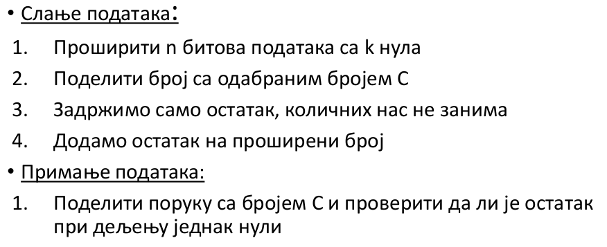
    - od generatora zavisi kvalitet detekcije
    - često se koristi u Ethernet, 802.1, ADSL, kablovska, pri zipovanju


--- 

### `16.` Korekcija greške na sloju veze
Ako imamo Hamingov kod sa određenim rastojanjem, možemo mapirati nevalidnu reč u najbližu validnu reč. Pristup radi ako je Hamingovo rastojanje veće od 2d+1 a d je maksimalni očekivani broj jednobitnih grešaka.  
Hamingov kod za korekciju koristi n bitova podatak i k kontrolnih, pri čemu n = 2^k - k - 1.  
- Kontrloni bit se stavlja na pozicije koje su stepeni dvojke.
- Kontrolni bit na poziciji i se dalje računa kao bit parnosti za pozicije u binarnoj reprezentaciji imaju 1 na i-tom mestu.
- na pozicije stepena dvojke idu kontrolni bitovi, a na ostale pozicije idu bitovi koji se kodiraju
- kontrolni bitovi - sindrom

Dekodiranje ide identično
- izdvoje se pozicije gde su bitovi koji treba da se prime, i za njih se na isti način računaju kontrolni
- gleda se xor dobijenih i sindroma
- ako je nula nema greške
- u suprtonom xor govori na kojoj pozicije je greška, pa se samo taj bit invertuje

Hamingovi kodovi se retk koriste u praksi.  
Najčešće se korise Konvolucioni kodovi, Metoda parnosti za malu gustinu, Rid-Solomonovi kodovi...


--- 

### `17.` Sloj veze, tipovi servisa, okruženje, utopijski jednosmerni protokol

Tipovi servisa na sloju veze:
- Servis bez uspostave veze i bez potvrde prijema
    - okvir se šalje nezavisno i bez retransmisije u slučaju greške
    - koristi ga Ethernet, jer je hardverski dovoljno pouzdan
- Servis bez uspostavljanja veze i sa potvrdom prijema
    - radi retransmisiju ako je potrebno
    - primalac treba da javi da li je poruka stigla
    - koristi ga WiFi, jer je on sam nepouzdan
- Servis sa uspostavom veze i sa potvrdom prijema
    - uspostava veze omogućava da podaci teku istim redom kojim su i poslati
    - retko se koristi iako maksimalno povećava pouzdanost sistema

Okruženje:  
Sloj mreže je obično realizovan delom na mrežnoj kartici a drugm delom na nivou operativnog sistema. Algoritmi usaglašavanja i kontrole toka, više smo na softverskom sloju. Mrežna kartica realizuje neke funkcionalnsoti hardverski pa ih prosleđuje drajverima os-a, i dalje na niskom softverskom nivou.  

Standardizovani api ka drugim slojevima:  
- Ka mrežnom slolju
    - from_network_layer - uzima paket sa mrežnog sloja
    - to_network_layer - prosleđuje paket na mrežni sloj
- Ka fizičkom sloju
    - from_physical_layer - uzima okvir iz fizičkog sloja
    - to_physical_layer - prosleđuje okvir ka fizičkom sloju
- Pomoćne metode koje omogućavaju rad sa događajima
    - funkcionalnosti mreže su često realizovane preko pasivnog čekanja
    - metoda koja čeka šalje zahtev i prelazi u blokirano stanje čekanja, odblokira se kad stigne odgovor
    - tajmer i štoperica takođe ispaljuju događaj
    - wait_for_event
    - start_timer
    - stop_timer
    - start_ack_timer - pokreće tajmer za okvir potvrde ACK
    - stop_ack_timer

Utopijski jednosmerni protokol:
- pretpostavljamo da ništa loše ne može da se desi
- optimističan protokol
- korsiti ga Ethernet - jer su kablovi pouzdani a udaljenost mala
- Osnovne pretpostavke:
    1. neće se desiti greška
    2. pošiljalac i primalac su iste brzine - da se ne bi desilo da poruka izgubi jer ne može dovoljno brzo da se primi, i ako ima buffer on može da se prepuni
    
    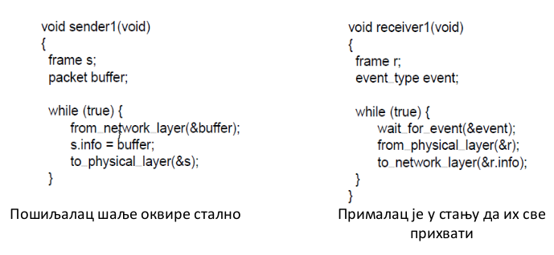

--- 

### `18.` Kontrola toka, ARQ, pauza (tajmaut), duplikati, protokol "stani i čekaj" za savršen i nesavršen kanal

Ako stiže više poruka nego što može da se primi neka može da se izgubi. Brzina primanja ne zavisi samo od karakteritsika kanala već i od karakteristika mrežne kartice i hardvera.  
Protokol sa kontrolom toka - pošiljac pošalje i čeka odgovor ACK da je poruka primljena, tek kad dobije potvrdu šalje dalje.

Protokol "stani i čekaj" za savršen kanal
- Garantuje usaglašenost u brzini komunikacije
- šalje se okvir, pošiljalac šalje naredni tek kad dobije potvrdu za prethodni - neefikasno
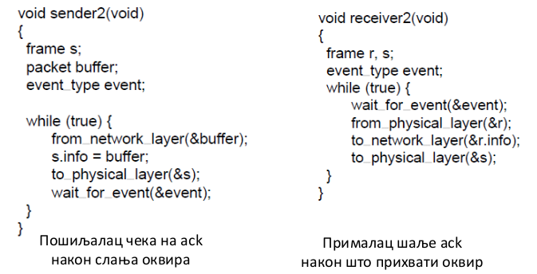

Problem: ako se poruka izgubi, ili se ACK izgubi. Potrebna je detekcija i retransmisija ARQ (Automatic Repeat reQuest).

ARQ
- koristi se kada su greške uobičajne i kada se moraju ispraviti
- WiFi i TCP
- primalac šalje potvrdu o prijemu ispravnog okvira ACK
- ukoliko je stigla poruka sa greškom ne šalje ništa i ponaša se kao ništa nije primio
- pošiljalac će nakon pauze (tajmauta) ponovo poslati poruku ako u međuvremenu nije dobio ACK
- problem primanja poruke je manje više halting
- dva glavna problema
    1. Kako odrediti dužinu pauze? 
    - prekratka pauza - ACK stiže kasno pa će primalac dobiti i duplikat
    - predugačka pauza - gubljenje vremena, neiskorišćenost kanala
    - u LAN je lako odrediti, jadna gornja granica
    - za internet je teško odrediti, nema jasne gornje granice i veliko odstupanje
    2. Kako izbeći interpretaciju dupliranh okvira kao novih?
    - Ako se ACK izgubi pošiljalac će poslati opet, ili ako ACK ne stgne na vreme
    - okviri i ACK-ovi moraju da nose oznaku kako bi se izbegli duplikati, dovoljno je samo razlikovati trenutni okvir od narednog - 1 bit
- Želimo ispravan okvir, bez greške i duplikata, ali i efikasnu komunikaciju

Protokol "stani i čekaj" za nesavršen kanal:
- Šalje i indikator okvira, kao u diskusiji malopre

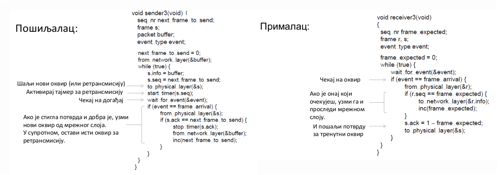

Ograničenja "stani i čekaj":
- u jednom trenutku može da prenosi samo jedan okvir, okej za LAN ali neefikasno za visok BDP

--- 

### `19.` Protokol kliznih prozora u sloju veze, "1-bitni", "vrati se N", "selektivno ponavljanje"

RTT - round trip time, 2D, vreme potrebno da okvir ode i da se vrati potvrda.
Omogućava se da u svakom momentu W okvira bude u kanalu. W okvira za RTT.  
- Pošiljalac ima na raspolaganju W uzastopnih okvira koje može da pošalje
- mora da ih baferiše zbog eventualne retransmisije
- kada stigne ACK pošiljalac pomera prozor, spisak raspoloživih okvira
- primalac ima na raspolaganju prostor za nekoliko okvira koje može da prihvati, mora da ima bafer za njih
- prozor primaoca se takođe pomera kada stižu novi okviri
- veći prozori omogućavaju protočnu obradu za efikasniju upotrebu kanala
- Stani i čekaj je specijalan slučaj za W=1, neefikasan
- optimalan W zavisi od BDP
- Želimo W>=2*BDP+1

1-bitni protokol kliznih prozora:
- nema odvojenih algoritama, oba šallju i primaju
- radi nad nesavršenim kanalom
- omogućava kontrolu toka
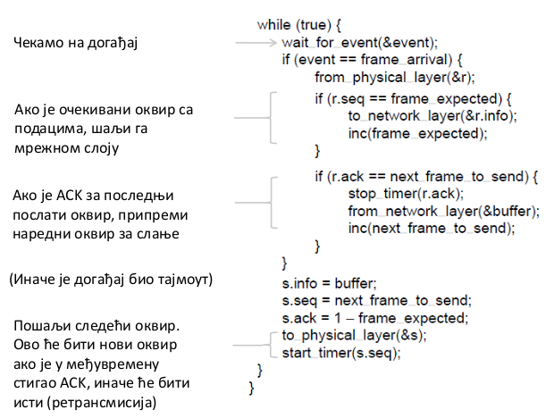
- radi korektno ali može da dođe do usporenja ako svi započnu istovremeno

Protokol "vrati se N"
- primalac prihvata samo okvire koji stižu redom
- odbacuje sve okvire koji stignu a nisu na redu
- kada pošiljaocu istekne tajmout on šalje sve nepotvrđene okvire do kraja prozora ponovo
- LFA - last frame acknowladgment - broj do kog su svi okviri potvrđeni, pamti se samo taj broj a ne neka komplikovana struktura
- jednostavno na strani primaoca jer mu je potreban bafer za samo jedan okvir
- nepotrebno trošenje protoka u slučaju veliko prozora, jer tada u najgorem slučaju ceo prozor mora da se šalje opet ako se javi greška

Protokol "selektivno ponavljanje"
- primalac ne mora da prima po redu
- primalac prima okvir sve dok je redni broj okvira u opsegu definisanom kliznim prozorom
- NAK - negativni ACK - primalac javlja pošiljaocu da pošalje opet, da ne bi bespotrebno čekali da istekne tajmer kad već zna da mora opet
- složenij je za implementaciju zbog baferisanja pri primanju i višestrukim tajmerom pri slanju
- efikasnija upotreba protoka, jer se samo izgubljeni okviri ponovo šalju
- dodatni zatev je da opseg brojeva okvira S bude najmanjne dva puta veći od veličine prozora W kako bi se izbegli problemi sa retransmisijom okvira.

--- 


### `20.` MAC podsloj, uloga, alokacija kanala, ALOHA protokol

Mrežni sistem je distribuiran i niko ne vidi celu mrežu. Ako na primer imamo deljeni komunikacioni kanal. 
MAC se bavi identifikacijom različitih korisnika.

MAC podsloj:
- ALOHA
- CSMA - Carrier Sense Multiple Access
- protokol bez kolizija
- protokol bez zagušenja
- protokol za bežični LAN (WiFi)

Alokacija kanala:
1. Statička alokacija
    - za fiksni kanal sa N korisnika
    - podeli se kanal korišćenjem FTM, TDM...
    - dodela FM radio stanica npr
    - loše u slučaju promenljivog sadržaja
    - korisnici ili koriste saobraćaj intenzivno ili ga uopšte ne koriste

2. Dinamička alokacija
    - ovo rade MAC protokoli
    - daje kanal korisniku kada mu je potreban
    - potencijalno N puta efikasnije za N korisnika

ALOHA
- računarska mreža koja je povezivala Havajska ostrva krajem 60ih
- čvor šalje kada ima nešto da pošalje
- ako dođe do kolizije (nema ACK) onda se čeka slučajan interval vremena pa se šalje ponovo, čeka se slučajan interval da ne bi opet došlo do iste kolizije
- u praksi je problem sudaranje okvira - kolizija
- signal koji ide kroz komunikacioni kanal možemo gledati kao da ima neku dužinu/ trajanje
- jednostavan i decentralizovan
- radi dobro za malo opterećenje mreže
- vrlo neefikasan za veliko opterećenje mreže 
- eksperimentilano utvrđeno da je efikasnot 18%
- poboljšanje - diskretizuje se vreme i onemogući slanje bilo kad - poboljšanje na 36%
- inspirisao Boba Metkalfada izmisli Eternet za lokalne mreže, čvorovi dele koaksiajlni kabl


--- 

### `21.` CSMA, CSMA/CD, BEB

CSMA
- poboljšanje ALOHA
- jednostavno kod žičanih, ne kod bežičnih
- osluškuje kanal pre slanja
- neće eliminisati kolizije jer se nešto možda pojavi na kanalu dok mi krenemo slanje
- ako je BDP mali dobar je protiv kolizije

CSMA/CD
- CSMA sa detekcijom kolizije
- smanjuje trošak kolizije tako što je detektuje i obustavlja slanje ostatka okvira
- i dalje teško kod bežičnih kanala
- detekcija se realizuje hardverski, imamo neki komparator koji proverava
- želimo da svi koji su u koliziji to saznaju, a čuće to sigurno u okviru intervala 2D
- ograničimo okdvir da traje najmanje 2D sekundi - tako ne možemo da završimo slanje pre nego shvatimo da je došlo do kolizije
- jer ako završimo slanje i negde posle dođe do kolizije nećemo saznati
- u najgorem slučaju će se desiti kolizija tik pre cilja
- Eternet - minimalna dužina okvira je 64 bajta

Kad dođe do kolizije:
- želimo da odredimo koja je gornja granica čekanja na naredo slanje nakon kolizije
- ako imamo n korisnika verovatnoća slanja u svakom kvantu vremena treba da bude 1/n
- algoritam je decentralizova pa čvorovi sami treba da shvate koliko je čvorova u mreži i da usaglase verovatnoću slanja, a to se procenjuje na osnovu broja kolizija
- kada saznamo broj korisnika u mreži možemo da koristimo heurističko slanje na 1/n vremena
- kada se desi kolizija odredimo koliko da čekamo od 0 do n
- na početku pp da smo sami u mreži, kada se desi prva kolizija pp da nas je dvoje, nakon naredne kolizije 4, i tako raste eksponencijalno
- veće opterećenje - više kolizija

BEB - binarno eksponencijalno odlaganje
- Binary Exponential Backoff
- mehanizam određivanja verovatnoće u distribuiranom sistemu
- prva kolizija - čekaj 0 ili 1 jedinica vremnan
- druga kolizija - čekaj između 0 i 3 okvia
- treća kolizija - čekaj između 0 i 7 okvira
- ...
- BEB duplira interval nakon svake uzastopne kolizije
- brzo raste pa dolazi do dobre procene, čak i ako je verovatnoća jako mala
- veoma efikasan u praksi


--- 

### `22.` MAC protokol zasnovan na redosledu, Token Ring

- deterministički algoritam, ne korisi slučajne brojeve
- CSMA se loše ponaša pod velikim opterećenjem, puno kolizija pa vreme pristupa varira
- definiše se uređenje po kom čvorovi šalju ako imaju nešto da pošalju, ako nemaju onda samo propuste
- organizujemo čvorove u prsten pa se token prosleđuje u krug
- svaki čvor zna koji je njemu naredni i kome da prosledi token kad završi šta ima
- može da šalje samo čvor sa tokenom i to nekoliko kvantova
- token ring omogućava round robin time sharing algoritam iz os-a
- loše 
    - ako samo jedan šalje pa token mora da obiđe ceo krug da bi ovaj mogao da nastavi
    - složenost - npr token može da se izgubi
- prednosti
    - nema kolizije 
    - troškovi su unapred određeni
    - svakom čvoru je zagarantovano da će biti opslužen u nekom trenutku

Ovi protokoli se probaju kao poboljšanje, ali se u praksi više koriste protokoli sa slučajnošću, jer se dobro ponašaju i skaliraju.

--- 

### `23.` MAC protokoli za bežične mreže

- nemamo komunikacioni kanal sa osobinama koje bi bile pogodne za CSMA i CSMA/CD
- bežični signal se emituje, a primaju ga čvorovi koji su dovoljno blizu
- čvorovi su skriveni ako ne mogu da se čuju međusobno
- čvorovi su izloženi ako se čuju međusobno
- kod žice možemo rano da detektujemo koliziju, ovde ne možemo pa odmah imamo dodatne troškove

MACA - Multiple Accesss with Collision Avoidance
- koristi proceduru rukovanja umesto CSMA
- WiFi koristi poboljšanu verzju ovoga

- kolizije moguće ali malo verovatne

```
A <- B C -> D // ok iako su B i C u dosegu jedan drugog
```


--- 

### `24.` Klasični Eternet
- Bob Metkalfa je izmislio eternet pod uticajem ALOHA protkola.
- Topologija zasnovana na magistrali koja je deljena komponenta koja se koristi za prenos podataka.
- Kabal ide iz jedog računara u drugi, ako jedan kabl otkaže sve se prekida
- Eternet je bio najpopularniji vid oranizacije LAN tokom 80ig i 90ih.
- 10Mb/s preko deljenog koaksijalnog kabla
- Koristi CSMA/CD sa BEB
- Poruka sadrži adresu pošiljoca i primaoca (ovo nije bilo na sloju veze jer je tamo bilo point to point)
- koristi CRC-32 za detekciju grešaka
- nema ack ni retransmisije, to se ostavlja višim slojevima
- mac adresa - hardverska adresa uređaja, serijskim brojevima se postiže jedinstvenost
    - svaki računar je jedinstveno identifikovan sa 48 bitova
- regulisan standardom IEEE 802.3
- thick Ethernet
    - liči na žuto baštensko crevoo
    - prikači se rčunar na svakih 2,5 metara
    - jedan segment može biti 500m sa 100 računara
- thin Ethernet
    - jeftiniji i lakši za postavljanje
    - jedan segment može biti do 185m sa 30 računara
- više kablova se moglo povezivati repetitorima (repeaters), da bi se mglo povezati više računara
    - što se softvera tiče to je jedan veliki kabl sa nešto većim kašnjenjem zbog nadovezivanja
    - može da se putuje preko najviše 4 repetitora
    - primaoci ne smeju biti dalje od 2,5km, zbog MAC
- radi multicasting ili broadcasting
- svaki paket koji se šalje ima adresu pošiljaoca i primaoca, tip, podatke, kontrolnu sumu

--- 

### `25.` Moderni (komutirani) Eternet

- Više nema jednu deljenu magistralu već je razdvajanje odrađeno hardverski - svičevima.  
- Čvorovi se na Eternet povezuju fizičkim vezivanjem upredenim paricama na skretnicu (upredene parice od fiksne telefonije).  
- Liči na topologiju zvezde.

Svič - skretnica
- radi na sloju veze
- može da pročita šta piše u okviru - mac adresu pošiljaoca i primaoca
- u učionici na fakultetu ima kutija sa svičevima na koju su povezani svi računari, mogu da komuniciraju međusobno
- koristi adresu iz okvira da bi prosledio ulaz na željeni izlaz
- može se slati više okvira istovremeno, ima više puteva
- ima bafer za slučaj da više ulaza cilja jedan izlaz
- veliko opterećenje može da dovede do plavljena bafera i gubitka infomracija
- praktičnije i pouzdanije nego klasični Eternet
- ako jedan kabl otkaže lako se nalazi koji je i ne ugrožava se cela mreža
- omogućava poboljšani protok, npr 100Mb/s po ulazno/izlaznoj liniji umesto toliko za celu mrežu deljenu kablom
- skretnica pronalazi odgovarajući port na osnovu adrese
- prosleđivanje okvira na osnovu tabele relacija između broja porta i adrese iz okvira
    - ova tabela se uči unazad
    - posmatraju se adrese i portovi čvorova koji šalju okvire
    - ako se za datu adresu u tabeli nalazi pridruženi port pošalji samo njemu, inače šalji svim portovima
- moguće višestuke skretnice i razvodnice pod uslovom da nema petlji
- mreže se projektuju da imaju redudantnosti, tj petlje
    - dobro ako neki čvor otkaže da imamo drugi put
    - ali je problem ako upadnemo u beskonačnu petlju
    - formira se razapinjuće stablo - nema ciklus a svi su povezni

Tipovi opereme za usmeravanje
- hub je na fizičkom nivou i prosleđuje svima
- svič je na nivou veze
    - za razliku od huba nema kolizija i može više da se šalje istovremeno
    - bezbedniji od hub-a jer se paket ne prosleđuje svima
- ruteri su na nivou mreže i usmeravaju

--- 

### `26.` Mrežni sloj, uloga, motivacija, rutiranje i prosleđivanje (ukratko), tipovi servisa na mrežnom sloju, objašnjenja i njihov uporedni odnos

Uloga:
- Vrši rutiranje i prosleđivnje, pronalazi optimalne putanje za prenos podataka kroz mrežu.

Motivacija
- Mrežni sloj postoji jer veće mreže ne mogu da se izgrade preko svičeva, nisu skalabilni. 
- Tabele relacija bi postale ogromne za ceo svet. 
- Svičevi ne rade ako su tehnologije sloja različite (npr čvorovi na eternetu, 3G...). 
- Ne možemo da kontrolišemo i planiramo rute, putanja može biti neefikasna.

Rutiranje
- proces odlučivanje u kom pravcu treba poslati saobraćaj
- nema globalnog odlučivnja
- svaki ruter zna koja je optimalna putanja sa njegove tačke gledišta i prosleđuje tuda, deluje loklano a razmišlja globalno, nema garancije da će se posle proslediti putem koji je on zamislio

Prosleđivanje
- proces slanja paketa na osnovu lokalne tabele
- 95% vrema ide na ovo
- kada već znamo optimalne putanje samo tuda prosleđujemo

Tipovi servisa na mrežnom sloju

1. Datagrami
- servis bez uspostavljanja veze
- poput pošte, poruka se rasparča na pismo pa se šalju odvojeno
- IP - internet protokol
    - IPv4 - paket ima 32bitnu adresu, obično velik oko 1,5KB
    - IP paket ima meta informacije od kojih su najbitnije adresa pošiljaoca i primaoca
- paket sadrži ciljnu adresu na osnovu koje prosleđuje paket dalje
- ne moraju svi paketi da idu istim putem, što je dobro ako neki čvor otkaže
- svaki usmerivač ima tabelu prosleđivanja koja se menja vremenom
- red u tabeli prosleđivanja za datu ciljnu adresu određuje susedni čvor na koji će se paket proslediti, naredni hop

2. Virtuelna kola
- servis sa uspostavljanjem veze
- poput fiksne telefonije
- unapred se uspostavi ruta na relaciji nekog kola
- Tri faze:
    1. Uspostavljanje virtuelnog kola - odabir putanje i slanje informacija o putanji svim usmerivačima
    2. Prenos podataka - paketi se prosleđuju duž uspostavljenog kola
    3. Brisanje virtuelnog kola - svi relevantni usmerivači brišu informacije o virtulenom kolu
- kao kod fiksne telefonije, samo što je veza virtuelna, tj kanal se ne rezerviše samo za tu konekciju već se statističkim multipleksianjem za veći broj virtulenih kola i/ili datagramskih servisa
- paketi sadrže samo kratku oznaku kola, ta oznaka nema globalno značenje kao IP adresa već samo na nivou nekog dela sloja veze
- imamo kao izviđački saobraćaj, paket izviđač odredi putanju pa onda kreću podaci
- podaci kreću život kao datagrami, kad uđu u kolo oni se dekorišu oznakom kola a podaci o ciljnoj adresi se zanemariju
- bolja kontrola toka virtuelnih informacija, bolje upravljanje saobraćajem, ISP može da napravi kolo za posebne korisnike, npr prenos olimpijskih igara

OBA
- realizuju se tehnikom sačuvaj i prosledi (store and forward)
- omogućava da paketi teku donekle pouzdano kroz mrežni sloj
- koristi se baferisanje - ruter privremeno čuva paket koji prosleđuje, briše ga iz bafera kad dobije potvrdu da je stigao gde treba
- koristi tehniku statističkog multipleksiranja za upavljanje protokom

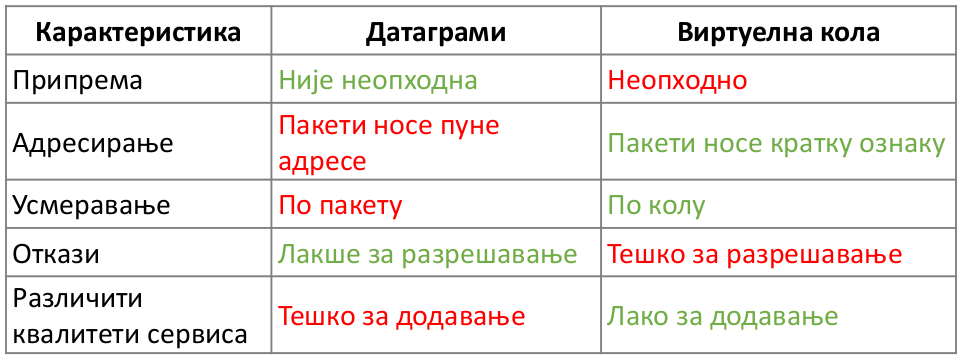

--- 

### `27.` IP adrese i prefiksi

IP adresa se koristi za adresiranje na mrežnom sloju. To je logička adresa, nije ugrađena kao mac.

Dve verzije: 
- IPv4 (32 bitni) 
    - identifikuje 2 na 32 racunara, nije dovoljno za ceo svet
    - široko rasprostrtanjen
    - 4 osomobitna broja razdvojena tačkama
    - od 0.0.0.0 do 255.255.255.255
- IPv6 (128 bitni)
    - još uvek nije zastupljen
    - 8 četvorocivrenih heksadekadih brojeva razdvojeni sa :
    - identifikuje 2 na 128 računara, dovoljno za identifikaciju svih atoma

IP prefiksi
- koncept koji omogućava grupisanje ip adresa
- grupišu se leksikografski
- ip prefiks je sekvenca 1 ili više fiksiranih bitova
- opisujemo grupu x računara sa istim prefiksom
- L-bitni prefiks je grupa adresa koje imaju isti prefiks dužine L bita - ima 2 na 32-L različitih adresa
- prefiksi opisuju mreže računara odnosno opsege adresa
- notacija: IP adresa / dužina prefiksa
- 128.13.0.0/16 je opsega od 128.13.0.0 do 128.13.255.255
- prefiks od 24 bita odgovara opsegu sa 256 adresa, a 32 bita odgovara jednoj adresi
- jedan prefiks može da sadrži drugi
- najopštiji prefiks koji opisuje sve računare: 0.0.0.0/0
- najspecifičniji prefiks opisuje jedan računar: xxxx/32
- ip prefiks je uopštenje ip adrese
- ip adresa je specifičan vid ip prefiksa
- duži prefiks je specifičniji, bliže određuje opseg oko te adrese
- manje specifičan prefiks je kraći

- potencijalni problem hijerarhije ip adresa: 
    - ako korisnik menja lokaciju a želi da zadrži istu ip adresu
    - potencijalna neiskorišćenost velikog broja adresa, ako je prfiks mali imamo puno adresa pa je problem ako je malo korisnika

IP klase adresa
- stari sistem grupisanja
- ip adrese bile grupisane u klase adresa fiksne dužine
- klasa A 2 na 24 adrese
- klasa B 2 na 16 adrese
- klasa C 2 na 8 adrese, većinom a lokalne mreže

Javna adresa
- jedinstvena oznaka računara na Internetu
- regularno telo dodeljuje pre upotrbe
- nema ih dovoljno u IPv4

Privatna adresa
- nije globalno jedinstvena
- jedinstvena na nivou manje mreže, u kući, firmi...
- potrebno je bar jedna javna IP adresa i NAT da bi se iz ovih mreža povezali na internet

IANA - svetsko regulatorno telo za dodeljivanje ip adresa
- dodeljuje ceo opseg adresa regionalnim telima
- regionalan tela dodeljuju opsege kompanijama u regionu
- kompanije dodeljuju konkretnim računarima

IANA (sve IP) -> RIPE (Evropa) -> kompanije, ISP -> krajnji korisnici

---

### `28.` IP prosleđivanje
- sve IP adrese jedne mreže pripadaju istom prefiksu
- svaki usmerivač prosleđuje tabelu uređenih parova oblika (prefiks, sledeći čvor hop)
- prosleđivnje ne ide baš tablično jer bi bile ogromne tabele
- kada stigne adresa gleda se ciljna ip adresa i kom prefiksu pripada, pa se tom susedu šalje dalje
- ip adrese su distribuirane hijerarhijski pa ima smisla
- može biti više odgovarajućih prefiksa, tada se prosleđuje onom sa najdužim zajedničkim prefiksom, tj najspecifičnijem prefiksu
- paket se prosleđuje čvoru odgovornom tom prefiksu
- prefiksi smanjuju prostornu i vremensku složenost rutiranja
- ogromna tabela je rasparčana hijerarhijski na veliki broj usmerivača
- kompromis između vremenske i prostorne složenosti
    - komapktnije tabele daju manje efikasno ponašanje i bolje memorijski
    - veće tabele su lošije memorijski ali brže rade posao

- CIDR - Classless Inter-Domain Routing
---

### `29.` ARP i DHCP

DHCP
- Dynamic Host Configuration Protocol
- dodeljivanje IP adrese računaru u mreži
- omogućava automasko dodeljivanje adresa
- npr povezujemo se na wifi na nekoj konferenciji
- DHCP je neki program instaliran na nekom racunaru u lokalnoj mreži
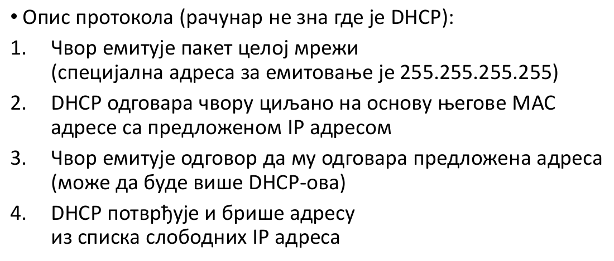
- klijent može da obnovu već dodeljenu IP adresu ako je ranije dobio, šalje samo REQUEST i dobija ACK
- istovremno može da radi više DHCP servera pa REQUESTovi moraju biti sinronizovani, zbog pouzdanosti i efikasnosti

ARP
- Adress Resolution Protocol
- određivanje adrese u sloju veze (MAC) za ciljnu IP adresu
- čvor traži ciljnu adresu na sloju veze kako bi poslao okvir odgovarajućem sloju
- Protokol:
    1. čvor koji hoće da sazna emituje ciljnu IP adresu
    2. onaj ko ima tu ip adresu ako svoju izvornu vraća mu odgovor sa svojom adresom u sloju veze
- omogućava nam da saznamo mac adresu prekok ip, da bi se komunikacija nastavila niz slojeve
- ovako je jednostavnije nego čuvait tabelu preslikavanja
- ARP može da ima svoj keš, da ne radi broadcast svaki put

TODO - pogledati iz knijge još jednom

---

### `30.` ICMP i NAT

ICMP
- Internet Control Message Protocol
- kada usmerivač detektuje grešku pri prosleđivanju on šalje ICMP paket pošiljaocu i odbacuje problematičan paket
- prevelik paket, maksimalan broj hopova...
- ttl - time to live, ukoliko u toliko hopova ne dođemo do odredišt javlja se greška
- ICMP paket sadrži tip greške kod i kontrolni zbir
- ICMP paket je isti kao IP paket, samo indikatorsko polje omogućava razlikovanje
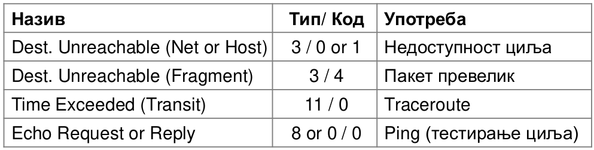

NAT
- hibrid mrežnog i transportnog protokola
- Netwok Address Translation
- povezuje računare iz lokalne mreže na spoljnu mrežu, npr Internet
- neophodan jer IPv4 nema dovoljno kombinacija da bi se svakom uređaju dodelila javna ip adresa
- sav saobraćaj koji izlazi iz stana se predstavlja jednom ip adresom, a adrese uređaja u stanu nisu ključne
- narušava enkapsulaciju, pogleda šta piše u tcp segmentu
- npr ISP sve uređaje u stanu vidi kao jedan računar
- NAT održava tabelu preslikavanja unutrašnjih i spoljnih adresa
- UnutrašnjiIP:port <=> SpoljašnjiIP:port
- portovi su neophodni da bi preslikavanje bilo 1-1, tj da bi imali inverznu funkciju
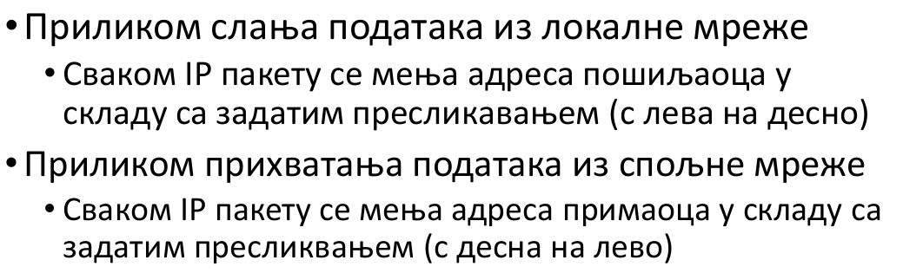

Loše:
- narušava slojevitost jer barata TCP portovima iako je na mrežnom sloju
- paketi mogu da se primaju jedino ako je nešto prethodno slato jer nas nat preslikava tek kad nešto šaljemo
- server je praktično nemoguće koristiti jer je on pasivan i zahteva da mu se javimo prvo, a to ne možemo zbog prethodne tačke

Dobro:
- zaštita privatnosti, ne može da se nađe ko je čemu pristupio na faksu jer svi idu preko jedne javne ip adrese
- smanjena potreba za javnim ip adresama
- lako se instalira
- često ima firewall kao zaštitu od upada
- ako pristupamo nekom sajtu sa IPv6 mogu da vide sa kod računara smo pristupili, skupljaju naše informacije

---
### `31.` Rutiranja, mehanizam alokacije protoka, modeli isporuke, ciljevi rutiranja, princip dizajna algoritma rutiranja, rutiranje sa najkraćim putevima (najmanjim troškom), Dajkstrin algoritam

Rutiranje je određivanje putanja kojim će se vršiti prosleđivanje.

Mehanizam alokacije protoka:
- protok se alocira sa otkazivanjem čvorova na umu
1. Rutiranje osetljivo na opterećenje
    - reaguje u sekundama
    - adaptacija ka kritičnim čvorovima opterećenja
    - reaguje na opterećenje mreže
    - optimalna vrednost je jedinstvena ali putanja ne mora da bude
    - ispituje opterećenje u svakoj sekundi
2. Rutiranje
    - reaguje u minutima
    - adaptira se ka otkazanim čvorovima
    - ruter zna deo ili celu toplogiju mreže i iz minuta u minut joj se prilagođava
3. Oblikovanje protoka
    - na nivou sati
    - gleda opterećenje mreže
    - provajder se prilagođava navikama svojih korisnika
    - navike se uočavaju empirijski
    - analizira se u okviru vremenske serije, npr danju/noću veći/manji protok
4. Rezervacija protoka
    - na nivou meseci
    - usmereno ka korisnicima
    - na visokom nivou se napravi ugovor kojim se dve strane dogovre o garanciji opsega za x meseci

Modeli ispruke
- Unicast - šalje od jedne tačke do drugoj
- Broadcast - emituje svima, jedan čvor velikom broju drugih
- Multicast - šalje svima koji su se pretplatili, npr za video konferenciju
- Anycast - imamo primaoce koji primaju od bilo koga

Ciljevi rutiranja:  

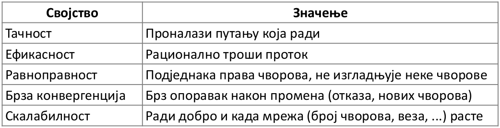

Princip dizajna algoritma rutiranja:
- decentralizovan
- distribuiran
- čvorovi su ruteri a ne krajnji korisnici
- svi čvorovi su ravnopravni
- čvorovi znaju ukupno stanje mreže tako što razmenjuju poruke sa susednim čvorovima
- mogu se desiti otkazi čvorova i veza, gubljenje poruka

Rutiranje sa najkraćim putevima (najmanjim troškom):
- Trokovi se mogu predstaviti matricom, mogu se kombinovati sa težinom
- neki od troškova koji se uzimaju u obzir:
    - Kašnjenje - nećemo zaobilzne puteve
    - Protok - izbegavati spore veze
    - Novac - izbegavati skupe veze
    - Broj hopova - smanjiti iskorišćenost komunikacione opreme
- ruteri traže najkraće puteve između svaka dva čvora
- pretpostavke:
    - graf je neusmeren
    - troškovi su simetrični
- uzeti u obzir princip optimalnosti: delovi optimalnih puteva su takođe optimalni putevi
    - npr ABCD je najkraći put, onda je su i BC, BCD, ABC... najkraći putevi
    - Dajkstrin se zasniva na ovom principu

Dajskstrin algoritam
- najkraći put između zadatog i svih ostalih
- dobija se stablo
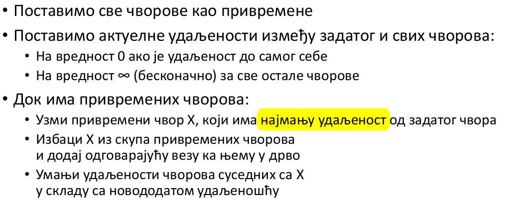

Karakteristike algoritma:
- pronalazi puteve ka čvorovima prema rastućem poretku dužina
- koristi svojstvo dekompozicije i optimalnosti
- vreme izvršavanj zavisi od efikasnoti pronalaženja najbolje privremenog čvora
    - može se koristi hip ali je složenost veća od linearne

---

### `32.` Rutiranje zasnovano na vektoru razdaljine
- DV rutiranje - Distance vector routing
- zasniva se na razmeni vektora (tabela) razdaljina susednih čvorova
- jedan od prvih pristupa (arpanet), sad se retko koristi
- vektor udaljensoti je trenutna percepcija mreže, koliki je trošak rutiranja do drugog čvora
- implicitno od suseda saznajemo najkraće puteve
- svaki čvor održava vektor udaljensoti i sledećih hopova za sve ciljne čvorove

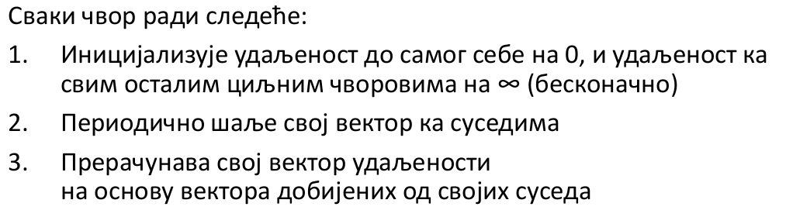

- nakon n-tog koraka svako nauči puteve dužine n
- ovaj algoritam se vrti u beskonačnoj petlji
- radi i ako čvorovi otkažu ili se dodaju
- nakon poslednjeg kruga tabela konvergira
- Ako se dodaju veze ili čvorovi
    - vest putuje jedan hop po razmeni što je sporo
    - nije toliki problem, samo se neoptimlano rutira dok se ne detektuje brži put
- uklanjanje veza ili čvorova
    - susedi ne vrše razmenu s njim neko vreme pa zaborave da postoji
    - može se uvesti maksimalna starost razmenjenog vektora
- razbijanje mreže na dva dela je ozbiljan problem
    - može se brojati do beskonačnosti
    - imamo A - B - C
    - npr pukne veza do A, B kaže da ne može direktno do A, C kaže ja mogu do A, ali C ne zna u tom trenutku da on isto ne može jer isto ide preko B
- brzina konvergencije zavisi od dijametra grafa
- odlična skalabilnost, čvorovi računaju rešenje potproblema

---

### `33.` Plavljenje

- jednostavan ali ne preterano efikasan mehanizam
- šalje svim ruterima informaciju
- na svakom čvoru:
    - kad ti stigne poruka prosledi je svim ostalim susedima
    - zapamti koja poruka ti je stigla da je ne bi prosleđivao ako ti opet stigne, može da se pamti heš
- neefikasno jer jedan čvor može dobje višestruke kopije iste poruke
- svaka veza je iskorišćena u najmanje jednom smeru
- povećava se redudantnost slanja
- dovoljno je pamtiti izvor i redni broj poruke, pa se posle primaju samo poruke sa većim rednim brojem
- moguće je omogućiti  ARQ
- informacija stiže nekim putem
- implicitan trošak je vreme
- daje najkraće vreme dostavljanja sadržaja

---

### `34.` Rutiranje zasnovano na stanju veze
- LS - Link state routing
- svaki graf zna svoje susede i troškove i svi plave
- svi čvorovi dobijaju parcijlna susedstva čvorova čime mogu da rekonstruišu ceo graf
- svaki čvor može da sprovede centralizovanog Dijkstru i da ažuriraju tabele
- ovim se rešava problem spore konvergencije
- Dve faze:
1. Čvorovi plave mrežu informacijama o svojoj loklanoj toplogiji (susedima)
    - plavi se LS paketom
    - svaki čvor može da rekonstruiše celokupnu topologiju
2. Svaki čvor računa svoju tabelu prosleđivanja
    - npr Dajkstrin algoritmom
    - svaki čvor ima punu topologiju, dobija je tako što kombinuje sve LSP
    - svaki čvor izvrši Dajkstrin algoritam - deluje da ima previše izvršavanja ako se gleda cela mreža

- kada čvor detektuje promenu u mreži on plavi svojo novi LSP
- iako odredi celu putanju čvor gleda samo naredni korak, ne zamara se time šta će biti dalje sa paketom
- razmišlja globalno a radi lokalno
- ako otkažu čvor ili veza ponašanje je isto, susedi otkaza plave nove informacije
- brže se saznaje ako se doda čvor
- brza konvergencija, jer je plavljenje brzo
- sklabilnost je korektna, svaki čvor računa rešenje celog problema
    -  za sad se može nadomestiti boljom opremom

----

### `35.` Višeciljno rutiranje sa najkraćim putevima (ECMP)
- Equal-cost multiple routing
- povećavamo pouzdanost dozvoljavanjem  višestrukih puteva
- doprinosi smanjenju zagušenja
- pamtimo i alternativne puteve i dobijamo usmereni acikličan graf umesto drveta
- zadržavamo sve najbolje puteve a ne samo jedan
- ako neki čvor otkaže ili se javi zagušenje imamo odmah alternativni put
- Dajkstrin algoritam, samo ubacujemo sve najbolje
- načini izbora puta, pošto ih imamo više:
    - nasumično - balansiramo opterećenje, ali paketi mogu imati različito kašnjenje, loš prenos u realnom vremenu
    - ciklično
    - možemo da dodelimo granu pošiljaocu
    - možemo moduo ip adrese pa da uvek ide na istu stranu
- najbolje fiksirati putanju za izvor i cilj, paketi jedne logičke celine idu uvek istim putem, i dalje balansirano opterećenje, kontrolisano nasumično

---

### `36.` Hijerarhijsko rutiranje

Ideje: čvorove grupišemo u regione pa u regionima vršimo specifično rutiranje, jer se rutiranje po pojedinačnim čvorovima ne skalira dobro.

- nema smisla praviti unos u tabelu prosleđivanje za svaki ruter u svetu
- uvode se veće jedinice rutiranja, npr država
- te veće jedinice posmatramo kao pojedinačne čvorove
- unutar regiona mogu postojati podregioni, npr ISP mreže
- Konačno rutiranje:
    - paket rutiramo u najmanjem regionu, npr u okviru ISP meže
    - po izlasku iz ISP mreže rutiramo na nivou države
    - dalje se ulazi u ciljnu ISP mrežu
- u grupu se ubacuju geografski bliski ruteri
- smanjuje se vreme rutiranja i memorijsko zauzeće
- ne daje uvek najkraće putanje ali je to kompromis zarad efikasnosti
- kad ruter jednog regiona pokuša da rutira na dva ili više rutera drugog regiona odluka i troškovi će biti manje više isti

Podmreže
- interna podela IP prefiksa, npr unutar kompanije
- IP prefiksi rutera nisu vidljivi spolja

Sažimanje
- moguće je i spoljno sažimanje nepovezanih ustanova
- obično radi ISP

---

### `37.` Transportni sloj, uloga, tipovi servisa i njihovo poređenje

- nadogradnja na mrežni sloj
- omogućava prenos podataka sa željenom pouzdanošću i kvalitetom
- omogućava komunikaciju između dva krajnja korisnika, tj procesa/programa
- jedinica komunikacije - segment
- segment se ugrađuje u pakete, a oni dalje u okvire


| TCP | UDP (Datagrami) |  
|-----|------|  
| pouzdan | nepouzdan |
| ozbiljno razrađen mehanizam | koristi datagrame mrežnog sloja 
| ostvaruje vezu | datagrami |
| bajtovi se isporučuju jednom, pouzdano, po redu | poruke se mogu izgubiti, pomešati, duplirati|
| proizvoljna dužina toka | ograničena dužina poruke |
| kontrola toka se prilagođava pošiljaocu i primaocu | šalje se bez obzira na stanje primaoca |
| kontrola zagušenja se prilagođava stanju mreže | šalje se bez obzira na stanje mreže |


---

### `38.` Socket API, primer jednostavnog klijent-servera (pseudokod), portovi

- abstrakcija za upotrebu mrežnih usluga
- upotreba transportnih servisa
- deo svih bitnih operativnih sistema
- podržava datagrame i tokve
- aplikativni sloj koristi neke biblioteke koje upakuju mrežni api, soketi su i dalje na transportnom sloju
- omogućavaju procesima da se povezuju na lokalnu mrežu putem različitih portova
- da bi identifikovali neki ruter ili serverski računar treba nam javna ip adresa
- ali ako imamo više procesa na računaru javna ip adresa nije dovoljna, ovo se rešava nadovezivanjem porta na ip adresu
- os vodi računa o portovima, to su uglavnom četvorocifreni brojevi koje računar dodeljuje
- isit api se korsti i za tokove i za datagrame:
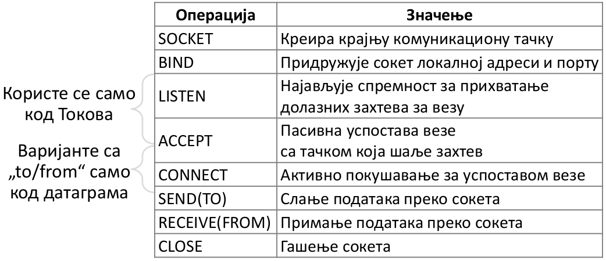

`Server:`
```
Socket server = Socket()
server.bind(localhost, port)
server.listen()
while(true){
    Socekt client = s.accept()
    // obradi klijenta
    // obrada se uglavnom radi u posebnim nitima
}
server.close()
```

`Klijent:`
```
Socket client = Socket()
client.connect(localost, port)
...
client.send(some_message)
...
data = client.receive()
...
client.close()
```

Portovi
- proces se identifikuje uređenom trojkom (IP adresa, protokol, port)
- 16-bitni pozitivni celi brojevi
- servisi se obično vezuju za neke opšte poznate portove
- klijenti obično koriste nasumične portove koje bira os, ne moraju biti opšte poznatii jer ih niko ne cilja
- maksimalan broj portova 2 na 16 = 65236

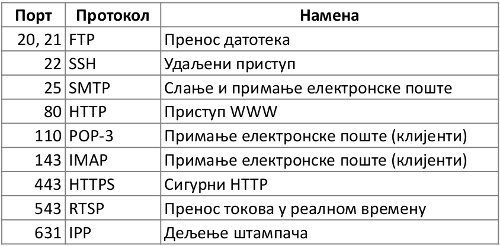

---

### `39.` UDP
- Unreliable Datagram Protocol
- programi kojima nije preterano bitna pouzdanost ili su bazirani na porukama
    - Voice-over-IP nepouzdano
    - DNS, RPC su zasnovani na porukam
    - DHCP je zasnovan na porukama

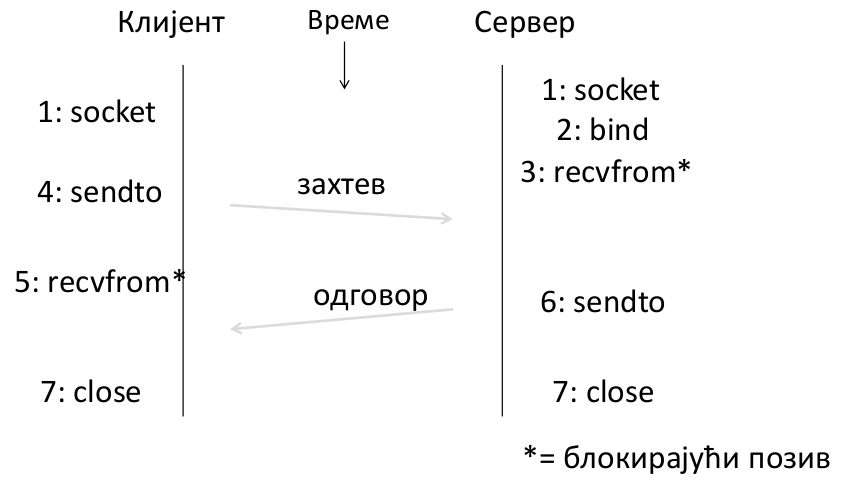

- UDP datagram je veličine 64K
    - Source port 16b
    - Destination port 16b
    - UDP length
    - UDP kontrolna suma
- praktično doda informacije o portu i prosledi poruku mrežnom sloju

---
### `40.` Uspostavljanje i prekid veze na transportnom sloju (uopšteno)

Uspostavljanje veze:
- krajnji čvorovi moraju biti svesni uspostavljanja veze pre bilo kakvog slanja i primanja poruka
- moraju se dogovoriti o skupu parametara, veličini segmenta...
- Prvo se podešava stanje krajnih čvorova, poput zvanja telefonom, zatim usaglase početne brojeve segmenta kako bi se mogao imlementirati protokol kliznih prozora (ovde protokol je imeđu krajnjih korisnika, a ne između susednih čvorova kao u sloju veze)

Trofazno rukovanje:
1. Klijent pošalje segment SYN(x)
    - gde  je x početni redni broj segmenta, obično slučajan broj od 0 do 2 na 32, praktično nemoguće da se dva puta pošalje isto
2. Server odgovara
    - šalje broj koji sledeći put očekuje i šalje svoj početni broj
    - SYN(y)ACK(x+1)
3. Klijent potvrđuje da je primio ACK(y+1)
- SYN segmenti se ponovo šalju ako se izgube
- potencijalni problem:
    - tražim konekciju
    - uspostavi se ali se izgubi potvrda servera
    - opet tražim konekciju - server je odbije jer je već uspostavljena

Prekidanje veze:
- obe strane treba da prekinu vezu
- ne sme da se desi da je jedna strana prekinula vezu a druga ne
- jedna strana uvek inicira prekid, klijent ili server
- teorijski nerešiv problem poput vizantijskog generala:
    - dve vojske moraju zajedno da napadnu
    - ako jedna napadne sama izginuće
    - prvi šalje kurira da hoće napad u zoru, da kaže i da se vrati s potvrdom jer bez potvrde ne napadaju
    - drugi primi poruku i kaže da ide da potvrdi ali da se vrati i njima da potvrdi jer na da druga strana neće napasti bez potvrde, pa da zna da je potvrđeno
    - ...
    - i tako u krug
- rešava se u dva koraka:
    1. Aktivna strana šalje FIN(x), pasivna potvrđuje sa ACK(x+1)
    2. Pasivna šalje FIN(y), aktivna potvrđuje ACK(y+1)
    - FIN se ponovo šalju ako se izgube
    - svako gasi svoju stranu veze nakon slanja FIN i dobijanja ACK za isti
    - aktivna strana kad dobije potvrdu ne gasi odmah već heuristički čeka, ne može da čeka neograničeno
    - dešava se da jedna konekcija ostane otvorena iako se druga strana zatvorila

---

### `41.` Protkol kliznih prozora na transportnom sloju

- u sloju veze su se odnosili na prenos podataka kroz kabl imeđu dva susedna čvora, ovde se odnosi na prenos između krajnjih tačaka bilo gde na Internetu
- povećanje pouzdanosti na nižim nivoima doprinosi efikasnosti viših nivoa
- ne mora sve da se vrši na nižim nivoima, može na transportnom i kontrola toka i provera greške,
    - ali to nije efikasno jer smo već stigli do višeg sloja s greškom, efikasnije bi bilo da smo to ranije otkrili
- postoji dosta varijacija ovih protokola u zavisnosti od baferisanja, potvrđivanja poruka i retransmisije

- Vrati se N
    - jedostavna verzija
    - potencijalno neefikasan
    - primalac ima bafer veličine 1
    - LAS - redni broj poslednjeg segmenta prosleđenog aplikativnom sloju
    - Ako je redni broj primljenog segmenta LAS+1 onda
        -  prihvati
        - prosledi aplikativnom
        - ažuriraj LAS++
        - pošalji potvrdu
    - inače odbaci
- Selektivno ponavljanje
    - složenije i efikasnije
    - primalac prosleđuje aplikativnom sloju po redu
    - baferiše segmente ako nisu po redu, bafer veličine W
    - TCP koristi ovaj pristup
    - putem ACK segmenta primalac:
        - potvrdi najviši uređen segment
        - dodatno šalje informaciju o segmentima koji nisu po redu
    - održava stanje promenljive LAS
    - prihvata segment ako je iz opsega [LAS+1, LAS+W], pri tom
        - baferiše segmente opsega [LAS+1, LAS+W]
        - prosleđuje aplikativnom sloju ako stigne segment sa brojem LAS+1, i pritom ažurira LAS++
        - šalje potvrdu
- svima je zajedničko da od aplikativnog sloja dobijaju segmene po redu i da mu šalju segmente po redu

Pošiljalac
- baferiše najviše W segmentata dok ne stignu potvrde za njih
- LFS - poslednji poslat segment
- LAR - poslednji potvrđen segment pre koga su svi potvrđeni
- šalje dok god je LFS - LAR <= W, tj transportni prima od aplikativnog
- kada stigne potvrda za naredni segment prozor se pomera i šalje se novi segment 

Retramsmisije:
- Vrati se N
    - pošiljalac ima jedan tajmer
    - kad istekne tajmer šalje sve baferisane segmente od LAR+1
- Selektivno ponavljanje
    - pošiljalac ima tajmer za svaki nepotvrđeni segment
    - po isteku tajmera šalje ponovo
    - u proseku radi manje retransmisija

---

### `42.` Kontrola toka podataka na transportnom sloju

Usaglašava brzinu slanja sa brzinom primanja. Npr telefon ne može dovoljno brzo da učitava video.  
Npr imamo klizni prozor
- ne možemo da pomerimo prozor dok aplikativni sloj ne primi podatke
- kad stignu naredni segmenti popunjava se bafer
- kad se bafer popuni ne može više da se prima sve dok aplikativni sloj ne prihvati segmente

Izbegavanje gubitka na strani primaoca
- primalac govori pošiljaocu dostupno stanje bafera
- win - broj dostupnih mesta u baferu
- pošiljalac korsiti win kao efektivnu informaciju o veličini prozora
- koristimo cirkularni bafer
- SEQ + veličina segmenta < ACK + WIN


---
### `43.` Retransmisija i prilagodljive pauze (tajmaut) na transportnom sloju

Ideja: 
- kad pošaljemo segment aktiviramo tajmer 
- tajmer se prekida ako stigne potvrda
- ako tajmer istekne vrši se retransmisija
- nezgodno odrediti kolika treba da bude pauza, postoji opasnost od nepotrebnog čekanja
- RTT - round trip time
- krenemo pesimistično pa smanjujemo čekanje
- sa dugom pauzom se nepotrebno čeka
- sa kratko pauom možemo imati nepotrebne retransmisije
- za LAN se lako određuje na sloju veze, jer imamo poznate rute i kratak kabl, samim tim predvidim RTT
- za Internet na transportnom sloju je teško odrediti, širok opseg i promenljiv RTT, ima više rutera kroz koje prolazimo i od kojih zavisi koliko će brzo stići

Prilagodljiva pauza (tajmaut)
- odredi se kratkoročni RTT i njegova varijansa
- to se iskoristi za postavljanje trajanja pauze
- Formula zasnovana na pomerajućim prosecima
    1. SRTT n+1 = 0,9 * SRTTn + 0,1*RTTn+1
        - uzmemo u obir prethodno predviđanje koje će dati inerciju, ali gledamo i novo ostvareno
    2. Svar n+1 = 0,9 * Svar n + 0,1 * abs(RTT n+1 - SRTT n+1)
        - predviđamo narednu varijansu na sonovu prethodne i novog relizovanog

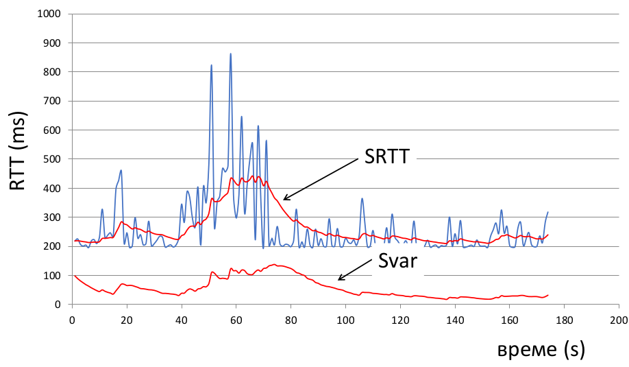

- Pauza treba da bude uvek iznad ocene RTT 
    - TCP timeout n = SRTT n + 4*Svar n
    - što je veća varijansa manje smo sigurni jer je i gornja granica više udaljena
- SRTT je zapravo moving average i dobro hvata trend sa malim zakašnjenjem

---

### `44.` TCP, svojstva, zaglavlje, realizacija kliznih prozora, uspostava i prekid veze (specifično)

TCP - Transmission Control Protocol  

Svojstva:
- pouzdan tok bajtova
    - segmenti kroz mrežu mogu da idu neuređeno i nepouzdano kroz niže slojeve
    - transportni sloj ih uređuje, proverava i aplikativnom sloju šalje pouzdano i po redu
    - slanje i primanje podataka u oba smera
    - šlepanje - kontrolne informacije se šalju zajedno sa drugim segmentom, npr ACK
- zasnovan na vezama
- koristi klizni prozor sa prilagodljivim pauzama zarad pouzdansoti
- kontrola toka za spore primaoce

Zaglavlje
- portovi identifikuju programe - socket API
- 16bitni identifikatori
- koristi SEQ/ACK brojeve u okviru protokola kliznih prozora

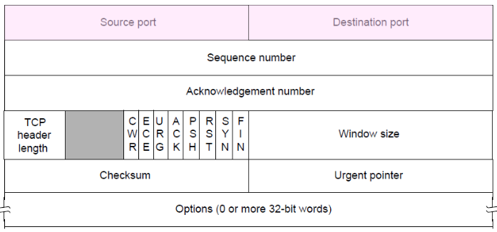

Klizni prozori
- Kumulativni ACK - koji je sledeći očekivani bajt, LAS+1
- Selektivni ACK (SACK) se koristi opciono zarad optimizacije
    - za potvrđivanje čitavih opsega
    - listanje do tri opsega prmljenih bajtova

- pošiljalac koristi prilagodljivu pauzu za retransmisiju segmenta koji počinju od LAS+1
- koristi heuristiku kako bi brže zaključio koji segmenti su izgubljeni i time sprečio nepotrebno čekanje
    - npr heuristika: ako nam stignu potvrde za 2, 3, i 4i okvir prvi je verovatno izgubljen

uspostava i prekid veze - pitanje ` 40.`

---

### `45.` Zagušenje na transportnom sloju, opis problema i mehanizam rešavanja za AIMD

- do zagušenja dolazi ako podaci stižu brže nego što mogu da se obrade, i to srednjeročno ili dugoročno
- postoje mehanizmi koji na nižim slojevima mogu da reše ovaj problem, npr baferisanje u ruterima, ali ti baferi mogu da preliju, nije rešenje za veće zagušenje
- redovi čekanja mogu da pomognu samo pri absorbovanju kratkoročnih skokova u saobraćaju
- sa povećanjem opterećenja se drastično smanjuju performanse - izaziva se kolaps

Alokacija protoka
- dodeljivanje kapaciteta pošiljaocima
- deo rešenja problema zagušenja
- efikasno - skoro ceo kapacitet je upotrebljen ali nema zagušenja
- ravnospravnost - svi pošiljaoci dobijaju udeo protoka i nema izgladnjivanja
- ovde zajedno rade transportni i mrežni sloj
- mreži sloj ima svoje bafere i može da detektuje zagušenje, dok je transportni na višem logičkom sloju i to ne može
- transportni sloj izaziva zagušenje ali može i da ga razreši redukovanjem opterećenja

Ideje za rešavanje zagušenja:
- pošiljalac prilagođava svoj odlazni saobraćaj na osnovu onog što detektuje iz mreže
- ima u vidu efikasnost i ravnopravnost
- prilagođavanje mora da bude stalno jer se stanje mreže stalno menja

AIMD - Additive Increase Multiplicative Decrease
- kontrolni mehanizam koji omogućava dostizanje dobre alokacije
- pošiljalac aditivno povećava brzinu slanja podataka dok se ne pojavi zagušenje
- kada se uoči zagušenje pošiljalac multiplikativno smanjuje brzinu slanja
- TCP ovo korsti u nekoj formi
- zagušenje može da bude na ruteru ili na komunikacionom kanalu
- npr ako dva korisnika šalju na jedan ruter, a taj ruter može samo jedno da prosledi
- sve alokaciju su dopustive ali nisu sve dobre
- problem je što smo u decentralizovanom sistemu i ne vidimo direktno celu mrežu

- aditivno uvećanje pomera pod uglom od 45 stepeni, multiplikativno umanjenje ide ka tački 0
- optimalna tačka je ova tačka preseka
- umnoženo smanjenje vraća relativno prema trenutnom protoku
- veći protok -> veća dužina projekcije
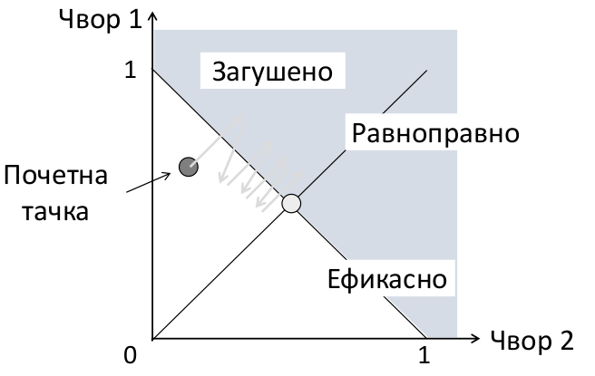

- ovo konvergira ka optimalnoj tački
- presek efikasnosti i ravnospravnosti je optimalna tačka
- radi i u višedimenzionom scenariju
- ostali ne rade posao, MIAD, MIMD, AIAD
- od mreže se traži samo binarni odgovor da li se javilo zagušenje
    - mogući signali mreže:
    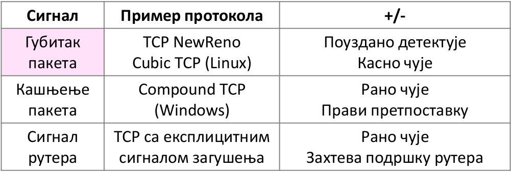

---

### `46.` Aplikativni sloj, uloga, interakcija sa slojem ispod, pregled Internet aplikacija

- aplikativni sloj je najviši i naslanja se na transortni
- namenjen je izgradnji krajnjih aplikacija
- poruke aplikativnog sloja se obično dele na segmente, a oni obično pripadaju jedinstvenom paketu

Interakcija sa transportnim slojem
- aplikacijama možda trebaju zahtevnije funkcionalnosti koje ne postoje na transportnom sloju
- Web - sekvenca poruka različitih dužina i pouzdanosti, koristi TCP
- DNS - kratke pouzdane poruke
    - korsiti UDP i povećava pouzdanost na aplikativnom sloju
    - preslikavanje stringa u ip adresu
- Skype - nepouzdana sekvenca podataka u realnom vremenu, koristi udp

Posle pojave arpaneta počinje formiranje prvih aplikacija.

Internet aplikacije
- Telnet - prvi nastao
    - omogućava pristup drugim računarima na daljinu, preko konzole
    - u istraživanjma
    - dele se hardverski resusi
    - potpuno nezaštićen
    - prenose poruke
- SSH - Secure Shell
    - bezbedna verzija telneta
- FTP - File Transfer Protocol
    - prenose se fajlovi
    - nije interaktivno
    - danas je zaštićeniji
- Email 
    - SMTP - Sending Mail Transfer Protocol
    - protokol za slanje i primanje
- News
    - NTTP - News Transfer Protocol
    - preteča današnjih novinskih portala i veba
    - bio u konzoli, nema gui
    - omogućava razmenu informacija od javnog interesa
- Web
    - http - u početku samo jednostvno praćenje linkova
    - CDN - čitave farme servera koje hostuju statičke stranice
- P2P
    - BitTorrent
- Web video

---

### `47.` DNS, uloga, raniji pristup, moderniji pristup, TLD, slogovi

DNS
- Domain Name System
- sistem za preslikavanje imena na IP adrese
- praktičnije je zapamtiti domen nego IP adresu
- prostor imena je organizovan jer ne može jedan računar da čuva sve
- neophodan je proces za određivanje adrese za traženo ime
- ime - identifikator resursa, kako se zove?
- adresa - lokator resursa, gde je?
- određivanje adrese je preslikavanje imena na adresu

Raniji pristup:
- Arpanet je imao fajl sa svim preslikavanjima - hosts.txt
- svi čvorovi su ovaj fajl preuzimali sa jdnog centralnog čvora
- imena su inicijalno bila nestruktuirana
- postalo neefikasno kako je arpanet rastao

Moderni pristup
- DNS - aplikacija koja vrši preslikavnje imen u IP adresu
- efikasan i lak za upravljanje i sa velikim brojem korisnika
- distribuirana hijerarhijski organizovana tabela
- automatski protokol za povezivanje delova hijerarhije

TLD
- Top Level Domains
- održava organizacija ICANN - Internet Corp. for Assigned Names and Numbers
- 22+ osnovna TLD
    - .com, .edu, .net, .gov, .org, .mil; .aero, .mseum...
- oko 140 nacionalnih TLD
    - .au, .tv, am, .gl, .rs...
    - neke države su prodale svoje domene
- zona - neprekidno pareče prostora imena
    - osnov za dalju distribuciju
    - EDU registar za sva imena koja se završavaju sa .edu npr
    - UW nadležan a sva imena sa sufiksom washington.edu
    - svaka zona ima nadležni server imena koji zna kontakte za delegiranje, tj server imana a podzone
- delegiranje - podela na podzone radi lakše i efikasnije organizacije
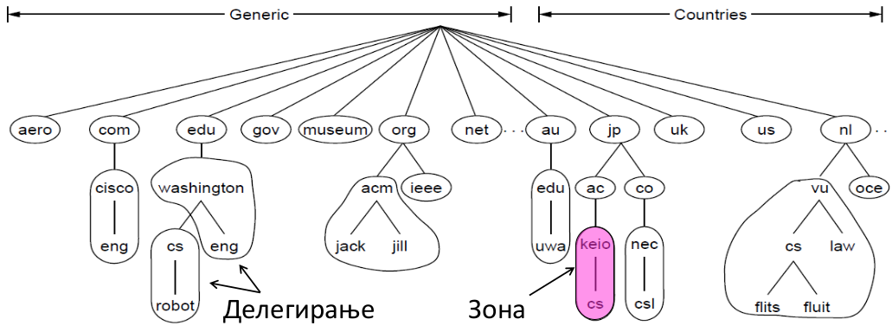
- svaka zona sadži podešavanja (slogove) koji pružaju
    - informacije o imenovanim računarima
    - informacije vezane za slanje pošte
    - informacije o parametrima
    

---

### `48.` DNS, zone, opis mehanizma određivanja adresa

Početak iz pitanja `47`.

- klijent kontaktira DNS kako bi mu poslao IP adresu drugog računara na internetu
- računar kontaktira svoj najbliži DNS, taj lokalni DNS proveri da li ima sačuvanu adresu od ranije, ako nema onda apočinje traženje kroz hijerarhiju
- loklani DNS radi po principu ključ u ruke
- DNS serveri su iterativni, rekurzivno bi bili previše zahtevno
- kajnji čvorovi mogu nekad priuštit rekurziju
- npr tražimo washington.edu
    - naš lokalni npr nema keširano
    - daje nam adresu .edu servera i pušta nas
    - idemo na tu adresu i ona nam daje adresu za washington.edu
    - vraćamo se našem loklanom i odatle idemo na dobijenu adresu
    - i tako dok ne dođemo do krajnjeg odredišta

- Iterativni DNS
    - ako ne zna ime iterativno samo vraća referencu na druge DNSove koji naj odgovor, a te reference mogu biti rekurzivne ili iterativne
    - koreni su uvek iterativni, dok lokalni mogu biti rekurzivni
    - ne zahteva veliku memoriju, pamti samo direktne potomke, tj serverska imena nižeg nivoa
- Rekurzivni DNS
    - završava ceo posao za klijenta - nalazi ip aresu i vraća je klijentu
    - smanjuje opterećenje onome ko traži informaciju
    - omogućava keširanje za prethodne upite, što može poboljšati performanse na strani onog ko pita
- Keširanje
    - čuvanje adresa kojima smo već pristupali
    - odgovara odmah, bez pitanja drugih DNSova
    - potpuno - naš loklani DNS čuva ciljnu adresu
    - parcijalno - naš lokalni DNS čuva deo ciljne adrese
    - treba čuvati ttl keša, za slučaj da se nešto promenilo pa nam nije validan keš

- Lokalni DNS
    - obično u vlasništvu firme ili ISP
    - postoje i javno dostupni, Google javni DNS
    - mogu biti na klijentu ili pristupnoj tački
    - klijent mora da zna svoj lokalni DNS
    - obično se podešava putem DHCP o istom trošku kada se računaru u mreži šalje sopstvena IP adresa

- Koreni DNS serveri
    - čini ih 13 servera, od a do m root-servers.net
    - njihove adrese su fiksirane u svim drugim DNS serverima
    - postoji preko 250 kopiranih korenskih DNS servera
    - više mašina koje mapiraju ova imena 
    - anycast - u zavisnsoti od blizine onoga ko pristupa
    - vrlo pouzdan i efikasan

- DNS poruke
    - zahtevi i odgovori
    - UDP port 53
    - ARQ za pouzdanost
    - poruke se identifikuju 16bitnom oznakom
    - klijent se obraća jednom od višestrukih servera za istu zonu, što pomaže  balansiranju protoka

---

### `49.` HTTP protokol, preuzimanje Veb dokumenata

- HTTP - Hypertext Transfer Protocol
- osovni protokol za preuzimanje Internet dokumenata (npr internet stranica)
- www (veb) - skup svih povezanih dokumenata na logičkom nivou
- Internet se odnosi na skupo povezanih mašina a fizičkom nivou
- korsiti TCP
- obično na portu 80
- koristi se i na strani klijenta (pregledač) i na strani servera (veb server)

klijent   
- aplikacija na vebu koja implementira http protokol
- formuliše zahtev 
- formir stranicu od odgovora

server 
- aplikacija na vebu koja implementira http protokol
- radi po standardu, ali ne sa grafičkim elementima
- razume zahtev klijenta i formira http odgovor

Koraci u preuzimanju Veb dokumenta
- korisnik ukuca adresu veb dokumenta
    - protokol://ime_pridruženo_ip_adresi/relativna_putanja_resursa
    - protokol sugeriše na kom portu da se gleda
    - realtivnu putanju gleda server, npr get zahtev, ne gleda se na nižim slojevima
- odredi IP adresu
- uspostavi TCP vezu sa serverom (mašinom na ciljnoj IP adresi)
- slanje HTTP zahteva za konkretnim dokumentom na serveru
- čekanje HTTP odgovora
- izvršavanje ili preuzimanje ugrađenih dokumenata (slika, videa...)
- gašenje TCP veze

Veb dokumenta
- statička - imaju fiksan sadržaj, slike, vieo, html stranice...
- dinamička - dokument je datoteka dobijena kao rezultat izvršavanja programa, npr rezulat pretrage na google

Komande koje se koriste pri formiranju zahteva i kodovi koji se vraćaju:
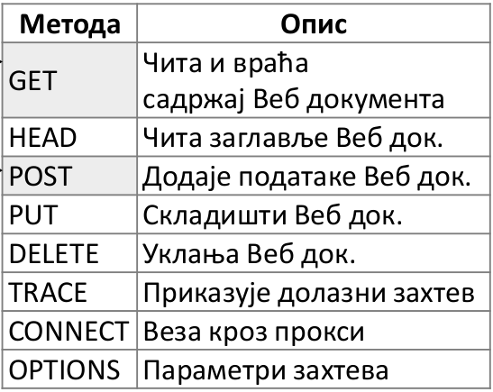 
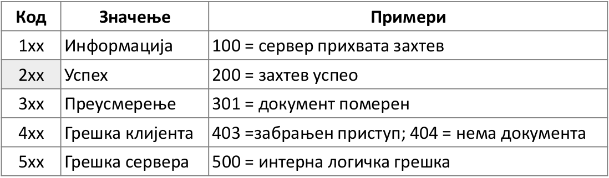
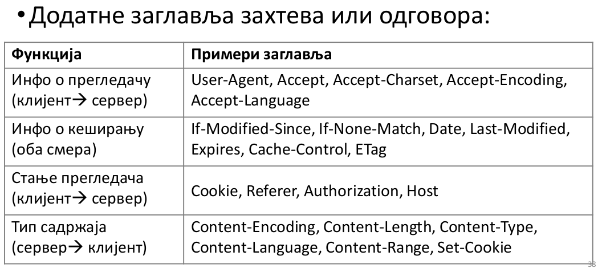

---

### `50.` HTTP performanse

- PLT - Page Load Time
- vreme učitavanje dokumenta je osnovno merilo performansi
- korisnik želi što pre da vidi nešto korisno
- zavisi od:
    - strukture dokumenta
    - verzije HTTP i TCP
    - mrežnog protoka i RTT

Ranije
- HTTP/1.0
- jedna TCP veza za preuzimanje jednog dokmenta, za naredni dokument naredna veza...
- jednostavna implementacija
- veoma loše performanse
- sekvencijalno izvršavnje
- potrebno uspostaviti više konekcija, možda nisu svi resursi na jednom računaru
- internet je stateles - nema memoriju

Način poboljšanja efikasnoti:
1. Slati manje sadržaja, manje slika, videa, zipova
2. prilagoditi http da bolje koristi protok, to ne možemo mnogo da menjamo
3. izbegavati ponavaljanje http zahetva
    - keširanje i veb proksiji
4. pomeranje sadržaja da bude bliže korisniku - CDN
5. paralelne TCP veze
    - npr istovremeno 6 http konteksta i toliko TCP veza, a npr 6 slika na različitim serverima
    - promena samo na klijentu, server ne mora da zna
    - bolje se koristi protok
    - sve radi istovremeno pa nema gomilanja kašnjenja usled uspostave TCP veze
6. Trajne - višestruko upotrebljive veze
    - jedna tcp veza za sve resurse na jednom serveru
    - deli se među nezavisnim HTTP zahtevima ka tom serveru
    - nema kašnjenja zbog uspostave nove veze
7. protočno slanje veze
    - jedna uspostava veze
    - šaljemo zahteve bez čekanja na odgovor

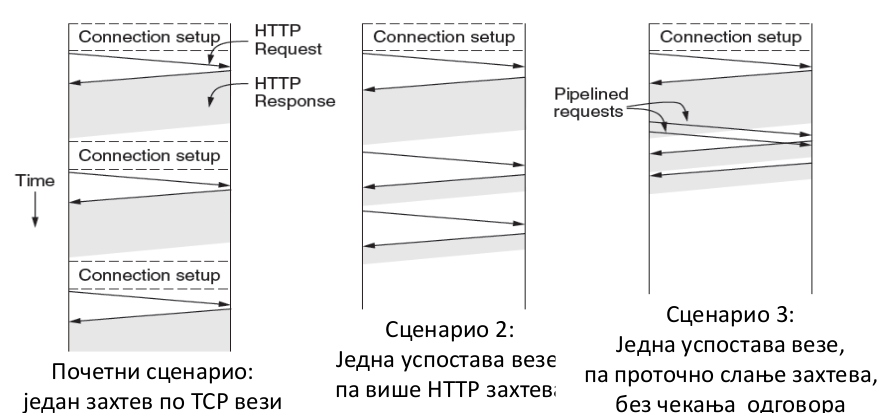

---

### `51.` HTTP keširanje i HTTP proksiji

- isti koncept
- omogućava višestruku upotrebu istog sadržaja

Keširanje
- lokalno čuvamo kopiju stranice kojoj često pristupamo
- kopija je ispravna ako nije istekla
- server dostavlja dodatno polje sa informacijom kada kopija isitče
- ako je kopija ispravna koristi se 
- uslovni keš zahtev - kažemo serveru da imamo taj i taj resurs i kad smo ga preuzeli, i pitamo da li je validan
- server šalje ili da je ok ili novi sadržaj
- moguća je provera pomoću nekog vida heš koda - etag zaglavlja

Proksiji
- keš nije na lokalnom računar već na nekom računaru lokalne mreže
- heširaju se podaci a korisnike na nivou mreže
- ima smisla jer možda više korisnika pristupa istom sadržaju
- u proksi se mogu ugraditi sigurnosni mehanizmi - zabrana sadržaja i slično
- korisno za kompanije, organizacije, ISP...
- klijent kontaktira proksi, a proksi kontaktira server ako je neophodno

---

### `52.` CDN

- Content Delivery Networks
- mreža računara posvećena dostavljanju statičkog sadržaja
- efikasna isporuka često korišćenog sadržaja
- smanjuju čekanje i potrošnju ukupnog protoka
- popularan sadržaj se postavlja bliže klijentima

- bez CDNa ima 12 hopova, a sa CDNom ima 6:
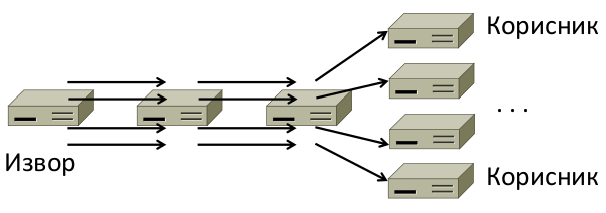

- keširanje i proksiji su ograničeni na sadržaje koji koriste pojedinci i grupe pojedinaca

- CDN pomaže ako je sadržaj popularan na višem nivou, npr viralni videi i slika, tada kopije želimo na geografski pogodnom mestu
- CDN je komercijalni sistem i kompanije ih imaju za svoje interne potrebe
- facebook je verovatno najveći potrošač CDNa
- DNS određivanje adresa može da dodeli različite odgovore različitim klijentima u zavisnosti od toga koja im je najbliža kopija

---

### `53.` P2P

- model isporuke sadržaja
- alternativa CDNa
- nema centralnih bitnijih čvorova
- svako je i klijent i server
- svi čvorovi su ravnopravni i pomažu jedni drugima
- BitTorrent je primer realizacije ovakvog tipa sistema
- cilj je isporuka sadržaja bez centralizovanih mehanizama
- efikasno se ponaša sa povećanim brojem čvorova
- može se postići visoka pouzdanost
- Netscape 1999
    - inicijalna ideja
    - za deljenje muzičkog sadržaja
    - ugašen jer je imao centralizovan spisak sadržaja
- BitTorrent 2001
    - nema deljeni registar sadržaja pa se ne može optužiti pojedinac
    - standardni p2p sistem koji se danas koristi
    - veliki deo internet saobraćaja danas
    - za legalni i ilegalni sadržaj
    - .torrent datoteka sarži meta podatke, spisak datoteka, veličine...
    - sadržaj se šalje u delovima zbog paralelizma
    - spisak čvorova može biti naveden Tracker serverom - računarom čija je namena da pamti spiskove čvorova koji poseduju određenu datoteku (sve se manje koristi zbog pojave DHTa - Distribuirane Heš Tabele)
- komunikacija imeđu čvorova mora da bude samoodrživa i distribuirana jer nema nikake centralizovanosti
- komplikuje se sa povećanjem broja čvorova

1. Podsticaj za učešće čvora
    - preuzmi da bi pomogao sebi
    - šalji da bi pomogao drugima
    - šaljem tebi ako šalješ meni
2. Decentralizcija 
    - pronalazak sadržaja bez centralizacije
    - DHT - distribuirana heš tabela
    - koristi algoritme za rad sa distribuiranim indeksom
    - indeks je distribuiran preko svih čvorova
    - indeks za tražen sadržaj daje spisak svih čvorova koji ga sadrže 
    - svaki čvor ima pristup indeksu

BitTorrent protokol
1. počinje torrent datotekom
    - u njoj je ili lokacija Tracker servera ili informacije potrebne za kontaktiranje DHTa
2. Razmena podataka sa različitim čvorovima
    - imam sadržaj koji nekom treba, a nekom ima sadržaj koji meni treba
3. što više šaljem više dobijam
    - izlazni sadržaj ka nekom čvoru prati dolazni sadržaj sa njega
- kada pokrenem torent postajem deo mreže koja je zainteresovana za taj konkretan fajl
- ne prave se veze imeđu svih torent klijienata na svetu već postoje privremene veze
- potpuno virtuelna veza
- a svaki transfer učestvujemo u po jednoj mreži
- delovi koji se šalju obično idu nasumično, kad bi išli po redu mogućnost trgovine bi se značajno smanjila
- ako samo preuzimamo a ne šaljemo biće nam obustavljeno preuzimanje
