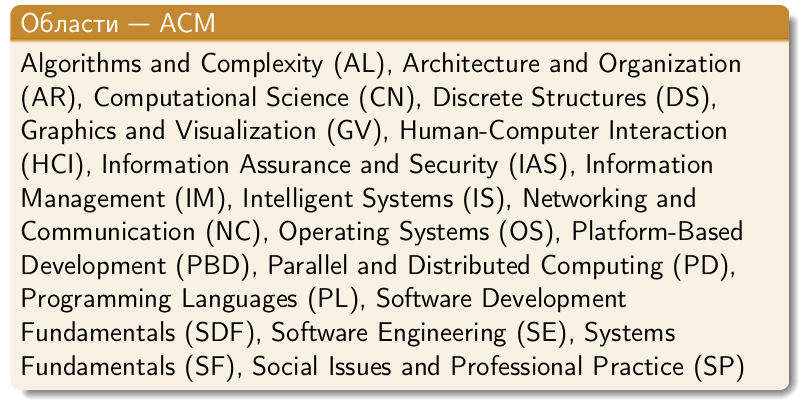
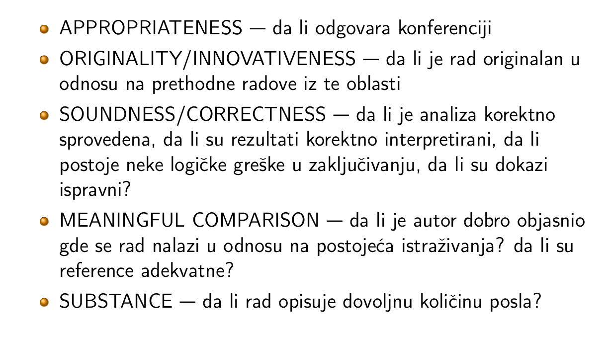
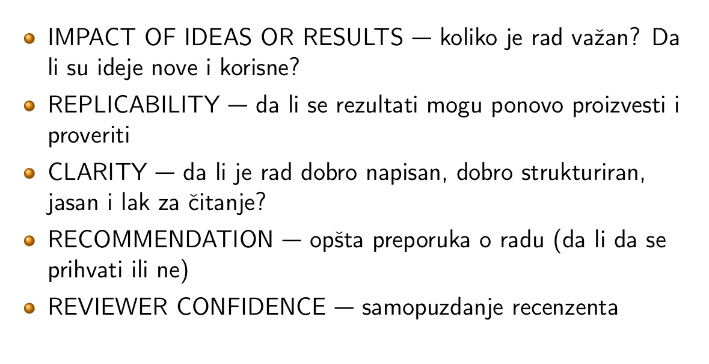

# 1 Osnovna pitanja
## 1.1 Nauka
1. Nauka. Naučno istraživanje. Faze istraživanja. Vrste istraživanja. Naučne oblasti.  

Nauka 
- nauka je znanje, sređeno, sistematizovani i proverivo saznanje o nečemu, postignuto metodičnim, pažljivim i savesim istraživanjem  razmatranjem
- rad na sticanju novih znanja, sistematski poduhvat prikupljanja znanja o svetu i organizovanja i sažimanja tog znanja u zakone i teorije koje mogu biti proveravani 
- znanje i sticanje znanja
- Ajnštajn: što više empirijskih činjenca obuhvatiti logičkim rasuđivanjem u što manjeg broj aksioma
- objektivno, logički argumentovano i sistematizovano znanje o zakonitostima, činjenicama, uzrocima i pojavam u stvarnosti, stečeno i provereno egaktnim posmatranjem, ponovljivim eksperimentom i valjanim ratmišljanjem

Teorija - organizuje neučno znanje.

Naučno istraživanje 
- sistematsko, plansko i objektivno ispitivanje nekog problema, prema određenim metodološkim pravilima, čija je svrha da pruži pouzdan i precizan odgovor na unapred postavljeno pitanje

Faze naučnog istraživanja:
- definicija problema
- prikupljanje podataka
- formulisanje hipoteze
- posmatranje/eksperiment
- testiranje hipoteze
- definisanje naučnog doprinosa
- zaključak

Vrste naučnih istraživanja:
- Fundamentalna istraživanja
    - povećavaju opšti fond naučnih činjenica i saznanja, definišu nove oblasti ljudskih interesovanja i saznanja, nemaju i ne moraju da imaju naporsrednih praktičnih, odmah primenljivih rezultata
- Primenjenja istraživanja
    - ima za cilj da uveća količinu znanja koje će biti ili koja lako mogu biti praktično i naposredno brzmo primenjena
- Razvojna istraživanja
    - zasnivaju se na fundamentalnim i primenjenim istraživanjima, kao i na bazi iskustva, bavi se stvaranjem i praktičnom primenom, iskorišćavanjem novih metoda i tehnika, novih materijala, radne tehnologije i slično

Naučne oblasti
- Prirodno matematičke nauke
    - astronomija, biologija, geofizika, geologija, geografija, hemija, matematika...
- Tehničko-tehnološke nauke
    - elektrotehnika, mašinstvo, metalurgija, arhitektura, građevinstvo, rudarstvo, saobraćaj...
- Biotehničke nauke
    - zaštita biljaka, biljna proizvodnja, veterina, stočna proizvodnja, šumarstvo
- Medicinske nauke
    - metodologija, stomatologija, farmacija
- Društvene nauke
    - antropologija, demografija, ekonomija, filozofija, pedagogija, političk nauke, psihologija, sociologija
- Kulturno-istorijske nauke
    - istorija, arheologija, etnologija, lingvistika, filologija, književnost, muzikologija
---
2. Odnos nauke i pseudonauke. Okamova oštrica.

Pseudonauka, ya rayliku od nauke, nije posledica nekog nau;nog metoda i nije testirana, verodostojna. Nauka ima metode kojima tvrđanja mogu da se pobiju ukoliko se utvrdi da su netačna, dok pseudonauka predstavlja verovanje.

Okamova oštrica - od svih mogućih objašnjenja najbolje je ono jednostavnije, tj ono koje uvodi najmanje pretpostavki

---
3. Informatika kao nauka. Odnos informatike i računarstva. Osnovne oblasti istraživanja.

Računarstvo - Computer Science
- objedinjuje logiku, teorije algoritama i prve digitalne računare
- praktičan pristup izračunaanju i primenama izračunavanja
- nauka koja se bavi strukturm, automatskom obradom i prenosom podataka
- study of phenomenom related to computers
- study of information structures
- study and management of complexity
- mechanization of abstraction

Informatika - Informatics
- informacija i atomika
- obuhvata računarstvo sa svojim matematičkim osnovama, tehnološkim i inženjerskim znanjima
- teorijska, primenjena, matematička, tehnička i inženjerska nauka
- bavi se:
    - predstavljanjem podataka, informacija i znanja (baze, logički formalizmi, heš tabele, pravila izvođenja...)
    - se algoritmima i njihovom implementacijom koja se koristi za obradu podataka, informacije i znanja (sortiranje, pretraga...)
    - arhitekturom ardvera
    - procesi softverskog inženjerstva za organizovanje razvoja i održavanje velikih informacionih sistema
    - teorija istraživanja osobina i odnosa između zadataka i tehnika

Osnovna pitanja u informatici:
- kako da računarski sistemi budu bolji za upotrebu?
- kako računarski istemi da budu pouzdaniji?
- kako možemo da sagradimo računarske modele kompleksnih sistema?

Rezultati naučnog rada u informatici:
- teorija, zaključak, zapažanje, objašnjenje
- naučni članak
- metodologija
- softver
- baza podataka 
- podaci

---
4. Šta je značajno istraživanje (po Hammingu)? Kako organizovati rad da bi se ostvarili značajni rezultati?

Hamming - _Umetnost bavljenja naukom i inženjerstvom_

Značajno istraživanje - donose odgovre na pitanja koja bi značajno unapredila nauku, donela nagrade i fondove za istraživanje, ali postoji razuman način da se počne to istraživanje; na primer za putovanje kroz vreme, antigravitaciju i teleportaciju ne postoji razuman pristup za početak istraživanja

Organizacija rada:
- treba odrediti šta je važan problem i imati hrabrosti da se počne rad na tom problemu
- raditi na tom problemu, jer do otkrića _na sreću_ dolazi samo onaj ko se bavi problemom
- treba biti posvećen i kreativan
- na rešavanu problema treba raditi aktivno i energično
- treba imati toleracniju na neodređenost, ako prihvatimo sve činjenice nećemo imati šta da otkrivamo, a ako previše sumnjamo nećemo ništa otkriti
- ne treba biti potpuno fokusiran sve vreme, mozak može da izvede zaključke u difuznom stanju, kada nismo potpuno fokusirani
- uslovi za rad ne moraju biti savšeni, jer u teškim uslovima se uočavaju problem čije rešenje može biti nešto revolucionarno

5. Plagijarizam. Osnovne vrste plagijarizma. Kako izbeći plagijarizam?

Plagijarizam 
- prisvajanje tuđeg dela kao svog
- korišćenje tuđeg dela bez navođenja izvora
- prisvajanje postojećih ideja kao nešto novo i originalno
- kopiranje tuđi reči i ideja bez priznavanj zasluga
- nestavljanje znakova navoda na mestu citata
- davanje pogrešnih informacija o izvoru citata
- menjanje reči u rečenici tako da kontekst ostane isti, bez navođenja izvora
- kopiranje velikog roja reči ili ideja sa izvora tako da čine većinu rada, bez obzira da li su navedeni izvori
- korišćenje slika sa drugh sajtova bez navođenja izvora
- korišćenje snimaka ili muzike koji su zaštićeni autorskim pravima

Vrste plagijarizma
1. **Kloniranje** - predajauđeg rada, od reči do reči, kao svog
2. **Kopiranje** - rad sadrži dosta teksta kpoiranog sa jednog izvora, bez imena
3. **Pronađi i zameni** - menjanje ključnih reči i fraza uz zadržavanje suštine izvornog teksta
4. Remiks - parafraziranje više izvora tako da se sve uklopi
5. **Recikliranje** - izdašno pozajmljivanje iz ranijeg rada na tu temu bez citiranja
6. **Hibrid** - kombinovanje citiranih i necitiranih delova
7. **Pire (mashup)** - kopiranje materijala sa više izvora
8. **Greška 404** - citiranje iz nepostojećih ili netačnih izvora
9. **Agregator** - rad sadrži odgovarajuće citate, ali rad skoro da ne sadrži originalne ideje
10. **Retvit** - rad sadrži odgovarajuće citate ali se previše oslanja na originalna tekst

Kako izbeći plagijarizam?
- posavetovat se s profesorom
- napraviti plan izrade rada
- vađenje beleški
- ako nismo sigurni da li citirati - citiramo
- naznačiti ko je šta rekao
- naučite da parafrazirate
- procenite izvore informacija

---

6. Koje su osnovne tehnike za otkrivanje plagijarizma?
Detekcija plagijarizma: 
- metode zasnovane ne gramatici
- metode zasnovane ne semantici
- gramatičko-semantičke hibridne metode
- metode spoljašnje detekcije
- klasterovanje

Detekecija plagijarizma koda
- stringovi - poredi stringove
- tokeni - izdvajaju se tokeni, zanemaruju se beline, komentari i imena promenljivih
- drveta parsiranja - uočava dodatne sličnosti dva koda
- grafovi zavisnosti - uočavaju se sličnosti u logici
- metrike - broje se pojavljivanja operatora, prmenljive datog tipa, petlje...
- hibridne metode - kombinacija prethodnih

# 1.2 Radovi
1. Pisanje rada (sadržaj).

Sadržaj treba da sadrži:
- naslov, autore, kurs, mentor, institucija
- apstrakti i ključne reči
- sadržaj
- uvod
- razradu
- zaključak
- opcionu zahvalnice
- literaturu
- opciono dodatne materijale

---
2. Sličnosti seminarskog, master i naučnog rada.

- osnovni cilj - da ga što više ljudi pročita
- pisani rad stručne obrade
- imaju određenu strukturu (manje ili više razrađenu)

| seminarski | naučni | master |
| --- | --- | --- |
|pisani rad stručne obrade određene teme obuhvaćene nastavnim planom i programom|originalni naučni doprinos| originalni doprinos naučne prirode|

---
3. Razlike seminarskog, master i naučnog rada.

- seminarski rad je manjeg obima
- seminarski rad je manje zahtevan, samim tim i manjeg obima
- u master i naučnom radu su zaključci više obavezujući, dok su u seminarskom radu predmet diskusije
- master rad ima metodološki pristup, dok je za seminarski to redukovano
- master rad ima izvestan kreaticni doprinos autora
- seminarskim radom se vežba sušina akademskog pisanja, dok se master radom pokazuje uvojena veština akademskog pisanja

---
4. Kako se odreduju autori rada?

- osobe koje su dale intelektualni doprinos istraživanjima koja su prikazana u radu
    - osobe koncipiraju istraživanje, upravljaju u nadgledaju
    - prikupljaju, analiziraju, evaluiraju i interpretiraju rezultate
    - izrada i primena metodologija
    - skiciranje i pisanje rada, prepravke teksta, ne jezičke
- ne osobe čijim se prethodnim doprinosima piše rad, tj one iz referenci
- ne sponzori, oni koji finansiraju
- redosled autora može biti azbučno ili po zaslugama

---
5. Kako izabrati naslov?
- informativan - odgovara radu
- kratak - najviše nekoliko reči
- jasan - bez skraćenica i tehničkih izraza
- precizan - sadrži konkretan opis glavne teme
- privlačan - da zaintrigira čitaoca
- izbegavati prazne fraze (razmatranje... , jedna studija...)

---
6. Šta treba da sadrži apstrakt?

- sažetak rada, jedan pasus, nezavisan i svobuhvatan
- jasno naznačava problem i glavna rezultate
- sadrži
    - motivaciju i opravdanje, zašto je tema važna i interesantna
    - predstavljanje ciljeva i svrhe rada
    - predstavljanje istraživanja, važnih rezulttata i suštine samog rada
- ključne reči - reči koje karakterišu rad i suštinu rada, oblasti i tematike, koriste se prilikom pretrage

---
7. Šta treba da sadrži uvod?

- navodi se šira oblast i sam problem koji je tema rada
- motiviše i opravdava temu o kojoj se piše
- sumira relevantna postignuća na datu temu i literaturu
- navodi se šta nije urađeno u toj oblasti
- predstavlja cilj rada, pristup rešenju u glavn rezultate
- zaintrigirati čitaoca da čita dalje
- najaviti šta će biti predstavljeno u radu
- navesti zašto su rezultati značajni i interesantni

---
8. Šta treba da sadrži zaključak?

- ukatko opisuje glavne doprinose rada
- sumirati rad i izvesti glavne zaključke
- razmotriti pravce budućeg razvoja, novih upotreba, novih mogućnosti
- po čemu treba pamtiti ovaj rad

---
9. Šta je paragraf i od čega se sastoji?

paragraf - osnovna jedinica akademskog pisanja, sastoji se od grupe rečenica koje se odnose na jednu temu
- najmanja logičko-sadržajna i misaono-emocionalna celina teksta
- razrađuje jednu ideju/stav/aspekt/pojavu
- nije jedna rečenica, nije nabrajanje
- svaki paragraf se povezuje rečenicom ili sa dve rečenice koje objašnjavaju na koji način ideja tog pasusa vodi ka sledećoj, i kako to sve zajedno doprinosi lavnoj ideji

Sastoji se od:
- prve (tematske) rečenice koja je teza paragrafa (tvrdnja koja se razrađuju u pasusu), to je osnovna ideja paragrafa
- potporne rečenice - argumenti za prethodnu tvrdnju, empirijski podaci, logičko-teorijsko dokazivanje, reprezentativni primeri; konkretne tvrdnje koje obrazlažu osnovne ideje paragrafa
- zaključna rečenica 

---
10. Koja su osnovna pravila za organizovanje tabela?

- tabela treba da je nezavisna od teksta i da može sama da se pročita
- svaka tabela mora biti referencirana iz teksta
- koristiti prirodan format, horizontalan ili vertikalan
- izbeavati vertikalne linije između kolona
- izbegavati hhorizontalne linije kada nije neophodno
- ubaciti prazninu nakon svakog petog reda kod kompleksnijih tabela
- grupisati slične stavke, razdvojiti različite
- urediti poređenja vertikalno
- koncizan sadržaj
- izbegavati ponavljanja, zajedničke stvari izdvojiti u naslov ili zaglavlje tabele
- izbegavati redudantnost
- naslov tabele ide iznad tabele, bez tačke na kraju naslova
- uniformno ponavljanje u okviru tabele

---
11. Kako biste predstavili naredne podatke tabelom? ...

---
12. Koja su osnovna pravila za slike?

- izbeggavati prepunjenje i prazne slike
- slike treba da mogu da stoje bez teksta i da se razumeju bez čitanja teksta
- naslov slike ide ispod
- pregledno, jasno, visoka rezolucija
- grafici, bar charts, pie charts, dijagram toka
- koristiti odgovarajuće grafičke elemente

Grafici:
- za poređenje
- izbegavati više od tri linije
- obeležavati tačke
- ne komplikovati 3d elementima
- spojiti tačke ukoliko su neprekidni podaci, ne spajati za diskretne
- obegavati horizontalne linije

Bar charts
- za poređenje
- labele stavljati da budu jednoznačno pridružene šipkama, ne stavljati ih na linije
- izbegavati 3d

Pie chart 
- poređenje celine i delova
- uvek se počinje od 12h sa najvećim delom
- broj segmenatta 5-7
- labele segmenata van kruga

Dijagram toka
- prikazuje redosled izvršavanja nekih postupaka, mogu se koristiti i za podele

---
13. Kako biste predstavili naredne podatke slikom? ...

---
14. Koja su osnovna pravila za organizovanje literature?

- potrebno je navesi svu literaturu korišćenu u izradi rada
- može da sadrći knjige, naučne i stručne radove,relevantne internet adrese
- spisak mora da sadrži sve detalje rada: autore, naslov, časopsi/zbornik, godina objavljivanja, strane
- sortiranje liste radova:
    - alfabetski po prezimenu prvog autora
    - hronološki po redosledu navađenja
- potrebno je citirati u okviru rada, nije dovoljno naesti na kraju

---
15. Šta i kako se citira u radu?

- svako tvrđenje u radu mora da bude potvrđeno ili odovarajućim citiranjem ili sadržajem rada (rezulltatima, dokazima, tvrđenjima, interpretacijom)
- rad se navodi u blizini tvrđenja obično na kraju rečenice
- stilovi za citiranje:
    - numerički - sortira po prezimenu prvog ili pojavi u tekstu, [1]
    - autor-datum - prezime prvog autora i godina objavljivanja rada u malim zagradama, više autora: (prvi, drugi, et al, 2022), ako je autor deo rečenice onda se u zagradama navodi samo godina, ako se ređa više referenci razdvajaju se tačkom zapetom, sortiranje po prezimnu autora i godini
    - skraćenice - npr ime autora, godina publikovanja itd u srednjim zagradama, sortirano po ključu koji je dodeljen svakoj referenci
- o stilu i uniformnosti citiranja se brine bibtex

---
16. Zašto se radovi citiraju?

- da bi se ukazalo na rad drugih istraživača i odala dužna pažnja njihovim prethodnim naporima
- da bi se demontrirao celokupni kopus znanja na kom je zasnovan naš doprinos
- da se omogući drugim istraživačima da lakše pronađu relevantne izvore iz kojih mogu doviti još više informacija
- radovi se ne citiraju da bismo mogli da kopiramo i preuzmemo tekst iz drugih izvora - to je plagijarizam

---
17. Na kojem mestu u narednom tekstu je potrebno umetnuti citati? ...

---
18. Opšti saveti za pisanje rada.

- dizajnirati rad odozgo na dole (top-down) - krenuti sa strukturom rada pa popunjavati detalje
- pisati iz sredine (inside-out) - napisati prvo telo rada, pa tek onda uvod i zaključak
- sažetak i ključne reči pisati na kraju
- prvu verziju napisati brzo, zatim pažljivo čitati i doterivati rad
- dobro je napraviti pauzu dan-dva na pisanju rada jer t omogućava da se sagledaju greške
- ne mešati stilove - ujednačiti stilove delova rada koji su pisali različiti autori
- voditi računa o štamparskim, gramatičkim i jezičkim greškama, neke greške se vide tek kad se rad odštampa
- ako ne može da se interpretira na više načina - pogrešno je
- treba znati za koga se piše, treba dobro poznavati oblast o kojoj se piše, znati svrhu onog a što se piše
- ako ne vidite razlog da stavite zapetu izostavite je 
- tekst treba da bude:
    - jasan - da čitalac dobije poruku
    - koncizan - nema bespotrebnih viškova
    - korektan - poruke su tačne
    - efikasan - štedi vreme onome ko čita
    - kompletan -  odgovara na sva pitanja
- proveriti sve činjenice i zaključke - da li su činjenice korektno navedene i da li zaključci slede iz njih
- izbaciti nepotrebne delove, proveriti da li ima ponavljanja
- dijagrami  tabele - proveriti da li su jasni i čitljivi, da li su referisani iz teksta
- rad treba da bude samododvoljan - da može da se čita nezavisno od ostalih radova, svi relevantni pojmoi treba da budu uvedeni
- čitljivost teksta
    - da li su delovi povezani ili ima prekida
    - da li postoji logičan tok
    - da li postoj *nit* ili je tekst kao špageta
- pisanje radova se učit **čitanjem** i **pisanjem**

## 1.3 Timski rad
1. Donošenje odluka (prednosti i nedostaci), tehnike i smernice.

- Sinergjia - pozitivna snaga koja se javlja u timu kada njeni članovi stimulišu nova rešenja problema kroz poces uzajamnog uticaja i ohrabrivanja u grupi
- Prednosti:
    - više ivora informacja i znanja
    - povećano prihvatanje
    - veće razumevanje odluka
- Nedostatci:
    - zabušavanje
    - dominacija grupom od strane jednog moćnog uticajnog člana ili klike
    - konformacije - pritisak grupe i nekritičko prihvatanje grupne odluke
    - pritisak u okviru grupe da se članovi konformiraju odluci
    - potrebno vreme

- Tehnike grupnog donošenja odluke
    - Nominalna grupna tehnika - strukturisani pristup grupnog odlučivanja koji se fokusira na prvo individualno generisanje alternativa, pa onda zajednički izbor jedinice
    - Brejnstorming - tehnika generisanja što je moguće više ideja na određenu temu, bez njihove kritičke procene sve dok se ne iscrpe se moguće ideje
    - Delfi tehnika - prikupljanje mišljenja eksperata
    - Đavolji advokat - osoba se delegira da bude kritična
    - Dijalektička istraga - debata izmeđ dve suprotne preporuke

- Smernice
    - odluke treba donositi konsenzusom
    - konsenzus nije uvek moguć, ali je važno da se svi članovi grupe barem delimično slože
    - za postizanje konsenzusa:
        - izbegavati zagovaranje svoji stavova, pokušati da se priđe zajedničkom odlučivanju na osnovu logičkog zaključivanja
        - izbegavati promenu mišljenja ili stava radi postizanjna dogovora ili izbegavanj sukoba, podržati samo ona rešenja sa kojma se možemo barem delimično složiti
        - izbegvati tehnike odlučivanja koje za cilj imaju izbegavanje sukoba poput većinskog glasanja, ujednačavanje pojedinačnih izbora ili trgovine
        - razlike u staovima posmatrati kao podsticaje, a ne kao prepreku donošenju odluka

2. Procesi u timu, osnovni aspekti, strukturalni elementi tima, atmosfera u timu.

Procesi u timu:
- uspostaviti zajednički cilj
- proceniti snage i slabosti članova tima
- rezviti specifične individualne ciljeve članova
- složiti se oko zajedničkog pristupa postizanju ciljeva
- članovi prihvataj odgvornost i za individualno i za timsko postignuće 
- igrađivanje uzajamnog poverenja
- održavanje odgovarajuće kombinacije veština i karakteristika ličnosti članova tima
- pospešavanje timskog procesa kroz definisanje uloga, olakšavanje komunikacije i definisanje procedure donošenja odluka
- stvaranje mogućnosti za postizanje kratkoročnih ciljeva u kojima će se članovi osećati kao deo tima

Aspekti timskog rada
1. interpersonalni odnosi: komunikacija, emocije, karakterisitke ličnosti, konflikti
2. radni zadaci: kompetencija, sposobnosti, iskustva, znanja, veštine
3. pitanje vođenja i moći: liderstvo, procena rada, motivacija (nagrađivanje i kažnjavanje), kontrola

Strukturni elementi tima
- uloge - skup propisanih i očekivanih obrazaca ponašanja koja proizilaze iz pozicije koju neko ima u timu (iz opisa posla, neformalnih očekivanja)
- norme - pravila ponašanja koja su uspostavljena da bi se održala konzistentnost u ponašanju članova tima i obezbedilo skladno funkcionisanje i postizanje ciljeva tima, standardi ponašanja koje su članovi tima pihvatili
- vrednosti - ono što tim smatra bitnim, bilo da je to dato ekspicitno ili implicitno; da bi neko postao član tima mora de se uklopi u njih, prihvati ih i da im se posveti
- obrasci komunikacije - centralizovana, svako sa svakim...
- razlike u statusu - razlike u zavisnosti od relativnog doprinosa (zadatka koji neko obavlja) konačnom grupnom cilju (posledice: veća plata, veća tolerancija na kršenje grupnih normi, veća moć u grupi (uticaj))

Atmosfera u timu
- atmosfera - opuštena, prijatna i neformalna?
- razumevanje i prihvatanje zadatka: svi članovi su dobro razumeli i prihvvatili zadatak na kom rade?
- komunikacija: članovi pažljivo slušaju jedni druge, većina članova učestvuje u većini vezanih zadataka?
- usmerenost ka cilju: funkcionisanje tima je savesno i svrsishodno
- procedura: odluke se najčešće donose konsenzusom, a ne preglasavanjem
- ishod - dobrovoljnost: kada se donese odluka, dodele se zadaci na kojima su članovi dobovoljno prihvatili da rade
- poverenje: članovi se osećaju slobodno da iskažu kako svoje ideje tako i svoja osećanja?
- tolerancija ali ne jednoumlje: sukobi i neslaganja su isključivo vezana za ideje i metode njihovog sprovođenja, a nikako za karakteristike ličnosti članova

---
3. Karakteristike uspešnih/neuspešnih timova.

Karakteristike uspešnih timova:
- ograničen broj članova, do 10
- komplementarne veštine članova: profesionalne, veštine odlučivanje, interpersonalne veštine
- zajednički cilj - vizija
- pojedinačni ciljevi: konkretizovani, merljivi poslovni ciljevi (transformisani zajednički cilj u oce pojedinačne konkretizovane)
- zajednički pristup - postgnut dogovor oko strategije
- zajednička odgovornost i na grupnom i na individualnom planu

Karakteristike neuspešnih timova:
- nejasni ciljevi
- nesigurnost u ciljeve
- međusobna netrpeljivost članova
- nedostatak poverenja
- neposedvanje ključnih veština
- neposedovanje podrške van tima (u okviru organizacije...)

---
4. Kritičko mišljenje. Sukob mišljenja i konstruktivna diskusija.

Kritičko mišljenje
- može i treba da se korisit u svi mogućim situacijama koje porazumevaju obradu informacija, rešavanje problema, donošenje odluka i učenje
- omogućava da se distanciramo od sopstvenih ubeđenja i predrasuda i da dođemo do dobro zasnovanih i logičkih zaključaka o tome u šta da verujemo i šta da učimo

Sukob mišljenja
- kritičko mišljenje vodi sukobu mišljenja članova tima
- konstruktivna diskusija je važna u sukobu mišljenja

Knstruktivna diskusija
- u okviru diskusije NE SME se:
    - vređati sagovornik
    - pobijati tvrđenje na osnovu osobina sagovornika
    - odbijati tvrđenje na osnovu tona sagovornika
    - jednostavno navoditi suprotnosti
- diskusija treba da bude argumentovana
    - davanje kontraargumenata
    - pronalaženje rgešaka i njihovo objašnjenje, citiranje adekvatnih izvora
    - pronalaženje suštinskih grešaka i pobijanje suštinskih argumenata
- kada je diskusija argumentovana nema narušavanja funkcinsianja tima

---

5. Koje su tehnologije potrebne u svakodnevnom radu kako bi tim bio uspešan? Koje karakteristike tima su
važne za subjektivan osećaj kvaliteta tima? Koji su svakodnevni problemi u timovima?

## 1.5 Razno

1. Šta sadrži plan? Koja je uloga planiranja?

Plan obuhvata:
- analiza svih neophodnih resursa koji se koristi u projektu
- definicije svih potrebnih aktivnosti
- definicije uloga i odgovornosti budućeg tima
- razmatra sve eventualne poteškoće, rizike i komplikacije sa kojima se možete sresti
- rokove za realizaciju svih aktivnonsti
- šemu sastanaka

Pitanja koja se postavljaju:
- zašto radimo ovaj projekat?
- šta pravimo?
- kako ćemo to napraiti?
- kada treba da završtimo posao?
- koliko će nam trebati vremena?
- koliko će koštati projekat?
- u čemu je prednosot projekta, zašto je dobar?
- šta može krenuti naopako?
- ko će raditi projekat?
- kako ćemo komunicirati?
- šta nam nedostaje i kako ćemo to nabaviti?
- kako ćemo sve da integrišemo?
- da li da radimo projekat ili da otkažemo?

Uloga planiranja
- omogućava praćenje napretka, možemo na vreme da uočimo ukoliko postoje neka odstupanja od plana
- krajnji cilj je isporučiti kvalitetan projekat 

2. Recenziranje. Uloga i značaj recenziranja. Vrste recenziranja.

- ocena od strane kolega iz date oblasti
- proces kritičkog ispitivanja naučni rezultata, ideja i realizacija od strane eksperata iz iste ili slične oblasti
- svaka oblast treba da ima skup eksperata koji su koji s kvalifikovani da napišu nezavisnu i objektivnu recenziju
- ne garantuje da neće biti grešaka u radovima

Ulogai i značaj
- cilj je odrediti kvalitet rada, minimizovati greške pre nego rad postane poznat široj publici

Vrste recenziranja
- anonimne - autori ne znaju ko je recenzer
- duplo-skrivene - recenzeri ne znaju ko je autor, autor ne zna ko recenzira
- otvorene recenzije - svi identiteti su poznati

3. Struktura prezentacije. Priprema prezentacije.

Struktura prezentacije
- predstavljanje, pregled izlaganja u 1-2 rečenice
- uvod - motivacija, opšti kontekst, važnost, relevantni rad
- razrada
- zaključak - važnost izloženo, budući rad, sumiranje rezultata

Struktura izlaganja:
- uvod - pozdraaviti publiku, pohvaliti organizaciju događaja, pokazati dobre manite
- početak - povezati s sa prethodnim govornikom, postaviti _okvir_ prezentacije, privući pažnju publike, definisati glavne teme (ne više od tri)
- središnji deo - prikazati kratko tuđe rezultate na ovu temu, zatim rezultate svog rada i dopsrinose, obrazložiti rad a ne prikazivati sirove formule
- kraj - rekapitulacija, ponoviti glavne teme, navesti literaturu, zahvaliti publici na pažnji

Pripreme prezentacije
- odrediti cilj prezentacije
- analizirati publiku
- isplanirati prezentaciju
- organizovati materijale
- pripemiti vizuelne efekte, prateće materijale
- pripremiti se, vežbati pred ogledalom

4. Cilj i vrste vizuelnih efekata. Struktura i sadržaj slajdova.

Cilj vizuelnih efekata
- daju strukturu prezentaciji
- daju oslonac i predavaču i publici
- pomažu publici da zapamti izlaganje
- fokusira pažnju i publike i predavača
- pojačava ono što se kaže

Vrste vizuelnih efekata
- nepromenljivi za vreme prezentacije, pripremljeni unapred
    - slajdovi
- prilagodivi za vreme prezentacije, pripremljeni unapred ili improvizovani, ali izvedeni za vreme prezentacije
    - tabla, pisanje koda
- kombinacija prethodna dva

Slajdovi
- treba da budu jednostavni
- 20-40 reči po slajdu, najviše 80
- ne prepunjavati prostor
- koristiti stavke (nabrajanja) umesto čistog teksta
- najviše dva nivoa nabrajanaj
- mali broj stavki
- naznačiti važne stvari
- kratke ili nepotpune rečenice, preferirati fraze u onosu na potpune rečenice
- dosledno stavljati znake initerpunkije
    - bez tačke nakon fraze
    - sa tačkom nakon kompletne rečenice
- ne smanjivati font da bi tekst stao na slajd
- tekst čitljiv pod teškim uslovima, obratiti pažnju na veličinu sale
- isti font ili mali broj fontova
-  izabrati boje, ne više od 3
- za naglašavanje koristiti boje, a ne italic
- boje imaju značenje, koristiit ih dosledno
- obratiti pažnju na kontrast boje slova i pozadine
- koristiti slike i animacije kad god je moguće
- slike bez previše detalja
- slike uvek zahtevaju objašnjenje
- koristiti animacije za objašnjavaje algoritama, dinamike, sistema...
- ne koristiti animacije samo za privlačenje pažnje
- ne koristiti specijalne efekte i prelaze između slajdova

5. Govor tela. Sedam principa javnog govorništva.

Govor tela
- profesionalna i udobna obuća
- isključiti mobilni telefon
- stati na odgovarajuće mesto
- započeti prezentaciju sa osmehom
- ne zaklanjati slajdove
- stojati uspravno, držati glau uspravno
- ako se pomera onda ne na velike razdaljine
- ruke za objašnjenje
    - gestovi sa otvorenim šakama, koristiti cele ruke
    - izbegavati agresivne pokrete
    - izbegavati ruke u džepovima, prekrštene ili ruke iza leđa
- kontakt očima
    - pogledati svakog, tretirati svakog isto
    - ne gledati kroz prozor ili na sat
    - ne gledati predugo u istu osobu
- pratiti govor tela publike
- govor
    - jasno i glasno
    - pauzirati na važnim mestima da bi se naglasila
    - naglasiti važne stvari, kontrolisati disanje
    - pokreti lica i ton glasa treba da se poklapaju sa porukom koja se prenosi
    - ne žuriti i ne pričati sporo, ali varirati brzinu
- ne okretati leđa publici
- ne čitati tekst

Principi javnog govorništva
- Svrha 
    - zašto govorite?
    - šta želite da publika zapamti, misli, veruje ili uradi kao rezultat vaše prezentacije?
- Ljudi
    - ko čini publiku?
    - na koji način karakteristike, spospbnosti, mišljenja, ponašanje publike utiču na efekat vaše svrhe
- Mesto
    - na koji način se prilagoditi mestu držanja predavanja? Ima li tabla, projektor...
    - koji vizuelni efekti se mogu koristiti da bi se prenela poruka?
- Priprema
    - gde i kako pronaći ideje i informacije za govor?
    - koliko i kakvi materijali su potrebni?
- Planiranje 
    - da li postoji prirodni tok ideja i informacija koje ćeš koristiti?
    - šta je najefikasniji način a rganizaciju govora?
- Ličnost
    - kako da vas povežu sa porukom koju prenosite na pozitivan način?
    - na koji način možete prikazati svoju stručnost, kompetentnosst, karakter publici?
- Izvođenje 
    - koja forma izlaganja je najbolja za svrhu izlaganja?
    - koje tehnike izlaanja će učiniti govor efikasnijim?
    - na koji način je najbolje vežbati?

---
6. Stručna informatićka udruženja.

Strana
- Društvo za menadžement informacija
- IEEE računarska zajednica - unapređivanje teorije, prakse i primene nauke i tehnologije računarstva
- Međunarodno društvo računarske sigurnosti
- Međunarodno uduženje razvijaoca video igara
- Udruđenje za unapređivanje veštačke inteligenije
- Međunarodno udruženje "Žene u tethnologji"
- Udruženje za računarske mašine
- Udruženje stručnjaka informacionih tehnologija
- WWW konzorcijum - standardizacija veba

Domaća
- Centar za proučavanje informacionih tehnologija
- Infomaciono društvo Srbije
- Jedinstveni informatički savez Srbije
- Pedagoško društvo informatičara Srbije
- Udruđenje profesora informatike Srbije
- Udruženje za elektronske komunikacije i informaciono društvo Privredne komore Srbije
---
## CV

STAR thinka
- **SITUATION** - situacija u kojoj su stečene veštine; praksa, posao, volontiranje...
- **TASK** - zadatak koji je obavljen u toj situaciji; praktikant, volonter...
- **ACTION** - aktivnosti koje su preduzete sa ciljem izvršavanja zadatka; programiranje, pomoć u organizaciji događaja...
- **RESULT** - uspeh koji dokauje da je zadatak ostvaren

Navsti
- lične podatke, adresa, kontakt, mejl
- obraovanje, prosek ako je dobar
- pohvale, nagrade
- programske jezike
- radno iskustvo
- projekte, prakse, volontiranje
- lične osobine, hobije
- mogu se navesti interesovanja

Podatak - izjava koju prihvatamo _zdavo za gotovo_, predstavljnea brojem, slovima, slikom ili zvukom

Informacija - interpretiran podatak, kada podatku dodamo značenje

Znanje - kombinovanje informacija sa iskustvom, kontekstm, interpretacijom i razmišljanjem

---
Pitanja za recenziranje

---

Grupa - socijalna jedinica koju čini ograničen broj pojedinaca koji su u socijalnoj interakciji, između njih postoji stabilizovan sistem odnosa i norme ponašanja usmerene ka ostvarivanju zajedničkih ciljeva

Tim - grupa ljudi koja posaeduje komplementarne veštine i ima zajedničku
- misiju
- cilj
- pristup
- osećaj odgovornsoti