# ISPITNA PITANJA

## `1` Računarska inteligencija, definicija i paradigme

Intaligencija - mogućnost razumevanja i ostvarivanja koristi od razumevanja, uključuje kreativnost, veštine, savesnost, emociju u intuiciju.  
Tjuringov test da li mašina može da imitira ljudski mozak: mašina i čovek odgovaraju na pitanja, ako ne možemo da napavimo razliku onda mašina ima veštačku inteligenciju. To uključuje da mašina može da daje pogrešne odgovore kao što bi ih i čovek dao.  
Računarska inteligencija je podgrana veštačke intelignecije.  
Računarska inteligencija (Computation nitelligence) je inspirisana konceptima iz prirode, koji se javljaju u dinamičkom okruženju.  
Npr posmatrana jata ptica, kolonije mrava.  
Računarska inteligencija izučava mehahnizme inteligentnog ponašanja u složenim okruženjima.
Mehanizmi koji mogu da uče, da se prilagođavaju, uopštavaju...

RI paradigme
- Veštačke neuronske mreže (Artificial neural networks - ANN)
    - oponašaju ljudski mozak
    - mreža je izgrađena od veeštačkih neurona
    - mreža obično sadrži ulazni, izlatni i nula ili više srednjih slojeva
    - neuronske mreže mogu biti jednoslojne, višeslojne sa propagacijom unapred, temporalne i rekurentne, samoorganizujuće, kombinovane mreže
    - primenjuju se u medicini, prepoznavanju zvuka i slika, kontrola robota, klasifikacija podataka...
- Evolutivna izračunavanja (Evolutionary computation - EC)
    - imitiraju proces prirodne evolucije
    - osnovni koncept je da prilagođenije jedinke preživljavaju a manje prilagođene izumiru
    -  koristi je populacija jedinki - hromozoma
    - iterativno se kroz generacije simulira evolucija
    - vrste evolutivnih izračunavanja su genetski algoritmi, genetsko programiranja, evolutivne strategije, diferencijalna evolucija, kulturalna evolucija, koevolucija
    - korissti se za rešavanje teških poblema kombinatorne (diskretne) i kontinualne (globalne) optimizacije, klasifikaciju podataka, klaster analiza, aproksimacija vremenskih serija...
- Inteligencija grupa (Swarm intelligence - SI)
    - ideja zasnovana na socijalnom ponašanju nekih organiama - mrava, pčela, ptica...
    - PSO - Particle swarm optimization, socijalno ponašanje jata ptica
    - svaka jedinka jate prestavlja kandidata za rešenje postavljneog optimiacionog problema
    - pozicija u višedimenzionom prostoru pretrage se može pretvoriti u rešenje posmatranog problema
    - jedinke koje u prostoru rešenja uzimaju boljju poziciju privlače druge jedinke
- Veštački imuni sistem (Artificila immune system - AIS)
- Rasplinuti (fazi) sistemi (Fuzzy systems - FS)
    - inspirisani prirodnim jezikom, nije sve crno-belo već ima i sivog
    - ideja je da element može da pripada skupu u odrerđeno procentu, nije samo pripada / ne pripada
    - zasnovana je na zakonitostima verovatnoće i bazirana je na opažanjima
    - primena: kontrolni sistemi, automatski menjači, kontrola liftova, kućni ueđaju, kontrola saobraćajne signalizacije...

Srodan termin CI je Soft computing koji podraumeva upotrebu višestrukih CI paradigmi i verovatnosnih metoda.

---

## `2.` Veštačke neuronske mreže, definicija, biološki neuron, veštački neuron.

Veštačke neuronske mreže za zadatak imaju da imitiraju ljudski mozak. Za razliku od moga koji obavlja više poslova isotvremeno, neuronske mreže obavljaju samo jedan.

Biološki neuron
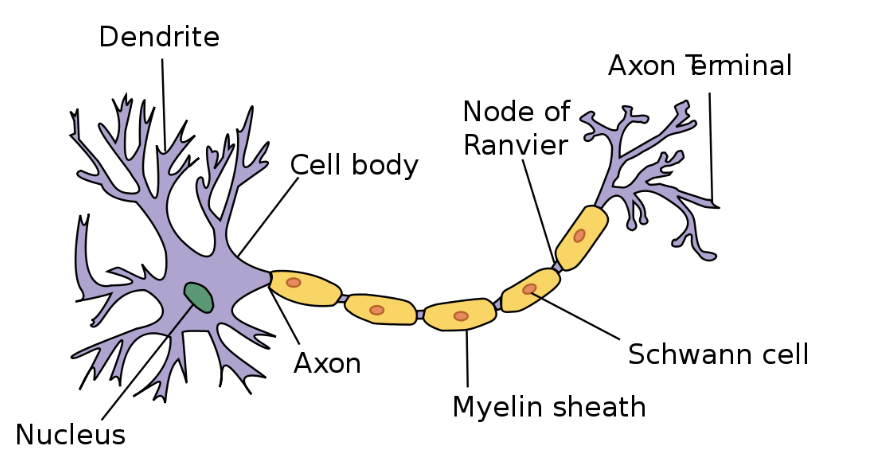
-  neuroni su međusobno povezani
- veza ide između aksona jednog neurona i dendrita drugog - veza se naziva sinapsa
- sinapsa nije fizička veza već se pod određenim uslovima prenosi impuls/signal sa jedne strane na drugu
- signal se šalje povremeno
- neuron može da suzbije ili pojača jačinu signala

Veštački neuron - Artificial Neuron  
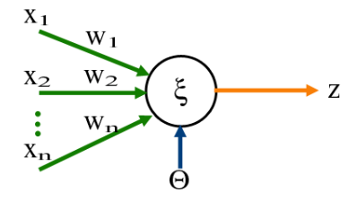
- model biološkog neurona
- AN prima signal od okruženja ili drugog AN, a zatim ga prenosi povezanim AN
- hemijske veze se simuliraju funkcijama
- ulazni signali su promenljive ili vektori promenljivih
- postoje težine w koje se množe sa ulaznim signalom, i te težine se uče
- sinapsu simulira aktivaciona funkcija koja prima skalarni proizvod wx
- vrednost aktivacione funckije uzima u obzir prag koji odlučuje da li će se signal poslati dalje
- izbor težina i aktivacione funkcije omogućava učenje
- veštački neuron predstavlja jednostavan mehanizam učenja linearne funkcije

Veštačke neuronske mreže - Arrtificial Neural Networks
- mreže slojevito raspoređenih veštačkih neurona
- ima ulazni i izlazni sloj, a između je nula ili više središnjih slojeva
- koristi se a učenje složenih i nelinearnh funkcija
- ulazni sloj mogu činiti pikseli slike
- izlaz jednog neurona se propagira na sve neurone narednog sloja i tako redom...
- cilj je naučiti funkciju
- uspeh učenja zavisi od količine ulaznih podataka

Vrste veštačkih neurronskih mreža
- jednoslojne
- višeslojne mreže sa propagacijom napred
- temporalne i rekurentne mreže
- samoorganizujuće
- kombinovane mreže

## `3.` Uvod u fazi sisteme i fazi skupove
- većina realnih situacija ne može da se prikaže binarno, pripada / ne pripada skupu, nije crno/belo
- Lofti Zadeh (1965) - opisao ideju fazi skupova
- fazi skupovi su bazirani na pretpostavci da možemo definisati stepen pripadnosti nekom skupu
- pripadnost skupa se definiše nekom numeričkom vrednošću između 0 i 1
- Ako je X domen, a x iz X konkretna element tog domena, onda se fazi skup A opisuje funkcijom pripadnosti:
μ_A: X -> [0, 1]
- npr domen je visina, a mi definiše u kolikom meri neka visina pripada skupu visokih, odnosno niskih ljudi
- fazi skpovi mogu iti dfinisani nad diskretnim ili realnim domenom
- Notacije za predstavljanje diskretnog fazi skupa:
1. Preko skupa uređeniih parova: 
    - $A = \{(μ_A(x_i),x_i)|x_i ∈ X, i = 1, ... , n_x \}$
2. Preko "sume": 
    - $A = μ_A(x_1)/x_1 + μ_A(x_2)/x_2 + ··· + μ_A (x_nx)/x_nx$
    - ne podrazumeva stvarno sabiranje već samo u smislu zapisa

- Notacija za realn fazi skup se daje preko "integrala"
    - kao suma malopre, ovo je samo notacija
    - 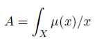

- Fazi funkcija pripadnosti skupu
    - ograničena imeđu 0 i 1
    - za svaki element domena je jednočlana
    - postoji više mogućih načina definisanja

    - 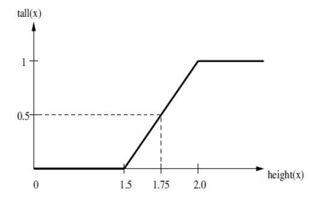
    - 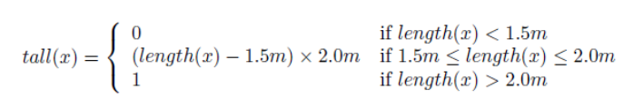

- Neke standardne fazi funkcije  
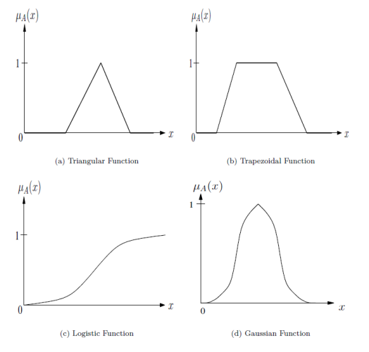

---
## `4.` Fazi skupovne operacije

- jednoakost skupova
    - fazi skupovi su jednaki ako imaju isti domen i pritom za svaki element domena imaju istu funkciju pripdnosti
    - $А=B$ akko $μ_A(x) = μ_B(x)$ za sve $x \in X$ 
    - ovo implicira da i elemetni koji nisu deo sistema imaju jednaku vrednost funkcije pripadnosti, 0

- podskupovi
    - skup A je podskup skupa B akko $μ_A(x) <= μ_B(x)$ za sve  $x \in X$ 
    - funkcija pripadnosti A je manje od funkcije pripadnosti B

- komplement
    - ako je $A^c$ komplement skupa A onda za sve $x \in X$  $μ_A(x) = 1 - μ_{A^C}(x)$
    - ne važi identitet kao u klasičnoj teoriji skupova da je $A^C \cap A = ∅ $ i $A^C \cup A = X$

- presek
    - može da se definiše na više načina, neki standardni su:
    - preko minimuma:
        - $μ_{A \cap B}(x) = min \{ μ_A(x), μ_B(x)\}, \forall x \in X$
    - preko proizvoda:
        - $μ_{A \cap B}(x) =  μ_A(x) * μ_B(x),  \forall x \in X$
    - prođemo kroz sve elemente domena i izračunamo vrednost funkcije pripadnosti elemenata u preseku po izabranoj formuli
    - efikasnije je proći kroz elemente samo jednog skupa
    - svaki element dobija stepen pripadnost preseku
    - problem sa proizvodom je težnja nuli, nakon nekoliko množenja broja manjeg od 1 se sve više teži nuli
    - definicija preko minimuma rešava ovaj problem

- unija
    - može da se definiše na više načina, neki standardni su:
    - preko maksimuma   
        - $μ_{A \cup B}(x) = max \{ μ_A(x), μ_B(x)\}, \forall x \in X$
    - preko sume i preseka
        - $μ_{A \cap B}(x) =  μ_A(x) + μ_B(x) - μ_A(x) * μ_B(x),  \forall x \in X$
    - sa sumom i presekom treba biti oprezan, jer funckaije pripadnosti teži 1 čak i ako su polazne funckije bliske 0

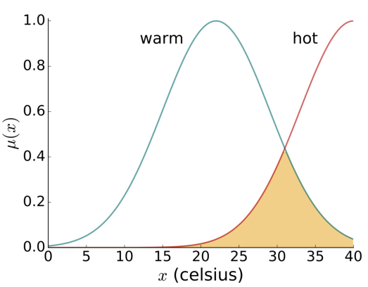

- na x osi su stepenin u celsijusima
- na y osi su vrednosti funkcije pripadnosti
- na grafiku su dva fazi skupa
1. plava linija za toplo
2. crvena linija za vruće
- gledamo pripadnost skupova nad isitim domenom
- jedna tacka domena može da pripada toplom i vrućem u određenoj meri
- kako fukcija za toplo opada funkcija za vruće raste na desno

---
## `5.` Karakteristike fazi skupova.

- **Normalnost**
    - fazi skup je normalan ako ima bar jedan element koji pripada skupu sa stepenom 1
    - $\exists x \in A , μ_A(x) = 1$ ili
    - $sup_xμ_A(x)=1$
    - ima visinu 1
- **Visina**
    - suprermum funkcije pripadnosti
    - $height(A) = sup_xμ_A(x)$
- **Podrška**
    - skup svih elemenata koji imaju pripadnost veću od 0
    - $support(A) = \{x \in X | μ_A(x) > 0\}$
    - stvarno pripada skupu bar u nekom delu
- **Jezgro**
    - skup elemenata koji pripadaju skupu sa stepenom 1
    - $core(A) = \{x \in X | μ_A(x) = 1\}$
    - elementi koji bi u klasičnoj logici sigurno bili u skupu
- **$\alpha$-rez** 
    - skup svih elemenata koj imaju pripadnost najmanje $\alpha$
    - $A_\alpha = \{x \in X | μ_A(x) \geq \alpha\}$
    - kao neka relativizacija jezgra za $\alpha=1$
- **Unimodularnost**
    - fazi skup je unimodalan ako njegova funkcija pripadnosti unimodalna
    - unimodalna funckija - ima smo jednu vrednost sa najvećom vrednošću
- **Kardinalnost**
    - u zavisnosti od tipa domena se definiše na jedan od narednih načina
    - $card(A) = \sum_{x \in X} μ_A(x)$
    - $card(A) = \int_{x \in X} μ_A(x)dx$
    - sabiramo vrednosti funkcije pripadnosti svih elemenata domena
- **Normalizacija**
    - fazi skup se normalizuje tako što se funkcija pripadnosti podeli visinom fazi skupa
    - $normalized(A) = μ_A(x) / height(x)$
    - preslikavanje dovodi do toga da skup postaje normalan, tj ispunjava svojstvo normalnosti, vrednost funkcije ide od 0 do 1?? TODO
- **Komutativnost**
- **Asocijativnost**
- **Tranzitivnost**
- **Idempotencija**

---
## `6.` Fazi i verovatnoća.

- fazi i verovatnoća nisu povezani
- jedina sličnost je što oba termina referišu na (ne)sigurnost događaja
- verovatnoća se vezuje za slučajan događaj, a u fazi nema koncepta slučajnosti i neizvesnosti
    - nema predviđanja da li je neko visok, već samo koliko pripada skupu visokih ljudi
    - u fazi ne govorimo o sigurnosti da se neki događaj desi, ne govorimo kolika je šansa da padne glava ili pismo
- fazi se vezuje za stepen istinitosti, stepen pripadnosti nekom skupu
- verovatnoća se vezuje za mogućnost predviđanja nekog ishoda

---
## `7.` Fazi logika.
Primer zaključivanja:  
- imamo dva fazi skupa - jedan meri visinu a drug atletizam
- definišemo pravilo zaključivanja nad jednim domenom
- $μ_{tall}(A)=0.9 μ_{athlete}(A)=0.8$
- $μ_{tall}(B)=0.9 μ_{athlete}(B)=0.5$
- znamo da je dobar košarkaš visok i dobar atleta, gledamo ko je bolji
- primenimo pravilo minimuma za presek
- $μ_{good player}(A)= min \{0.9, 0.8\} = 0.8$
- $μ_{good player}(B)= min \{0.9, 0.5\} = 0.5$
- zaključujemo da je A bolji košarkaš
- u realnim okolnostima su složenije zavisnosti

Ključni elementi su lingvističke promenljive i fazi _if-then_ pravila zaključivanja.

Lingvsitičke (fazi) promenljve - Zadeh (1973)
- promenljive čije su vrednosti reči prirodnog (neformalnog) jezika
- reč _tall_ je lingvistička promenljiva
- tipovi lingvisitčkih promenljivih:
    - kvantifikatori: sve, većina, mnogo, neki, nijedan...
    - promenljive za učestalost: ponekad, često, uvek...
    - promenljive za šansu: moguće, verovatno, sigurno

- modifikatori lingvističkih promenljivih
    - dodatne reči koje pojačavaju ili slabe efekat
    - najčešće pridevi, veoma, malo, srednje...
    - mogu se navesti u relaciji sa originalnom lingvističkom promenljivom putem funkcija 
    - npr $μ_{very tall}(x)= μ_{tall}(x)^2$
        - ako neko pripada skupu visokih ljudi sa sigurnošću 0.9 onda prpada skupu veoma visokih ljudi sigurnošću 0.81
    - za slabljenje efekta se uglavnom koristi $μ_{very tall}(x)= μ_{tall}(x)^{1/p}$ $za$ $p>1$
- fazi pravila zaključivanja
    - npr _if **age** is OLD then **speed** is SLOW_
    - premise - stvari koje možemo da izmerimo, izvedene primenom sistema zaključivanja
    - zaključak je verodostojan koliko i premise
    - na osnovu premisa se donosi skup zaključaka
    - iz spoljašnosti se dobijaju vrednosti, njih provučemo kroz skup pravila i dobijamo neku upotrebljivu vrednost
    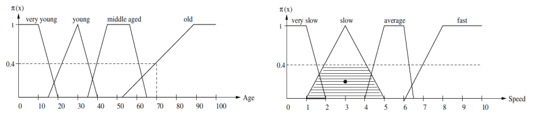
    - pripadnost osobe od 70 godina starim osobama je 0.4
    - uzimamo stepen pripadnosti premise i sečemo y osu
    - gledamo skup koji nam je interesantan, tj skup sporih ljudi
    - centar gravitacije u oblasti spore brzine ograničeno je sa 0.4 je 3
    - prema ovome će brzina osobe od 70 godina biti 0.4
    - centar gravitacije nije jedini načina da se ovo odredi

---
## `8.` Fazi zaključivanje.
### Memdanijev metod:
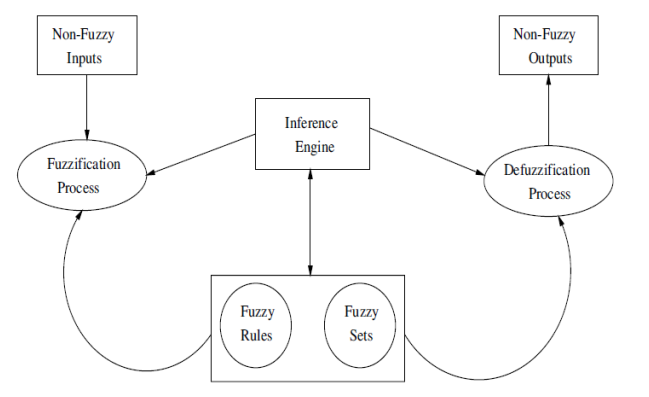
- ulaz iz stvarnog sveta se fazifikuje, tj prevodi na jezik fazi logike
- sprovodi se sistem zaključivanja i dobija se fazifikovan izlaz
- defazifikacijom se fazifikovan izlaz prevodi u nešto razumljivo

### Fazifikacija
- ulazni podaci (premise) se iz nefazi prevode u fazi reprezentaciju
- primeni se funkcija pripadnosti nad ulaznim podatkom, prepoznajemo stepen pripadnosti svakog elementa iz domena
- npr za osobu od 70 godina, povučemo presek i gledamo koja je pripadnost svakom skupu
- nad dobijenim vrednostima se dalje sprovodi proces zaključivanja
- npr A i B su fazi skupovi nad domenom X
- proces fazifikacije prihvata elemente _a_ i _b_ iz domena X
- na izlazu proizvodi fazi skup tako što im dodeljuje stepene pripadnosti svakom o fazi skupova
    - $\{(μ_A(a), a),(μ_B(a), a), (μ_A(b), b), (μ_B(b), b)$

### Primena pravila zaključivanja
- cilj je primeniti pavila zaključivanja nad fazifikovanim ulazima
- na izlazu iz pravila zaključivanja je fazifikovan izlaz za svako od pravila (u opštem slučaju je više pravila)
- za svako pravilo se određuje stepen pripadnosti zaključku
- Primer:
    - neka su A i B definisani nad domenim $X_1$, dok je fazi skup C definisan nad domenom $X_2$
    - dato je pravilo _if A is a and B is b thenn C is c_
    - na osnovu fazifikacije imamo $μ_A(a)$ i $μ_B(b)$
    - izračunamo stepen pripadnosti skupa premisa, tj da je a iz A a b iz B
        - $min\{μ_A(a), μ_B(b)\}$
- ovo se radi za svako pravilo zaključivanja
- neka je $a_k$ stepen pravila zaključivanja za k-to pravilo
- sledeći korak je računanje stepena pripadnosti zaključku $c_i$
    - $β_i = max\{α_{ki}\}$, za svako pravilo k u kojem figuriše $c_i$
- to znači da je na izlazu iz zaključivanja stepen pripadnosti za svaki od fazi skupova zaključaka

### Defazifikacija
- praktično izbacujemo nešto upotrebljivo na izlaz
- podrazumeva određivanje lingvisitčkih promenljivih za prethodno određene stepene pripadnosti zaključcima
- funkcija pripadnosti skupu
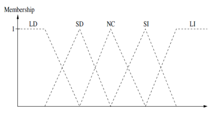
    - treba odrediti lingvističku promenljivu ako su na osnovu pravila doneti zaključci:
    - $μ_{LI}=0.8$, $μ_{SI}=0.6$, $μ_{NC}=0.3$

Pristup zasnovan na računanju centroide:
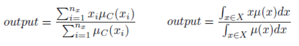
- nakon računanja centroide se pročita ona lingvistička promenljiva koja joj odgovara prema nekom od sledećih pravila:
1. max-min - uzima se centroida ispod lingvisitčke promenljive koja odgovara zaključku sa nejvišim stepenom, LI ovde
    - uimamo onaj skup koji ima najveći stepen pripadnosnti
    -  prethodnom uzmemo LI, nađemo centroide i pročitamo   vrednost ispod njih
    - 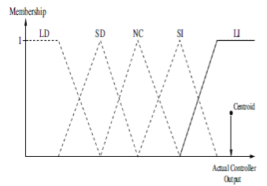
2. Uprosečavanje - računa se centroida a sve lingvisitčke promenljive i na osnovu toga se određuje konačna lingvisitčka promenljiva
    - tehnika koja uima u obzir sve podržane zaključke
    - $(0.8 + 0.6 + 0.3)/3 = 0.57$
    - tražimo pripadnost samo skupu koji je od interesa, tj gledamo LI, SI i NC
    - 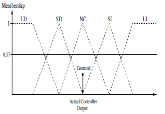
3. Skaliranje - funkcije pripadnosti se skaliraju prema dobijenim zaključcima i nakon toga se računa centroida
    - skaliramo skupove da uzmemo u obzir stepen pripadnosti skupovima
    - suptilna tehnika koja odgovara stvarnosti
    - 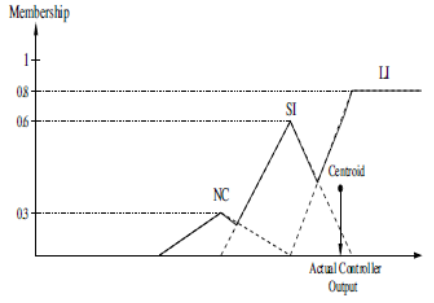
4. Isecanje - funkcije pripadnosti se seku na mestima koja odgovaraju zaključcima i potom se računa centroida
    - 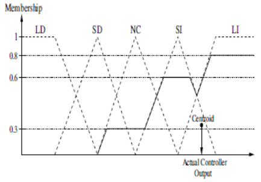

---
## `9.` Optimizacija, definicija, izazovi, ključni pojmovi.
Optimiacija je oblast koja se dominanto bavi algoritmima pretrage, a čiji je cilj pronaći rešenje problema koje
1. maksimizuje ili minimizuje neku unapred definisanu funkciju
2. opciono zadovoljava neki skup ograničenja, ovim se redukuje skup mogućnosti, npr radimo samo sa parnim brojevim

### Izazovi:
- rešenje može biti predstavljeno kao kombinacija vrednosti iz različitih domena
- ograničenja mogu biti nelinearna
- karakteristike problema mogu varirati tokom vremena, tj mogu da se menjaju ograničenja i funkcija cilja
- funkcija cilja može biti u _konfliktu_ sa ograničenjima

### Ključni pojmovi
- funkcija cilja: $f:S 🠂 R$ 
    - S je domen, a R je skup realnih brojeva
    - slika skupa mogućnosti u realne vrednosti
    - realna vrednsoti u koju se slika govori o kvalitetu rešenja
    - cilj je kvantifikovati kvalitet ponuđenog rešenja iz domena
- minimum od f je maksimum od -f
- nezavisne promenljive - skup vrednsti __x__ koje utiču na vrednost f, i za date vrednosti promenljivih funkcija ima vrensot f(x)
- skup ograničenja najčešće predstavlja zavisnosti između nezavisni promenljivih
    - npr ograničenje da jedno zavisi od drugog, ograničenja mogu da redukuju domen, npr da je x parno ili neparno
- skup ograničenja može da ograničava i same nezavisne promenljive, npr na neki interval ili skup vrednosti

### Programiranje ograničenja
- Constraint programming
- bavi se problemima bez funkcije cilja koji treba da zadovolje neka ograničenja
- nije isto što i optimizacija jer nema funkciju cilja
    - kao kad bi kod problema dama kvantifikovali svaki raspored na neki način, a nemamo te dodatne kvantifikacije
    - sat problem - problem zadovoljivosti iskazne formule, potrebno je naći valuaciju koja zadovoljava vreme
- problem programiranja ograničenja možemo rešavati optimizacionim algoritmima, ali obrnuto ne može
- fja cilja predstavlja zadovoljivost rešenja


### Tipovi optimuma
- globalni optimum - najbolje rešenja na čitavom dopustivom skupu rešenja S
    - $f(x^*) < f(x), \forall x \in S$
    - može ih biti više ali da imaju iste vrednosti a da se razliku samo u poziciji
- jak lokalni optimum - najbolje rešenje u nekoj okolini $N \sube S$
    - $f(x^*_N) < f(x), \forall x \in N$
- slab lokalni optimum - jedno od najboljih rešenja u okolini $N \sube S$
    - $f(x^*_N) \le f(x), \forall x \in N$

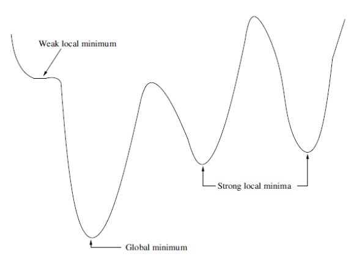

### Metode optimizacije
- traže optimum u prostoru dopustivih rešenja, tj rešenje koje zadovoljava svak ograničenja, domenska i ekslplicitna
- nekad možemo da izađeo iz skupa dopustivih rešenja jer postoji mogućnost da se u blizini nedopustivog nalazi dobro dopustivo rešenje

Prema fokusu pretrage:
- Lokalne metode
    - ne mogu da nađu globalni optimum, eventulno da ubode ako imamo sreće
    - gradijentne metode
    - obično determinističke
- Globalne metode
    - rešava probleme globalne i kombinatorne optimizacije
    - imaju mehanizam kojim mogu da izbegnu zaglavljivanje u lokalnom optimumu
    - malo izađe iz rutine, slučajno proba neko rešenje ne bi li naleteli na nešto bolje i izbegli zaglavljivanje
    - obično više stohastičke

Metode prema pristupu pretrage
- Stohastičke - ima nivo slučajnosti
- Determinističke - jasan postupak

Ideja: ako su blizu lokalnog optimuma primeni neku metodu, npr prati gradijent, ako si zaglavljen u minimumu zapamti gde si bio i prebaci se negde nasumično i proveri ima li tamo neko bolje rešenje, slučajni brojevi pomažu odglavljivanju.

### Još neki vidovi postavke optimizacionih problema
1. problem sa višestrukim optimumima
    - pronaći sva rešenja koja su optimalna ili dovoljno blizu optimuma
    - npr dedukujemo gde je pritisak na tač ekranu
2. višeciljna optimizacija
    - imamo više funkcija cilja pa je složenije urediti rešenja
    - hoćemo istovremeno da optimizujemo više funkcija cilja, ali je problem što je u jednoj tačk viš optimizovana jedna funkcija a u drugoj druga
    - npr hoćemo da stignrmo najbrže moguće a da ne potrošimo previše goriva, da ne upadnemo u gužvu i da ne bude preskupo
3. Dinamička optimizacija
    - funkcija cilja se menja tokom vremena

### Domen prostora rešenja
1. Kombinatorna (diskretna) optimizacija
    - dopustiv skup vrednosti promenljivih je iz konačnog ili beskonačnog skupa celih brojeva, ili se može kodirati celim brojevima prebrojiv skup
    - specijani slučaj su problemi binarne optimizacije, npr problem pokrivenosi grana
2. Globalna (kotinualne) optimizacija
    - dopustiv skup vrednosti je iz domena realnih brojeva, npr $R^n$


---
## `10.` Optimizacija bez ograničenja, definicija, primer.
Formulacija problema: minimizovati $f(x), x =(x_1, x_2, ... , x_n), x \in S$
- npr pronaći minimum funkcije $f(x,y)=x^2+y^2$ na domenu realnih brojeva
- možemo koristiti standardne analitičke tehnike za rešavanje

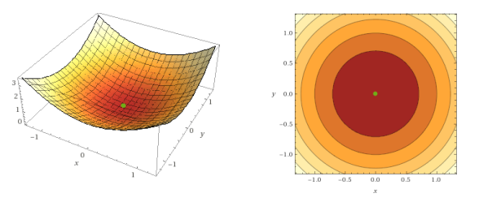
- unimodalna funkcija - ima jedan optimum
- lako se nalazi minimum
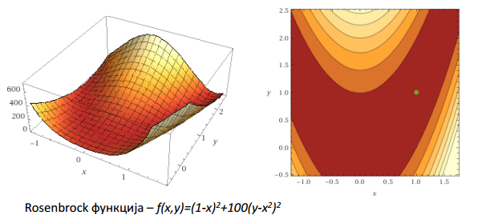
- nešto kompleksniji pimer
- fitness landscape - prostor funkcije cilja
- vidi se promena funkcije cilja u zavisnoti od dopustivih vrednosti

---
## `11.` Optimizacija sa ograničenjima, definicija, slika sa objašnjenjem ključnih pojmova, rad sa nedopustivim rešenjima.

Opšta formula u slučaju ograničenja:
- minimizovati $f(x), x=(x_1, ... , x_{nx}), x \in S$ pri ograničenjima:
    - $g_m(x) \le 0, m=1, ... , n_g$
    - $h_m(x) = 0, m=n_g, ... , n_g+n_h$
    - funkcije mogu biti proizvoljne, nezgodnije je rešiti problem ako je nelinearna
    - jednakost se može svesti na dve nejednakosti
- Ovde pored domenskih ograničenja postoje i ograničenja zasnovana na jednakosti i/ili nejednakosti

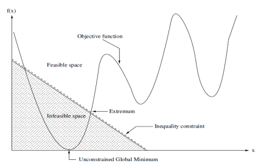
- ograničenja redukuju prostor pretrage
- infeasible space - nedopustiv prostor rešenja
- feasible space - dopustiv prostor rešenja
- kada redukujemo prostor rešenja ne moramo da ih proveravamo više, ali pri proveri moramo da proveravao da li je rešenje dopustivo
- objective functiona - funkcija koju posmatramo
- ograničenje nejednakosti

Rad sa nedopustivim rešenjima:
1. Odbaciti ih
    - jednostavno ali uglavnom nije dovoljno dobro
2. Dodeljivati penal
    - npr negativan faktor u slučaju maksimizacije ili pozitivan u slučaju minimizacije
    - kažnjavamo slučaj da uđe u nedopustiv prostor
    - to što ne odbacujemo rešenja omogućava fluidniju pretragu
    - možda bi došli do optimuma u jednom koraku da nismo odbacili zbog blizine nedopustivom rešenju
3. Svoditi na rešenje bez ograničenja pa ga posle konvertovati u rešenje koje poštuje ograničenja
4. Održavanje dopustivosti samim dizajnom metoda
    - najčešće
    - ne dozvolimo da uđe u skup nedopustivih rešenja
    - ako tražimo dopustivu permutaciju vodimo računa da nemamo dva ista broja, npr samo zamenjujemo mesta
5. Uređivati nedopustiva rešenja prema stepenu nedopustivosti
6. Popravljati nedopustiva rešenja

---
## `12.` Kombinatorna optimizacija i optimizacioni algoritmi
- minimizovati $f(x), x=(x_1, ... , x_{nx}), x \in S$ pri čemu je S konačan ili beskonačan i diskretan
- Trgovački putnik (TSP)
    - imamo skup C od m gradova i funkcija udaljenosti $d(c_i, c_j) \in N$ za svaki par gradova
    - pronaći permutaciju $p: [1..m]🠂[1..m]$ takvu da je ukupna suma udaljenosti grana koje prolaze obilaskom minimalna
    - matrica udaljenosti ne mora biti simetrična, mogu biti jednosmerne ulice npr
    - želimo što efikasnije da obiđemo sve gradove
    - veličina dopustivog skupa m!, jer je toliko dopustivih permutacija
    - algoritam grube sile je eksponencijalan
    - opšti slučaj TSP bi bio nad proizvoljnim grafom
    - u opštem slučaju bi najsigurnije rešenje bilo totalna enumeracija, tj gruba sila
    - ako pretpostavimo da se radi u Euklidkom prostoru, zbog važenja nejednakosti trougla može malo bolje, ali i dalje teško
    1. Gruba sila - generišemo i prođemo kroz sve permutacije
    2. Dinamičko programiranje - identično prethodnom, samo imamo memoizaciju i čuvamo međurezultate, bolja složenost ali i dalje eksponencijalno
    3. aproksimativni algoritam
        - matematički utvrdimo da važe neke pravilnosti
        - za TSP je utvrđeno da postoje dva aproksimativna algoritma
        - dobijeno rešenje će najviše dva puta lošije od optimalnog i postoji teorema koja to dokazuje
        - imamo gornju granicu ali to nije najbolja granica kvaliteta
        - obično aproksimativni algoritmi imaju bolju složenost

Poređenje različitih pristupa
- Gruba sila i dinamičko programiranje
    - loši za veće dimanzije problema, npr preko 50ak gradova
    - daju optimalno rešenje ako završe 
- Aproksimativni pristup
    - jako efikasni uglavnom, linearni ili polinomijalni
    - rešenja lošijeg kvaliteta
    - prednost je što znamo da rešenje ne može biti više od dva puta lošije
- Metaheuristike
    - rešenje će biti blisko optimalnom, ali ne garantuje da će biti optimalno
    - vreme izvršavanje će biti razumno, i to možemo da kontrolišemo
### Algoritmi pretrage
- metaheuristike pripadaju širokoj grupi algoritama pretrage
- opšta formula algoritma pretrage
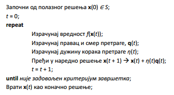
- izaberemo neko polazno rešenje iz dopustivog skupa
- kriteijum zaustavljanja: stabilnost rešenja, fiksan broj iteracija...
- računamo vrednost funkcija cilja u svakoj iteraciji
- izračunamo pravac i smer pretrage qt, može da se računa na različite načine, npr gradijent
- korak možemo gledati kao pravac poverenja u smer kretanja pretrage, menja se po nekoj funkciji vremena
- naredno rešenje se ažurira u skladu sa korakom pretrage

Primer: problem pokirivača grana čvorovima, potskup skupa čvorova takav da su sve grane incidentne sa bar jednim čvorom iz skupa
- rešenje u koraku $x_t$
- 0101110 npr to su odabrani čvorovi grafa
- graf definisan matricom relacije
- variramo bitove i gledamo poboljšanje
- u svako koraku menjamo po jednom bitu - ako se resenje poboljsa onda idemo u tom pravcu, mozemo da mejamo i po dva bita  
1101100  
0001100  
0111100  
...  
0101101  

### Ubacivanje slučajnosti u pretragu
- metaheuristike kombinuju lokalnu pretragu i slučajnost
- nešto između Monte Karlo simulacija i lokalne pretrage
- Monte Karlo generiše slučajne promenljive, nusmično generiše vrednosti, ispituje vrednosti funkcije cilja i čuva optimum
- nema garanciju kvaliteta, kad dođe do rešenja nema garanciju da je najbolje
- kada broj pokušaja teži beskonačno i rešenje teži optimumu
- Las Vegas algoritmi su takođe slučajni algoritmi
- efikasnost je problem - ne možemo baš beskonačno, ali ogrman broj pokušaja

- lokalna pretraga vrlo brzo iskonvergira ka lokalnom optimumu, sklona zaglavljivanju ali efikasna
- Monte Karlo - dolazi do globalnog optiuma ali izuzeno neefikasno
- ova dva načina se kombinuju simuliranim kaljenjem

- algoritam koji koristi slučjanos i determinizam

- diversifikacija - šetanje bez vraćanja na mesto gde smo bili - omogucava nepristrasan prolaz kroz skup mogućnosti
- loklanom pretragom vrsimo intenzifikaciju pretrage

- slučajno se pomerimo i time vršimo diversifikaciju, a onda intenzivfikuj pretragu - tj nađemo lokalni optimum i sačuvamo ga za kasnije poređenje

- intenzifikacija prirodno dopunjuje diversifikaciju

- Monte Karlo može da izabere tačku koja je jako blizu optmuma, a da ne nađe optimum

### Simulirano kaljenje
- u svakoj iteracji imamo promenu temperature
- inspirisano hlađenjem vrelog gvožđa, pri čemu metal očvrsne
- iteacije menjaju temperturu kojoj je izložen metal
- verovatnoća prihvatanja rešenja je uslovljena postupkom hlađenja metalne rešetke
- verovatnoća prihvatanja rešenje postaje sve veća
- vremenom gledamo hoćemo li prihavtiti rešenje ili ne
- verovatnoca prihvatanja postaje sve manja - metal očvrscava - ima sve manje prostora za diversifikaciju
- pojačava se intensifikcija a smanjuje diversifikacije

- single solution - metaheuristike bazirane na pojediničnom rešenju,
u svakoj iteraciji rade sa jednim rešenjem koji je aktuelni kandidat za optimum
- u svakoj narednoj iteraciji se menja to resenje
- populacione heuristike - rade sa populacijom rešenja, genetski algoritmi
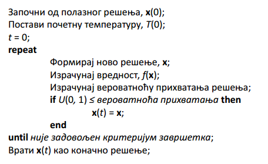

---
## `13.` Višeciljna optimizacija.
Problemi kod kojih je potrebno zadovoljiti više funkcija cilja (kriterijuma)
- Ekomonija - naći portfolio sa maksimalnim prihodom i minimalnim rizikom
- Transportni poblem - maksimizovati iskorišćenost ulice a minimizovati zagušenje, troškove rutiranja i slično
- poboljšanje jedne funkcije cilja znači pogoršanje druge funkcije cilja
- npr povećanje stabilnosti mosta povećava i troškove
- pravi se balans, tj kompromis, koncept nedominiranih rešenja

### Pristupi rešavanju
- pravljenje ponderisanih proseka odnosno agregacija
    - svaka funkcija cilja ima težinu koja predstavlja njen značaj
    - ovo se kasnije svodi na klasičnu jednociljnu optimizaciju
    - problem je odrediti težine
- pravljenje skupa Pareto-optimalnih rešenja
    - rešenje __x__ dominira nad rešenjem __y__ ako nijedna vrednost funkcije cilja od rešenja __y__ nije bolja od odgovarajuće vrednosti funkcije cilja __y__
    - rešenje __x__ je Pareto-optimalno ako ne postoji nijedno drugo rešenje koje dominira nad njim
    - skup svih Pareto-optimalnih rešenja se naziva Pareto-optimalan skup
    - Pareto-optimalna površ predstavlja površ koju formiraju funkcije cilja kada se primene nad Pareto-optimalnim skupom rešenja
    - algoritmi pretrage koji mogu efikasno da pretražuju Pareto-optimalnu površ
    - populacione strategije koje iterativno poboljšavaju skup dobrih rešenja upotrebom svojstva dominacije

---
## `14.` Klase složenosti izračunavanja i rešavanje NP teških problema.

Algoritam - konačan spisak pravila čijim praćenjem dolazimo do rešenja bilo kog partikularnog problema (instance problema) iz date klase, a praćenje pravila traje konačano mnogo koraka.  

Problem je odlučiv ako daje odgovor da ili ne.

Problemi poput TSPa se mogu svesti na problem odlučivanja. Npr pitamo se da li za konkretan TSP problem postoji rešenje sa troškovima manjim od _C_, a na osnovu odgovora možemo menjati granicu C. Svođenje može biti veoma neefikasno.

### Polinomski problemi
Problem odlučivanja pripada klasi P 
- ako **postoji algortiam** A za rešavanje tog problema
- i polinom _p(n)_ takav da A završava izvršavanje za **ne više od p(n) koraka** za svaku instancu tog problema
- pri čemu je **n dimenzija problema**

Polinomijalni algoritmi se smatraju efikasnim.  
Algoritme čije vreme ne možemo da ograničimo polinomom podrazumevano ograničavamo eksponencijalnom funkcijom $c^n, c>1$

### Eksponencijalno rešivi problemi
Postoje problemi za koje je dokazano da ne mogu biti rešeni algoritmom bržim od eksponencijalnog
- podrazumeva se da su ovi problemi postavljeni kao problemi odlučivanja (klasa  **EXPTIME**)
- npr problem evaluacije poteza u uopštenom šahu, igri GO i slično
- uopštena varijante igre podrazumeva da je promenljive dimenzije
- npr pronalazenje skuppa svih razapinjućih stabala u kompletnom grafu sa n čvorova. Zna se da je broj razapinjućih stabala $n^{n-2}$, pa bi se eksponencijalno vreme potrošilo samo za prikaz rezultata.

### Nedeterministički polinomski problemi (NP)
- problemi za koje se ne zna da li postoji polinomski algoritam za njihovo rešavanje
- ako se za konkretno ponuđeo rešenje problema odlučivanja može utvrditi da li je odgovor potvrdan u polinomijalnom broju koraka onda je u pitanju polinomijalni nedeterminsitički problem
- npr TSP
    - rešenje je bilo koja permutacija gradova
    - broj C predstavlja trošak
    - može se dati potvrdan ili odričan odgovor u polinomskom vremenu

### Redukcija (svođenje) problema
- imamo dva problema odlučivanja A1 i A2
- pp da se za A1 može konstruisati polinomski algoritam u kom se kao jedan od koraka pojavljuje algoritam za rešavanje A2
- ako je algoritam za rešavanje problema A2 polinomski onda i za A1 postoji polinomski algoritam
- kaže se da se A1 **redukuje** na A2
    - ako se za svaki specijalni X problem A1
    - može u polinomskom vremenu pronaći specijalan slučaj Y problema A2
    - takav da je problem X odgovor potvrdan akko je za Y odgovor potvrdan
- za rešavanje problema A1 koristimo rešavač A2, pri čemu transformisanje A1 u A2 ne treba da prelazi složenost A2
- A2 je teži problem jer možda za A1 postoji brži algoritam
- pp da je A2 eksponencijalno, imamo polinomijalni pretvarač A1 u A2 i obrnuto, to je sve zajedno eksponencijalno, a možda postoji polinomijalni direktan algortiam za A1

### NP potpuni (kompletni) problemi
- problem je np kompletan ako za svođenje bilo kog np problema na posmatrani problem postoji polinomski algoritam
- ako ne znamo težinu nekog problema i ako neki np težak problem svedemo na taj, onda je taj posmatrani problem najmanje np težak
- svi problemi su najviše teški kao algoritam na koji se redukuju
- ako za bilo koji NP kompletan problem pronađemo polinomski algoritam time bi dokaali postojanje polinomskog algoritma za svaki NP problem, tj pokaalo i se N=NP

### NP teški problemi
- spominje se u kontekstu optimizacije
- problemi čije su odlučive vairjante NP potpuni problemi
- zapravo NP kompletni problemi u klasi problema odlučivanja

### Načini rešavanja problema
- egzaktno rešavanje problema
    - postupci koji dovode do garantovano optimalnog rešenja ako završe
    - polinomske probleme treba rešavati egzaktno
- približno (aproksimativno) rešavanje
    - postupci koji čak i kad završe ne garantuju optimalnost
    - ovde spadaju (meta)heuristike i algoritmi sa garancijom kvaliteta
    - približno treba rešavati samo ako je postoji polinomski postupak, tj približno treba rešavati NP teške probleme


---
## `15.` Evolutivna izračunavanja - opšti koncepti
- evolucija se može posmatrati **optimizacionim procesom** sa ciljem poboljšanja **prilagođenosti** organizma (ili sistema) **dinamičkom i takmičarsko nastrojenom okruženju**
- prirodni mehanizam koji za posledicu ima da se oragnizmi u prirodi prilagođavaju sistemu u kom se nalaze, a loše prilagođene vrste izumiru

- Domeni
    - hemijski - organiski i neorganski
    - kosmički - evolucija zvezda u svemiru
    - biološki
    - evolucija ljudskih tvorevina

- Lamarack (1744-1829) 
    - podržava teoriju nasleđivanja stečenih karakteristika poznatu već 2000 godina
    - **opovrgnuto**
    - npr imamo osobu visoku 180cm, igra košarku pa se izduži na 185cm, ta visina neće biti nasledna
    - nema veze između fenotipa i genotipa
    - fenotip - osobine koje su se ostvarile
    - genotip - osobine zapisane u hromozomu

- Darwin (1809-1882)
    - teorije evolucije kroz proces **prirodne selekcije**

### Prirodna selekcija
- svaka jedinka se **takmički** sa ostalima u cilju preživljavanja
- **najbolje** jedinke imaju veću šansu da prežive i ostave potomstvo, one imaju više vremena da ostave potomstvo
- one češće prenose svoje gene, tj **karakteristike**
- vremenom ove **pogodne** karakteristike postaju dominantne u populaciji
- tokom stvaranja potomstva ulogu igraju i slučajni dogđaji:
    - ukrštanje - bira se gen oca ili majke, ukrštaju se geni, suštinski ne nastaje ništa novo
    - mutacija - nasumična izmena zbog spoljašnjih događaja, uvode se nove informacije u sistem, npr ako imamo populaciju ljudi jedne boje očiju, da bi se boja promenila potrebno je da se desi mutacija na određenom genu
- nema garancije da će dobro prilagođene jedinke ostaviti potomstvo, ni da loše prilagođene neće
- evolucija po prirodnoj selekciji se dešava sporo

### Evolutivna iračunavanja
- imitiraju proces evolucije kroz
    - prirodnu selekciju
    - ukrštanje
    - mutacija
    - ... 
- umesto organizama i njihove borbe za preživljavanjem, jedinke u populcijama, kodiraju rešenja nekog problema
- jedinka se kodira određennim strukturama podataka, listama, nizovima...
- neka funkcija cilja kvantifikuje prilagođenost jedinke
- nakon nekog vremena rešenje evoluira u smeru poboljšanja

### Uopšteni evolutivni algoritmi
- evolutivni algoritmi traže optimalna rešenja putem **stohastičke** pretrage nad **prostorom rešenja**
- jedinke (hromozomi) predstavljaju pojedinačne tačke u prostoru rešenja
- genetski algoritmi su populacioni algoritmi - menja se cela populacija, u svakom momentu raspolažemo populacijom jedinki, a pp da su ravnomerno razbacane po prostoru pretrage
- Ključni aspekti evolutivnih algoritama:
1. Rešenja se kodiraju u vidu hromozoma, npr niz celi brojeva koji predstavlja sekvencu gena
2. Fitnes funkcija koja ocenjuje kvalitet jedinke, malo prilagođenija u nekim situacijama u odnosu na funkciju cilja
    - funkcija cilja direktno odgovara postavci problema, dužina najkraćeg ciklusa npr
    - fitnes funkcija bi mogla da daje penale za nekorektan ciklus
3. Inicijalizacija početnog skupa jedinki, tj početnog rešenja
4. Operatori selekcije - biranja jedinki koje se reprodukuju
    - kada sprovodimo ukrštanje ne biramo sve jedinke
    - fitnes funkcija povećava šansu određene jedinke da ostavi potomstvo
5. Operatori ukrštanja - način stvaranja novih jedinki od postojećih

### Pseudokod
```
inicijalizuj broj generacija na t=0;
kreiraj i inicijaliuj n_x-dimenzionu populaciju C(0) od n_s jedinki;
while nije_zadovoljen_uslov_zaustavljanja do
    izračunaj fitnes funkciju f(x_i(t)) svake jedinke x_i(t);
    izvrši ukrštanje i fomriraj potomke;
    odaberi novu populaciju C(t+1);
    pređi u narednu generaciju, t=t+1;
end
```

### Evolutivni algoritmi
- Genetski algoritmi
    - evolucija nad linearnim genotipom, nizom
    - pogodno kada imamo problem koji se može formulisati linearno
- Genetsko programianje
    - evolucija nad stabloidnim genotipom, nelinearnim strukturama
    - računarski programi se mogu evoluirati na ovaj način
    - može rešavat probleme klasifikacije genetskim algoritmima
- Evolutivno programiranje
    - evolucija fenotipa, tj ponašanja
    - kodiranje sekvence ponašanja, ali ne nizovima
    - nema ukrštanja
    - fitnes je relativan u odnosu na druge funkcije
    - nije inspirsano prirodom ali se dobro ponaša u prakski
- Evolutivne strategije
    - evolucija evolucije = evolucija genotipa + evolucija parametara evolucije genotipa
    - neki vid metaevolucije
    - ne variramo samo genotip već i uslove okruženja
    - kao da imamo različita podneblja za evoluciju, jednu populaciju stavimo na Madagaskar a drugu na Antarktik
- Diferencijalna evolucija
    - kao standardni EA samo se mutacija bira iz unapred nepoznate slučajne raspodele - prilagođene populacije
    - biraju se vektori pomeraja koji su relativni u odnosu na ostale jedinke populacije
    - ne pravi se pp iz koje raspodele biramo slučajne brojeve
- Kulturna evolucija
    - evolucija kulture u populaciji - kulture prihvataju verovanja iz populacije, ali i utiču na populaciju srazmerno svojoj prilagođenosti 
    - nije biološka evolucija
- Koevolucija
    - evolucija i preživljavanje kroz saradnju i takmičenje, npr biljke i insekti (simbioza)


---
## `16.` Kodiranje rešenja evolutivnog algoritma, fitnes funkcija i inicijalna populacija.

### Kodiranje (reprezentacija) - hromozom
- hromozomi su sačinjeni od molekula DNK
- nalaze se u jezgru ćelije
- svaki hromozom je sačinjen od velikog broja gena
- gen - jedinica nasleđivanja
    - određuje anatomiju i fiziologiju organizma
    - kodira i kontroliše proces izgradnje proteina
    - određen je svojom pozicijom - lokusom
- jedinka je sačinjena od sekvence gena
- vrednost (sadržaj) gena se zove genski alel
- u konteksu EA hromozomi predstvljaju rešenje problema, a pojedinačni geni su karakteristike rešenja
- odabir pogodnog kodiranja je ključno za rešavanje problema
- kodiranje je najčešće zasnovano na nizu vrednosti nekog tipa, osim u slučaju genetskog programiranja gde je kod nelinearan (stablo)
- klasična reprezentacija bi bio binarni vektor fiksne dužine, npr za grafove kod može biti zasnovan na nizu celih brojeva fiksne dužine

Primeri:
1. naći najmanji podskup čvorova takav da svaka od grana grafa ima bar jedan kraj u tom podskupu
2. Problem trgovačkog putnika - traži se Hamiltonov ciklus, krenemo iz jednog grada obiđemo sve ostale i vratimo se u početni, a to po najmanjoj ceni, predstavlja se permutacijom čvorova

- domen hromozoma i domen rešenja ne moraju da se poklapaju
- npr možemo da koristimo niz realnh vrednosti za hromozom, a da rešenje bude binaran vektor, npr ako je veće od 0.5 onda true, inače false
- metoda elektromagnetizma - jedinke se biraju iz prostora [0,1], a vektor predstavlja njihovu poziciju u prostoru, onda se nad tim jedinkama mogu primenjivati operatori elektomagnetnog privlačenja
- iskazni problem se može rešavati tehnikama diskretizacije, radimo sa realnim vrednostima pa ih diskretizujemo

Primer: p-Median
- imamo težinski graf, želimo da nađemo skup p izabranih čvorova tako da je ukupna udeljenost od svih ostalih čvorova minimalna
- kao da biramo lokaciju za supermarket, klijenti i supermarketi su validne lokacije, želimo da svaki klijent ima supermarket relativno blizu
- možemo gleadti tačke u ravni
- za rastojanje uzmemo euklidsko
- posmatramo kompletan graf, iz svake pozicije se može doći do svake druge
- najjednostavnija reprezentacija je vektor realnih vrednosti
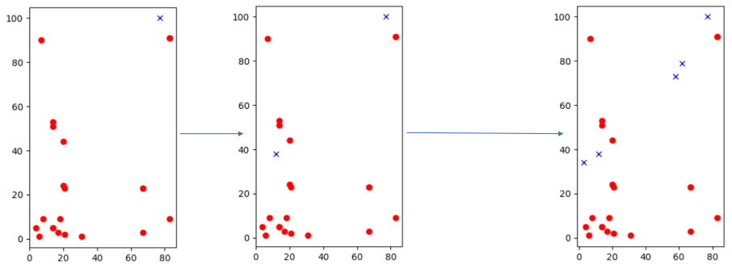

### Fitnes funkcija
- kvantifikuje karakteristike jedinke, tj njihovu prilagođenost
- primenjuje se nad jedinkom
- obično apsolutna mera kvaliteta jedinke, ali može biti i realativna u odnosu na druge jedinke
- obično je jednaka funkciji cilja, ali ne nužno
- u primeru k-median u ravni fitnes funkciju definišemo na isti način kao i funkciju cilja, a to je udalejnost svih tačaka od najbliže odabrane tačke (najbližeg supermarketa)

### Razvoj uporednog algoritma
- koristi se za validaciju predloženog algoritma
- idealno je taj algoritam egzaktan, tj radi tačno
- u slučaju NP teških problema dimenzija koju rešavamo uporednim algoritmom je očekivano malo
- drugi način provere rezultata je poređenje sa već posotjećim reuzltatima iz literature
- uporedni algoritmi često korsite istu funkciju cilja i kodiranje 
    - može se implementirati algoritam slučajne pretrage i sistematične pretrage TODO

### Inicijalizacija rešenja
- stanardni pristup: inicijalna populacija se formira od nasumično odabranih dopustivih rešenja
- u slučaju nedopustivih rešenja će verovatno biti potrebna popravka
- slučajnost je dobra zbog boljeg pokrivanja skupa dopustivih rešenja
- dovoljno velik slučajni uzorak ima dobru reprezentativnost
- ako neki deo nije pokriven na početku verovatno neće biti obiđen ni kasnije
- alternativa su determinističke metode, ako po teoriji ili iz iskustva znamo gde bi optimum mogao biti onda krećemo odatle

- veličina metode se određuje empirijski za konkretnu metodu
- veća populacija omogućava veću _pokrivenost_ i povećava šasnu za nalaženje globalnog optimuma - **diversifikacija**
- mala populacija je efikasnjie i omogućava bržu konvergeniju ka lokalnom optimumu - **intenzifikacija**


---
## `17.` Operator selekcije kod evolutivnih algoritama i elitizam

### Selekcija
- proces izbora jedinki koje će učestvovati u kreiranju naredne generacije
- načelna ideja je dati veću šansu boljim rešenjima
- selekcioni pritisak (selection pressure) - vreme potrebno da se proizvede uniformna populacija jedinki, odnosno da najbolje jedinke ostave svoje gene svuda
    - što je veći pritisak ovo će se desiti ranije
    - kada dođemo u situaciju da su sve jednike slične onda nema više prostora za istraživanje
    - mutacijama možemo da se izvučemo iz ove pozicije
    - ne treba preterivati sa selekcionim pritiskom, ako je visok pritisak raznovrsnost gena se brže smanjuje, pa dolazi do preuranjene konvergencije

### Pristupi selekciji
1. Slučajna
    - svaka jedinka ima istu šansu
    - najniži selekcioni pritisak
    - spora konvergencija
2. Proporcionalno
    - daje veću šansu boljim jedinkama, na osnovu fitnesa
    - 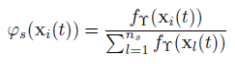
    - ruletksa selekcija je standardan način implementacije ovog mehanizma
        - simulira upotrebu ruletskog točka
        - veličine podeoka su proporcionalne fitnesu podeoka
        - simulira se bacanje kuglice tako što se generiše random broj i gleda se kom intervalu pripada

3. Turnirska selekcija
    - turnir između slučajnog podskupa jedinki
    - ako je podskup jednak populaciji onda je to **elitizam**
    - ako je podkup veličine 1 onda je to **slučajna strategija**
    - variranjem veličine podskupa se menja selekcioni pritisak
    - biramo učesnike turnira, pobeđuje onaj sa nejvećom funkcijom cilja

4. Rangovska selekcija
    - umesto vrednosti fitnes funkcije se koristi samo redni broj u uređenju populacije
    - smanjuje se selekcioni pritisak jer se dobrim rešenjima relativizuje značaj
    - kod fitnes baziranih selekcija se može desiti da jedinke u nekoj okolini imaju dosta blizak fitnes

### Elitizam
- tehnika koja sprečava gubljenje dobrih jedinki
- iako su roditelji najverovatnije dobre jedinke, primenom ukrštanja i mutacije se može izgbiti kvalitet jedinki
- ovih pristupom se nekoliko najboljih jedinki direktno prebacuje u narednu generaciju
- broj elitistički odabranih jedinki ne sme biti preveliki, da ne bi bio veliki selekcioni pritiska, tj prebrza konvergencija

---
## `18.` Operator ukrštanja, mutacije, kriterijumi zaustavljanja - ukratko

### Ukrštanje
- proces kreiranja novih jedinki - potomaka
- podrazumevano se koriste operatori
    - ukrštanja - rekombinacija gena
    - slučajne mutacije - opciona promena nasumičnog gena

- jednopoziciono nasumično ukršanje
    - 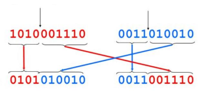

### Mutacija
- omogućava ubacivanje novih informacija u sistem
- 1258 -> 1248
- ukrštanje radi samo sa već postojećim podacim

### Kriterijumi zaustavljanja
1. istek unapred fiksiranog broja iteracija
2. istek unapred fiksiranog vremena
3. kada nema unapređenja u poslednjih P generacija
4. kada u poslednjih P generacija nema promen u genotipu
5. ako je nađeno prihvatljivo rešenje, ako znamo šta je prihvatljivo
6. kad se nagib fitnes funkcije više ne povećava, potrebno je pratiti kretanje fitnes funkcije kroz vreme

### Upoređivanje rešenja
- rešenja za poređenje se dobijaju:
    - algoritmom slučajne pretrage
    - evolutivnim algoritmom
    - egzaktnim algoritmom, na mapi neke dimenzije gde je moguće izvršiti

- pri poređenju treba voditi računa da bude fer
    - npr isti broj izvršavanj fitnes funkcije
    - fer je da se evolutivni algoritam izvrši 1000 puta sa 10 jedinki i da se slučajni algoritam izvrši 10 000 puta
    - nije pametno porediti vreme izvršavanja jer on zavisi od jačine računara

---
## `19.` Genetski algoritmi - uvodni koncepti, kanonski genetksi algoritam

### Tehnike pretrage
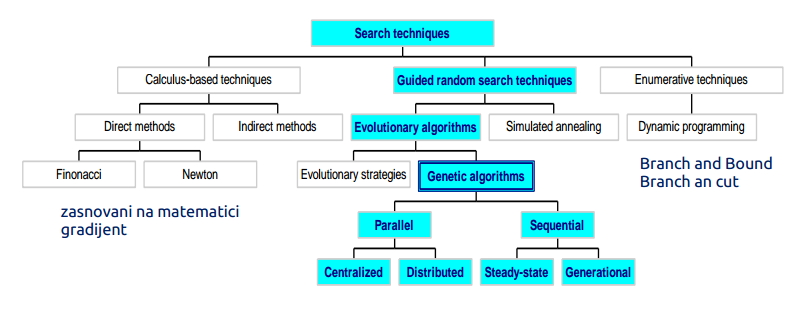
- polazilo se od Monte Karlo simulacija ali nisu bile dovoljno uspešne
- sekvencijalne tehnike su jednonitne
- paralelne tehnike - višenitne, distribuirani sistemi, ili izvršavanje preko mreže

### Genetski algoritmi
- Amerika 1970ih
- ključni autori: J. Holland, K. DeJong, D. Goldberg
- primenjuje se na probleme u diskretnom domenu
- postoje ekstenzije za rešavanje problema u realnom domenu, ali oni moraju biti np kompletni
- Karkteristike
    - nije preterano brz kao i većina populacionih metaheuristika
    - dobra heuristika za rešavanje kombinatornih problema
    - dosta varijatni - različiti mehanizmi ukrštanja, mutacije
- **no free lunch teorema**: ni jedan algoritam ne dominira nekim drugim algoritmom, nije bolji u svakom slučaju od drugog

### Kanonski genetski algoritam (SGA)
- orignalni genetski algoritam je napravio John Holland 
- naziva se još i jednostavni (kanonski) GA ili SGA
- drugi genetski algoritmi se razlikuju u 
    - reprezenacijama - kodiranjima i dekodiranjima
    - mutacijama
    - ukrštanju
    - selekciji
- Pseudokod:
```
inicijalizuj populaciju;
evaluiraj populaciju; // izračunavanje fitnesa hromozoma
while nije ispunjen uslov završetka {
    odaberi roditelja za ukrštanje;
    izvrši ukrštanje i mutaciju;
    evaluiraj populaciju;
}
```

- Elementi SGA  

| karakteristike GA | imeplementacija u SGA | 
|-----------|-------|
| reprezentacija | niz bitova |
| ukrštanje | n-poziciono ili ravnomerno
| mutacija | izvrtanje bitova sa fiksnom verovatnoćom
| selekcija roditelja| fitnes-srazmerna, tj ruletska|
| selekcija preživelih | roditelji se potpnuno zamenjuju decom|
| specijalnost | fokus je na ukrštanju, intenzifikacija pretrage |

### SGA reprezentacija
- fenotip - kako jedinka ostvaruje potencijal
- genotip - geni, ono što je zapisano
- ovde je fenotip direktna posledica genotipa
- problem u nekom prostoru možemo pretvoriti u problem u binarnom prostoru veće dimenzije
- prostor problema i metode ne moraju biti isti
- funckija kodiranja - ulazni problem konvertuje u prostor metode
- funkcija dekodiranja - na izlazu daje rešenje u prostoru problema
- ako su prostor metoda i problema jednaki onda je preslikavanje identitet
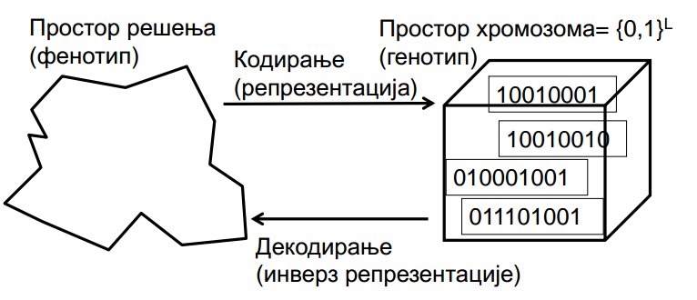

### Ukrštanje
1. odaberi roditelja u skupu za ukrštanje, cela populacija je skup za ukrštanje
2. promešamo podskup odabrnih roditelja (Shuffle), bez ponavljanja
3. za svaki uzastopni par hromozoma se izvrši ukrštanje sa verovatnoćom $p_c$, ako se ne primeni onda se kopiraju roditelji, $p_c$ je obično iz intervala [0.6, 0.9]
4. za svako dete se primenjuje mutacija sa verovatnoćom $p_m$  po svakom bitu nezavisno
5. zameni celu populaciju sa novodobijenom populacijom dece

### SGA operator ukrštanja sa jednom tačkom
- odabere se slučajna pozicija, manja od broja gena
- razdvoji svakog roditelja na dva dela po ovoj poziciji 
- kreiraj decu razmenom delova između roditelja

### SGA operator mutacije
- svaki gen (bit) se sa verovatnoćom $p_m$ invertuje
- $p_m$ - stopa mutacije
    - tipično je između $1/veličina\_populacije$ i $1/dužina\_hromozomaa$

### SGA operator selekcije
- ideja je da bolje jedinke imaju veću šansu
- šanse su srazmerne fitnesu
- implementacija: ruletski točak
    - dodelimo svakoj jedinki isečak točka
    - okreni točak n puta i izaberi n jedinki

### Mane
- previše restriktivna reprezentacija
- mutacija i ukrštanje su primenljivi samo na bitovske i celobroje reprezentacije, nije dovoljno fleksibilno
- selekcija osetljiva na slučaj kada populacija konvergira, tj bliske fitnes vrednosti
- generisanje populacije se može unaprediti tehnikom eksplicitnog preživljavanja

- koristan za bazično razumevanje genetskog algoritma
- dobar za poređenje sofisticiranijih algoritama

---
## `20.` Ostali tipovi reprezentacije kod genetskih algoritama i mutacije nad njima

### Druge reprezentacije
- Grejovo kodiranje celih brojeva
    - binarni hromozmi
    - male promene genotipa prave i male promene fenotipa, za razliku od standardnog kodiranja
    - "glatkija" genotip-fenotip preslikavanje može da poboljša GA
    - npr u običnom kodiranju 15=0111 s 16=1000, totalna promena genotipa a mala promena fenotipa

- šeme kodiranja bazirane na drugim reprezentacijama
- numeričke vrendnosti se kodiraju direktno kao
    - celi brojevi
    - realni brojevi u fiksnom zarezu
    - onda se i operatori dizajniraju tako da rade sa ovim tipovima, tj celim ili realnim brojevima

- direktna celobrojna reprezentacija
    - logična reprezentacija pri obradi procesiranju slika npr
    - nekad vrednosti mogu biti kategoričke iz fiksnog skupa, npr {red, green, blue}
    - n-poziciono / ravnomerno ukrštanje radi u ovim situacijama
    - binarna mutacija se mora proširiti, ne može biti smo izvrtanje bitova
        - mutiranje u bliske (slične) vrednosti
        - mutiranje u nasumične vrednosti, tipično za kategoričke promenljive

- kodiranje realnog domena
    - npr problem globalne optimiacije $f: R^n \rightarrow R$
    - primer: Ackley-eva funkcija, nezgodan prostor za pretragu, u 2D
    - 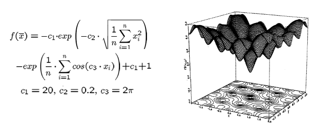

    - preslikavanje na niz bitova:
        - $z \in [x,y] \subseteq R$ predstavljeni kao niz bitova $\{a_1, ... , a_l\} \in \{0, 1\}^L$
        - $[x,y] \rightarrow \{0, 1\}^L$ mora biti inverzno, tj jedan fenotip za svaki genotip
        - $Г : \{0, 1\}^L\rightarrow [x,y]$ definiše reprezentaciju
        - 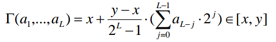
        - samo $2^L$ vrednosti od mogućih beskonačno je moguće kodirati
        - L određuje preciznost rešenja
        - velika preciznost > dugački hromozomi > spora evolucija

    - kodiranje može biti direktno uz doradu operatora

- Mutacije za diretktno realno kodiranje
    - opšta šema za brojeve u fiksnom arezu
    - 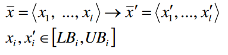
    - ravnomerna mutacija
        - $x_i'$ se bira ranomerano iz [$LB_i$, $UB_i$]
    - analogno izvrtanju bitova binarnog koda ili nasumičnom mutiranju kod celih brojeva
    - ako bi invertovali bitove onda postoji opasnost da malim izmenama mnogo menjamo fenotip
    - neravnomerne mutacije
        - verovatnoća mutacije može da se menja vremenom i pozicijom npr
        - standardan pristup je dodeljivanje slučajne devijacije svakoj promenljivoj, a zatim izvlačenje promenljivih i N(0, d)
        - standardna devijcija d kontroliše udeo promena , npr 2/3 devijacija će se nalaziti u opsegu (-d, +d)


- problemi zasnovani na permutacijama
    - objekti se organizuju u odgovarajućem redosledu, npr problem sortiranja, problem trgovačkog putnika (TSP)...
    - ovakvi problemi se generalno izražavaju permutacijama
    - ako postoji n promenljivih, onda je reprezentacija sačinjena od n celih brojeva takvih da se svaki pojavljuje tačno jednom

- mutacije nad permutacijama
    - normalni operatori mutacije bi doveli do nedopustivih rešenja, neka vrednost bi se pojavila više puta a neka bi nestala
    - vrednsoti se moraju menjati bar dvema promenljivama
    - verovtnoća mutacije sada opisuje vrednost promena operatora nad celim rešenjme, a ne nad pojedinačnim pozicijama
    - pitanje je koliko ekstraman efekat želimo na permutacija ima
    1. način - izaberemo dve pozicije, alel sa druge pozicije se pomeri pored onog sa prve, dok se ostali ispomeraju
        - 1**2**34**5**6789 > 1**25**346789
        - ovim se zadržava veći deo uređenja onosno informacije o prethodnom susedstvu, što je dobro jer ne želimo previše dramatične promene
    2. mutacije zasnovane na zameni
        - odaberu se slučajno dve pozicije i zamene mesta
        - zadržava se većina uređenja
        - 1**2**34**5**6789 > 1**5**34**2**6789 
        - manje intenzivna promena
    3. mutaciije zasnovane na inverziji
        - slučajno se izaberu dve pozicije pa se vrednosti između njih obrnu
        - 1**2345**6789 > 1**5432**6789 
        - intenzivnija promena uređenja od prethodna dva
    4. mutacije zasnovane na mešanju
        - izabere se podskup pozicija na slučajan način, pa se vrednosti na tim pozicijama slučajno reorganizuju
        - 1**2345**6789 > 1**3542**6789 
        - pozicije ne moraju biti uzastopne

---
## `21.` Ostali operatori ukrštanja kod genetski algoritama

- jednopoziciono ukrštanje
    - kvalitet zavisi od redosleda promenljivih u rešenju
    - geni sa različitih krajeva hromozoma se nikad neće naći u istom potomku
    - ovo je poziciona pristrasnost, a nju ne želimo
    - može biti korisno ukoliko znamo strukturu problema, ali u opšem slučaju nepoželjno

- n-poziciono ukrštanje
    - bira se n slučajnih pozicija
    - razdvoji se po tim pozicijama
    - alternirajući delovi se spajaju
    - uopštenje jednopozicionog ukrštanja, a poziciona pristrasnost i dalje postoji
    - ako je n parno onda uvek završavaju krajnji delovi u istom potomku, a ako je neparno onda završavaju u različitim potomcima

- ravnomerno ukrštanje
    - kao bacanje novčića za svaki gen, ako padne _glava_ ide u jednog potomka a za _pismo_ ide u drugog potomka
    - drugo dete je inverz prvog
    - nasleđivanje je nezavisno od pozicije

### Ukrštanje ili mutacija?
- pitanje nekoliko decenija
- od problema zavisi šta je bolje
- najbolje oba
- bez mutacije bi se zagljavljivali u lokalnim ekstrmumima, rešenje bi zavisilo od polaznog rešenja, a radili bi samo kombinovanje postojećih vrednosti
- kad bi imali samo mutaciji išli bi previše nasumično i teško bi konvergiralo
- samo ukrštanje ne bi radilo, dok same mutacije bi
- eksploracija - otkrivanje novih oblasti u prostoru pretrage
    - mutacije
    - uvodi novu informaciju i time proširuje prostor pretrage
    - mutacija vrši u eksploataciju jer gleda lokalnu okolinu trenutnog rešenja
- eksploatacija - optimizacija u okviru postojećih oblasti (kombinovanje rešenja)
    - ukrštanje je radi
    - pravi kombinaciju roditeljskih hromozoma
    - ako alel za globalni optimum ne postoji onda globalno rešenje nikad neće biti dostignuto
- postoji kooperacija i konkurencija između njih
- da bi pogodili optimum obično je potrebna srećna mutacija
- ukrštanjem se ne menja frekvencija genski alela, ako imamo 50% nula na prvom bitu posle n ukrštanje ćemo imati isto?%  TODO

### Ukrštanje za direktno realno kodiranje
- kod diskretnog domena (binarni ili celobrojni)
    - svaki alel dete z je direktno nasleđen od nekog od roditelja (x,y) sa jednakom verovatnoćom: $z_i = x_i \ or\ y_i$ 
    - nema smisla koristii n-poziciono ili ravnomerno, treba smisliti genotipsku reprezentaciju koja će se svesti na fenotipsku
    - treba formirati decu koja su imeđu roditelja, tzv Aritmetičko ukrštanje
    - $z_i= \alpha x_i + (1-\alpha)y_i$, gde je $\alpha : 0 \le \alpha \le 1$
    - dete je linearna kombinacija roditelja
    - parametar $\alpha$ može biti
        - konstanta, za ravnomerno aritmetičko ukrštanje
        - promenljiva, npr da zavisi od starosti populacije
        - odabrana slučajno svaki put

- jednostruko aritmetičko ukrštanje
    - roditelji $<x_1, ... , x_n>$ i $<y_1, ... , y_n>$
    - slučajno se odabere gen k
    - 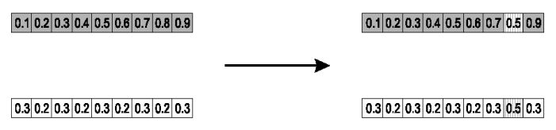
    - efekat je neki vid uprosečavanja, pravi se podesivi prosek

- jednostavno aritmetičko ukrštanje
    - roditelji $<x_1, ... , x_n>$ i $<y_1, ... , y_n>$
    - slučajno se odabere gen k
    - ukrštanje na nekom segmenut
    - 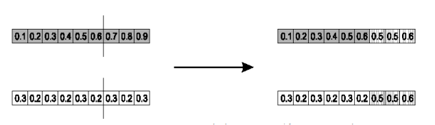
    
- celovito aritmetičko ukrštanje
    - najčešće se koristi
    - zadržava se 1 dete, a imamo duplo više ukrštanja
    - roditelji $<x_1, ... , x_n>$ i $<y_1, ... , y_n>$
    - ovde jedinke nemaju veliki diverzitet pa je potrban veći stepen mutaciije
    - npr za $\alpha = 0.5$
    - 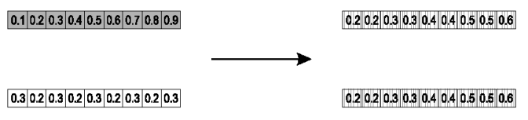
    
###  Ukrštanje u permutacionim problemima
- obični operatori ukrštanja dovode do nedopustivih rešenja:
- 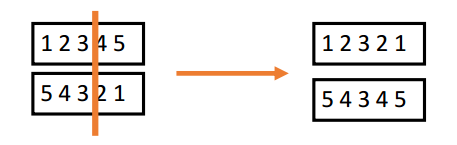
- ukrštanje prvog reda
    - ideja zadržati relativno uređenje
    - opšta šema
        1. odaberi segmenti hromozoma prvog roditelja
        2. iskopiraj ovaj segment u prvo dete
        3. iskopirati preostale vrednosti (brojeve) tako da kopiranje počinje desno od kopiranog segmenta korišćenjem redosleda datog u drugom roditelju
        4. identično za drugo dete
    - 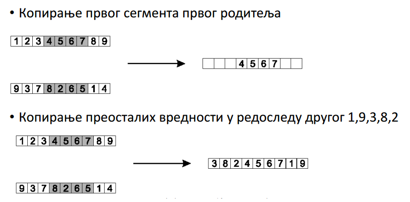
    
- delimično ukrštanje (RMH)
    - opšta šema za roditelje P1 i P2:
    1. odaberi slučajan segment i kopiraj ga od P1
    2. počev od pozicije početnog segmenta, traži elemente u tom segmentu za P2 koji nisu bili kopirani
    3. za svaki od ovih $i$ pronađi vrednost $j$ iz P1 koja je kopirana na njegovo mesto
    4. postavi $i$ na poziciju zauzetu sa $j$ u P2, pošto zasigurno znamo da j neće biti tamo, jer je već u detetu
    5. ako je mesto na kojem se nalai j u P2 već zauzeto vrednošću k, onda postavi i na poziciju koju zauzima k u P2
    6. preostale elemente kopirat iz P2
    - drugo dete se kreira analogno
    - 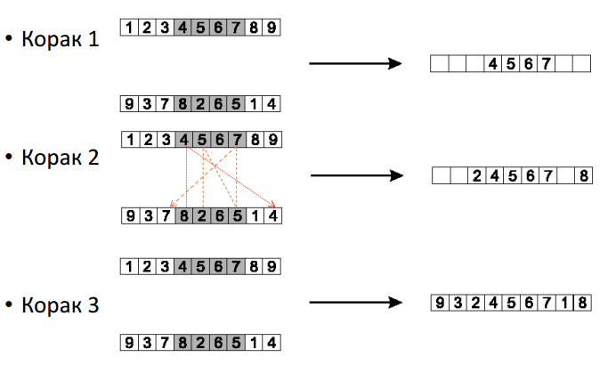
    TODO

---
## `22.` Populacioni modeli i selekcija
- generacijski model (Generation getetic algorithm - GGA)
    - koristi ga SGA
    - svaka jedinka preživi tačno jednu generaiju
    - ceo skup roditelja je zamenjen svojim potomcima
- model sa stabilnim stanjem - Steady-state GA (SSGA)
    - jedno dete se generiše po generaciji
    - jedan član generacije biva zamenjen njime
- generacijski jaz
    - udeo populcije koja se menja
    - 1.0 za GGA, 1/_veličina populacije_ za SSGA

- selekcija se može javiti u dva navrata
    - selekcija roditelja za ukrštanje
    - selekcija preživelih - biranje iz skupa roditelja + deca onih koji će preći u novu generaciju

- razlika među selekcijama se pravi na osnovu
    - operatora: definiše različite verovatnoće
    - algoritmi: definišu kako se verovatnoće implementiraju

### Primer selekcije: SGA
- očekivani broj kopija jedinke i
    - $E(n_i) = \mu f(i)/<f>$
    - kvazi verovatnoća bazirana na fitnes vrednostima
    - $f(i)/<f>$ - normalizovan fitnes
    - $\mu$ - velična populacije
    - $f(i)$ - fitnes jedinke
    - $<f>$ - prosečan fitnes opulacije

    - Ruletksa selekcija
        - za datu raspodelu verovatnoća se okrene ruletski točak n puta
        - nema garantovane gornje ili donje granice $n_i$
    - Baker SUS algoritam
        - SUS - Stohastic universal sampling
        - n ekvidistantnih graničnika postavljeno na točku, jedno okretanje
        - garantuje da je $floor(E(n_i)) \le n_i \le ceil(E(n_i))$

- Fitnes-rsazmerna selekcija
    - problem je što jedna visoko kvalitetna jedinka može brzo da preuzme čitavu populaciju ako su ostale jedinke značajno lošije, rana konvergencija
    - kada su fitnesi slični (pred kraj) selekcioni pritisak je loš
        - selekcioni pritisak definiše koliko su favorizovana dobra rešenja
        - kada su fitnesi relativno slični (bliski) smanjuje se favorizacija
        - skaliranje može da popravi:  
            - skliranje prema najgorem: $f`(i)=f((i) - \beta ^t$, gde je $\beta$ najgori fitnes u poslednjoj generaciji

- rang-bazirana selekcija
    - pokušava da prevaziđe problem fitnes-srazmerne selekcije
    - vrednost fitnesa nema apsolutan već relativan značaj ovde
    - najbolja jedinka ima najviši rang $\mu$, a najgori rang 1
    - trošak na sortiranje je obično zanemarljiv

- turnirska selekcija
    - ovo može biti usko grlo paralelnim mašinama
    - oslanja se na pristustvo eksternih fitnes funkcija koje možda ne postoje uvek, npr evolucija botova za igrice (ovde ne znamo fitnes ali možemo da utvrdimo ko bolje igra)
    - odaberemo k članova na slučajan način, potom se odabere najbolji od njih
    - ostale jedinke se biraju na isti način
    - verovatnoća odabira jedinke i zavisi od:
        - ranga i 
        - vrednosti k, veće k je veći selekcioni prtisak
        - da li se takmičari biraju sa vraćanjem, odabir sa vraćanjem pojačava selekcioni pritisak
    - za k=2, vreme potrebno da najbolja jedinka preuzme populaciju je ista kao kod linearnog rangiranja za s=2*p

- selekcija preživelih
    - metoda slična onoj za odabira roditelja za ukrštanje
    - u generacijskom modelu trivijalno, brišu se najstariji, tj svi roditelji
    - u opštem slučaju se mogu birati/brisati bilo koje jedinke iz skupa roditelja i dece
    - dve grupe pristupa:
    1. selekcija zasnovana na starosti
        - kako kod SGA
        - SSGA može da implementira brisanje slučajne (što se ne preporučuje) ili brisanje najstarije

    2. fitnes-srazmerna selekcija
        - primena ruletske ili turnirske...
    - Elitizam je specijalni slučaj
        - često se koisti i kod GGA i SSGA
        - uvek zadržava kopiju najboljeg rešenja do sad

---
## `23.` Teorema o shemama
- teorijska osnova iza genetskih algoritama i genetskog programiranja, John Holland 70ih godina
- nejednakost koja objašnjava evolutivnu dinamiku  

**Teorema:** kratke sheme sa natprosečnim fitnesom postaju eksponencijalno učestalije tokom generacija

- shema je šablon koji identifikuje podskup niski koje su slične na pojedinačnim pozicijama, kao regularni izrazi na nivou binarnih izraza

_Primer:_ za binarne niske dužine 6, primer shheme je 1\*10\*1 gde svaka shema opisuje sve niske dužine 6 sa fiksiranim bitovima na 4 opisane pozicije

- red sheme o(H) - broj fiksiranih pozicija
- $\delta (X)$ - udaljenost između prve i poslednje fiksirane pozicije
- fitnes sheme je prosečan fitnes svih niski koje pripadaju shemi

**Teorema:** 
$$E(m(H, t+1)) \ge m(H, t)f(H)/a_t[1-p]$$
- $m(H,t)$ - broj niski koje pripadaju shemi H u generaciji t
    - broj jedinki koje se uklapaju u prethodnoj iteraciji utiče na broj jedinki koje će se preneti u narednu generaciju
- $f(H)$ - prosečan fitnes sheme H, 
    - što je veći fitnes neke posmatrane sheme to je veća šansa da se broj takvih jedinki poveća 
- $a_t$ - prosečan fitnes u generaciji t
- p - verovatnoća da je ukrštanje ili mutacija _razbiti_ shemu 
    - $p=\delta(H)/(l-1)p_c+o(H)p_m$
    - $l$ - dužina genotipa
    - $p_c$ i $p_m$ - verovatnoće ukrštanja i mutacije


- očekivani broj jedinki koje imaju određenu shemu H u nekoj generaciji t+1 je veći od broja jedinki koji se uklapaju u shemu H puta fitnes sheme kroz prosečan fitnes svih jedinki u populaciji
- što je udaljenost prve i poslednje fiksirane pozicije veća veća je i šansa de će se ukrštanjem razbiti shema

---
## `24.` Genetsko programiranje - pregled koncepata i opšta shema
- razvijeno u Americi 90ih godina, J. Koza
- primenjuje se u mašinskom učenju, predikcija, klasifikacija
- konkurentan neuonskim mrežama i sličnim metodama, ali je sporo i zahteva ogromen populacije
- Specijalne karakteristike:
    - nelinearni hromozomi, stabla, grafovi
    - mutacija je moguća ali ne neophodna, za razliku od GA

- Tehničke karakteristike:

|  |  |
|---|---|
| reprezentacija | stablo|
| ukrštanje | razmena stabala, nema smisla višepozicioni|
| mutacija | slučajna promena u stablu,slučajno odabrano podstablo zamenimo slučajno generisanim|
| selekcija roditelja | fitnes srazmerna |
| selekcija preživelih | generacijska zamena |
|

_Primer:_ Banka odlučuje da li će nekome dati kredit. Na osnovu istorijski podataka pravimo stablo odlučivanja. Npr gledamo broj dece, platu i bračni status.
- kada generišemo stablo odlučivanje ide brzo
- tačke prostora su kandidat stabla, veliki prostor mogućih rešenja
```
IF formula THEN dobar ELSE loš
```
- mogući model:
```
IF broj_dece=2 AND plata>80000 THEN dobar loš
```
- prostor pretrage (fenotip) je skup svih formula
- fitnes formule - procenat dobro klasifikovanih primera
- prirodna reprezentacija formule (genotip) je stablo
- imamo tehniku koja ne zapada u lokalne optimume, globalnija je
- genetski algoritam kreće od slučajno generisane populacije stabala, izgeneriše se da prati ograničenja operatora
- formiraju se dopustiva rešenja

### Reprezentacija stabla
- Stablima se može predstavljati veliki broj formula
* Aritmetička formula
    - 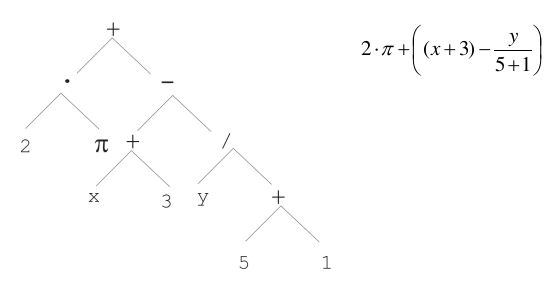
* Logička formula
    - 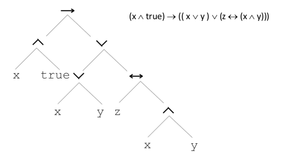
* Program
    - 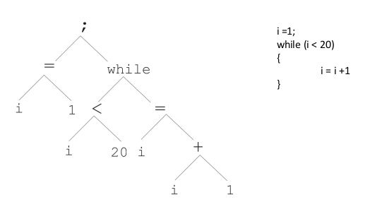


- u genetskih algoritmima, evolutivnim strategijma, evolutivnom programiranju hromozomi su linearne strukture - nizovi bitova, celih brojeva, relanih brojeva, permutacije... veličina hromozoma je fiksna
- stablo-hromozomi su nelinearne strukturei  stablo može biti proizvoljne dubine i širine

### Reprezentacija stabla
- simbolički izrazi mogu biti definisani pomoću
    - skupa termova T
    - skupa funkcija F sa pridruženim arnostima
- dalje se može koristiti sledeća rekurzivna definicija
1. Svaki $t \in T$ je korektan izraz
2. $f(e_1, ... ,e_n)$ je korektan izraz ako $f \in F$, $arity(f)=n$ i $e_1, ... ,e_n$ su korektni izrazi
3. ne postoje druge korektne forme izraza
- u opštem slučaju izrazi u GP nisu tipizirani, tj svaki $f \in F$ može uzeti bilo koji $g \in F$ kao argument

### Generisanje potomaka
- genetsko prograiranje koristi **ILI** ukrštanje **ILI** mutaciju, ali ne oba
- za razliku od genetski algoritama koji koriste i ukrštanje i mutaciju
- 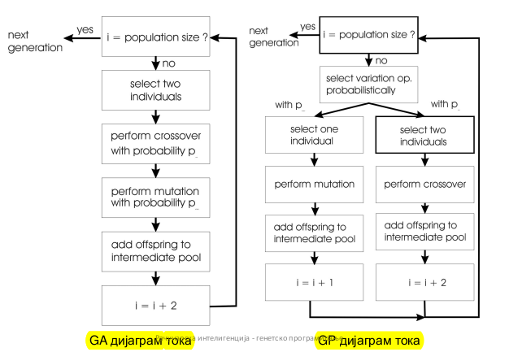

### Selekcija
- selekcija roditelja je obično fitnes-srazmerna
- selekcija u veoma velikim populacijama
    - populacija se rangira prema fitnesu i podeli u dve grupe
    - grupa 1 - najbolji x% populacije
    - grupa 2 - ostalih (100-x)%
    - 80% operacije selekcije se vrši nad grupom 1, a presotalih 20% nad grupom 2
    - procenti su određeni empirijski i zavise od veličine populacije, za populacije 1000, 2000, 4000, 8000, x = 32%, 16%, 8%, 4%
- selekcija preživelih
    - standardni pristup je generacijski
    - model sa stabilnim stanjem i elitizmom postaje popularan u poslednje vreme
- zbog veći mogućnosti je ovde potrebna veća kontrola, malo veća doza elitima, manja doza nasumičnosti, da bi se očuvao neki kvalitet

### Inicijalizacija populacije
- postavi se maksimalna dubina stabla $D_{max}$
- Balansirani pristup
    - teži se ka balansiranom stablu dubine $D_{max}$
    - čvorovi na dubini $d<D_{max}$ se slučajno biraju iz skupa fnkcija F
    - čvorovi na dubini $d=D_{max}$ se slučajno biraju iz skupa termova T

- Ograničeni pristup
    - teži se ka stablu ograničene dubine $\le D_{max}$
    - čvorovi na dubini $d<D_{max}$ se slučajno biraju iz skupa fnkcija $F \cup T$
    - čvorovi na dubini $d=D_{max}$ se slučajno biraju iz skupa termova T

- standardna GP inicijalizacija: kombinovan pristup koji koristi i balansirani i ograničeni pristup, svaki po pola populacije

### Pristup zasnovan na povećanju
- Bloat - tendencija ka udebljanju, stbla unutar populacije vremenom rastu
- debata u naučnim istraživanjima
- **Okamova britva**: ako imamo dva algoritma sa identičnim performansama bolje korsititi jednostavniji
- potrebne su kontramere poput sprečavanja upotrebe operatora koji prave preveliku decu i penalizacija prevelikih jedinki

_Primer:_
- 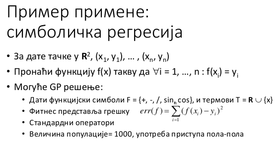
- jednostavna interpretacija, čitljivo
- potencijalno beskonačna petlja

---
## `25.` Operator mutacije i ukrštanja kod genetskog programiranja.

### Mutacija
- najčešće: zameni slučajno odabrani podstablo novim slučajno generisanim stablom
- 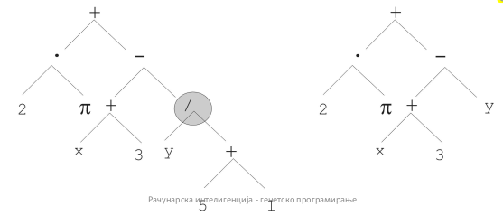
- mutacija ima dva parametra
    - $p_m$ - verovatnoća odabira mutacije, u suprotnom je selekcija, savet je da bude blisko nuli, npr 0.05
    - verovatnoća odabira unutrašnje tačke, tj korena podstabla za zamenu
- veličina deteta može da bude veća od veličine roditelja
- ako se ovo dešava kroz generacije stabla postaju sve veeća i kompleksnija
- postoje tehnike koje sprečavaju rast potomaka

### Ukrštanje
- najčešće: zameni dva slučajno odabrana podstabla između roditelja
- ukrštanje ima sva parametra
    - $p_c$ - verovatnoća odabira ukrštanja, u suprotnom je mutacija
    - verovatnoća odabira unutrašnje tačke, tj pozicije za ukrštanje kod oba roditelja
- veličina deteta može da bude veća od veličine roditelja
- 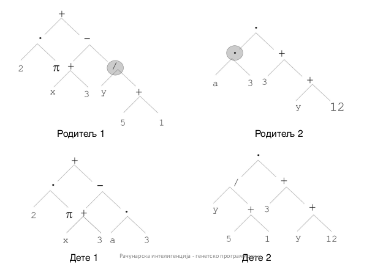


---
## `26.` Intelignecija rojeva - uopšteno.
- Pčele
    - kooperacija u okviru kolonije
    - mahanjem krilima regulišu temperauru unutar košnice
    - efikasnost se postiže specijalizacijom - podelom posla u okviru kolonije
    - komunikacija - izvor hrane se koristi u skladu sa njihovom blizinom saću i kvalitetom

- Ose
    - tragači za hranom, tragači za vodom, roditelji
    - složena gnezda - horizontalne kolone, zaštitne opne, centralni ulazni hol
    - nema centralizovanog sistema, nekako indirektno komuniciraju

- Termiti
    - konusni spoljni zidovi i ventilacioni otvori
    - legla u centralnoj košnici
    - spiralni ventilacioni otvori za hlađenje
    - potporni stubovi

- Mravi
    - prave puteve do mesta sa hranom tako što ostavljaju tragove feromona
    - formiraju lanc svojim telima u cilju pravljenja mosta preko lišća i granja
    - podela posla između više i manje bitnih mrava, dobra specijalizacija posla
    - mogu optimizovati putanju da manje troše energiju

- Karakteristike socijalnih insekata  

|  |  |
|---|---|
| fleksibilnost | kolonija savladava unutrašnje preturbacije kao i spoljašne izazove, kombinacija slučajnosti i onoga što se već radi, primenjuju diversifikaciju i intensifikaciju |
| robusnost | zadaci se završavaju i ako neke jedinke zakažu| 
| decentralizovanost | ne postoji centralni mehanizam kontrole niti koncept lidera |
| samoorganizovanost | putevi do rešenja vremenom iskrsnu, nisu unapred predefinisani |
|

- jednostavne jedinke mogu da grade globalno kompleksno ponašanje

### ikosistem simulacija
- svaki agent X ima dodeljena dva nasumična protivnika A i B
- 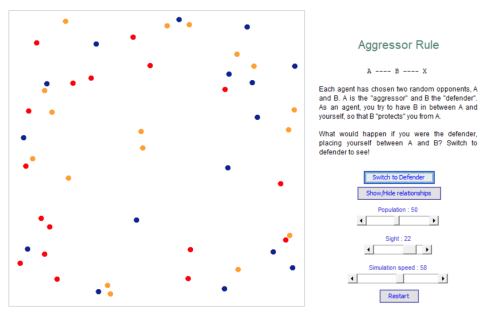
- pravilo za X je da se postavi tako da bude na putu između A i X
- 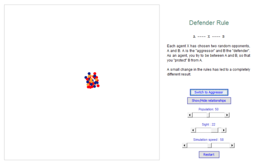
- mala promena pravila drastično utiče na kolektivno ponašanje

- 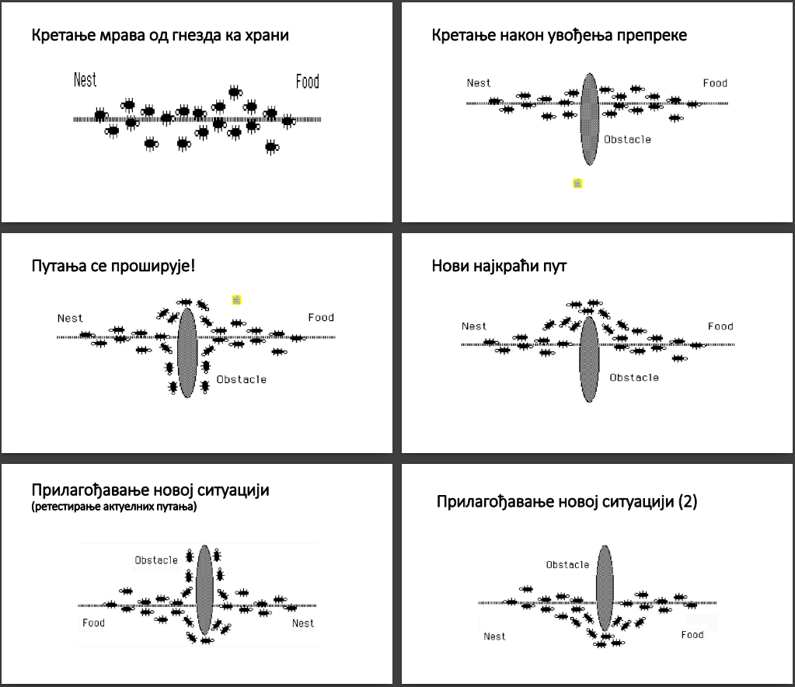
- kada se pojavi prepreka mravi će se ponašati haotično,dok ne nađu put oko prepreke, kada se na putu poveća trag feromona skoro svi mravi će pratiti taj put

### Problemi sa inteligentnim rojevima
- teško se programira jer je teško kodirati i dekodirati
- rešenja iskrsnu unutar sisitema
- rešenja su rezultat ponašanja i interakcije između pojedinačnih agenata (jedinki) u sistemu

### Glavni sastojci samoorganizacije
- pozitivna povratna sprega - positive feedback
    - nagrada pozitivnog ponašanja
- negativna povratna sprega - negative feedback
    - kazna negativnog ponašanja
- pojačavanje i smanjivanje slučajnosti
- oslanjanje na međusobne interakcije agenata

### Svojstva samoorganizacije
- kreiranje struktura - gnezda, tragovi, socijalno uređenje- hijerarhija
- promene su rezulat postojanja višestrukih puteva razvoja - nekoordinisane i koordinisane faze
- postojanje više stabilnih stanja - npr dva jednako dobra izvora hrane

### Tipovi interakcije socijalnih insekata
- direktna interakcija
    - razmena tečnosti i hrane, vizuelni kontak, hemijski kontakt - feromoni
- indirektna interakcija - stigmergija - stigmergy
    - individualno ponašanje menja okruženje koje posle izaziva promenu ponašanja drugih individua
    - kod mrava stigmergija eliminiše potrebu za direktnom međusobnom komunikacijom
    - efekat je da mrav sprovode koordinisane aktivnosti bez obraćanja jedan drugom kao što to rade ljudi

- neke popularne primene
    - optimizacija ruta
    - klasterovanje i sortiranje
    - podela posla
    - kooperativni transport
    - igradnja složenih struktura - gnezda

### Optimizacija ruta mravima - TSP
- $d_{ij}$ - udaljenost između gradova i j
- $\tau _{ij}$ - količina feromona na luku (i,j)
- m agenata (mrava) 
- u svakom koraku, veroatnoća odlaska od grada i do grda j je srazmerna $(\tau_{ij})^a (d_{ij})^{-b}$
    - verovatnoća odlaska do nekog grada je srazmerna količini feromona a obrnuto srazmerna udaljenosti
- feromoni isparavaju po fomruli $\tau (1 - \rho) \tau$
- krećemo od nasumične tačke, graf je hamiltonov ciklus pa je svejedno odakle krećemo
- 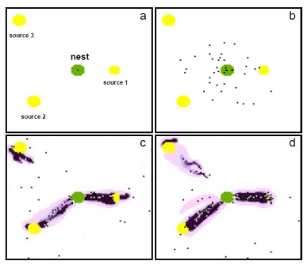

### Rutiranje u komunikacionim mrežama
- agenti započinju put od polaznog ka ciljnom čvoru
- svaki agent ažurira svoju tabelu rutiranja i komunicira sa ostalima
- ideja: ako ideš ka ciljnom čvoru u kom sam ja već bio ranije, daću ti savet kuda da ideš
- uticaj agenta (validnost saveta) sa smanjuje sa starenjem
- agenti se veštački usporavaju na zagušenim čvorovima (granama) - simulacija realnosti
- sporije ispravanje feromona > intensifikacija rešenja, saveti ostaju isit i vodi se sličnim rešenjima

### Klasterovanje
- 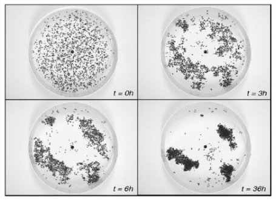
- mravi se kreću ka hrani, a ona je centroid klastera
- izolovana hrana ima veću šansu da bude pokupljena od strane agenta koji nosi tovar
- verovatnoća uzimanja tovara: $p_p = [k_1 / (k_1 + f)]^2$
- $f$ - gustina hrane u datoj okolini
- agent koji nosi tovar ima veću šansu da ispusti tovar ukoliko u blizini postoji drugi tovar: $p_d = [f / (k_2 + f)]^2$
- operatori se moraju direktno prilagoditi problemu

### Podela posla
- _Messor barbarous_ - mravi u jugoistočnoj Španiji, donose hranu od izvora ka gnezdu u brigadama od šestoro radnika
- prvo manji mravi izviđači uzimaju hranu sa izvora i nose je duž puta dok ne sretnu veće radnike, prelaze manji put i troše manje energije
- veći radnici preuzimaju hranu i nose je dalje dok se manji vraćaju nazad do izvora
- 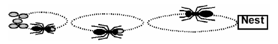
- slično organizaciji amerčkog tacko bella

### Kooperativni transport
- kada sam mrav ne može da nosi veliki komad hrane više mrava se aktivira
- u početku se mravi kreću nesinhronizovano, bez nekog napretka
- nakon nekog vremena uspevaju da pomere plen, i onda nastavljaju da rade sličnu aktivnost koja daje rezultate

### Kolektivna robotika
- reprodukcija kolektivne koordinacije sa grupom veoma jednostavnih robota
- roboti su zajedno gurali kutiju
- možda ne najefikasniji način, ali je potencijalno fleksibilan i pogodan za prilagođavanje pod najrazličitijim okolnostima
- potrebno je adekvatno definisati pravila
- npr imamo algoritam ponašanja i roboti se prilagođavaju životu na drugoj planeti

### Izgradnja složenih struktura
- agenti se pomeraju nasumično unutar 3D mreže
- agent postavlja ćeliju/ciglicu svaki put kad pronađe stimulativnu konfiguraciju
- postoji tabela pravila za stimulativne konfiguacije
- pozicija je stimulativna npr ako ima ciglicu pored ili ispod
- prostor mogućnosti stimulativnih izvdenih konfiguracija je ogroman
- 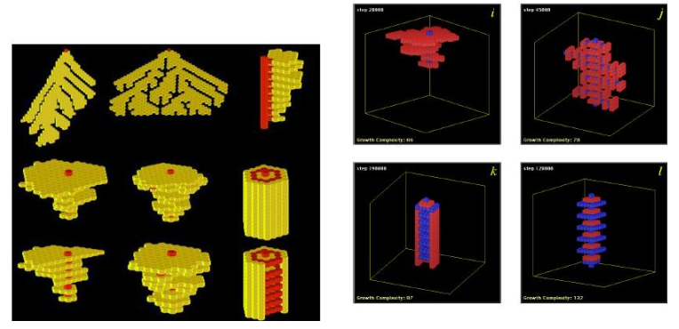

### Opasnost pravila
- mravi atnici napravili krug smrti
- krug prečnika 400 metara i svakom mravu je trebalo oko 2 i po sata da ga obiđe
- veliki broj mrava uginuo jer nisu mogli da izađu iz kruga, nekoliko je uspelo da se izvuče

---
## `27.` Optimizacija rojevima čestica - opšti koncepti i osnovni algoritam
- PSO - Particle Swarm Optimization
- koren u socijalnoj psihologiji
- rojevi čestica su na neki način slični celularnim automatima - CA:
    - svaka ćelija ažurira svoje stanje paralelno sa ostalim
    - svaka nova vrednost neke ćelije zavisi od starih vrednosti i od vrednosti svojih suseda
    - sve ćelije se ažuriraju primenom istog pravila
- ćelije se menjaju iterativno
- PSO nije nastao pre CA, nego se posle ispostavilo da liče
- čestice unutar roja se mogu poistovetiti sa ćelijama unutar CA, samo se njihova stanja menjaju u mnogo dimenzija istovrermeno

- James Kennedy i Russell Eberhart: _Čestice unutar roja imitiraju socijalno ponašanje ljudi ili insekata. Čestice (jedinke) interaguju međusobno dok uče i sopstvenog iskustva, što postepeno pomera populaciju u pravcu boljih regiona rešenja problema._
- čestice a ne tačke jer brzina i ubrzanje više priliče česticama nego tačkama

- imamo kognitivnu komponentu - znamo šta smo radili, gde se nalazimo, delimično vidimo šta drugi rade

- zahtevna metoda, uopštenija od mravljih kolonija, lakše se prilagođava posmatranom problemu

- za probleme u realnom, diskretnom ili mešovitom prostoru pretrage
- za probleme sa višestrukim lokalnim optimumima, ograničenjima
- za probleme višeciljne, dinamičke optimizacije

### Originalni PSO
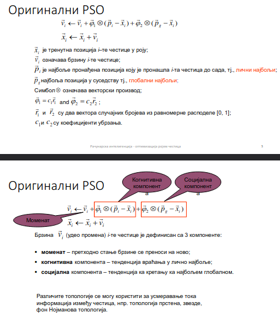
- ako je čestica imala veliku brznu mala je šansa da će naglo da se smanji

### Pseudokod
- za svaku jedinku u populaciji se ažurira njena trenutna pozicija po potrebi

```
reandom_initial_population();
repeat 
    for i = population_size do
        if f(xi) < f(pi) then pi = xi;
        pg = min(p_neighbours)
        for d = 1 to dimmension do
            velocity_update();
            position_update();
        end;
    end;
until termination_criterion_met()
```

---
## `28.` Geometrijska interpretacija optimizacije rojevima čestica i primeri.

### Inercijalna težina

- w predstavlja inerciju
- njom kontrolišemo eksploraciju i eksploataciju
    - $w \ge 1$ - brzina raste tokom vremena, pa roj divergira
    - $0 < w < 1$ - čestica usporava pa konvergencija zavisi od vrednsoti $c_1$ i $c_2$
    - $w < 0$ - brzina se smanjuje tokom vremena, na kraju se smanji na 0 i time se zaustavlja algoritam
- manja brzina > manje istražuje prostor > manje diversifikacija
- ako se brzina poveća čestice divergiraju, tj sve više se udaljavaju jedna od druge
- empirijski je pokazano da dobre rezulatet daju vrednosti
    - $w=0.7298$
    - $c_1 = c_2 = 4.9618$
- Eberhart i Shi savetuju smanjenje inercije tokom vremena, obično u rasponu 0.9 i 0.4, ovim se postepeno prebacuje režima veće eksploracije u režim veće eksploatacije


### Primer

- $x(k+1) = x_k + v(k+1) = (4,2) + (2.2, 2.8) = (6.2, 4.8)$


### Ako imamo jednu česticu
- nema nasumičnosti, tj stohastičke komponente
- postoji jedna dimenzija
- unapred određene počenta pozicija i brzina
    - $v \leftarrow wv + c_1(p_i-x) + c_2(p_g-x$)
    - $x \leftarrow x + v$
- ako je $w=0.7,\ c_1=c_2=0.7$, znamo početne pozicije i brzinu
- posmatramo $f(x)=x^2$ na $[-20, 20]$
- imamo dva slučaja
1. Prve dve pozicije su sa iste strane minimuma, npr x=-20 i v=3.2
    - pošto je lični najbolji uvek jednak x čestica nikad neće moći da dostigne minimum, prerana konvergencija
    - nema neke tendencije da cik cak potezima dođe do globalnog optimuma bez stohastičk komponente
2. Pre dve pozicije okružuju minimum, npr x=-2, v=6.4
    - čestie osciluju oko minimuma pošto lični najbolji nije uvek x, dobija se bolje ponašanje


### Putanja dve čestice
- interakcije dve čestice se modeluje grafom uticaja
    - dva istraživača i dve memorije
    - svaki istraživač prima infomracije od dve memorije ali informiše samo jednu memoriju  


- dve čestice su dva istraživača i dve memorije
- imamo dva slučaja kao u prethodnom, ali ovde čestice rade zajedno


- memorija čestice 2 je uvek bolja od memorije 1, pa se čestica 2 ponaša isto kao i kada je bila sama
- ali čestica 2 sada ima koristi od memorije čestice 2 što na kraju izaziva konvergenciju (levo)

- opštji slučaj: svača čestica je pod uticajem tuđe memorije samo povremeno
- konvergencija ka globalnom optimumu je tada verovatnija, ali ceo proces može biti sporiji


### Potencijalno opasno svojstvo
- ako je lična najbolja pozicija jednaka globalno najboljoj i kada je to jednako trenutnoj poziciji: $x_i = p_i = p_g$
- tada ažuriranje brzine zavisi samo od $w*v_i$, tj promena brzine je 0 pa pomeraj zavisi samo od inercije
- ako se ovo ponovi u više iteracija $w*v_i \rightarrow 0$, tj brzina se smanjuje na 0
- rešenje: omogućiti da globalno najbolja čestica vrši lokalnu pretragu i koristi mutacije da prekine ovo stanje

### Ogoljeni PSO
- ako izbacimo brzinu
- ako su $p_i$ i $p_g$ konstantne, kanonski PSO pretražuje prostor pretrage praćenjem normalne distribucije sa centrom između $p_i$ i $p_g$

### Binarni PSO
- pozicija se ažurira prema formuli: $x_{ij}(t+1) = 1\ za\ U(0,1)<sig(v_{ij}(t+1))$, inače $x_{ij}(t+1) = 0$
- gde je $sig(v)=1/(1+e^{-v})$

---
## `29.` Varijante gbest i lbest algoritma i topologije uticaja.
### Topologija uticaja

- prva je kompletna topologija, tj jedinka se ugleda na sve
- druga je topologija kada se gledaju samo dva suseda
- treća je kada se sve jedinke ugledaju na jednu
- ne koristimo globlano najbolji za socijalnu komponentu, već imamo unapred zadatu topoplogiju uticaja zadatu na početku, ugledamo se na unapred zadatke susede, ili na neki broj dinamički određenih suseda
- Dva najčešća modela:
    - gbest - svaka čestica je pod uticajem najbolje jedinke iz čitavog roja
    - lbest - svaka čestica je pod uticajem najboljih jedinki iz neke svoje lokalne okoline

- 
    - graf uticaja nad rojem od 7 čestica
    - svaka čestica zavisi od same sebe i od svoja dva suseda

- 

- treba praviti kompromis između eksploatacije i eksploracije
- gbest najbrže širi informacije širom populacije, loše ako se prebrzo sazna nešto pa se ispostavi da ipak nije dobro
- lbest model koji koristi topologiju prstena najsporije, dobro za složen prostor pretrage
- za složene višemodalne funkcije bra populacija nije poželjna
- ali sporije širenje informacija usporava konvergenciju

- Mendes i Kennedy - von Nojmanova topologija daje najbolje ponašanje među mnogo različitih topologija
    - severna, južna, istočna i zapadna čestica u dvodimenonalnoj rešetci

- 
- kao kod karnoovih mapa, susedi prvi i poslednji red

---
## `30.` Funkcija aktivacije
- 
a) linearna funkcija - samo prosledi vrednost  
b) step funkcija - ispod neke vrednosti argumenta je jedna vednost, a iznad druga  
c) rampa  
d) Sigmoidna gunkcija - daje vrednost između 0 i 1  
e) hiperbolički tangens - daje vrednost između -1 i 1  
f) Gausova funkcija, kao raspodela  
g) relu = max(0,x)

TODO

---
## `31.` Linearna i nelinearna razdvojenost.
### Linearna razdvojivost
- postavlja hiperravan koja razdvaja ulazne podatke na one sa izlazom ispod i iznad nekog praga
- 
    - hiperravan koja odgovara funkciji logičke disjunkcije
    - kvartatići su 1 a kružići 0
    - želimo da povučemo liniju (hiperravan) tako da su kružići sa jedne strane a kvadatići sa druge
- želimo da aproksimiramo funkciju, tj naučimo da razlikujemo
- dovoljno da razdvojimo na da i ne, a perceptron može ovo da nauči
- ova funkcija je linearno separabilna, tj postoji hiperravan koja razdvaja na da i ne

### Nelinearna razdvojivost
- ako nije linearno razdvojivo, tj prostori sa da i ne se ne mogu razdvojiti jednom hiperravni
- ovo ne može da reši jedan veštački neurno, već je potreban složeniji model
- 
    - ne možemo jednom linijom razdvojiti kružiće i kvadratiće
    - ekskluzivna dijskunkcija je nelinearno razdvojiva
    - zahteva postojanje središnjeg sloja sa dva neurona

---
## `32.` Učenje veštačkog neurona.
- učenje gradijentnim spustom
- induktivni proces učenja
- dajemo primere sa odgovorima i nadamo se da će funkcija uhvatiti suštinu i da će znati da reši buduće slučajeve
- veštački neuron aproksimira funkciju opisanu ulazno izlaznim signalima podešavanjem težina $v$ i parametra $\theta$
- skalarni parametar $\theta$ se može pridružiti vektoru $v$ radi lepše notacije
- težine se menjaju u skladu sa greškom na izlazu
- ukuonu grešku treba minimizovati:
$$\epsilon = \sum_{p=1}^{P_T} (t_p-o_p)^2 $$
- $t_p$ - ciljna vrednost
- $o_p$ - aproksimirana vrednost
- $P_T$ - broj podatak sprovedenih na ulaz
- kvadriranje u funkciji greške onemogućava da se greške skrate
- 
- naredna težina je zbir prethodne i promene težine
- promena težine je proporcionalna brzini učenja i negativnom gradijentu posmatrane težine, tako se tazuem izvod ??
- ako je velika brzina učenje onda prebrzim oscilovanjem možemo preskočiti rešenje
- informacije o grešci se koriste tako da se težine menjaju u skladu sa negativnim gradijentom
- ako je veća greška pravimo jače promene u negativnom smeru od težinama tih neurona
- korekcija težine zavisi od magnitude, koliko je svaki težinski faktor uticao na nastanak greške

- 

---
## `33.` Tipovi organizacija veštačkih neuronskih mreža, slika sa objašanjenjem.
### Učenje ueuronskih mreža
- pojedinačan neuron može da nauči samo linearno razdvojivu funkciju
- grupisanje neurona u mrežu omogućava učenje nelinearno razvojivih funkcija
- učenje mreža je kompleksnije i računarsk zahtvnije
- nadgledano učenje - zahteva skup podataka za trening, svaki podatak ima pridruženu ciljnu promenljivu
- nenadgledano učenje

### Mrežensa propagacijom unapred
- FNN - Feedfoward neural network
- najmanje tri sloja: 
    - ulazni - tu dolaze iformacije iz spoljnog sveta
    - srednji
    - izlazni
- izlaz se računa jednim prolaskom kroz mrežu
- neuroni jednog sloja su povezani sa svim neuronima narednog sloja
- 
- 

### Rekurentne neuronske mreže
- Elman SRNN - Simple recurrent neural network
- kopija skrivenog slja se vraća na ulaz (kontekstni sloj)
- cilj je upotreba prethodnog stanja mreže
- omogućava učenje temporalnih zavisnsoti
- informacija ne ide samo unapred već postoji povratna sprega između izlaza i ulaza, izlaz se vraća ponovo na ulaz
- imaju dve verzije, jedna vraća samo sa poslednjeg sloja, a druga može i sa ostalih slojeva

- 
- 

- Jordan SRNN - kopija izlaznog sloja se sproodi na ulaz, tzv sloj stanja
- 

### Kaskadne neuronske mreže
- CNN - Casade neural network
- svi ulazi su spojeni sa svim skrivenim i svim izlaznim elementima
- elementi srednjeg sloja su spojeni sa svim izlaznim i svim narednim elementima srednjeg sloja
- 
    - postoje prečice i duži putevi u mreži
    - efektivno se održava više težina
    - ide u jednom smeru, od neurona višeg sloja se šalje ka neuronima nižeg sloja

---
## `34.` Pravila nadgledanog i nenadgledanog učenja.

### Pravila nadgledanog učenja
- dat je konačan skup uređenih parova ulznih vrednosti i pridruženih ciljnih vrednosti:  
$D = \{ dp=(z_p, t_p) | p = 1,...,P \}$
- $z_{i,p}, t_{k,p} \in R\ za \ i=1,...,l\ i \ k=1,...,K$
- $l$ - broj ulaznih signala
- $K$ - broj izlaznih signala
- $P$ - broj trening podataka
- tada možemo predstaviti sledeću zavisnost: $t_p= \mu (z_p) + \eta p$
- $\mu (*)$ - nepoznata ciljna funkcija
- $\eta p$ - šum
- učimo induktivno iz primera, a želimo da predviđamo vrednosti za nove podatke
- nije kao kod interpolacije gde treba da se uklopi u skup tačaka
- npr predviđamo vlažnost vazuha na osnovu istorijskih podataka

- cilj je aproksimirati $\mu (*)$ na osnovu podataka iz D
- polazni skup se obično deli na 3 dijsunktna skupa:
    - $D_T$ - trening skup za aproksimaciju
    - $D_V$ - skup za validaciju (memorizacija), može da smanji preprilagođavanje, ali nije obavezan
    - $D_G$ - skup za testiranje (procena kvaliteta, ne glda se pri učenju uopštavanja)
- tokom faze učenja se minimizuje empirisjka greška podešavanjem W
- 
- metode lokalne optimizacije, npr gradijentni spust
- metode globalne optimizacije, npr metaheuristike
- preprilagođavanje - jako doro radi na treningu, a loše na testu
- potprilagođavanje - nije dovoljno dobro obučen model

### Gradijenti spust za učenje NN
- Sastojis se iz dve faze
1. propagacija signala unapred, jednostavno računanje signala za FFNN
2. propagacija greške unazad, signal greške se šalje unazada ka ulaznom sloju pri čemu se vrši izmena težinskih koeficijenata
- imamo više grešaka koje treba rasporediti po mreži, a ne okriviti jedan sloj za svu gešku
- funkcija cilja minimizacije može biti sum kvadratna greška 
    - SSE - Sum squared error
    - $1/2 \sum_{k=1}^K(t_k-o_k)^2$
    - 1/2 da bi se skratilo pri izvodu
- kao funkcija aktivacije na izlaznom i središnjem sloju može da se koristi sigmoidna funkcija
    - $o_k = f_{ok} (net_{ok} = 1 / (1 + e^{-net_{ok}}))$

### Stohastički gradijentni spust za učenje NN
- 
- 

- 
    - varira se redosled ulaza podataka u mrežu
    - nema preferrencije za težine
    - podatci se propagiraju kroz mrežu dok se ne zadovolji neki uslov

### Nendgledano učenje
- ne daje se očekivani izlaz
- algoritam mora sam da utvrdi postojanje pravilnosti u ulaznim podacima
- veštačke neuonske mreže omogućavaju pravljenje asocijacija između šablona (Pattern association)
- još se nazivaju asocijativna memorija ili asocijativne neuronske mreže
- npr. sećenje na sliku može da izazove osećanja kod čoveka

---
## `35.` Asocijativna neuronska mreža i Hebovo učenje
### Asocijativne neuoronske mreže
- obično dvoslojne
- cilj je omogućiti ostvarivanje asocijacija
- razvoj ovakvih mreža je zasnovan na studijama vizuelnog i zvučnog korteksa kod mozga sisara
- topološka organizacija neurona omogućava asocijaciju
- dodatna poželjna karakteristika je zadržavanje starih informacija, a ovo obično ne može nadgledanim učenjem
- stvaramo asocijaciju između sličnih podataka, npr sve objekte slične nijanse

### Primer asocijativne mreže
- Hebova mreža / Hebovo učenje
- funkcija koju uči ovakva mreža je preslikavanje ulaznog šablona u izlazni
- $f_{NN}:R^I \rightarrow R^K$
- višedimenzioni ulaz ($z_i$) i izlaz ($o_i$) su povezani, pa gledamo preslikavanje iz ulaza na izlaz
- 

### Hebovo učenje
- neuropsiholog Heb
- težina se ažurira na osnovu korelacije između aktivacionih vrednosti neurona
- zasnovano na hipotezi: _potencijal neurona da ispali signal je zavistan od potencijala okolnih neurona._
- uči na osnovu korelacije ulaznog i izlaznog signala
- težina između dva korelisana neurona se pojačava
    - gledamo k-ti ulazni i i-ti izlani neuron
    - $u_{ki}(t) = u_{ki}(t-1) + \Delta u_{ki}(t)$
    - $\Delta u_{ki}(t) = \eta o_{k,p} z_{i,p}$
    - $\Delta$ - stepen brzine učenja
    - $o_{k,p}$ - vrednost izlaza
    - $z_{i,p}$ - vrednsot ulaza
- gledamo težinu i-tog i j-tog singla, šta je ušlo u i, a šta je izašlo na k
- ako su pozitivno korelisani težina se povećava vremenom, koliko brzo zavisi od brzine učenja
- ako su nengativno korelisani težina se smanjuje
- sve se gleda kroz vreme a ne u jednoj iteraciji
- problem: ponovno ubacivanje ulaznih šablona dovodi do ekspoenencijalnog rasta težina, jačanje težina u +/- beskonačno
- rešenje: postaviti limite na vrednosti težina
- primer limita: nelinearni faktor zaboravljanja:
    - $\Delta u_{ki}(t) = \eta o_{k,p} z_{i,p} - \gamma o_{k,p}u_{k,i}(t-1)$
    - gde je $\gamma$ pozitivna konstanta koja kontroliše umanjenje

    ### ?

---
## `36.` Kvantizacija vektora 1
- LVQ-1 klasterovanje
- PRESKOČENO

--- 
## `37.` Samoorganizujuće mape
- Self-organizing feature maps
- SOM
- razvio ih Kohonen u nameri da modelira karakteristike ljudskog celebralnog korteksa
- tehnika nenadgledanog učenja kod koga se vrši višedimenziono prosto preslikavanje u prostor niže dimenzije, tako da se zadrže veze iz viših dimenzija u nižim dimenzijama
- ako su tačke bile blizu u višim dimenzijama biće blizu i u nižim
- podseća na PCA
- metoda vrši projekciju I-dimenzionog prostora u izlazni diskretni prostor (neki vid kompresije)
- izlazni postor je često dvodimenziona mreža vrednosti
- ideja je zadržavanje topološke strukture ulazno prostora
    - ako su dva podatka blizu u ulaznom prosoru biće blizu i u izlaznom
    - slične moždane vrednosti aktiviraju bliske neurone

### Stohastičko pravilo učenja
- zasnovano na kompetitivnoj strategiji učenja
- vrlo slično LVQ-1 klasterovanju
- Ulazni podaci su povezani sa odgovarajućim neuronima u mapi
    - mapa je obično kvadratnog oblika
    - broj neurona je manji od broja trening podataka
    - u idealnom slučaju broj neurona je jednak broju nezavisnih trening primeraka
- 
    - 2d rešetka neurona
    - svaki neuron je vektor težina
    - k redova i j kolona
    - i dimenzija posmatranih podataka
    - imamo 3D vektor atributa, k*j neurona gde svaki neuron ima dimenziju i (dimenziju ulaznih podataka)
    - svaki ulazni vektor se povezuje sa svakim neuronom
    - za svaki neuron možemo izračunati sličnost sa ulaznim vrednostima, npr euklidsko rastojanje
- vektor težina za svaki neuron na poziviji (k,j) je inicijalno nasumično podešen
    - $w_{kj} = (w_{kj1}, w_{kj2}, ..., w_{KJI})$ 
- svaki ulazni podatak je povezan sa svakim neuronom iz mape
- prmetimo da je dimenzija vektora težina ista kao i dimenzija ulaznog podatka
- imamamo euklidsko rastojanje neurona i svih ulaza, gledamo koji neuron je najbliži ulazu
- taj najbliži neuron se naziva **pobednički**
- pobednički neuron i njemu bliski neuroni se ažuriraju kada se pojavi novi ulaz
- susednim neuronima se vrši korekcija težina u skladu sa udeljenošću od pobedničkog
- idemo u smeru ulaznog vektora
- implicitno se povećava veza bliskih neurona, pa će vektori težina biti međusobno korelisani za bliske neurone
- to znači da će bliski neuroni reagovati na slične nadražaje iz spoljašnje sredine
- nalik vizuelnom koreteksu i našem reagovanju na boje 
    - vizuelni korteks se aktivira kada se javi slična boja, ne nužno skroz ista

- Primeri:
    - raspoređivanje tema na vikipediji
    - klasterovanje boja
    - 

- Primene
    - analiza slika
    - prepoznavanje zvuka
    - procesiranje signala
    - telekomunikacije
    - analiza vremenskih serija

- Pogodnosti
    - omogućava laku vizuelizaciju i interpretaciju
    - oblasti koje klasifikuju (kategorišu) su vidljive na mapi