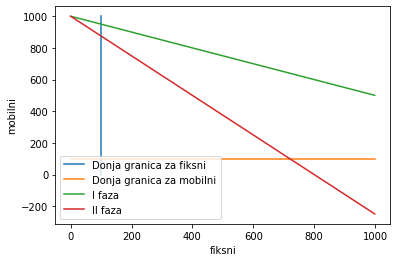
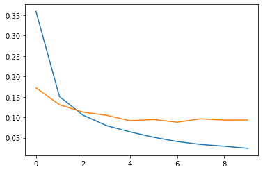

```python
import numpy as np
from numpy import linalg as LA
```

# Resavanje sistema
$Ax = b$  
$x = A^{-1}*b$  
$(A^T*A)^{-1}*A^T = A^{-1} * (A^{T})^{-1}*A^T = A^{-1}$  
$x = (A^T*A)^{-1}*A^T * b$


```python
A = np.array([[2,0], [-1,1], [0,2]])
b = np.array([2,0,-2])
```

### 1. nacin


```python
from numpy import linalg as LA
```


```python
x = LA.inv(A.T.dot(A)).dot(A.T).dot(b)
x
```


    array([ 0.66666667, -0.66666667])


### 2. nacin


```python
x, rss, _, _ = LA.lstsq(A, b, rcond=None)
x
```


    array([ 0.66666667, -0.66666667])


```python
rss
```


    array([2.66666667])


# Linearna regresija
$Aw = w_0 + w_1x = y$  
Sistem:  
$w_0 + w_1x_1 = y_1$  
$w_0 + w_1x_2 = y_2$  
$w_0 + w_1x_3 = y_3$  


```python
x = np.array([2, -1.22, 8.32, 4.23])
y = np.array([2.6, -1.7, 2.5, -1.6])
```


```python
ones = np.ones(4)
A = np.vstack((ones, x)).T

sol, rss, _, _ = LA.lstsq(A, y, rcond=None)
print('resenje ')
print(sol)

```

    resenje 
    [-0.60875222  0.31770509]


grafik


```python
from matplotlib import pyplot as plt
```


```python
xs = np.linspace(-5, 10, 100)
plt.plot(xs, sol[0] + sol[1]*xs)
# plt.plot(x, y, 'o')
plt.scatter(x,y)
```


    <matplotlib.collections.PathCollection at 0x7ff388429ca0>


```python
from sklearn import linear_model, model_selection,  preprocessing
import pandas as pd
```


```python
data = pd.read_csv('advertising.csv')
data.head()
```


<div>
<style scoped>
    .dataframe tbody tr th:only-of-type {
        vertical-align: middle;
    }

    .dataframe tbody tr th {
        vertical-align: top;
    }

    .dataframe thead th {
        text-align: right;
    }
</style>
<table border="1" class="dataframe">
  <thead>
    <tr style="text-align: right;">
      <th></th>
      <th>TV</th>
      <th>Radio</th>
      <th>Newspaper</th>
      <th>Sales</th>
    </tr>
  </thead>
  <tbody>
    <tr>
      <th>1</th>
      <td>230.1</td>
      <td>37.8</td>
      <td>69.2</td>
      <td>22.1</td>
    </tr>
    <tr>
      <th>2</th>
      <td>44.5</td>
      <td>39.3</td>
      <td>45.1</td>
      <td>10.4</td>
    </tr>
    <tr>
      <th>3</th>
      <td>17.2</td>
      <td>45.9</td>
      <td>69.3</td>
      <td>9.3</td>
    </tr>
    <tr>
      <th>4</th>
      <td>151.5</td>
      <td>41.3</td>
      <td>58.5</td>
      <td>18.5</td>
    </tr>
    <tr>
      <th>5</th>
      <td>180.8</td>
      <td>10.8</td>
      <td>58.4</td>
      <td>12.9</td>
    </tr>
  </tbody>
</table>
</div>


```python
tv = data['TV']
radio = data['Radio']
newspaper = data['Newspaper']
sales= data['Sales']
```


```python
plt.scatter(tv, sales)
```


    <matplotlib.collections.PathCollection at 0x7ff3255aabb0>


```python
X = data[['TV', 'Radio', 'Newspaper']]
X_train, X_test, Y_train, Y_test = model_selection.train_test_split(X, sales, test_size=0.3, random_state=17)
```


```python
model = linear_model.LinearRegression()
scaler = preprocessing.StandardScaler()

model.fit(X_train, Y_train)
```


    LinearRegression()


```python
model.intercept_
```


    3.064988997683665


```python
model.coef_
```


    array([ 0.04490671,  0.19545871, -0.00425482])


$3.064 + 0.045*TV + 0.195*Radio - 0.004*Newspaper$


```python
from sklearn import metrics
```


```python
y_predicted = model.predict(X_test)
mse = metrics.mean_squared_error(Y_test, y_predicted)
print("mse = ", mse)
mae = metrics.mean_absolute_error(Y_test, y_predicted)
print("mae = ", mae)
r2 = metrics.r2_score(Y_test, y_predicted)
print("r2 =" ,r2) # zelimo sto blize 1
```

    mse =  3.6841693521749455
    mae =  1.2750532458711015
    r2 = 0.8375469513486385


# Fazi logika


```python
class FuzzyInput():
    def __init__(self, name, xs, ys, x0):
        self.name = name
        self.points = list(zip(xs, ys))
        self.mu = self.calcMu(x0)
    
    def calcMu(self, x0):
        if x0 < self.points[0][0]: # ako je x0 pre prvog u nizu onda y prvog
            return self.points[0][1]
        elif x0 > self.points[-1][0]: # ako je x0 posle poslednjeg u nizu, onda y poslednjeg
            return self.points[1][1]
        # x0 izmedju prvog i poslednjeg
        for i in range(len(self.points)-1):
            x1 = self.points[i][0]
            x2 = self.points[i+1][0]            
            if x0 >= x1 and x0 < x2: # ako je x0 izmedju ove dve tacke
                y1 = self.points[i][1]                
                y2 = self.points[i+1][1]
                if y1==y2:
                    return y1
                elif y1<y2:
                    return (x0-x1)/(x2-x1)
                else:
                    return (x2-x0)/(x2-x1)
```


```python
class FuzzyOutput:
    def __init__(self, name, xs, ys):
        self.name = name
        self.xs = xs
        self.ys = ys
        self.mu = 0
        self.c = 0
        n = 0
        for x, y in zip(xs, ys):
            if y == 1:
                self.c += x
                n += 1
        self.c /= n
```


```python
from enum import Enum, unique

@unique
class Logic(Enum):
    OR=0
    AND=1
```


```python
class Rule:
    def __init__(self, fi1, fi2, fo, logic):
        self.fuzzyInput1 = fi1
        self.fuzzyInput2 = fi2        
        self.fuzzyOutput = fo
        if logic == Logic.OR:
            self.fuzzyOutput.mu = max(self.fuzzyOutput.mu, max(self.fuzzyInput1.mu, self.fuzzyInput2.mu))
        if logic == Logic.AND:            
            self.fuzzyOutput.mu = max(self.fuzzyOutput.mu, min(self.fuzzyInput1.mu, self.fuzzyInput2.mu))
```

1. $\mu_{malaPotrosnja}\ \& \ \mu_{visokaPouzdanost} => \mu_{velikaVrednost}$
1. $\mu_{malaPotrosnja}\ \& \ \mu_{niskaPouzdanost} => \mu_{srednjaVrednsot}$
1. $\mu_{srednjaPotrosnja}\ \& \ \mu_{visokaPouzdanost} => \mu_{srednjaVrednost}$
1. $\mu_{srednjaPotrosnja}\ \& \ \mu_{niskaPouzdanost} => \mu_{srednjaVrednost}$
1. $\mu_{velikaPotrosnja}\ \& \ \mu_{visokaPouzdanost} => \mu_{srednjaVrednost}$
1. $\mu_{velikaPotrosnja}\ \& \ \mu_{niskaPouzdanost} => \mu_{malaVrednost}$


```python
po = []
po.append(FuzzyInput("mala", [3,10], [1,0], 9))
po.append(FuzzyInput("srednja", [7,10,12,15], [0,1,1,0], 9))
po.append(FuzzyInput("velika", [12,15], [0,1], 9))

pz = []
pz.append(FuzzyInput("visoka", [5,10], [1,0], 8))
pz.append(FuzzyInput("niska", [8,15], [0,1], 8))

vr = []
vr.append(FuzzyOutput("mala", [7,15], [1,0]))
vr.append(FuzzyOutput("srednja", [7,15,25,40], [0,1,1,0]))
vr.append(FuzzyOutput("velika", [25,40], [0,1]))

rules = []
rules.append(Rule(po[0], pz[0], vr[2], Logic.AND))
rules.append(Rule(po[0], pz[1], vr[1], Logic.AND))
rules.append(Rule(po[1], pz[0], vr[1], Logic.AND))
rules.append(Rule(po[1], pz[1], vr[1], Logic.AND))
rules.append(Rule(po[2], pz[0], vr[1], Logic.AND))
rules.append(Rule(po[2], pz[1], vr[0], Logic.AND))

```


```python
vr[2].mu
```


    0.14285714285714285


```python
plt.plot([0,3,10, 16], [1,1,0, 0], label = 'mala')
plt.plot([0,7,10,12,15,16], [0,0,1,1,0,0], label = 'srednja')
plt.plot( [0,12,15,16], [0,0,1,1], label = 'velika')
plt.plot([9],[0], 'o')
plt.title("Pouzdanost")
plt.legend()
```


    <matplotlib.legend.Legend at 0x7ff3841dd100>


```python
plt.plot([0, 7, 15], [1, 1, 0])
plt.plot([7,15,25,40], [0,1,1,0])
plt.plot([25,40,45], [0,1,1])
plt.title('vrednost')
plt.legend(['mala', 'srednja', 'velika'])
plt.plot([7],[1],'o')
plt.plot([40],[1],'o')
plt.plot([(15 + 25) / 2], [1], 'o')
plt.plot([25.26], [0], 'o')
```


    [<matplotlib.lines.Line2D at 0x7ff323459c40>]


# Optimizacija
    def localSearch():  
        solution = initialize()  
        currVal = calcSolutionValue(solution)  
        bestVal = currVal  
    
        while not stopCondition():
            newSolution = izmeni malo solution
            newValue = calculateSolutionValue(newSolution)
        
            if newValuelue < currVal:
                solution = newSolution
                currVal = newValue
                if newValue<bestVal:
                    bestVal = newValue
            else:
                nastavi sa starim solution
        return bestVal


```python
import random
```

## UFLP
Prost lokacijski problem  
$I$ korisnika  
$J$ resursa - lokacija za bolnice  
$c_{ij}$ - cna pridruzivanja korisnika i resursu j   
$f_j$ - cena uspstavljanja resursa j - izgranje bolnice j  
koje resurse izgrafiti da bude minimalna cena?
$$min( sum \ c_{ij} + sum \ f_{ij})$$
tj.
$$min( sum \ y_j*c_{ij} + sum \ x_{ij}*f_{ij})$$


```python
# da li je resenje zadovoljivo
# zadovoljivo je ako je izgradjena bar jedna bolnica
def isFeasible(solution):
    for res in solution:
        if res:
            return True
    return False
```


```python
def initialize(numResources):
    soluion = [random.random() < 0.25 for _ in range(numResources)]
    if not isFeasible(soluion):
        chosen = random.randrange(0, numResources)
        soluion[chosen] = True
    return soluion
```


```python
def calcSolutionValue(solution, cost, fixedCost):
    value = 0
    numUsers = len(cost)
    numRseources = len(fixedCost)
    used = [False for _ in range(numRseources)]
    for i in range(numUsers):
        minCost = float('inf')
        resouceUsed = -1
        for j in range(numRseources):
            if solution[j] and cost[i][j]<minCost:
                minCost = cost[i][j]
                resouceUsed = j
        value += minCost
        used[resouceUsed] = True
    for i in range(numRseources):
        if used[i]:
            value += fixedCost[i]
    return value
```


```python
def invert(solution):
    chosenResource = random.randrange(0, len(solution))
    solution[chosenResource] = not solution[chosenResource]
    if isFeasible(solution):
        return chosenResource
    else:
        solution[chosenResource] = not solution[chosenResource]
        return -1 # nije invertovano, vraca prvobitno
    # problem ako iskljucimo sve bolnice
```

## Lokalna pretraga
Radi pohlepno pa se zaglavljuje u lokalnim optmumima.


```python
def localSearch(cost, fixedCost, iters):  
    solution = initialize(len(fixedCost))  
    currVal = calcSolutionValue(solution, cost, fixedCost)  
    bestVal = currVal  
    
    for i in range(iters):
        resourceInverted = invert(solution)
        if resourceInverted == -1:
            continue
        newValue = calcSolutionValue(solution, cost, fixedCost)
        if newValue < currVal:
            currVal = newValue
        if newValue<bestVal: # ako je bolje nsatvaljamo s njim
            bestVal = newValue
        else: # inace se vratimo na staro
            solution[resourceInverted] = not solution[resourceInverted]
            
    return bestVal
```

## Simulirano kaljenje
Krecemo se ka boljem resenju ali nekad odemo u gore da bi izbegli zaglavljivanje.


```python
def simulatedAnneling(cost, fixedCost, iters):
    solution = initialize(len(fixedCost))  
    currVal = calcSolutionValue(solution, cost, fixedCost)  
    bestVal = currVal  
    
    for i in range(iters):
        resourceInverted = invert(solution)
        if resourceInverted == -1:
            continue
        newValue = calcSolutionValue(solution, cost, fixedCost)
        if newValue < currVal:
            currVal = newValue
            if newValue<bestVal: # ako je bolje nsatvaljamo s njim
                bestVal = newValue
        else: # i ako je re[enje losije sa malom verovatnocom nastavljamo sa losijim
            p = 1.0 / i**0.5
            q = random.uniform(0, 1)
            if p>q:
                currVal = newValue
            else:
                solution[resourceInverted] = not solution[resourceInverted]
            
    return bestVal
```

## VNS
VNS - Variable neighborhood Search - Pretraga Promenljivih okoloina Pretraga ide prvo lokalno, pa malo sire, pa jos malo sire  
RVNS - Reduced VNS   
  
    solution = initialize()  
    currVal = calculateSolutionsVal(Solution
    bestVal = currVal
    while not stop_condiditiona():  
            k = 1  
            while k <= k_max: // broj okolina  
                newSlutions = getNeighbour(solution, k)
                newVal  = calcValue(newSolution)
                if newVal < curVal:
                    curVal = newVal
                    solution = newSolution
                    break
                else:
                    k += 1 // prelazimo na sledecu okolinu, gledamo malo sire
      return bestVal
Iz okoline k-te usimamo random suseda, ne garantuje da je najbolji  
BVNS - Basic VNS, uzmi nekog rnadom, a onda nekim oblikom lokalne pretrage probaj da ga optimizujes newSoluton  
GVNS - Generalised VNS, optimizuj newSolution sa VNSom


```python
def getNeighbor(solution, k): # menjamo k RAZLICITIHH bitova
    indices = range(len(solution))
    toInvert = random.sample(indices, k)
    
    for index in toInvert:
        solution[index] = not solution[index]
    
    if isFeasible(solution):
        return True, toInvert
    else:
        return False, toInvert
```


```python
def restore(solution, inverted):
    for resource in inverted:
        solution[resource] = not solution[resource]
```


```python
def RVNS(cost, fixedCost, iters, max_k):
    # max_k - broj okolina, koliko se poicija menja
    solution = initialize(len(fixedCost))  
    currVal = calcSolutionValue(solution, cost, fixedCost)  
    bestVal = currVal  
    
    for i in range(iters):
        k=0
        while k <= max_k:
            success, inverted = getNeighbor(solution, k)
            if not success:
                restore(solution, inverted)
                continue
            newVal = calcSolutionValue(solution, cost, fixedCost)
            if newVal < currVal:
                currVal = newVal
                if newVal < bestVal:
                    bestVal = newVal
            else: # ako nije bolje vracamo se na staro i gledamo vecu okolinu
                k+=1
                restore(solution, inverted)
        
    return bestVal
```


```python
cost = [[1, 12, 3], [2, 7, 41], [19, 21, 7]]
fixedCost = [12, 11, 13]
```


```python
localSearch(cost, fixedCost, 100)
```


    34


```python
simulatedAnneling(cost, fixedCost, 100)
```


    34


```python
RVNS(cost, fixedCost, 10, 2)
```


    34


# Linearno programiranje
$min \ f$  
$g_i(x) \le b_i$  
Linearno programiranje ako su f i g linearne funkcije.  

$f(x)=cx = c_0x_0 + ... + c_nx_n$  
$g_i[x] = a_i x$  
Linearno programiranje je resavanje problema oblika:  
$min \ cx$  
$Ax \le b$  
x je vektor $R^n$ ili $Z^n$, u R je polinomijlano a u Z np tesko.

Proizvodjac mobilnih i fiksnih telefona zeli da poveca profit.  
fiksni - 12e  
mobilni - 20e  
x - broj fiksnih  
y - broj mobilnih  
$profit = x*12 + y*20$  
$y = (profit - 12*x)/20$  
Ogranicenja:  
I faza:  
fiksni - 0.2h  
mobilni- 0.4h  

II faza:  
fiksni - 0.5h  
mobilni- 0.4h  

I faza:
$0.2 * x + 0.4 * y <= 400$  
$y=(400-0.2x)/0.4$

II faza <= 490h:
$0.5 * x + 0.4 * y <= 490$       
$y=(490-0.5x)/0.4$


```python
plt.plot([100,100], [0, 1000], label="Donja granica za fiksni")
plt.plot([0,1000], [100, 100], label="Donja granica za mobilni")
x = np.arange(0, 1000)
y1 = (400-0.2*x)/0.4
plt.plot(x, y1, label="I faza")
y2 = (400-0.5*x)/0.4
plt.plot(x, y2, label="II faza")

plt.xlabel('fiksni')
plt.ylabel('mobilni')
plt.legend()
plt.show()
```





```python
from docplex.mp.model import Model
```


```python
model = Model(name='telefoni')
x = model.continuous_var(name="fiksni")
y = model.continuous_var(name="mobilni")
model.add_constraint(x>=100)
model.add_constraint(y>=100)
model.add_constraint(0.2*x+0.4*y <= 400)
model.add_constraint(0.5*x+0.4*y <= 490)
```


    docplex.mp.LinearConstraint[](0.500fiksni+0.400mobilni,LE,490)


```python
model.maximize(12*x+20*y)
```


```python
model.print_information()
```

    Model: telefoni
     - number of variables: 2
       - binary=0, integer=0, continuous=2
     - number of constraints: 4
       - linear=4
     - parameters: defaults
     - objective: maximize
     - problem type is: LP


```python
model.solve()
```


    docplex.mp.solution.SolveSolution(obj=20600,values={fiksni:300,mobilni:8..


```python
model.print_solution()
```

    objective: 20600.000
      fiksni=300.000
      mobilni=850.000


## UFLP linearnim programiranjem


```python
numUsers = len(cost)
numResources = len(fixedCost)
model = Model(name="uflp")
x = model.binary_var_matrix(numUsers, numResources, name='x') # x[i,j] - korisniku i je dodeljen resurs j
y = model.binary_var_list(numResources, name='y') # y[i]=True - uspostavljne je resurs
```


```python
for j in range(numResources):
    model.add_constraints([x[i,j] <= y[j] for i in range(numUsers)])
```


```python
# svakom korisniku se dodeljuje tacno 1 resurs
model.add_constraints([sum ([ x[i,j] for j in range(numResources) ]) == 1 for i in range(numUsers)])
```


    [docplex.mp.LinearConstraint[](x_0_0+x_0_1+x_0_2,EQ,1),
     docplex.mp.LinearConstraint[](x_1_0+x_1_1+x_1_2,EQ,1),
     docplex.mp.LinearConstraint[](x_2_0+x_2_1+x_2_2,EQ,1)]


```python
model.print_information()
```

    Model: uflp
     - number of variables: 12
       - binary=12, integer=0, continuous=0
     - number of constraints: 12
       - linear=12
     - parameters: defaults
     - objective: none
     - problem type is: MILP


```python
# cena veze svakog korisnika sa dodeljenim resursom
firstSum = sum( [ sum ([ x[i,j] * cost[i][j]  for j in range(numResources)]) for i in range(numUsers) ] )
```


```python
# cena uspostavljanja resursa
secondSum = sum([ y[i]*fixedCost[i] for i in range(numResources) ])
```


```python
model.minimize(firstSum + secondSum)
```


```python
model.print_information()
```

    Model: uflp
     - number of variables: 12
       - binary=12, integer=0, continuous=0
     - number of constraints: 12
       - linear=12
     - parameters: defaults
     - objective: minimize
     - problem type is: MILP


```python
solution = model.solve()
solution.display()
```

    solution for: uflp
    objective: 34
    x_0_0 = 1
    x_1_0 = 1
    x_2_0 = 1
    y_0 = 1


```python
model.print_solution()
```

    objective: 34
      x_0_0=1
      x_1_0=1
      x_2_0=1
      y_0=1


## SSCFLP
- Single Source Capacity
- opstiji problem od uflp, sa dovoljno velikim kapacitetom se svodi na uflp.

$s_j$ - kapacitet resursa, koliko je velika bolnica  
$d_i$ - potraznja korisnika i  
$y_j$ - resurs j nije uspostavljen  
$x_{ij}$ - i-ti korisnik je dodeljen j-tom resursu  
$$ min \ f = sum \ y_j*f_j + sum \ x_{ij}*c_{ij} $$
Ogranicenja>  
$sum\ x_{ij}\ po\ j = 1$ - korisnik je dodeljen tacno jednom resursu  
za uflp je $x_{ij} \le s_j*y_j$ za svako i j  
$sum_i x_{ij}*d_i \le s_j * y_j, \forall j$ - suma potraznje po svim korisnicima resursa j mora da bude manja od pacaiteta resursa j, taj resurs j mora da bude uspostavljne  
I+J ogranicenja


```python
d = [1 for _ in range(numUsers)] # potraznja
s = [1.5 for _ in range(numResources)] # kapacaitet, za 3 bi bio uflp
```


```python
model = Model(name='sscflp')
```


```python
x = model.binary_var_matrix(numUsers, numResources, name='x') 
y = model.binary_var_list(numResources, name='y') 
```


```python
for i in range(numUsers):
    model.add_constraint(sum( x[i,j] for j in range(numResources) ) == 1)
```


```python
for j in range(numResources):
    model.add_constraint(sum( x[i,j] * d[i] for i in range(numUsers)) <= s[j]*y[j])
```


```python
model.print_information()
```

    Model: sscflp
     - number of variables: 12
       - binary=12, integer=0, continuous=0
     - number of constraints: 6
       - linear=6
     - parameters: defaults
     - objective: none
     - problem type is: MILP


```python
firstSum = sum( [ sum ([ x[i,j] * cost[i][j]  for j in range(numResources)]) for i in range(numUsers) ] )
secondSum = sum([ y[i]*fixedCost[i] for i in range(numResources) ])
```


```python
model.minimize(firstSum+secondSum)
model.solve()
model.print_solution()
```

    objective: 51
      x_0_0=1
      x_1_1=1
      x_2_2=1
      y_0=1
      y_1=1
      y_2=1


## MSCFLP
- Multiple Source Capacity Facility Location Problem
- identicno prethodnom samo je x iz intervala [0,1] umesto bool
- ista ogranicenja


```python
d = [1 for _ in range(numUsers)] # potraznja
s = [1.5 for _ in range(numResources)] # kapacaitet, za 3 bi bio uflp
model = Model(name='mscflp')
x = model.continuous_var_matrix(numUsers, numResources, name='x') 
y = model.binary_var_list(numResources, name='y') 
```


```python
for i in range(numUsers):
    model.add_constraint(sum( x[i,j] for j in range(numResources) ) == 1)
for j in range(numResources):
    model.add_constraint(sum( x[i,j] * d[i] for i in range(numUsers)) <= s[j]*y[j])
```


```python
model.print_information()
```

    Model: mscflp
     - number of variables: 12
       - binary=3, integer=0, continuous=9
     - number of constraints: 6
       - linear=6
     - parameters: defaults
     - objective: none
     - problem type is: MILP


```python
firstSum = sum( [ sum ([ x[i,j] * cost[i][j]  for j in range(numResources)]) for i in range(numUsers) ] )
secondSum = sum([ y[i]*fixedCost[i] for i in range(numResources) ])
```


```python
model.minimize(firstSum + secondSum)
model.solve()
model.print_solution()
```

    objective: 36.000
      x_0_0=0.500
      x_0_2=0.500
      x_1_0=1.000
      x_2_2=1.000
      y_0=1
      y_2=1


# Scipy
- kao docplex sa ruznijom sinkatkosm

$min\ f(x_1, x_2) = 3x_1 + 4x_2$  
$x_1 + 2x_2 \le 14$  
$x_2 \le 3x_1$  
$x_1 - x_2 \le 2$

$min\ f = x*c$  
$A_{ub} x \le b_{ub}$  
$A_{eq} x = b_{eq}$


```python
from scipy import optimize as opt
```

### opt.linprog


```python
c = np.array([3,4])
A_ub = np.array([
    [1, 2], 
    [-3, 1], 
    [1, -1]])
b_ub = np.array([14,0,2])
opt.linprog(c=c, A_ub=A_ub, b_ub=b_ub)
# kada se doije broj na -11 to je prakticno 0
```


         con: array([], dtype=float64)
         fun: 3.4075110662706493e-10
     message: 'Optimization terminated successfully.'
         nit: 5
       slack: array([1.40000000e+01, 2.81844599e-10, 2.00000000e+00])
      status: 0
     success: True
           x: array([9.78753002e-11, 1.17813015e-11])


### opt.minimize
- minimizuje diferencijabilnu funkciju
- funkciji dajemo funkciju, pocetno tacku, metod optimizacije, opseg
- sa adekvatnim parametrima resava vcinu problema

$f(x,y) = 2xy + 2x - x^2 - y^2$  
$g1(x,y) = x^3 - y = 0$    
$g2(x,y) = y - 1 >= 0$ <=> $-y+1<=0$


```python
def f(x):
    # x = x[0]
    # y = x[1]
    return 2*x[0]*x[1] + 2*x[0] - x[0]**2 - x[1]**2
```


```python
c = [
    {
        'type': 'eq',
        'fun': lambda x: np.array(x[0]**3 - x[1]),
        'jac': lambda x: np.array([ 3*x[0]**2,  -1 ]) # jakobijan, [dx, dy]
    }, 
    {
        'type': 'ineq',
        'fun': lambda x: np.array(-x[1]+1),
        'jac': lambda x: np.array([ 0, -1]) # jakobijan, [dx, dy]
    }
]
```


```python
opt.minimize(f, x0=[1,3], constraints=c, method='SLSQP') # sequnetial list squarerd progrmming
```


         fun: -2.157569898958764e+291
         jac: array([-0.00000000e+000,  9.28992985e+145])
     message: 'Singular matrix E in LSQ subproblem'
        nfev: 111
         nit: 36
        njev: 36
      status: 5
     success: False
           x: array([-1.51473296e+051, -4.64496491e+145])


# Gradijentni spust
- gradijent - pravac najveceeg uspona
- kada trazimo minimum idemo suprotno pravcu gradijenta  
- velicina koraka moze da se menja, razliciti intenziteti alfa
- alpha - learning rate
- problem su platoi, kada je gradijet 0 u svim pravcima
- slab lokalni minimum - ako je u okolini sve vece ili jednako
- jak lokalni minimum - ako je u okolini sve strogo vece
- moze biti problem ako funkcija ima prekide

```
    x = x0  
    for i in range(iters):
        x_next = x - alpha * gradient(x)

        if abs(f(x_new) - f(x)) < eps:
            break

        x = x_new
```


```python
def gradient_descent(f, gradient, alpha, x0, eps, iters):
    x = x0
    for i in range(iters):
        x_new = x - alpha * gradient(x)
        if abs(f(x) - f(x_new)) < eps:
            break 
        x = x_new
    result = {}
    result['converged'] = i != iters
    result['num_iters'] = i
    result['x'] = x_new
    return result
```

$f(x,y) = 0.5 * (x^2 + 10y^2)$  
$f'_x (x,y) = x $  
$f'_y (x,y) = 10y $  
$x = x[0]$  
$y = x[1]$


```python
def f(x):
    return 0.5*(x[0]**2 + 10*x[1]**2)
```


```python
def gradient(x):
    return np.array([x[0], 10*x[1]])
```

Napomena: Koristiti np.array a ne python listu  
np.array([1,2])\*5 -> array([ 5, 10])  
[1,2]\*10 -> [1, 2, 1, 2, 1, 2, 1, 2, 1, 2, 1, 2, 1, 2, 1, 2, 1, 2, 1, 2]


```python
x0 = np.array([3,5])
eps = 0.001
iters = 1000
alpha = 0.1
gradient_descent(f, gradient, alpha, x0, eps, iters)
```


    {'converged': True, 'num_iters': 33, 'x': array([0.08343852, 0.        ])}


# Metod inercije
- inerciju mozemo da gledamo kao ubrzanje
- inercija nas vuce da nasatvimo kretanje u smeru u kom smo do tad isli
- inercija je generalno brza od gradijentnog spusta


```python
def momentum(f, gradient, alpha, x0, eps, iters, beta):
    x = x0
    d = 0
    for i in range(iters):
        d = beta * d + alpha*gradient(x)
        x_new = x - d
        if abs(f(x) - f(x_new)) < eps:
            break 
        x = x_new
    result = {}
    result['converged'] = i != iters
    result['num_iters'] = i
    result['x'] = x_new
    return result
```


```python
momentum(f, gradient, alpha, x0, eps, iters, beta=0.5)
```


    {'converged': True, 'num_iters': 16, 'x': array([ 0.00486534, -0.00709534])}


# Nesterov
- gledamo gradijent u tacki u koju cemo da se pomerimo


```python
def nesterov(f, gradient, alpha, x0, eps, iters, beta):
    x = x0
    d = 0
    for i in range(iters):
        d = beta * d + alpha*gradient(x - beta*d)
        x_new = x - d
        if abs(f(x) - f(x_new)) < eps:
            break 
        x = x_new
    result = {}
    result['converged'] = i != iters
    result['num_iters'] = i
    result['x'] = x_new
    return result
```


```python
nesterov(f, gradient, alpha, x0, eps, iters, beta=0.5)
```


    {'converged': True, 'num_iters': 16, 'x': array([0.04459388, 0.        ])}


# Adam
- adaptive momentum
- k-ti moment iz statistike $E(x^k)$
- adam racuna prvi i drugi momenat
- drugi moment gleda promenu gradijenta
 
$g = gradient(x,y)$  
$m = \beta_1 * m + (1 - \beta_1) * g$  
$v = \beta_2 * v + (1 - \beta_2) * g^2$  
$\hat m = m / (1-\beta_1^i)$  
$\hat v = v / (1-\beta_2^i)$
        
$x_{new} = x - \alpha * (\hat m / \sqrt{(\hat v) + \delta)} $
        


```python
def adam(f, gradient, alpha, x0, eps, iters, beta1, beta2, delta):
    x = x0
    m = 0
    v = 0
    
    for i in range(1, iters+1):
        g = gradient(x)
        m = beta1 * m + (1 - beta1) * g
        v = beta2 * v + (1 - beta2) * g**2
        
        m_hat = m / (1-beta1**i)
        v_hat = v / (1-beta2**i)
        
        x_new = x - alpha * (m_hat / (np.sqrt(v_hat) + delta)) # malo delta da ne bi delili nulom
        
        if abs(f(x) - f(x_new)) < eps:
            break 
        x = x_new
    result = {}
    result['converged'] = i != iters
    result['num_iters'] = i
    result['x'] = x_new
    return result
```


```python
adam(f, gradient, alpha, x0, eps, iters, 0.9, 0.999, 1e-7)
```


    {'converged': True, 'num_iters': 86, 'x': array([0.01802498, 0.00438169])}


# Branch and bound
- nalazi optimalno resenje problema kombinatorne optimizacije
- broj potencijalnih resenja eksponencijalan u odnosu na velicinu ulaza
- kada se stigne do nekog cvora pokreni bound koji ce naci gornju granicu rezultata
- za svaki cvor pamtimo najbolje resenje podstabla, tj koliko ukljucivanje nabolje solucije u podstablu poboljsava resenje
- ukoliko je trenutno najbolje resenje bolje od opcije da se u nekom podstablu izabere resenje, citavo stablo se moze zanemariti

## Problem ranca
- zelimo da ranac sadrzi najvcu vrednost a da se ne predje maksimalni kapacitet
- brute force - generistai $2^n$ kombinacija
- backtracking je poboljsanje
- np tezak problem
- u opstem slucaju potreban ekspnencijalan algoritam


```python
import queue
```


```python
class Node:
    def __init__(self, weight, value, level):
        self.weight = weight # ukuona tezina iduci od korena
        self.value = value # ukupna vrednost iduci od korena
        self.level = level # nivo u drvetu
        self.bound = 0 # najveca vredsnot za podstabla od trenutnog cvora
```


```python
class Item:
    def __init__(self, weight, value):
        self.weight = weight
        self.value = value 
    def __str__(self):
        return str(self.weight) + " " + str(self.value)
```


```python
def bound(u, items, knapsackCapacity):
    if u.weight >= knapsackCapacity: # u cvoru vise nego ranac moze da ponse
        return 0
    totalValue = u.value
    totalWeight= u.weight
    level = u.level + 1
    
    # dok ima namirnica za ubacivanje i dok god se ne predje kapacitet
    while level < len(items) and totalWeight + items[level].weight < knapsackCapacity:
        totalValue += items[level].value
        totalWeight += items[level].weight
        level += 1
        
    # dodamo deo namirnice ako treba, radi optimisticne procene
    if level < len(items):
        totalValue += items[level].value * (knapsackCapacity - totalWeight) / items[level].weight
    return totalValue
```


```python
def bnb(items, knapsackCapacity):
    items = sorted(items, key=lambda x : x.value/x.weight, reverse=True)

    Q = queue.Queue()
    node = Node(0,0,-1)
    Q.put(node)
    maxValue = 0
    
    while not Q.empty():
        u = Q.get()
        
        if u.level == len(items)-1:
            continue # dno stabla
        
        v_level = u.level + 1
        v = Node(level=v_level, 
                 weight=u.weight + items[v_level].weight, 
                 value=u.value + items[v_level].value)
        
        if v.weight<=knapsackCapacity and v.value>maxValue:
            maxValue = v.value
            
        v.bound = bound(v, items, knapsackCapacity)
        if v.bound > maxValue:
            Q.put(v)
        
        v = Node(level = u.level +1, weight = u.weight, value = u.value)
        v.bound = bound(v, items, knapsackCapacity)
        
        if v.bound > maxValue:
            Q.put(v)
    return maxValue
```


```python
items = [Item(2,40), Item(3.14, 50), Item(1.98, 100), Item(5,95), Item(3, 30)]
bnb(items, 10)
```


    235


# TODO
dame

# Genetski algoritmi
- population
- smenom generacija se dobija populacija koja je bolje prilagodjena okruzenju
- populacija je skup resenja
- jedinka u populaciji je jedno resenje
- jedinka je skup gena
- generacije se smenjuju dok se ne ispuni nieki uslov

```
    jedinka = resenje, kodirano 011000101101110101
    population = initialize()
    while not stop_condition():
        if elitism:
            u novu generaciju iskopiraj nekoliko najboljih jedinki
        
        izaberi jedinke za reproddukciju
        ukrstanje
        mutacija
```

- mutacija - slucajna promena nekih gena odredjene jedinke
- bez mutacije bi se zaglavili u lokalnom optimumu
- mutacija je lokalna pretraga oko pojedinacne jedinke
- selekcija - izbor jedinki za reprodukciju
    - ruletksa selekcija - prilagojdenjije jedinke imaju vece sanse da budu izabrane
    - turnirska selekcija - izaberu se neke jedinke pa se odvija turnir izmedju njih
- ukrstanje - ukrstanja gena roditelja da bi se dobile dve nove jedinke
- ukrstanje moze biti jednopoziciono, vispoziciono ili uniformno
- mala verovatnoca mutacije - prerana konverenija
- velika verovatnoca mutacije - pretrazivanje bez jasnog fokusa
- elitizam - najprilagodjenije jedinke idu direktno u narednu generaciju, da se ne bi izgubile neke dobre osobine ukrstanjem i mutacijom
- parametri mogu biti fiksni ili da se menjaju kroz generacije
- parametri u praksi:
    - verovatnoca mutacije - izmedju 0.005 i 0.01
    - verovatnoca ukstanja - izmedju 0.8 i 0.95
    - velicina populaije - izmedju 10 i 150 jedinki

## Primena na UFLP
- 100 jedinki
- svakao jedinka se kodira binarno, true na nekoj poziciji - resur je uspostavljn e
- pogodnost svake jedinke se izracunava ohlepno
- pocetna generacija se generise proizvoljno, verovatnoca uspostvaljanj resursa je 25%
- kriteijum zaustavljanja - maksimalno 500 iteracija
- turnirska selekcija - velicina turnira 6
- jednopoziciono ukrstanje
- verovatnoca mutacije 0.05
- elitisticki pristup - 30% jedinki sa najvecom funkcijom pogodnosti se prebacuje u narednu generaciju


```python
class Individual:
    def __init__(self, nUsers, nResoures, cost, fixedCost):
        self.code = []
        for i in range(nResoures):
            self.code.append(random.random() < 0.25)
        self.correctNonFeasible()
        self.fitness = self.fitnessFunction(cost, fixedCost)
        
    def __lt__(self, other): # implemenramo < zbog sortiranja
        return self.fitness < other.fitness
    
    # ako su sve nule jednu random postavimo na True
    def correctNonFeasible(self):
        nResoures = len(self.code)
        for i in range(nResoures):
            if self.code[i]:
                return
        i = random.randrange(nResoures)
        self.code[i] = True
        
    def fitnessFunction(self, cost, fixedCost):
        nUsers = len(cost)
        nResoures = len(fixedCost)
        value = 0.0
        used = [False] * nResoures
        for i in range(nUsers):
            min = float('inf')
            k = -1
            for j in range(nResoures):
                if self.code[j] and cost[i][j] < min:
                    min = cost[i][j]
                    k = j
            value += min
            used[k] = True
        for i in range(nResoures):
            if used[i]:
                value += fixedCost[i]
        self.code = used
        
        fitness = 1 / value # jer zelimo najveci fitnes, pa ovako transformisemo
        self.fitness = fitness
        return fitness 
    
    def isFeasible(self):
        for c in self.code:
            if c:
                return True
        return False
    
    def invert(self):
        randomResource = random.randrange(len(self.code))
        self.code[randomResource] = not self.code[randomResource]
        
        if self.isFeasible():
            return randomResource
        else:
            self.code[randomResource] = not self.code[randomResource]
            return -1
        
        return randomResource
```


```python
def selection(population):
    TOURNAMENT_SIZE = 6
    bestFitness = float('-inf')
    index = -1
    
    for i in range(TOURNAMENT_SIZE):
        randomIndividual = random.randrange(len(population))
        if population[randomIndividual].fitness > bestFitness:
            bestFitness = population[randomIndividual].fitness
            index = randomIndividual
    return index
```


```python
def crossover(parent1, parent2, child1, child2):
    nResources = len(parent1.code)
    i = random.randrange(nResources)
    
    child1.code[:i] = parent1.code[:i]
    child2.code[:i] = parent2.code[:i]
    
    child1.code[i:] = parent2.code[i:]
    child2.code[i:] = parent1.code[i:]
    
    child1.correctNonFeasible()
    child2.correctNonFeasible()
```


```python
def mutation(individual):
    MUTATION_PROBABILITY = 0.03
    nResources = len(individual.code)
    for i in range(nResources):
        if random.random() < MUTATION_PROBABILITY:
            individual.code[i] = not individual.code[i]
    individual.correctNonFeasible()
```


```python
POPULATION_SIZE = 10
NUM_GENERATIONS = 10
ELITISM_SIZE = POPULATION_SIZE // 5

population = [Individual(numUsers, numResources, cost, fixedCost) for _ in range(POPULATION_SIZE)]
newPopulation = [Individual(numUsers, numResources, cost, fixedCost) for _ in range(POPULATION_SIZE)] # isto stavimo random jedinke
    
for iteration in range(NUM_GENERATIONS):
#     population.sort(key= lambda x : x.fitness)
    population.sort(reverse=True) # koristim _lt_ iz klase
    newPopulation[:ELITISM_SIZE] = population[:ELITISM_SIZE]
    for j in range(ELITISM_SIZE, POPULATION_SIZE, 2): # idemo na svako drugo mesto
        parent1 = selection(population) # indeksi roditelja
        parent2 = selection(population)
        
        crossover(population[parent1], population[parent2], newPopulation[j], newPopulation[j+1])
        
        mutation(newPopulation[j])
        mutation(newPopulation[j+1])
        
        newPopulation[j].fitnessFunction(cost, fixedCost)
        newPopulation[j+1].fitnessFunction(cost, fixedCost)
    
    population = newPopulation
    
best = max(population)
print(f'Solution {best.code} {best.fitness} cost {1/best.fitness}')
```

    Solution [True, False, False] 0.029411764705882353 cost 34.0


# Mesavina genetskog algoritma i simuliranog kaljenja
- genetskim algoritmom nadjemo najbolju jedinku pa istrazimo njenu okolinu simuliranim kaljenjem
- simulirano kaljenje u par iteracija pokusava da malo popravi dobru jedinku


```python
def simulatedAneling2 (individual, iters, cost, fixedCost):
    for i in range(1, iters+1):
        inverted = individual.invert()
        if inverted<0:
            continue
        newFitness = individual.fitnessFunction(cost, fixedCost)
        if newFitness > individual.fitness:
            individual.fintess = newFitness
        else:
            p = 1.0 / i**0.5
            q = random.uniform(0,1)
            if p > q:
                individual.fintess = newFitness
            else:
                individual.code[inverted] = not individual.code[inverted]
```


```python
POPULATION_SIZE = 10
NUM_GENERATIONS = 10
ELITISM_SIZE = POPULATION_SIZE // 5

population = [Individual(numUsers, numResources, cost, fixedCost) for _ in range(POPULATION_SIZE)]
newPopulation = [Individual(numUsers, numResources, cost, fixedCost) for _ in range(POPULATION_SIZE)] # isto stavimo random jedinke
    
for iteration in range(NUM_GENERATIONS):
#     population.sort(key= lambda x : x.fitness)
    population.sort(reverse=True) # koristim _lt_ iz klase
    newPopulation[:ELITISM_SIZE] = population[:ELITISM_SIZE]
    for j in range(ELITISM_SIZE, POPULATION_SIZE, 2): # idemo na svako drugo mesto
        parent1 = selection(population) # indeksi roditelja
        parent2 = selection(population)
        
        crossover(population[parent1], population[parent2], newPopulation[j], newPopulation[j+1])
        
        mutation(newPopulation[j])
        mutation(newPopulation[j+1])
        
        newPopulation[j].fitnessFunction(cost, fixedCost)
        newPopulation[j+1].fitnessFunction(cost, fixedCost)
    
    simulatedAneling2(max(newPopulation), 10, cost, fixedCost) # u 10 iteracija pokusamo da poboljsamo najbolju jedinku
    population = newPopulation
    
best = max(population)
print(f'Solution {best.code} {best.fitness} cost {1/best.fitness}')
```

    Solution [True, False, False] 0.029411764705882353 cost 34.0


# Genetsko programiranje
- pravimo genetski algoritam koji pravi programe
- jedna jedinka je neki program
- kod: abstract syntax tree, ne mora da bude binarno i moze biti proizvoljno duboko
- selekcija - gledamo fitnes pa mozemo bilo koji nacin selekcije
- ukrstanje - menjamo podstabla roditelja, ne mozemo bas niske da ukrstamo
- mutacije - menjamo zavrsne cvorove - terminale

- mozemo da koristimo aritmeticke izraze kao unutrasnje cvorove, a brojeve kao listove
- zelimo da napravimo izraz cija je vrednost 100


```python
eval('(2+3)*7')
```


    35


```python
class Individual:
    def __init__(self, goal = 100, num_operators = 3, num_terminals = 4):
#         self.code = [op1, op2, op3, a, b, c, d]
#         self.code = ['+', '+', '+', 1, 2, 3, 4] # losa inicijalizacij, losa raznoslikost, uksrsanjem ne dobijamo nista
        self.num_operators = num_operators
        self.num_terminals = num_terminals
        self.goal = goal
    
        self.code = []
        for i in range(num_operators):
            self.code.append(self.randomOperator())
        for i in range(num_terminals):
            self.code.append(self.randomTerminal())
        
        self.fitness = self.calcFitness()
       
    def __lt__(self, other):
        return self.fitness < other.fitness
    
    def calcFitness(self):
        value = eval(str(self))
        cost = abs(self.goal-value)
        return -cost
    # 100 - 19 -> 81
    # 100 - 90 -> 10  -  bolji fitnes, 
    # obruto je evolutivno, mozemo da trazimo minimalan fitnes, a da ne menajmo ovo
    # ili da ovakav fitnes transormisemo nekako
    # mzoemo negatvno da gledamo, malo ruzno ali resava
    
    def __str__(self):
        a = str(self.code[3])
        b = str(self.code[4])
        c = str(self.code[5])
        d = str(self.code[6])
        
        op1 = self.code[0]
        op2 = self.code[1]
        op3 = self.code[2]
    
        first = '(' + a +' ' + op2 +' ' + b + ')'
        second = '(' +' ' + c + op3 + ' ' + d + ')'
        return first +' ' + op1 + ' ' + second
    
    def randomOperator(self):
        operators = ['+', '-', '*'] # / pravi problem jer moda dobijemo deljenje nulom
        return random.choice(operators)
    
    def randomTerminal(self, lb=-10, ub=10):
        return random.randrange(lb, ub+1) # jer eandragen uzima [lu, ub)
```


```python
def getSubtree(root_index, subtree_indices, total_num_nodes = 7):
# radi i za potpuno stablo vece dubine
    if root_index < total_num_nodes:
        subtree_indices.append(root_index)
        getSubtree(root_index*2 + 1, subtree_indices, total_num_nodes)
        getSubtree(root_index*2 + 2, subtree_indices, total_num_nodes)
```


```python
def selection(population):
    TOURNAMENT_SIZE = 5
    choosen = random.sample(population, TOURNAMENT_SIZE)
    return max(choosen)
```


```python
def crossover(parent1, parent2, child1, child2):
    root_index = random.randrange(1, len(parent1.code)) # nema smisla da menjamo koren jer onda samo zamenimo mesta jedinkama
    subtree_indices = []
    getSubtree(root_index, subtree_indices)
    for i in range(len(parent1.code)):
        if i in subtree_indices:
            child1.code[i] = parent2.code[i]
            child2.code[i] = parent1.code[i]
        else:
            child1.code[i] = parent1.code[i]
            child2.code[i] = parent2.code[i]
```


```python
def mutation(individual):
    MUTATION_PROB = 0.5
    for i in range(len(individual.code)):
        if random.random() < MUTATION_PROB:
            if i < individual.num_operators:
                individual.code[i] = individual.randomOperator()
            else:
                individual.code[i] = individual.randomTerminal(lb=individual.code[i]-10, 
                                                               ub=individual.code[i]+10) # dozvolimo da ide van intervala
```


```python
POP_SIZE = 100
NUM_GENERATIONS = 2000
ELITISM_SIZE = POP_SIZE // 3

if ELITISM_SIZE%2 == 1:
    ELITISM_SIZE-= 1

population = [Individual(goal=289) for _ in range(POP_SIZE)]
newPopulation = [Individual(goal=289) for _ in range(POP_SIZE)]

for i in range(NUM_GENERATIONS):
    population.sort(reverse=True)
    
    if population[0].fitness == 0:
        break
    
    newPopulation[:ELITISM_SIZE] = population[:ELITISM_SIZE]
    for j in range(ELITISM_SIZE, POP_SIZE, 2):
        parent1 = selection(population)
        parent2 = selection(population)
        
        crossover(parent1, parent2, newPopulation[j], newPopulation[j+1])
        
        mutation(newPopulation[j])
        mutation(newPopulation[j+1])
        
        newPopulation[j].fitness = newPopulation[j].calcFitness();
        newPopulation[j+1].fitness = newPopulation[j+1].calcFitness();
        
    population = newPopulation

best = max(population)
print(best)
print(best.fitness)
```

    (-10 * -27) + ( 14- -5)
    0


```python
lst = [1,2,3]
lst.sort(reverse=True)
lst
```


    [3, 2, 1]


# PSO
- parical swarn optimization
- optimizuje se grupa cestica
- inteligencija roja, insekata, mrava
- npr ptice traze hranu, jedna nadje pa dovikne ostalima, trazi se globalni minimim tj najveci izvor hrane,a loklani je manji izvor hran
- svaka ptia je cestica i trazi svoje najbolje resenje
- tri sile vuku jednu jedinku:
    - intercija $c_i$, vuce u smeru do tadasnjeg kretanja
    - lokalno najbolji $c_l$, moje lokalno najbolje a nadam se da je u okolini jos bolje
    - globalno najbolji $c_g$ - informacija o najboljem u celom jatu
- sva sila vuce na svoju stranu nekim intenzitetom, a ptica se krece u pravcu zbirnog vektora

```
    swarn = [Particle() ...]
    while not stop_condidtion():
        for particle in swarn:
            r_l, r_g ~ u[0,1]
            v = c_i * inercija + r_l * c_l * lokalno + r_g * c_g * globalno # nova brzina
            p = p + c  # nova pozicija
```

- bolje radi u kontiinualnoj reprezentaciji, ali radi i za diskretnu, ali se mora paziti da ne upadne u nevalidno stanje
- bounds = [(lbx, ubx), (lby, uby)...] - niz taploca gornje i donje granice za svaku koordinatu
- test functions for optimization - komplikovane
- Rastrigin function - odlicna kada je puno minimuma i maksimuma
- Rosenbergova funkcija - odlicna za tst gradijentnog spusta, plato
- najveca brzina je sirina intervala ub-lb


```python
bounds = [(-5.12, 5.12), (-5.12, 5.12)]
```


```python
class Particle:
    globalBestPosition = None
    globalBestValue = None
    
    def __init__(self, bounds, obj_func, c_i, c_l, c_g):
        self.position = np.array([random.uniform(bound[0], bound[1]) for bound in bounds])
        self.velocity = np.array([random.uniform(-(bound[1]-bound[0]), bound[1]-bound[0]) for bound in bounds])
        self.bestPosition = np.array(self.position)
        self.currValue = obj_func(self.position)
        self.bestValue = self.currValue
        
        if Particle.globalBestValue is None or self.currValue < Particle.globalBestValue:
            Particle.globalBestPosition = self.position.copy()
            Particle.globalBestValue = self.currValue
        
        self.bounds = bounds
        self.obj_func = obj_func
        
        self.c_i = c_i        
        self.c_l = c_l        
        self.c_g = c_g
        
    def update_position(self):
        lower_bounds = np.array([x[0] for x in self.bounds])
        upper_bounds = np.array([x[1] for x in self.bounds])        
        self.position = np.clip(self.position + self.velocity, lower_bounds, upper_bounds)
        
        self.currValue = self.obj_func(self.position)
        if self.bestValue > self.currValue:
            self.bestValue = self.currValue
            self.bestPosition = self.position.copy()
            
            if Particle.globalBestValue > self.bestValue:
                Particle.globalBestValue = self.bestValue
                Particle.globalBestPosition = self.bestPosition.copy()
                
    def update_velocity(self):
        r_l = np.random.random(self.velocity.shape)
        r_g = np.random.random(self.velocity.shape)
        self.velocity = (self.c_i*self.velocity +
                        r_l * self.c_l * (self.bestPosition - self.position) +
                        r_g * self.c_g * (Particle.globalBestPosition - self.position))
```


```python
def rastrigin(x):
    A = 10
    n = len(x)
    return A*n + sum(xi**2 - A*np.cos(2*np.pi*xi) for xi in x)
```


```python
def rosenbrock(x):
    a = 1
    b = 100
    return (a-x[0])**2 + b*(x[1]-x[0]**2)**2
```


```python
SWARM_SIZE = 50
MAX_ITER = 200

Particle.globalBestPosition = None
Particle.globalBestValue = None

# swarm = [Particle(bounds, rastrigin, 0.75, 1.0, 1.0) for _ in range(SWARM_SIZE)]
swarm = [Particle(bounds, rosenbrock, 0.75, 1.0, 1.0) for _ in range(SWARM_SIZE)]

best_values = []

for i in range(MAX_ITER):
    for particle in swarm:
        particle.update_position()
        particle.update_velocity()
    best_values.append(Particle.globalBestValue)
print("Solution " + str(Particle.globalBestPosition))
print("Value " + str(Particle.globalBestValue))
plt.plot(range(MAX_ITER), best_values)
```

    Solution [1.00000028 1.0000006 ]
    Value 2.356233803041838e-13


    [<matplotlib.lines.Line2D at 0x7ff33e2bb880>]


# Neuronske mreze
- FCNN - Fully Connected Neural Networks, potpuno povezane neuronske mreze
- svi izlazi jednog sloja se proslede ulazu narednog sloja
- svaka grana koja povezuje neurone ima neku tezinu $w_i$
- u jednom neuronu imamo n ulaza $x_1, x_2, ... , x_n$
- neuron $w_1*x_1 + w_2*x_2 + ... + w_n*x_n$ - linearna kombinacija/skalarni proizvod vektora tezine i ulaza
- na ovo se primenjuje aktivaciona funkcija $g(w*x)+b$
- svki neuron ima dodatni ulaz 1, slbodni clan b
- Aktivacione funkcije
    - sigmoidna
    - relu
    - tangens hiperolicki
    - nelinearne
    - relu(x) = max(0, x)
    - leakyRelu nije bas 0, nego ima neki nagib
- Svaki sloj
    - slozi w po vrstama, vektor tezine - matrica W
    - da bi dobili skalarni proizvod odmah za ceo sloj predstavimo c kao vektor i mnozimo sa matricom
    - +b slobodni clan
    - g(Wx+b)
    - matricu tezina pomnozimo ulazom, doda se vektor tezina i na to se prmeni nelinearna funkcija
    - $h_1 = g(W_1x_1 + b1)$    
    - $h_2 = g(W_2h_1 + b1) = g(W_2*g(W_1x_1 + b1) + b1)$
    - ...
    - $h_1 = g(W_i*h_{i-1} + b_i)$
    - cela mreza je kompozicija nelinearnih funkcija
    
- ovo moze da se koristi za klasifikaciju, podesimo tezine da nam se za odgovarajuce ulaze daje odgovor da ili ne
- podesavanje tezine $\leftrightarrow$ treniranje neuronske mreze
- minimizujemo funkciju greske po parametrima
- adam je varijanta gradijentnog spusta
- back propagatoion - algoitam koji racun grdijene
- poslednji sloj moze da ima jedan neuron a da aktivaciona funkcija bude sigmoidna, sve manje od 0.5 da bude _ne_ a sve vece _da_


```python
from sklearn import datasets
```


```python
data = datasets.load_breast_cancer()
```


```python
data.feature_names
```


    array(['mean radius', 'mean texture', 'mean perimeter', 'mean area',
           'mean smoothness', 'mean compactness', 'mean concavity',
           'mean concave points', 'mean symmetry', 'mean fractal dimension',
           'radius error', 'texture error', 'perimeter error', 'area error',
           'smoothness error', 'compactness error', 'concavity error',
           'concave points error', 'symmetry error',
           'fractal dimension error', 'worst radius', 'worst texture',
           'worst perimeter', 'worst area', 'worst smoothness',
           'worst compactness', 'worst concavity', 'worst concave points',
           'worst symmetry', 'worst fractal dimension'], dtype='<U23')


```python
data.data.shape
```


    (569, 30)


```python
len(data.feature_names)
```


    30


```python
data.target
```


    array([0, 0, 0, 0, 0, 0, 0, 0, 0, 0, 0, 0, 0, 0, 0, 0, 0, 0, 0, 1, 1, 1,
           0, 0, 0, 0, 0, 0, 0, 0, 0, 0, 0, 0, 0, 0, 0, 1, 0, 0, 0, 0, 0, 0,
           0, 0, 1, 0, 1, 1, 1, 1, 1, 0, 0, 1, 0, 0, 1, 1, 1, 1, 0, 1, 0, 0,
           1, 1, 1, 1, 0, 1, 0, 0, 1, 0, 1, 0, 0, 1, 1, 1, 0, 0, 1, 0, 0, 0,
           1, 1, 1, 0, 1, 1, 0, 0, 1, 1, 1, 0, 0, 1, 1, 1, 1, 0, 1, 1, 0, 1,
           1, 1, 1, 1, 1, 1, 1, 0, 0, 0, 1, 0, 0, 1, 1, 1, 0, 0, 1, 0, 1, 0,
           0, 1, 0, 0, 1, 1, 0, 1, 1, 0, 1, 1, 1, 1, 0, 1, 1, 1, 1, 1, 1, 1,
           1, 1, 0, 1, 1, 1, 1, 0, 0, 1, 0, 1, 1, 0, 0, 1, 1, 0, 0, 1, 1, 1,
           1, 0, 1, 1, 0, 0, 0, 1, 0, 1, 0, 1, 1, 1, 0, 1, 1, 0, 0, 1, 0, 0,
           0, 0, 1, 0, 0, 0, 1, 0, 1, 0, 1, 1, 0, 1, 0, 0, 0, 0, 1, 1, 0, 0,
           1, 1, 1, 0, 1, 1, 1, 1, 1, 0, 0, 1, 1, 0, 1, 1, 0, 0, 1, 0, 1, 1,
           1, 1, 0, 1, 1, 1, 1, 1, 0, 1, 0, 0, 0, 0, 0, 0, 0, 0, 0, 0, 0, 0,
           0, 0, 1, 1, 1, 1, 1, 1, 0, 1, 0, 1, 1, 0, 1, 1, 0, 1, 0, 0, 1, 1,
           1, 1, 1, 1, 1, 1, 1, 1, 1, 1, 1, 0, 1, 1, 0, 1, 0, 1, 1, 1, 1, 1,
           1, 1, 1, 1, 1, 1, 1, 1, 1, 0, 1, 1, 1, 0, 1, 0, 1, 1, 1, 1, 0, 0,
           0, 1, 1, 1, 1, 0, 1, 0, 1, 0, 1, 1, 1, 0, 1, 1, 1, 1, 1, 1, 1, 0,
           0, 0, 1, 1, 1, 1, 1, 1, 1, 1, 1, 1, 1, 0, 0, 1, 0, 0, 0, 1, 0, 0,
           1, 1, 1, 1, 1, 0, 1, 1, 1, 1, 1, 0, 1, 1, 1, 0, 1, 1, 0, 0, 1, 1,
           1, 1, 1, 1, 0, 1, 1, 1, 1, 1, 1, 1, 0, 1, 1, 1, 1, 1, 0, 1, 1, 0,
           1, 1, 1, 1, 1, 1, 1, 1, 1, 1, 1, 1, 0, 1, 0, 0, 1, 0, 1, 1, 1, 1,
           1, 0, 1, 1, 0, 1, 0, 1, 1, 0, 1, 0, 1, 1, 1, 1, 1, 1, 1, 1, 0, 0,
           1, 1, 1, 1, 1, 1, 0, 1, 1, 1, 1, 1, 1, 1, 1, 1, 1, 0, 1, 1, 1, 1,
           1, 1, 1, 0, 1, 0, 1, 1, 0, 1, 1, 1, 1, 1, 0, 0, 1, 0, 1, 0, 1, 1,
           1, 1, 1, 0, 1, 1, 0, 1, 0, 1, 0, 0, 1, 1, 1, 0, 1, 1, 1, 1, 1, 1,
           1, 1, 1, 1, 1, 0, 1, 0, 0, 1, 1, 1, 1, 1, 1, 1, 1, 1, 1, 1, 1, 1,
           1, 1, 1, 1, 1, 1, 1, 1, 1, 1, 1, 1, 0, 0, 0, 0, 0, 0, 1])


```python
data.target.shape
```


    (569,)


```python
x = data.data
y = data.target
```


```python
from sklearn.model_selection import train_test_split
```


```python
x_train, x_test, y_train, y_test = train_test_split(x, y, test_size=0.3, random_state=123, stratify=y)
```


```python
x_train.shape
```


    (398, 30)


```python
y_train.shape
```


    (398,)


```python
x_train[0]
```


    array([1.299e+01, 1.423e+01, 8.408e+01, 5.143e+02, 9.462e-02, 9.965e-02,
           3.738e-02, 2.098e-02, 1.652e-01, 7.238e-02, 1.814e-01, 6.412e-01,
           9.219e-01, 1.441e+01, 5.231e-03, 2.305e-02, 3.113e-02, 7.315e-03,
           1.639e-02, 5.701e-03, 1.372e+01, 1.691e+01, 8.738e+01, 5.760e+02,
           1.142e-01, 1.975e-01, 1.450e-01, 5.850e-02, 2.432e-01, 1.009e-01])


```python
from sklearn.preprocessing import StandardScaler
```


```python
scaler = StandardScaler()
scaler.fit(x_train)
x_train_tr = scaler.transform(x_train)
x_test_tr = scaler.transform(x_test)
```


```python
x_train_tr[0]
```


    array([-0.32429881, -1.15003767, -0.32535806, -0.39922626, -0.11821685,
           -0.07701115, -0.65482488, -0.73036996, -0.56187199,  1.2723845 ,
           -0.77917122, -1.031772  , -0.92191029, -0.53533519, -0.61481545,
           -0.13138235, -0.03907495, -0.74175781, -0.51696191,  0.64582948,
           -0.5278475 , -1.41291056, -0.59099941, -0.53390993, -0.79622477,
           -0.36263373, -0.62895927, -0.86662682, -0.76393673,  0.89012251])


```python
from tensorflow.keras.models import Sequential
from tensorflow.keras.layers import Dense
```


```python
model = Sequential()
# dim - duzina jedne instance
# units - broj neurona
model.add(Dense(input_dim=x_train_tr.shape[1], units=100, activation='relu'))
model.add(Dense(units=40, activation='relu'))
model.add(Dense(units=1, activation='sigmoid'))

model.summary()
```

    Model: "sequential"
    _________________________________________________________________
    Layer (type)                 Output Shape              Param #   
    =================================================================
    dense (Dense)                (None, 100)               3100      
    _________________________________________________________________
    dense_1 (Dense)              (None, 40)                4040      
    _________________________________________________________________
    dense_2 (Dense)              (None, 1)                 41        
    =================================================================
    Total params: 7,181
    Trainable params: 7,181
    Non-trainable params: 0
    _________________________________________________________________


```python
model.compile(optimizer='adam', loss='binary_crossentropy', metrics=['accuracy'])
```


```python
history = model.fit(x_train_tr, y_train, batch_size=64, epochs=20, verbose=1, validation_split=0.2)
```

    Epoch 1/20
    5/5 [==============================] - 1s 54ms/step - loss: 0.7250 - accuracy: 0.4654 - val_loss: 0.6235 - val_accuracy: 0.7500
    Epoch 2/20
    5/5 [==============================] - 0s 12ms/step - loss: 0.5349 - accuracy: 0.8648 - val_loss: 0.4650 - val_accuracy: 0.9250
    Epoch 3/20
    5/5 [==============================] - 0s 10ms/step - loss: 0.4104 - accuracy: 0.9465 - val_loss: 0.3496 - val_accuracy: 0.9625
    Epoch 4/20
    5/5 [==============================] - 0s 12ms/step - loss: 0.3196 - accuracy: 0.9465 - val_loss: 0.2599 - val_accuracy: 0.9750
    Epoch 5/20
    5/5 [==============================] - 0s 11ms/step - loss: 0.2500 - accuracy: 0.9497 - val_loss: 0.1932 - val_accuracy: 0.9750
    Epoch 6/20
    5/5 [==============================] - 0s 9ms/step - loss: 0.2019 - accuracy: 0.9465 - val_loss: 0.1452 - val_accuracy: 0.9750
    Epoch 7/20
    5/5 [==============================] - 0s 9ms/step - loss: 0.1693 - accuracy: 0.9465 - val_loss: 0.1137 - val_accuracy: 0.9750
    Epoch 8/20
    5/5 [==============================] - 0s 10ms/step - loss: 0.1473 - accuracy: 0.9528 - val_loss: 0.0923 - val_accuracy: 0.9750
    Epoch 9/20
    5/5 [==============================] - 0s 8ms/step - loss: 0.1302 - accuracy: 0.9623 - val_loss: 0.0780 - val_accuracy: 0.9750
    Epoch 10/20
    5/5 [==============================] - 0s 9ms/step - loss: 0.1192 - accuracy: 0.9686 - val_loss: 0.0682 - val_accuracy: 0.9750
    Epoch 11/20
    5/5 [==============================] - 0s 9ms/step - loss: 0.1100 - accuracy: 0.9748 - val_loss: 0.0604 - val_accuracy: 0.9750
    Epoch 12/20
    5/5 [==============================] - 0s 9ms/step - loss: 0.1028 - accuracy: 0.9748 - val_loss: 0.0543 - val_accuracy: 0.9750
    Epoch 13/20
    5/5 [==============================] - 0s 11ms/step - loss: 0.0971 - accuracy: 0.9780 - val_loss: 0.0496 - val_accuracy: 0.9750
    Epoch 14/20
    5/5 [==============================] - 0s 8ms/step - loss: 0.0926 - accuracy: 0.9780 - val_loss: 0.0468 - val_accuracy: 0.9875
    Epoch 15/20
    5/5 [==============================] - 0s 12ms/step - loss: 0.0887 - accuracy: 0.9748 - val_loss: 0.0432 - val_accuracy: 0.9875
    Epoch 16/20
    5/5 [==============================] - 0s 9ms/step - loss: 0.0850 - accuracy: 0.9748 - val_loss: 0.0402 - val_accuracy: 0.9875
    Epoch 17/20
    5/5 [==============================] - 0s 9ms/step - loss: 0.0819 - accuracy: 0.9811 - val_loss: 0.0373 - val_accuracy: 0.9875
    Epoch 18/20
    5/5 [==============================] - 0s 9ms/step - loss: 0.0789 - accuracy: 0.9811 - val_loss: 0.0352 - val_accuracy: 0.9875
    Epoch 19/20
    5/5 [==============================] - 0s 11ms/step - loss: 0.0760 - accuracy: 0.9811 - val_loss: 0.0334 - val_accuracy: 0.9875
    Epoch 20/20
    5/5 [==============================] - 0s 11ms/step - loss: 0.0734 - accuracy: 0.9843 - val_loss: 0.0315 - val_accuracy: 0.9875


```python
epochs = history.epoch
plt.plot(epochs, history.history['loss'])
plt.plot(epochs, history.history['val_loss'])
```


    [<matplotlib.lines.Line2D at 0x7ff2d05f8c40>]


```python
plt.plot(epochs, history.history['accuracy'])
plt.plot(epochs, history.history['val_accuracy'])
```


    [<matplotlib.lines.Line2D at 0x7ff2d05e3220>]


```python
model.evaluate(x_test, y_test, batch_size=64)
```

    3/3 [==============================] - 0s 3ms/step - loss: 629.3569 - accuracy: 0.3743


    [629.35693359375, 0.3742690086364746]


## Boston_housing


```python
from keras.datasets import boston_housing
```


```python
(x_train, y_train), (x_test, y_test) = boston_housing.load_data()
```


```python
x_train.shape
```


    (404, 13)


```python
x_test.shape
```


    (102, 13)


```python
x_train[0]
```


    array([  1.23247,   0.     ,   8.14   ,   0.     ,   0.538  ,   6.142  ,
            91.7    ,   3.9769 ,   4.     , 307.     ,  21.     , 396.9    ,
            18.72   ])


```python
scaler = StandardScaler()
scaler.fit(x_train)
x_train_tr = scaler.transform(x_train)
x_test_tr = scaler.transform(x_test)
```


```python
model = Sequential()
model.add(Dense(input_dim=x_train_tr.shape[1], units=100, activation='relu'))
model.add(Dense(units=1))
model.summary()
```

    Model: "sequential_1"
    _________________________________________________________________
    Layer (type)                 Output Shape              Param #   
    =================================================================
    dense_3 (Dense)              (None, 100)               1400      
    _________________________________________________________________
    dense_4 (Dense)              (None, 1)                 101       
    =================================================================
    Total params: 1,501
    Trainable params: 1,501
    Non-trainable params: 0
    _________________________________________________________________


```python
model.compile(optimizer='adam', loss='mse', metrics=['mae'])
history = model.fit(x_train_tr, y_train, batch_size=128, epochs=100, validation_split=0.2)
```

    Epoch 1/100
    3/3 [==============================] - 1s 122ms/step - loss: 571.2356 - mae: 22.0642 - val_loss: 640.2754 - val_mae: 23.5524
    Epoch 2/100
    3/3 [==============================] - 0s 22ms/step - loss: 565.0660 - mae: 21.9297 - val_loss: 634.0035 - val_mae: 23.4215
    Epoch 3/100
    3/3 [==============================] - 0s 20ms/step - loss: 558.9838 - mae: 21.7955 - val_loss: 627.7205 - val_mae: 23.2903
    Epoch 4/100
    3/3 [==============================] - 0s 20ms/step - loss: 552.9808 - mae: 21.6609 - val_loss: 621.4428 - val_mae: 23.1587
    Epoch 5/100
    3/3 [==============================] - 0s 21ms/step - loss: 547.0037 - mae: 21.5268 - val_loss: 615.1355 - val_mae: 23.0257
    Epoch 6/100
    3/3 [==============================] - 0s 19ms/step - loss: 540.9737 - mae: 21.3914 - val_loss: 608.8189 - val_mae: 22.8915
    Epoch 7/100
    3/3 [==============================] - 0s 17ms/step - loss: 534.8875 - mae: 21.2547 - val_loss: 602.4386 - val_mae: 22.7549
    Epoch 8/100
    3/3 [==============================] - 0s 18ms/step - loss: 528.7828 - mae: 21.1142 - val_loss: 595.9849 - val_mae: 22.6158
    Epoch 9/100
    3/3 [==============================] - 0s 21ms/step - loss: 522.5858 - mae: 20.9736 - val_loss: 589.4520 - val_mae: 22.4738
    Epoch 10/100
    3/3 [==============================] - 0s 17ms/step - loss: 516.2846 - mae: 20.8281 - val_loss: 582.8002 - val_mae: 22.3278
    Epoch 11/100
    3/3 [==============================] - 0s 22ms/step - loss: 509.7473 - mae: 20.6774 - val_loss: 575.9832 - val_mae: 22.1777
    Epoch 12/100
    3/3 [==============================] - 0s 18ms/step - loss: 503.2502 - mae: 20.5248 - val_loss: 568.9466 - val_mae: 22.0226
    Epoch 13/100
    3/3 [==============================] - 0s 23ms/step - loss: 496.3397 - mae: 20.3671 - val_loss: 561.7600 - val_mae: 21.8628
    Epoch 14/100
    3/3 [==============================] - 0s 17ms/step - loss: 489.4056 - mae: 20.2044 - val_loss: 554.3936 - val_mae: 21.6986
    Epoch 15/100
    3/3 [==============================] - 0s 16ms/step - loss: 482.2769 - mae: 20.0366 - val_loss: 546.8388 - val_mae: 21.5278
    Epoch 16/100
    3/3 [==============================] - 0s 17ms/step - loss: 474.9827 - mae: 19.8633 - val_loss: 539.1206 - val_mae: 21.3514
    Epoch 17/100
    3/3 [==============================] - 0s 16ms/step - loss: 467.5538 - mae: 19.6842 - val_loss: 531.2431 - val_mae: 21.1690
    Epoch 18/100
    3/3 [==============================] - 0s 17ms/step - loss: 459.9309 - mae: 19.4987 - val_loss: 523.2081 - val_mae: 20.9812
    Epoch 19/100
    3/3 [==============================] - 0s 18ms/step - loss: 451.9317 - mae: 19.3048 - val_loss: 515.0295 - val_mae: 20.7885
    Epoch 20/100
    3/3 [==============================] - 0s 21ms/step - loss: 443.9320 - mae: 19.1079 - val_loss: 506.6513 - val_mae: 20.5890
    Epoch 21/100
    3/3 [==============================] - 0s 21ms/step - loss: 435.9004 - mae: 18.9070 - val_loss: 498.0346 - val_mae: 20.3817
    Epoch 22/100
    3/3 [==============================] - 0s 16ms/step - loss: 427.2508 - mae: 18.6897 - val_loss: 489.2965 - val_mae: 20.1687
    Epoch 23/100
    3/3 [==============================] - 0s 18ms/step - loss: 418.9126 - mae: 18.4763 - val_loss: 480.3081 - val_mae: 19.9476
    Epoch 24/100
    3/3 [==============================] - 0s 16ms/step - loss: 410.1536 - mae: 18.2532 - val_loss: 471.1288 - val_mae: 19.7198
    Epoch 25/100
    3/3 [==============================] - 0s 18ms/step - loss: 401.3433 - mae: 18.0220 - val_loss: 461.7833 - val_mae: 19.4927
    Epoch 26/100
    3/3 [==============================] - 0s 19ms/step - loss: 392.0947 - mae: 17.7857 - val_loss: 452.3882 - val_mae: 19.2630
    Epoch 27/100
    3/3 [==============================] - 0s 17ms/step - loss: 383.1632 - mae: 17.5514 - val_loss: 442.7808 - val_mae: 19.0255
    Epoch 28/100
    3/3 [==============================] - 0s 21ms/step - loss: 373.8695 - mae: 17.3060 - val_loss: 433.0702 - val_mae: 18.7814
    Epoch 29/100
    3/3 [==============================] - 0s 16ms/step - loss: 364.4778 - mae: 17.0516 - val_loss: 423.2816 - val_mae: 18.5311
    Epoch 30/100
    3/3 [==============================] - 0s 16ms/step - loss: 355.2797 - mae: 16.7921 - val_loss: 413.3698 - val_mae: 18.2744
    Epoch 31/100
    3/3 [==============================] - 0s 17ms/step - loss: 345.8218 - mae: 16.5305 - val_loss: 403.4260 - val_mae: 18.0122
    Epoch 32/100
    3/3 [==============================] - 0s 16ms/step - loss: 336.2330 - mae: 16.2638 - val_loss: 393.4369 - val_mae: 17.7440
    Epoch 33/100
    3/3 [==============================] - 0s 18ms/step - loss: 326.8716 - mae: 15.9955 - val_loss: 383.3926 - val_mae: 17.4697
    Epoch 34/100
    3/3 [==============================] - 0s 17ms/step - loss: 317.2932 - mae: 15.7268 - val_loss: 373.3935 - val_mae: 17.1911
    Epoch 35/100
    3/3 [==============================] - 0s 20ms/step - loss: 307.8782 - mae: 15.4550 - val_loss: 363.3654 - val_mae: 16.9071
    Epoch 36/100
    3/3 [==============================] - 0s 16ms/step - loss: 298.3885 - mae: 15.1851 - val_loss: 353.3392 - val_mae: 16.6177
    Epoch 37/100
    3/3 [==============================] - 0s 92ms/step - loss: 288.9104 - mae: 14.9017 - val_loss: 343.3770 - val_mae: 16.3231
    Epoch 38/100
    3/3 [==============================] - 0s 20ms/step - loss: 279.7539 - mae: 14.6232 - val_loss: 333.4850 - val_mae: 16.0236
    Epoch 39/100
    3/3 [==============================] - 0s 18ms/step - loss: 270.4753 - mae: 14.3459 - val_loss: 323.7408 - val_mae: 15.7218
    Epoch 40/100
    3/3 [==============================] - 0s 16ms/step - loss: 261.1213 - mae: 14.0578 - val_loss: 314.1059 - val_mae: 15.4228
    Epoch 41/100
    3/3 [==============================] - 0s 20ms/step - loss: 252.3842 - mae: 13.7729 - val_loss: 304.4478 - val_mae: 15.1184
    Epoch 42/100
    3/3 [==============================] - 0s 17ms/step - loss: 243.6703 - mae: 13.4925 - val_loss: 294.9611 - val_mae: 14.8114
    Epoch 43/100
    3/3 [==============================] - 0s 17ms/step - loss: 234.8960 - mae: 13.2008 - val_loss: 285.7232 - val_mae: 14.5034
    Epoch 44/100
    3/3 [==============================] - 0s 20ms/step - loss: 226.3740 - mae: 12.9122 - val_loss: 276.6701 - val_mae: 14.1930
    Epoch 45/100
    3/3 [==============================] - 0s 18ms/step - loss: 218.2347 - mae: 12.6240 - val_loss: 267.7622 - val_mae: 13.8861
    Epoch 46/100
    3/3 [==============================] - 0s 16ms/step - loss: 209.9104 - mae: 12.3303 - val_loss: 259.0544 - val_mae: 13.5813
    Epoch 47/100
    3/3 [==============================] - 0s 17ms/step - loss: 202.3403 - mae: 12.0408 - val_loss: 250.4221 - val_mae: 13.2808
    Epoch 48/100
    3/3 [==============================] - 0s 17ms/step - loss: 194.6192 - mae: 11.7508 - val_loss: 242.1103 - val_mae: 12.9850
    Epoch 49/100
    3/3 [==============================] - 0s 18ms/step - loss: 187.0760 - mae: 11.4676 - val_loss: 234.1075 - val_mae: 12.6907
    Epoch 50/100
    3/3 [==============================] - 0s 16ms/step - loss: 180.0340 - mae: 11.2003 - val_loss: 226.3009 - val_mae: 12.3939
    Epoch 51/100
    3/3 [==============================] - 0s 17ms/step - loss: 173.0399 - mae: 10.9347 - val_loss: 218.7308 - val_mae: 12.1044
    Epoch 52/100
    3/3 [==============================] - 0s 18ms/step - loss: 166.3648 - mae: 10.6806 - val_loss: 211.3738 - val_mae: 11.8218
    Epoch 53/100
    3/3 [==============================] - 0s 17ms/step - loss: 160.0816 - mae: 10.4367 - val_loss: 204.2121 - val_mae: 11.5376
    Epoch 54/100
    3/3 [==============================] - 0s 20ms/step - loss: 153.8571 - mae: 10.1925 - val_loss: 197.3458 - val_mae: 11.2674
    Epoch 55/100
    3/3 [==============================] - 0s 17ms/step - loss: 148.0007 - mae: 9.9591 - val_loss: 190.7896 - val_mae: 11.0100
    Epoch 56/100
    3/3 [==============================] - 0s 20ms/step - loss: 142.3926 - mae: 9.7358 - val_loss: 184.4912 - val_mae: 10.7769
    Epoch 57/100
    3/3 [==============================] - 0s 16ms/step - loss: 136.9933 - mae: 9.5118 - val_loss: 178.4243 - val_mae: 10.5497
    Epoch 58/100
    3/3 [==============================] - 0s 15ms/step - loss: 131.9734 - mae: 9.3047 - val_loss: 172.5566 - val_mae: 10.3344
    Epoch 59/100
    3/3 [==============================] - 0s 22ms/step - loss: 127.0971 - mae: 9.1027 - val_loss: 166.9683 - val_mae: 10.1296
    Epoch 60/100
    3/3 [==============================] - 0s 20ms/step - loss: 122.5755 - mae: 8.9130 - val_loss: 161.6031 - val_mae: 9.9299
    Epoch 61/100
    3/3 [==============================] - 0s 18ms/step - loss: 118.1474 - mae: 8.7324 - val_loss: 156.5408 - val_mae: 9.7352
    Epoch 62/100
    3/3 [==============================] - 0s 17ms/step - loss: 114.0310 - mae: 8.5661 - val_loss: 151.7168 - val_mae: 9.5533
    Epoch 63/100
    3/3 [==============================] - 0s 17ms/step - loss: 110.1916 - mae: 8.4037 - val_loss: 147.0320 - val_mae: 9.3714
    Epoch 64/100
    3/3 [==============================] - 0s 18ms/step - loss: 106.3775 - mae: 8.2374 - val_loss: 142.5993 - val_mae: 9.1933
    Epoch 65/100
    3/3 [==============================] - 0s 18ms/step - loss: 102.8112 - mae: 8.0765 - val_loss: 138.3610 - val_mae: 9.0225
    Epoch 66/100
    3/3 [==============================] - 0s 20ms/step - loss: 99.3936 - mae: 7.9240 - val_loss: 134.3042 - val_mae: 8.8685
    Epoch 67/100
    3/3 [==============================] - 0s 17ms/step - loss: 96.2515 - mae: 7.7792 - val_loss: 130.4003 - val_mae: 8.7203
    Epoch 68/100
    3/3 [==============================] - 0s 20ms/step - loss: 93.1921 - mae: 7.6370 - val_loss: 126.6746 - val_mae: 8.5840
    Epoch 69/100
    3/3 [==============================] - 0s 20ms/step - loss: 90.3772 - mae: 7.5004 - val_loss: 123.0700 - val_mae: 8.4560
    Epoch 70/100
    3/3 [==============================] - 0s 20ms/step - loss: 87.5911 - mae: 7.3671 - val_loss: 119.6157 - val_mae: 8.3287
    Epoch 71/100
    3/3 [==============================] - 0s 20ms/step - loss: 84.9380 - mae: 7.2407 - val_loss: 116.3011 - val_mae: 8.2018
    Epoch 72/100
    3/3 [==============================] - 0s 17ms/step - loss: 82.2635 - mae: 7.1110 - val_loss: 113.1457 - val_mae: 8.0769
    Epoch 73/100
    3/3 [==============================] - 0s 16ms/step - loss: 79.8860 - mae: 6.9918 - val_loss: 110.0862 - val_mae: 7.9527
    Epoch 74/100
    3/3 [==============================] - 0s 18ms/step - loss: 77.5798 - mae: 6.8741 - val_loss: 107.1238 - val_mae: 7.8316
    Epoch 75/100
    3/3 [==============================] - 0s 19ms/step - loss: 75.4238 - mae: 6.7622 - val_loss: 104.2497 - val_mae: 7.7143
    Epoch 76/100
    3/3 [==============================] - 0s 17ms/step - loss: 73.1964 - mae: 6.6461 - val_loss: 101.5150 - val_mae: 7.6034
    Epoch 77/100
    3/3 [==============================] - 0s 20ms/step - loss: 71.1432 - mae: 6.5396 - val_loss: 98.8625 - val_mae: 7.4925
    Epoch 78/100
    3/3 [==============================] - 0s 17ms/step - loss: 69.2016 - mae: 6.4375 - val_loss: 96.2886 - val_mae: 7.3817
    Epoch 79/100
    3/3 [==============================] - 0s 20ms/step - loss: 67.2869 - mae: 6.3375 - val_loss: 93.8295 - val_mae: 7.2733
    Epoch 80/100
    3/3 [==============================] - 0s 18ms/step - loss: 65.4605 - mae: 6.2408 - val_loss: 91.4636 - val_mae: 7.1664
    Epoch 81/100
    3/3 [==============================] - 0s 20ms/step - loss: 63.6319 - mae: 6.1437 - val_loss: 89.2186 - val_mae: 7.0622
    Epoch 82/100
    3/3 [==============================] - 0s 17ms/step - loss: 61.9989 - mae: 6.0503 - val_loss: 87.0170 - val_mae: 6.9597
    Epoch 83/100
    3/3 [==============================] - 0s 20ms/step - loss: 60.3356 - mae: 5.9560 - val_loss: 84.8817 - val_mae: 6.8575
    Epoch 84/100
    3/3 [==============================] - 0s 17ms/step - loss: 58.8064 - mae: 5.8666 - val_loss: 82.7778 - val_mae: 6.7561
    Epoch 85/100
    3/3 [==============================] - 0s 18ms/step - loss: 57.2634 - mae: 5.7759 - val_loss: 80.7443 - val_mae: 6.6611
    Epoch 86/100
    3/3 [==============================] - 0s 16ms/step - loss: 55.7880 - mae: 5.6884 - val_loss: 78.7949 - val_mae: 6.5696
    Epoch 87/100
    3/3 [==============================] - 0s 20ms/step - loss: 54.3791 - mae: 5.6030 - val_loss: 76.9031 - val_mae: 6.4810
    Epoch 88/100
    3/3 [==============================] - 0s 17ms/step - loss: 52.9733 - mae: 5.5171 - val_loss: 75.0883 - val_mae: 6.4006
    Epoch 89/100
    3/3 [==============================] - 0s 19ms/step - loss: 51.6825 - mae: 5.4354 - val_loss: 73.2910 - val_mae: 6.3215
    Epoch 90/100
    3/3 [==============================] - 0s 20ms/step - loss: 50.4564 - mae: 5.3528 - val_loss: 71.5415 - val_mae: 6.2469
    Epoch 91/100
    3/3 [==============================] - 0s 15ms/step - loss: 49.2352 - mae: 5.2710 - val_loss: 69.8656 - val_mae: 6.1752
    Epoch 92/100
    3/3 [==============================] - 0s 18ms/step - loss: 48.0507 - mae: 5.1929 - val_loss: 68.2654 - val_mae: 6.1058
    Epoch 93/100
    3/3 [==============================] - 0s 15ms/step - loss: 46.9273 - mae: 5.1111 - val_loss: 66.7177 - val_mae: 6.0374
    Epoch 94/100
    3/3 [==============================] - 0s 21ms/step - loss: 45.8474 - mae: 5.0386 - val_loss: 65.2416 - val_mae: 5.9701
    Epoch 95/100
    3/3 [==============================] - 0s 16ms/step - loss: 44.8588 - mae: 4.9659 - val_loss: 63.8128 - val_mae: 5.9036
    Epoch 96/100
    3/3 [==============================] - 0s 17ms/step - loss: 43.8885 - mae: 4.8940 - val_loss: 62.4562 - val_mae: 5.8375
    Epoch 97/100
    3/3 [==============================] - 0s 18ms/step - loss: 42.9250 - mae: 4.8218 - val_loss: 61.1703 - val_mae: 5.7727
    Epoch 98/100
    3/3 [==============================] - 0s 21ms/step - loss: 42.0462 - mae: 4.7556 - val_loss: 59.9216 - val_mae: 5.7098
    Epoch 99/100
    3/3 [==============================] - 0s 17ms/step - loss: 41.1816 - mae: 4.6886 - val_loss: 58.7001 - val_mae: 5.6505
    Epoch 100/100
    3/3 [==============================] - 0s 16ms/step - loss: 40.4153 - mae: 4.6265 - val_loss: 57.5108 - val_mae: 5.5936


```python
plt.plot(history.epoch, history.history['loss'])
plt.plot(history.epoch, history.history['val_loss'])
```


    [<matplotlib.lines.Line2D at 0x7ff2d85f6100>]


```python
plt.plot(history.epoch, history.history['mae'])
```


    [<matplotlib.lines.Line2D at 0x7ff2ad73bb50>]


```python
model.evaluate(x_test_tr, y_test, batch_size=128)
```

    1/1 [==============================] - 0s 27ms/step - loss: 53.8797 - mae: 5.7108


    [53.87965774536133, 5.710820198059082]


```python
model.save('models/boston.hgf5')
```

    INFO:tensorflow:Assets written to: models/boston.hgf5/assets


```python
from keras.models import load_model
```


```python
old_model = load_model('models/boston.hgf5')
```


```python
x_new = np.random.rand(x_train_tr.shape[1])
x_new = x_new.reshape(1, -1)
old_model.predict(x_new)
```


    array([[4.1757336]], dtype=float32)


# Povezana mreza za prepoznavanje slika


```python
from tensorflow.keras.datasets import mnist
```


```python
(x_train, y_train), (x_test, y_test) = mnist.load_data()
```


```python
x_train.shape
```


    (60000, 28, 28)


```python
x_test.shape
```


    (10000, 28, 28)


```python
plt.title(y_train[0])
plt.imshow(x_train[0], cmap='gray')
```


    <matplotlib.image.AxesImage at 0x7ff2aeb82970>


```python
# x_train[0]
```


```python
img_size = x_train.shape[1]
img_size
```


    28


```python
x_train = x_train.reshape(x_train.shape[0], img_size*img_size)
x_train.shape
```


    (60000, 784)


```python
x_test = x_test.reshape(x_test.shape[0], img_size*img_size)
x_test.shape
```


    (10000, 784)


```python
y_train.shape
```


    (60000,)


```python
from tensorflow.keras.utils import to_categorical
```


```python
y_train[0]
```


    5


```python
y_train = to_categorical(y_train, 10)
```


```python
y_test = to_categorical(y_test, 10)
```


```python
y_train[0]
```


    array([0., 0., 0., 0., 0., 1., 0., 0., 0., 0.], dtype=float32)


```python
y_train.shape
```


    (60000, 10)


```python
#[0,255] => [0,1]
x_train = x_train / 255.0
x_test = x_test / 255.0
```


```python
model = Sequential()
model.add(Dense(input_dim = x_train.shape[1], units=128, activation='relu'))
model.add(Dense(units=64, activation='relu'))
model.add(Dense(units=10, activation='softmax'))
model.summary()
```

    Model: "sequential_2"
    _________________________________________________________________
    Layer (type)                 Output Shape              Param #   
    =================================================================
    dense_5 (Dense)              (None, 128)               100480    
    _________________________________________________________________
    dense_6 (Dense)              (None, 64)                8256      
    _________________________________________________________________
    dense_7 (Dense)              (None, 10)                650       
    =================================================================
    Total params: 109,386
    Trainable params: 109,386
    Non-trainable params: 0
    _________________________________________________________________


```python
from tensorflow.keras.losses import CategoricalCrossentropy
from tensorflow.keras.optimizers import Adam
```


```python
model.compile(optimizer=Adam(), loss=CategoricalCrossentropy(), metrics=['accuracy'])
histor = model.fit(x_train,y_train, batch_size=128, epochs=10, validation_split=0.2)
```

    Epoch 1/10
    375/375 [==============================] - 4s 6ms/step - loss: 0.3596 - accuracy: 0.8996 - val_loss: 0.1724 - val_accuracy: 0.9527
    Epoch 2/10
    375/375 [==============================] - 2s 6ms/step - loss: 0.1508 - accuracy: 0.9562 - val_loss: 0.1307 - val_accuracy: 0.9624
    Epoch 3/10
    375/375 [==============================] - 2s 6ms/step - loss: 0.1053 - accuracy: 0.9695 - val_loss: 0.1128 - val_accuracy: 0.9674
    Epoch 4/10
    375/375 [==============================] - 2s 6ms/step - loss: 0.0797 - accuracy: 0.9770 - val_loss: 0.1050 - val_accuracy: 0.9699
    Epoch 5/10
    375/375 [==============================] - 2s 6ms/step - loss: 0.0643 - accuracy: 0.9808 - val_loss: 0.0917 - val_accuracy: 0.9726
    Epoch 6/10
    375/375 [==============================] - 2s 6ms/step - loss: 0.0512 - accuracy: 0.9851 - val_loss: 0.0945 - val_accuracy: 0.9738
    Epoch 7/10
    375/375 [==============================] - 2s 6ms/step - loss: 0.0407 - accuracy: 0.9882 - val_loss: 0.0879 - val_accuracy: 0.9751
    Epoch 8/10
    375/375 [==============================] - 2s 6ms/step - loss: 0.0336 - accuracy: 0.9899 - val_loss: 0.0964 - val_accuracy: 0.9732
    Epoch 9/10
    375/375 [==============================] - 2s 6ms/step - loss: 0.0291 - accuracy: 0.9914 - val_loss: 0.0932 - val_accuracy: 0.9752
    Epoch 10/10
    375/375 [==============================] - 2s 6ms/step - loss: 0.0239 - accuracy: 0.9930 - val_loss: 0.0935 - val_accuracy: 0.9753


```python
plt.plot(histor.epoch, histor.history['loss'])
plt.plot(histor.epoch, histor.history['val_loss'])
```


    [<matplotlib.lines.Line2D at 0x7ff2ad323820>]





```python
plt.plot(histor.epoch, histor.history['accuracy'])
plt.plot(histor.epoch, histor.history['val_accuracy'])
```


    [<matplotlib.lines.Line2D at 0x7ff2aeef2160>]


```python
model.evaluate(x_test, y_test)
```

    313/313 [==============================] - 1s 2ms/step - loss: 0.0833 - accuracy: 0.9758


    [0.08331792801618576, 0.9757999777793884]


```python
y_predicted = model.predict(x_test)
y_predicted
```


    array([[1.0007730e-06, 6.0606034e-08, 6.7217520e-06, ..., 9.9983048e-01,
            8.3321493e-07, 3.2656189e-05],
           [1.2093118e-10, 3.1523739e-06, 9.9999118e-01, ..., 6.4603344e-12,
            1.7433184e-08, 1.0815329e-15],
           [6.7715399e-07, 9.9805921e-01, 3.1213123e-05, ..., 4.5361716e-04,
            8.7365933e-04, 3.8578455e-06],
           ...,
           [5.9498404e-12, 4.0593856e-10, 6.4180735e-13, ..., 1.7490525e-07,
            8.0406695e-11, 2.2713141e-06],
           [4.9468705e-09, 9.2920172e-11, 2.2573174e-12, ..., 3.8528576e-11,
            6.6161197e-06, 2.3024209e-10],
           [2.7534821e-09, 1.1172887e-11, 1.9566717e-09, ..., 2.4452601e-12,
            3.0651992e-13, 1.1866765e-14]], dtype=float32)


```python
y_predicted[0]
```


    array([1.0007730e-06, 6.0606034e-08, 6.7217520e-06, 1.2811327e-04,
           4.2831527e-11, 9.2060110e-11, 5.6458245e-13, 9.9983048e-01,
           8.3321493e-07, 3.2656189e-05], dtype=float32)


```python
pred_cls = np.argmax(y_predicted[0])
pred_cls
```


    7


```python
y_test[0]
```


    array([0., 0., 0., 0., 0., 0., 0., 1., 0., 0.], dtype=float32)


```python
true_cls = np.argmax(y_test[0])
true_cls
```


    7


```python
errors = []
for i in range(x_test.shape[0]):
    pred_class = np.argmax(y_predicted[i])
    true_class = np.argmax(y_test[i])
    if true_class != pred_class:
        errors.append(i)
```


```python
len(errors)
```


    242


```python
rand_index = random.choice(errors)
pred_class = np.argmax(y_predicted[rand_index])
true_class = np.argmax(y_test[rand_index])
print(true_class, pred_class)
plt.imshow(x_test[rand_index].reshape(img_size, img_size), cmap='gray')
```

    5 3


    <matplotlib.image.AxesImage at 0x7ff2ad1ea730>


