# ISPITNA PITANJA

### 1. Kvalitet softvera. Briga o kvalitetu softvera u okviru procesa razvoja softvera. Atributi kojima se
meri kvalitet softvera.

Razvoj softvera:
- metode, principi i procedure potrebne da se procesom izrade softvera dođe do efikasnog i pouzdanog proizvoda
- aktivnosti:
    - analiza sistema, specifikacija zateva
    - projektovanje i implementacija softvera
    - briga o kvalitetu softvera (verfikacija i validacija softvera - V&V)
    - održavanje softvera

Kvalitet softvera
- atributi kojima se meri kvalitet softvera su 
    - statički atributi kvaliteta - struktuiranost koda, cena održavanja koda, mogućnost testiranja koda, prisutnost korektne i kompletne dokumentacije
    - dinamički atributi kvaliteta - pouzdanost (realiability), ispravnost (correctness), kompletnost (completeness), konzistentnost (consistency),lakoća korišćenja (usability), performanse (performance)

- Značenje nekih atributa:
    - kompletnost - raspoloživost svih osobina koje su tražene u zahtevima ili korisničkim uputstvima
    - konzistentnost - pridržavanje opšteg skupa pravila i konvencija koje se podrazumevaju (npr boja dugmića prati konvenciju)
    - lakoća korišćenja - način korišćenja aplkacije se oslanja na psihološke karakteristike korisnika
    - performanse - vreme koje aplikacija koristi da obavi traženi zadatak

---
### 2. Kvalitet softvera. Odnos verifkacije i validacije.

- Validacija - da li specifikacija zadovoljava korisničke potrebe? Da li pravimo ono što korisniku treba?
- Verifikacija - da li softver zadovoljava spcifikaciju? Da li je softver ispravan?

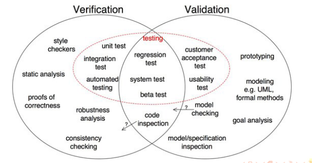

---
### 3. Kvalitet softvera. Uticaj neispravnog softvera.

- greška pravi nedostatak, on dalje uzrokuje pad, pravi i incident koji ima posledice
- Neprijatnost 
    - mobilni telefoni, internet pregledači, muzički uređaji...
    - google maps gives us directions to nowhere (2012)
- korisnik briše mobilnu aplikaciju zbog jedne geške - gubitak korisnika
- materijalni gubici
    - poslovni softver, banke, gubici podataka (virusi)
- Love virus (2000) - desetine miliona zaraženih računara, značajan gubitak podataka, šteta oko 10 milijardi dolara
- Knight Capital Group (2012) - izgubli 460 miliona dolara za 45 minuta jer su pokrenuli pogrešnu verziju softvera
- fatalne posledice
    - avioni, automobili, vozovi, aparati u zdravstvu, svvemirske letelice, nuklearne elektrane
- Ariana 5 (1996) - raspala se 37s nakon lansiranje usled greške u konverziji, 64bit u 16bit, 370 miliona dolara
- Dhahran raketa (1991) - pogodila cilj i ubila 28 vojnika: zbog grešske u softveru nije ispaljena protivodbrana
- Therac 25 (1986) - više ljudi je umrlo kao posledica predoziranja radijacijom usled neispravnosti softvera uređaja za terapijsku radijaciju

- neispravan softver košta američku ekonomoju 59,5 milijardi godišnje
- ranije otkrivanje greške moglo bi da uštedi 22 milijarde dolara godišnje
- broj linija koda se duplira svake godine, a broj defekata po liniji se nije menjao u zadnjih 10 godina

---
### 4. Tehnike verifkacije softvera. Osnovna podela i mogučnosti statičkog i dinamičkog pristupa.

Dinamička verifikacija softvera
- tehnika ispitivanja ispravnosti koda u toku njegovog izvršavanja
- testiranje 
    - sinonim za verifikaciju softvera, kao i za validaciju i verifikaciju
    - tehnika izvršavanja programa sa namerom da se pronađe što više mogućih defekata ili da se stekne dovoljnno poverenje u sistem koji se testira
    - u svakoj fazi razvoja softvera, plan testiranja zavisi od metodologije razvoja softvera i prilagođava se konkretnom projektu
    - skup podataka nad kojima će se vrštiti testiranje treba da bude reprezentativan:
        - visok potencijal otkrivanja greške
        - relativno mala veličina
        - visok stepen poverenja u pouzdanost softvera
    - testiranje crne kutije - funkcionalno testiranje, generisanje test primera bez razmatranja interene strukture koda
    - testiranje bele kutije - strukturno testiranje, generisanje test primera na osnovu interne strukture koda, npr jedinični testovi; kriterijum pokrivenosti koda: broj izvršenih putanja, broj izvršenih istrukcija, broj izvršenih grana...
    - testiranje sive kutije - mešovita strategija
    - automatizacija testiranja - sastavni deo alata za razvoj softvera, alati za kontinuiranu integraciju softvera, alati za testiranje specifičnih vrsta softvera
    - automatsko generisanje test primera - olakšava generisanje test primera, npr fuzz testing
    - koriste se alati za debagovanje i razne vrste profajliranja
    - testiranje ne može da dokaže ispravnost softvera

Statička verifikacija softvera
- analiza ispravnosti programa bez njegovog izvršavanja - analiza izvornog koda
- vrste statičke verifikacije:
    - ručne provere i pregledi koda
    - formalne metode verifikacije softvera - uslovi ispravnosti softvera se iskazuju u terminima matematičkih tvrđenja na striktno definisanom formalnom jeziku izabrane matematičke teorije
    - Halting problem - ne postoji opšti automatizovan način za proveraanje da li je neka naredba programa dostižna, pa samim tim ni da li je ispravna, tj da li je program ispravana
    - Nije moguće napraviti program koji bi potpuno automatski, u konačnom vremenu, koristeći konačne resurse, mogao da utvrdi ispravnost proizvoljnog programa potpuno precizno
        - to možemo ili precizno ili efikasno, ne oba

---
### 5. Testiranje u razvoju softvera. Cena greške u kontekstu vremena otkrivanja.

- poželjno je sve greške detektovati što ranije u fazi razvoja softvera jer je
ispravljanje grešaka jeftinije i brže u ranijim fazama razvoja softvera
- greška se vremenom samo povećava, pa je sve teže ukloniti
- Faza analize zahteva
    - cena greške = vreme potrebno da se utvrde i napišu novi zazhtevi
- Faza kodiranja
    - cena greške = dodatno vreme programera
    - vreme može da varira u zavisnosti od kompleksnosti greške, jer je značajno manje nego kada se ispravlja greška koju pronađe neko drugi, kad programer pronađe svoju grešku obično razume problem i zna kako da ga reši
- Faza integracije koda
    - cena greške = dodatni rad programera i drugih inženjera
    - greška se obično ispravlja duplo duže jer je potrebno naći gde je greška u kodu ili specifikaciji
- Sistemsko tstiranje
    - cena greške = dodatni rad programera i drugih inženjera, dodatni rad program menadžera i QA tima
    - QA itester treba da zna da reprodukuje i dokumentuje sve korake da se opiše greška
    - QA tester treba da prijavi grešku i da joj prioritet, da se sastane sa programeri i to prodiskutuje
    - nakon ispravljanja greške mora ponovo da se integriše, testira redom, proveri da li je greška stvarno uklonjena
- Testiranje prihvatiljivosti
    - cena greške = dodatni rad programera i drugih inženjera, dodatni rad program menadđera, QA tima i kupca/korisnika
    -komunikacija testera za proveru prihvatiljivosti i za sistemsko testiranje
    - sistemski tester treba da pokuša da reprokuje grešku, ako ne može onda treba dalje da komunicira sa testerom za prihvatljivost
    - ako se greška reprodukuje onda se kod vraća u prethdne faze da se greška ispravi, pa se sve ponovo tesira
- Program u upotrebi
    - cena greške = dodatni rad programera i drugih inženjera, dodatan rad program menadžera, QA tima i kupca/korisnika
    - koraci identični kao u prethodnom, ali su posledice značajno već jer ispravljen kod treb da se isporuči svima

6. Testiranje u razvoju softvera. Uloga testera u razvoju softvera.

- tester ima za cilj da pronalazi greške u kodu

Podele u timu:
- programeri su istovremeno i testeri
- programeri i testeri rade zajedno
- programeri i testeri su potpuno razdvojeni (nekad na fizički razvojenim lokacijama)

Problemi između programera i testea 
- loša komunikacija
- međusobno nerazumevanje
- netrpeljivost

Tester poseduje
- osnovno razumevanje programiranja i procesa razvoja softvera
- poznavanje procedure i procesa testiranja
- poznavanj alata i skript jezika
- poznavanje čestih greški i propusta, kao i nesvakidašnjih slučajeva upotrebe
- kreativnost i potrebu za stalnim usavršavanjem

7. Testiranje u razvoju softvera. Faze testiranja softvera: planiranje, analiza, dizajn i implementacija testova.

Ulazni kriterijumi
- nije neophodan kod za početak testiranja
- dovoljno je imati samo jasno definisane zateve korisnika, jer testiranje počinje analizom zahteva
- potrebno je da postoji specifikacija zahteva sistema koji treba da se izgradi

Test slučaj - dokument koji definiše ulaze u sistem i očekivane izlate za te ulaze

Planiranje
- priprema za ceo proces testiranja
- uključuje definisanje zadataka koje je potrebno sprovesti kao i način njihovog ivršavanja
- planiranje definiše:
    - vrste testova koje će biti sprovdene
    - opseg testiranja, pristup, strategije i metode testiranje
    - kriterijumi zevršetka
    - potrebne resurse i dogovora način komunikacije između članova tima
- zavisiti od primenjene metodologije razvoja softvera i prilagođava se svakom konkretnom projektu
- planiranjem se dobija skup dokumenata koji sadrže opšti pogled na sistem koji će se testirati, aktivnosti koje će biti izvršene kao i alate koji će biti korišćeni

Analiza, dizajn i implementacija testova
- obuhvata pravljenje detaljne specifikacije načina na koje će se aktivnosti predviđene planom izvršiti
- ispituje se mogućnost testiranja određenih delova koda, prikupljaju potrebni podaci i precizni zahtevi korisnika
- kreiaju se precizna uputstva kako će se vršiti testiranje sistema
- rezultat ove faze je skup test slučjeva i test procedura koja će biti korišćena u fazi zvršavanja testova
- izvršavanje može biti ručno ili automatsko

8. Testiranje u razvoju softvera. Faze testiranja softvera: izvršavanje i evaluacija testova.

Izvršavanje testova
- proces konkretne primene test slučajeva i test procedura formiranh na osnovu plana, analize, dizajna i implementacije
- određuje se prioritet izvršavanja testova, pripremaju se testovi za automatizovano testiranje (ukoliko je ono deo procesa testiranja) i organizuju testove za što efikasnije izvršavanje
- vrši se radi provere funkcionalnosti sistema
- obuhvata i dodatnu aktivnost statusa problema, ova aktivnost podrazumeva eliminaciju prijavljneih problema kao i potvrđivanje da je problem rešen
- ponovno izvršavanje testova posle popravke grešaka
- komunikacija tester-programer

Evaluacija testova
- procenu kriterijuma završetka testiranja i izvršavanja
- svaka izmena u kodu, čak i popravka greške može napraviti novu grešku
- kriterijum za završetak testova može biti procenat nerešenih bagova, reostalo vreme za testianje
- proces evaluacije uključuje pregled rezultata dobijenh analizom izlaza test slučajeva
- na kraju se kreira izveštaj sa opisom šta je testirano, na osnovu iveštaja se određuje da li je sistem spreman za korišćene u sklasu sa korisničkim zahtevima
- izlazni kriterijum određuje da li je testiranje kompletirano i da li je apikaicija spremna za korišćenje u sladu sa korisničkim zahtevima, uključuju test summary report, izračunavanje raznih metrika i izveštaja o defektima
- aktivnosti zatvaranja testiranja
    -testiranje se zatvara kada je softver isporučen korisniku, ili kada je projekat otkazan ili neki ugi cilj postignut
    - test skriptovi i dokumentacija se ariviraju, primenjeni proces testiranja se analizira i diskutuje se o tome šta je bilo dobro a šta ne

9. Vrste testiranja. Testiranje jedinca koda.

- proverava se funkcionisanje delova sistema koji se nezavisno mogu testirati
- to mogu biti podprogrami,
klase, manje ili veće celine formirane od tesno povezanih jedinica
- kroz ovo prolazi svaki i najmanji deo sistema
- jedinični tetovi su definisani standradom IEEE Standard for Software Unit Testing
- dobra podrška u alatima za automatsko izvršavanje i proveravanje ovih testova, sastavni deo razvojnog okruženja
- proverava da li izolovani delovi koda imaju predviđenu funkcionalnost
- ukoliko sistem komunicira sa mrežom, bazom podataka ili fajl sistemom, to se u testovima apstrahuje u nekakve fiksne vrednosti
- apstrahuje se u ukoliko komunicira sa drugim klasama, modulima ili komponentama sistema
- dozvoljena je samo dikretna komunikacija se memorijom
- testiranje metodama bele kutije
- testove piše programer
- ukoliko postoji greška unutar jedinice koda, ona bi trebalo da bude otkrivena u ovoj fazi

10. Vrste testiranja. Komponentno i integraciono testiranje.

Komponentno testiranje
- proverava komponente sastavljene od više jedinica koda
- jedinice koda su proverene da ispravno rade u izolaciji, sada se testira na nivou komponenti
- proverava se komunikacija između jedinica koda
- komponetna je skup povezanih jedinica koda koje imaju zajednički interfejs prema ostalim komponentama
- komponente se testiraju odmah po njnihovom kreiranju
- testiranje se može i ne mora vršiti izolovano od ostatka sistema, u zavisnoti od izabranog modela razvoja
- ovo je vrsta integracionog testiranja nižeg nivou jer se komponentom testiranja integrišu osnovne jedinice koda
- u zavisnosti od vrste projekta ga može vršiti programer ili tester

Integraciono testiranje
- proverava saradjnu komponeni koje predstavljaju jednu celinu
- ispituje da li su veze između komponenti dobro definisane i realizovane, tj da li komponente komuniciraju na način opisan u specifikaciji projekta
- ovim testovima se mogu naći propusti u komunikaciji između komponenti
- testiranje metodama crne kutije
- testiranje rade testeri

11. Vrste testiranja. Sistemsko testiranje. Istraživačko testiranje. Testovi prihvatljivosti.

Sistemsko testiranje
- proverava sistem kao celinu
- da li se sistem ponaša sa specifikacijom koju je zado klijent
- zahteva se pristup bazi i hardverskim delovima sistema
- može uključivati funkcionalne i nefunkcionalne aspekte sistema
- u ovu vrstu se nekad ubrajaju istraživačko testiranje i testiranje prihvatljivosti, a nekad se gledaju odvojeno

Istraživačko testiranje
- testeri pronalaze i proveravaju druge eventualne pravce korišćenja softverskog sistema
- podrazumeva prepoznavanje, kreiranje i izvršavanje novih test slučajeva (onih koji nisu bili predviđeni test planom)
- ima smisla kada je aplikacija u svom finalnom obliku, kada tester može da vidi i druge alternativne pravce korišćenja sistema koji se ranje nisu mogli tstirati
- ako se ova faza preskoči neki funkcionalnosti možda ne budu testirane

Testovi prihvatljivosti
- omogućava klijentukorisniku da se uveri da je napravljeni softver u skladu sa njihovim potrebama i očekivanjima
- validacija softvera
- izvode i procenjuju korisnici, a razvojni tim pruža pomoć oko tehničih pitanja ukoliko ima potrebe
- klijent može proceniti sistem na tri načina:  
    - referentim testiranjem - uobičajjni uslovi u kojima sistem treba da radi, da li je softver implementiran u skladu sa očekivanjima
    - pilot testranjem - instalacija sistema na privremenoj lokaciji i njegova upotreba, simulacija svakodnevnnog rada u sistemu
    - paralalenim testiranjem - tokom razvoja kada jedna verzija softvera treba da zameni drugu ili kada novi sistem treba da zameni stari, paralaleno funkcioniše stari i novi sisem dok se korisnici postepeno privikaaju i prelaze na novi sistem

12. Vrste testiranja. Nefunkcionalno testiranje. Testovi bezbednosti. Instalaciono testiranje.

Nefunkcionalno testiranje
- nefukncionalni zahtevi: brzina, efikasnost, otpornost na otkaze, uklapanje u okruženje u kom će se sistem koristiti
- testiranje performansi:
    - testovi konfiguracije - ispituje se ponašanje u razlečitim hardverskim i softverskim okruženjima, različite konfiguracije su namenjene različitim korisnicima sistema, ovim testovima se proveravaju sve konfiguracije sistema
    - testovi kapaciteta - proverava ponašanje sistema pri obrdi velikih količina podataka, skupovi podataka dostižu svoje maksimalne kapacitete
    - testovi kompatibilnosti - proverava se način ostvarivanja komunikacije sistema sa drugim spoljnim sistemima

Testovi bezbednosti
- proverava se da li su odredene funkcionalnosti dostupne isključivo onim korisnicima kojima su namenjene
- proverava dostupnost, integritet i poverljivost svih skupova podataka

Instalaciono testiranje
- izvodi se instaliranjem softvera na klijentskoj strani
- sistem se konfiguriše u skladu sa okruženjem
- uspostavlja komunikaciju sa spoljnim uređajima ukoliko je potrebno
- u saradnji sa korisnicima
- nakon uspeha ovog testiranja se sistem isporučuje

13. Tehnike testiranja. Odnos plana i strategije testiranja. Karakteristike dobrog skupa tesotva.
Osnovna podela na tehnike testiranja.

Plan testiranja - dokument sa informacijama o fokusus i obimu testiranja, definiše kriterijum pokrivenosti, raspored testiranja, osobine koje se testiraju i potrebne resurse
- šta testiramo i kako to želimo da ostvarimo

Strategija testiranja - vodič za postizanje cileva testiranja i izvršavanjne testova koji se pominju u planu testiranja
- definiše ciljeve, okruženja, pristup, automatizaciju i tehnike, nepredviđene situacije i analiza rizika

Ako je plan testiranja destinacija onda je strategija uputstvo kako do njega doći, mapa kako doći do destinacije.

Dobri test prmeri
- metod odeđivanja reprezntativnog skupa podataka nad kojima će se vršiti testiranje
    - visok potencijal otkrivanja grešaka
    - relativno mala veličina
    - relativno velika brzina izvršavanja
    - visok stepen poverenja u pouzdanost softvera
- pokrivenost koda - broj elemenata programa ispitanih testovima u odnosu na ukupan broj tih testova

Testiranje crne kutije
- generisanje testova na osnovu specifikacije, bez razmatranja interne strukture
- funkcionalno testiranje, testiranje ponašanja, testiranje vođeno podacima
- ponašanje iz korisničkog ugla
- dajemo ulaz i proveravamoočekivani izlaz
- pronaći prihvatljiv broj test slučajeva koji otkriva što više grešaka
- prednost: moguće potpuno razdvajanje programera i tester

Testiranje bele kutije
- npr jedinični testovi
- testovi se generišu na osnovu interne strukture koda
- kriterijum pokrivenosti - broj izvršenih putanja, instrukcija, grana ...
- strukturno testiranje, testiranje vođeno logikom
- ispituju se različite putanje kroz program
- može i za integraciono i sistemsko testiranje
- mogu se testirati putanje kroz jedinicu koda, putanja između jedinica koda za vreme integracije, putanje između podsistema za vreme sistemskog testiranja

Testiranje sive kutije
- mešovita strategija
- imamo uvid u unutrašnju strukturu, ali ne kao kod bele kutije
- kompozitno i integraciono testiranje
- programeri i testeri

14. Tehnike testiranja. Testiranje metodama crne kutije. Isprobavanja svih mogućih ulaza. Metod klasa ekvivalencije.

Isprobavanja svih mogućih ulaza
- nije moguće za netrivijalne programe
- npr za 3 32-bitna broja ima 2^{32} * 2^{32} * 2^{32} = 2^{96}

Metod klasa ekvivalencije
- cilje: smanjiti broj test slučajeva, a pritom održati razumnu pokrivenost testovima (pokrivenost se odnosi na broj mogućih ulaza koji će biti ispitan testovima)
- klasa ekvivalencije - skup podataka koji se tretiraju jadnako od strane modula ili koji treba da proizvede isti rezultat
    - sa tačke gledišta testiranja, podataka u okviru jedne klase su ekvivalene ostalim vrednostima u okviru te klase
    - ako jedan test slučaj u jednoj klasi ekvivalencije detektuje grešku, svi ostali test slučajevi u okviru ist klase ekvivalencije će verovatno detektovati istu grešku
    - ako jedan test slučaj u jednoj klasi ekvivalencije ne detektuje grešku, ni jedan drugi test slučaj u okviru ist klase ekvivalencije verovatno neće detektovati grešku
- identifikujemo klase ekvivalencije, pa pravimo test slučaj za svaku klasu ekvivalencije

15. Tehnike testiranja. Testiranje metodama crne kutije. Metod klasa ekvivalencije. Metod graničnih vrednosti.

Metod klasa ekvivalencije
- prethodno pitanje

Metod graničnih vrednosti
- fokusira se na granice, jer se tu krije mnogo grešaka
- česta greška je kodiranje nejednakosti, > umesto >=
- postupak:
    - identifikovati klase ekvivalencije
    - identfikovati granice svake od klasa ekvivalencije
    - praviti test slučaj za svaku graničnu vrednost birajući jednu tačku na granici, jednu ispod i jednu iznad granice
    - tačke ispod i iznad granice mogu pripadati drugim klasama ekvivalencije pa treba voditi računa o dupliranju testova
    - više dimenzija u klasama ekvivalencije, realni brojevi

16. Tehnike testiranja. Karakteristike dobrog skupa tesotva. Tabele odlučivanja.

Karakteristike dobrog skupa tesotva
- pitanje 13

Tabela odlučivanja
- prikaz složenih poslovnih pravla u lako čitljiv olik pomoću kog se mogu napraviti i test slučajevi
- prvu grupu redova čine uslovi nad ulazom a drugu moguće akcije
- kolone tabele predstavljaju pravila koja jedinstvenoj kombinaciji uslova dodeljuju odgovarajuće akcije
- uslovi pravila mogu biti binarni (izvode tačno jedan slučaj) ili sa više od dve vrednosti (mogu izvesti više slučajeva)
- izbor različitih test slučajeva iz jednog pravila može se vršiti u kombinaciji sa drugim tehnikama, kao što su klase ekvivalencije ili granične vrednosti
- kada imamo više pravila kod kojih akcija ne zavisi od vrednosti nekog uslova možemo ih spojiti u jedno pravilo (engl. table collapsing ). Takav uslov u novom pravilu označavamo sa '-' i nazivamo nebitnim (engl. don't care)

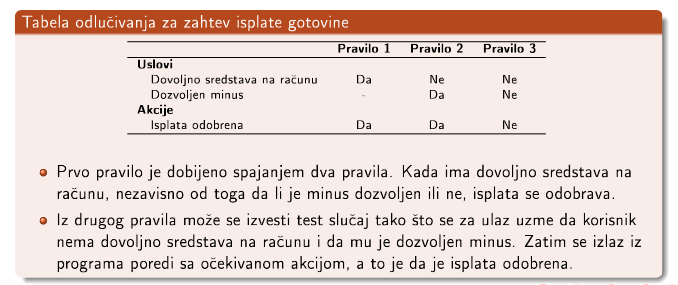

17. Tehnike testiranja. Karakteristike dobrog skupa tesotva. Dijagrami stanja. Tabele stanja.

Dijagram stanja
- kompaktno opisuje kompleksne zahteve sistema i njegov način interakcije sa spoljašnjim svetom
- primenjuje se kod sistema čije akcije zavise od akcija izvršenih uprošlosti i koji reaguju na spoljašnje dogadaje
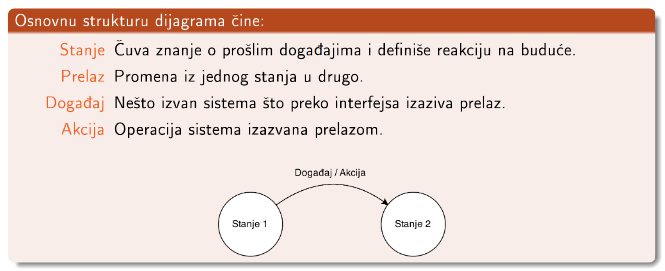

- U svakom trenutku sistem se nalazi u nekom od konačno mnogo stanja i čeka na neki dogadaj
- Kombinacija stanja i događaja određuje stanje u koje sistem prelazi
- Pri prelasku sistem može da izvrši još neku akciju, obično pravljenje nekih izlaza
- Ovakav sistem se može modelovati konačnim automatom 
- Dijagram stanja je jedan od načina prikaza takvog modela
- test slučajevi se mogu praviti obilaskom dijagrama stanja
- pri pravljenju testova se mogu zahtevati različiti nivoi pokrivenosti, pri čemu postoji kompromis između pokrivenosti i količine testova
- dobro je svaki prelaz ispitati bar jednom, možemo zahtevati da se svako stanje ili svaka putanja kroz dijagram obiđu bar jednom

Tabela stanja
- konačni automat koji modeluje sistem sa može prikazati i tabelama stanja
- prednost: sistematski pristup, prikazuje sve moguće kombinacije stanja i događaja
- može se uočiti gde je nedefinisano ponašanje sistema, i sprečiti pojavu greške
- iz svakog reda se može izvesti jedan test slučaj

18. Tehnike testiranja. Testiranje metodama bele kutije. Pojam i vrste pokrivenosti.

Testiranje bele kutije
- pitanje 13

Pokrivenost putanja (Path Coverage) 
- mera prolaska kroz moguće putanje 
- potpuna pokrivenost: sve moguće putanje programa su izvršene bar jednom

Pokrivenost naredbi (Statement Coverage) 
- mera izvršavanja naredbi programa
- potpuna pokrivenost: svaka naredba programa je izvršena bar jednom

Pokrivenost grana/odluka (Branch/Decision Coverage)
- mera prolaska kroz grane programa 
- potpuna pokrivenost: svaka odluka u programu je doneta bar jedno

Pokrivenost uslova (Condition Coverage) 
- mera ispitivanja uslova programa 
- potpuna pokrivenost: svaki uslov u svakoj odluci je uzeo sve moguće vrednosti bar
jednom

Pokrivenost višestrukih uslova (Multiple Condition Coverage) 
- mera ispitivanja
višestrukih uslova programa 
- potpuna pokrivenost: svaka moguća kombinacija uslova u svakoj odluci je ispitana bar jednom

Pokrivenost funkcija (Function Coverage) 
- mera poziva svih funkcija programa

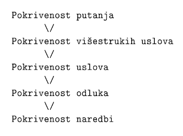

Računanje pokrivenosti koda
- postoje alati koji računaju
- gcov, Cobertura, CodeCover,Coverage.py, Emma, Gretel, Hansel, JaaCoCO, JCov

19. Tehnike testiranja. Karakteristike dobrog skupa tesotva. Testiranje metodama bele kutije. Testiranje baznih putanja.

Testiranje baznih putanja:
- izvođenje grafa toka upravljanja iz softverkog modula
- izračunavanje iklomatične kompleksnosti grafa - **C**
- odabir skupa **C** baznih putanja
- pravljenje test slučajeva za svaku baznu putanju
- izvršavanje ovih testova

Ciklomatična kompleksnost
- metrika koja se koristi da se izračuna kompleksnost softvera
- kvantitativna mera broja linearno nezavisnih putanja koz kod programa
- $C = grane - čvorovi + 2*broj_povezanih_komponenti$
- kreiranjem i izvršavanjem svih baznih test slučajeva, garantuje se i pokrivenost grana i pokrivenost naredbi zato što skup baznih putanja pokriva sve grane i čvorove grafa kontrole toka

20. Načini testiranja. Automatizacija u testiranju.

Automatizacija:
- način generisanja test primera
    može samo za neke vrste testiranja, npr za metode bele kutije, neke nefunkcionalne testove
    - većina funkcionalnih testova se mora manuelno generisati
- način izvršavanja test primera
    - u mnogim slučajevima je moguće automatizovati izvršavanje testiranja
    - često deo alata za razvoj softvera, alata za kontinualnu integraciju softvera, alata za testiranje sšecifičnih vrsta softvera...
    - najčešće vezano za testiranje jedinica koda
    - xUnit framework, JUnit, CppUnit
    - obično povezano sa automatskim računanjem pokrivenosti koda

21. Metamorfno testiranje.

- problem proročišta - nije dostupno ili ga je teško koristiti
- izraženo u grafici, konstrukciji kompilatora i mašinskom učenju
- metamorfno testiranje testira bez korišćenja prorčišta, umesto toga se koriste osobine algoritma koji se testira kako bi se generisali dodatni test primeri i automatski verifikovali njihovi izlazi
- Većina aplikacija ima neka svojstva takva da za odredene promene ulaza mogu da se predvide neke karakteristike novog izlaza, uz poznavanje prvobitnog izlaza
- npr ukoliko se ulaz poveća za n izlaz se poveća za $n^2$, ukoliko je ulaz po modulu k isti onda je izlaz isti...
- može se implementirati nezavisno od određenog programskog jezika
- ključni korak je identifikovati metamorfne relacije koje daju neku veu između više ulaza i njihovih izlaza za dati program
- Dobro je izabrati metamorfne relacije koje rezultuju najvećim razlikama u izvršnim putevima izmedu izvornih i naknadnih test primera: ako imamo veliku razliku izmedu izvršnih puteva, imamo i veliki prostor u kojem može da se izrazi propust u softveru
- često nije očigledno koje metamorfne relacije će rezultovati većoj razlici između izvršnih puteva
- potrebno je domensko znanje 

Relacija ekvivalentnosti
- Relacija ekvivalentnosti kao relacija izmedu relevantnih izlaza se pokazala kao bolja od ostalih relacija pošto je ekvivalentnost uži uslov od ostalih neekvivalentnih uslova
- Metamorfne relacije sa relacijom ekvivalentnosti se lakše mogu prekršiti od ostalih relacija, čime bi trebalo da se detektuje veći broj grešaka

22. Debagovanje. Neophodna podrška, najpoznatiji debageri.

Debager - program koji se koristi za praćenje rada drugog programa sa ciljem pronalaženja uzroka greške

Da bi informacije koje debager daje bile razumljivije, potrebna je podrška kompajlera/linkera.
Da bi debager mogao da radi, potrebna je podrška operativnog sistema i/ili hardvera.

Potrebna podrška
- Operativni sistem i hardver
    - debageri hvataju sistemske prekida, oni su sistemski zahtevni alati pa je potrebno razumeti kako procesi i sistemsk prekidi funkcionišu na odggovarajućem operativnom sistemu
    - na Linuxu je za sistemske prekide važna funkcija ptrace (process trace), jedan proces može da kontroliše drugi
    - debager može direktno da koristi neke funkcionalnosti hardera ukoliko su dostupne
- watchpoints - prati vrednosi neke promenljive u memoriji

Poznati debageri
- GDB - GNU debugger
- LLDB - LLVM based debugger
- WinDBG - Microsoft
- Microsoft Visual Studio Debugger

23. Debagovanje. Razlika izmedu release i debug režima prevodenja.

Releas mode
- daje izvršnu verziju namenjenu krajnjem korisniku
- optimizacije koje omogućavaju efikasno izvršavanje koda
- efikasnost je nekad vidilja
- optimizacijama se gubi veza sa originalnim kodom, neki delovi koda se usled optimizacije obrišu, neki se pomere, neki prezapišu...
- veličina izvršnog fajla je manje nego fajla prevedenog u debug modu

Dbug mode
- prevođenje u izvršnu verziju namenjenu programeru
- isključuje optimizacije sa ciljem lakšeg uparivanja izvornog i izvršnog koda, tj može se utvrditi koji deo koda se izvršava u datom trenutku
- manje efikasno izvršavanje
- većina ivršnog fajla je veća nego veličina fajla prevedenog u releas mode, zbog manjka optimizzacija i viška dodatnih informacija

Različite verzije mogu raličito da se ponašaju
- nekad se greška ispoljava samo u releas verziji
- debug verzija usled dodatni podataka ili inicijalizacije memorije maskira grešku
- greška se možda javlja zbog neke optimizacije

24. Debagovanje. Kako rade debageri?

Debager 
- može da započne proces i da ga prati i debaguje, ili može da se nakači na proces koji se već ivršava
- omogućava izvršavanje instrukciju po instrukciju
- omogućava postaljanje tačaka prekida i izvršavanje programa do tih tačaka prekida
- omogućava praćenje stanja promenljivih kroz ivršavanje
- savremeni debageri omogućavaju izmenu koda koji se izvršava i posmatranje efekta takvih izmena, debagovanje unazada, uslovne prekidne tačke, watchpoints
- može se koristiti i za releas i za debug mod
- debug verzija je povezana sa ivornim kodom pa daje više informacija
- u releas verziji su informacije često uvid u asemblerski kod, kao što ih vidi procesor

Anti-debagovanja
- implementacija tehnika unutar koda koje ometaju pokušaj obrnutog-inženjeringa ili debagovanja ciljano procesa
- zaštita od kopiranja
- virusni programi ga koriste

Pojednostavljeno izvršavanje:
Kada se postavi prekidna tačka u programu sa željom da se na tom mestu zaustavi program, debager umetne na to mesto u softveru instrukciju prekida ili neku nevalidnu instrukciju. Kada se prilikom izvršavanja programa naiđe na ovu instrukciju desi se hardverski izuzetak koji uzrokuje prekid. Najpre se proveri da li je prekid u listi očekivanih debager prekida (tj da li je u pitanju namerno zaustavljanje ili greška u originalnom kodu). Ukoliko je greška u originalnom kodu, onda se dopusti da se ta greška i izvrši i da program pukne. Ukoliko je u pitanju tačka prekida, prekid se prosledi na obradu debageru koji ga onda obradi tako što na tom mestu omogući uvid u sve vrednosti razičkih registara procesa kao i u stanje memorije. Debager prikazuje pročitane informacije o procesu povezane sa informacijama o izvornom kodu koje su nalaze u programu umetnute od strane kompajlera/linkera prilikom prevodenja programa. Ukoliko je u pitanju uslovna prekidna tačka, debager proverava uslov i u slučaju da uslov nije ispunjen, preskače se obrada prekida i samo se nastavlja dalje sa izvršavanjem procesa.
Kada poželimo da nastavimo izvršavanje:
- debager zameni instrukciju prekida sa originalnom instrukcijom
- izvrši je
- zameni ponovo originalnu instrukciju instrukcijom prekida
- prepusti ponovo dalje kontrolu programu

25. Debagovanje. Otvoreni problemi. Za i protiv debagera.

Debagovanje višenitnih aplikacija
- teško je
- debagerima treba dodatna podrška, najvažniji debageri imau tu podršku
- komunikacija između niti često može zbuniti debager
- pokretanje aplikacije kroz debager može poremetiti redosles izvršavanja u okvir aplikacije i time zamaskirati problem

Ograničenost primene
- primenljivo nad aplikacijama srednje veličine, ne skalira se uvek
- za veće i kompleksnije softvere proces debagovanja može biti previše spor

Protivnici debagera
- Linus Torvalds - kreirao Linux
- Robert C. Martin - jedan od autora agilnog programiranja, misli da su debageri gubljenje vremena
- Brian W. Kernigham - debagovanje sa print
- Guido van Rossum - autor pythona, 90% debagovanja je print
- razlog: debageri nisu oduvek bili moćni i uspešni alati kao danas

Print umesto debagera
- potrebno novo prevođenje
- umetanje print može da zamaskira grešku
- ne može zaustaviit program i videti sve zanimljive vrednosti
- štampanje je statična aktivnost, za svaku promenu je potrebno novo izvršavanje
- dobro jedino ako ne postoji alternativni debager

26. Profajliranje. Osnovni pojmovi. Ciljevi profajliranja. Testiranje performansi i optimizacija. Podrška profajliranju. Instrumentalizacija. Ograničenja.

Performanse 
- testiranje performansi - merenje vremenske i memorijske efikasnosti programa
- ako program ne zadovoljava kriterijuma potrebno je naći uzrok i izvrštiti optimizaciju
- profajleri generišu informacije na osnovu kojih se donose odluke o optimizaciji

Profajliranje
- vid dinamičke analize koda čiji je rezultat skup podataka dobijen izvršavanjem programa sa odredenim ulaznim podacima
- zasniva se na instrumentalizaciji, tj ubacivanju dodatnih instrukcija u proram kako bi se prikupljali podaci o programu za vreme njegovog izvršavanja

Profil
- podaci dobijeni profajliranjem
- npr frekvencija izvršavanja funkcija ili blokova koda, procenat utrošenog vremena u bloku koda, podatke o alokaciji memorije
- pomaže otkrivanju koda koji se često izvršava, određivanju pokrivenosti koda datim ulazima prošitivanju skupa testova i rešavanju mnogih drugih problem
- merenje se najčešće odnose na broj izvršavanja određenog dela koda ili vreme provedeno u tom delu koda
- različiti ulazi daju različite profile
- da bi se donela odluka o optimiazaciji važno je da se profil napravi realnom upotrebom programa, da su ulazi ili skupovi ulaza relevantni

Testiranje performansi i optimizacija
- optimiaciju na osnovu profajliranja vrši čovek, a može i automatski
- samo čovek može suštinski da izmeni algoritam, dok automatska optimizacija može da poboljša efikasnost koda
- automatska optimizacija može da se sprovodi u fazi izvršavanja koda ili u fazi kompilacije
- u fazi kompilacije optimizacija koristi informacije dobijene profjliranjem da bi se dobila nova efikasnija izvršna verzija
- u fazi izvršavanja koristi informacije dobijene profajliranjem da bi se donela odluka o tome da se neki delovi izvršnog koda optimizuju u fazi izvršavanja

Podrška profajliranju
- samo softversko, može da ima podršku hardvera ili mešavina sofverskog i hardverskog profajliranja
- podrška hardvera omogućava veću efikasnost profajliranja, kao i veći opseg podataka dobijenih na osnovu profajliranja
- za neka merenja je neophodan hardver, brojanje promašaja keša u memoriji, merenje utrošenog vremena zbog čekanja protočne obrade neke instrukcije

Instrumentalizacija
- prikuplja samo potrebne podatke
    - premalo nije značajno, puno usporava
- ne utiče na funkcionalnost programa
    - ako utiče na rad rograma onda podaci ne oslikavaju pravi način njegovog rada
- ne usporava previše rad programa
    - zavisi od tipa aplikacije, možemo kontrolisati u zavisnosti od granulacije, tj delova programa koji se instrumentalizuju
- na osnovu toga kako se nove instrukcije ubacuju u program
    - programer manuelno dodaje željene llinije u kod
    - automatski u različitim fazama
        - sprovodi kompajler i/ili linker
        - može da se ubaci u već kompajlirani program
        - može da se ubaci u vreme kompajliranja

Ograničenja instrumentalizacije
- sistemi u realnom vremenu imaju stroga vremenska ograničenja koja se profajliranjem mogu poremetiti i time izazvati štetu
- memorijska ograničenja uređaja, program sa dodatnim kodom može da ne stane na uređaj

27. Profajliranje. Osnovne vrste. Profajliranje putanja, blokova, grana. Knutov algoritam.

- najčešće se prikupljaju informacije o količini izvršavanja određenih delova koda kako bi se pri optimizaciji obratila pažnja na njih
- najbitnije informacije su
    - sekvence blokova koje se najčešće izvršavaju
    - instrukcije (blokovi) koji se najčešće izvršavaju

Osnovne vrste profajliranja
- profajliranje putanja
- profajliranje blokova
- profajliranje grana

- postavljamo brojače kojima utvrđujemo koliko puta se neki događaj desio prilikom izvršavanja
- dobijeni profili se mogu koristiti za kompajlerski zasnovane optimizacije i za utvrđivanje pokrivnosti koda testovima

Profajliranje putanja
- složen vid profajliranja
- dobijaju se informacije o najčešće korišćenim putanjama kroz program
- sadrži informacije o profilima grana i blokova
- zahteva kompleksne algoritme i najviše utiče na performanse izvršavanja prilikom profajliranja

Profajliranje blokova
- blok - funkcija ili deo koda u kome se ne nalaze instrukcije grananja ili skovi
- broji ukupan broj izvršavanja svakog bloka
- naivni algoritam- svakom bloku dodeliiti brojč, precizna informacija ali prilično usporava sistem
- ne daje informacije koje su putanje najčešće ni koji su prelazi između blokova česti

Profajliranje grana
- grana - prelazak koji se ostvaraje instrukcijom grananja ili skoka kojom se prebacuje tok izvršavanja programa iz jednog bloka u drugi
- mogu se dobiti i podaci koji se dobijaju profajliranjem blokva
- broj izvršavanj bloka se može srračunati pomoću brojača grana, tako što se sumiraju sve grane koje ulaze u blok
- naivan algoritam - za svaku naredbu skoka umeće brojač
- efikasniji algoritam - radi u fazi kompilacije, Donald Knut umeće minimalan broj brojača

Knutov algoritam
- graf kontrole toka u kom su svi čvorovi blokovi instrukcija, a grane naredbe grananja ili skoka
- napravi se razapinjuće stablo, broj grana je v-1, gde je v broj čvorova grafa
- granama koje ne pripadanu stablu se dodaje brojač
- broj izvršavanja grana bez brojača se može izračunati na osnovu sračunatih vrednosti
- mana: isti broj grana može instumentalizovti na različite načine jer graf može da ima više razapinjućih stabala
- optimalno razapinjuće stablo - grane se najveći broj puta izvršavaju

28. Smanjenje trškova profajliranja. Uslovi prelaska. Duplirajući i proveravajući kod, delimično dupliranje i bez dupliranja. Profajliranje uzimanjem uzoraka.

- Tomas Bal i Džejms Larus - osmislili način kako da se proceni koji skup grana je optimalan, tj kako da se korišćenjem jednostavne statičke analize instrumentalizuju one grane za koje se predviđa da će se najmanje puta izvršti

- prvim koracima profjliranja se dobija veliki rezultat, kako se više optimizuje program to ga je teže dodatno optimizovati
- zbog prethodnog se u prvim koracima mogu koristiti manje precizne tehnike, a kasnije je potrebno koristiti sve preciznije tehnike

Profajliranje uzimanjem uzorka
- neophodno je smanjiti uspravanje programa instrumentalizacijom
- smanjuje opterećenje programa 
- ne određuje način insrumentalizacije, već samo kako smanjiti njene troškove
- često se koristi
- podrazumevano za Visual Studio Profiling Tools
- uzimaju se *slike* programa u određenim vremenskih intervalima i od njih pravi profil programa
- znatno smanjuje opterećenje programa, ali je smanjena i tačnost dobijenih podataka
- za dobro izabraen intervale merenja preciznost ove metode može da bude veoma visoka
- ako su intervali loši može se desiti da se ne zabeleže određeni događaji
- najčešće se koristi za pronalaženje najfrekvntnijih događaja
- primer: uzimanje slike stanja na steku

Duplirajući i proveravajući kod
- dupliran kod - duplikat koda koji sadrži instrumentalizovan kod
- originalan kod - proveravajući kod, u njemu se ispituje uslov, koji ukoliko je ispunjen treba kontrolisano da pređe u dupliran kod, ovim se kontroliše koliko će se izvršavati svaki od ova dva koda
- kada izvršavanje pređe u duplirani kod ono tu ostaje ograničeno vreme a zatim se vraća u proveravajući
- trenutak prelaska iz proveravajućeg u duplirani kod se može iniccirati hardverski, putem operativnog sistema ili softverski

Uslov prelaska
- Time based sampling
    - fiksiran vremenski period između dva uzimanja uzorka: tajmer postavi bit, uslov proverava da li je taj bit postavljen
    - period uzimanja uzorka je ograničen frekvencijom tajmera što nije praktično za veoma česte događaje
    - kada istekne vreme, sledeći uzorak će biti uzet tek kada ponovo ispita uslov prelaska
- Counting-based sampling
    - čuva se brojač za prelaske koji se dekrementira
    - kada brojač dođe do nule, uzima se uzorak i resetuje se brojač
    - očekuje se da je cena ovoga mala jer se brojač može držati u kešu
    - obezbeđuje se da će se uzorci uzimati proporcionalno broju provera

Algoritam uzorkovanja
- dupliranjem se povećava upotreba memorije i vreme kompilacije
- mogu se instrumentalizovati samo delovi koda, neki algoritmi prave kopije samo onih delova koji su vezani samo za insrtumentalizaciju
- za rekonstrukciju profila nije potrebno instrumentaliovati svaki blok ili svaku granu
- delimičnim dupliranjem se može smanjiti upotreba memorije i vreme kompilacije sa potpunim zadržavanjem preciznosti dobijenih informacija

Bez dupliranja koda
- dodaje se provera ispod svakog instrumentalizovanog čvora
- narušava se svojstvo proporcionalnosti i dodaje se veće opterećenje
- rezultati nisu isti kao kod punog ili delimičnog dupliranja
- profajliranje može da se zaustavi ranije

TODO

29. Sanitajzeri

- cilj instrumentalizazcije: profajliranje, optimizacija koda, pronalaženje greške u radu sa memorijom ili u radu sa nitima

Sanitajzeri 
- koriste se u fazi razvoja programa kao pomoć u detektovanju grešaka

AddressSanitizer (ASan) 
- Clang, gcc
- detektuju prekoračenje bafera i korišćenje oslobođene memorije
- drugačija instrumentalizacija, obuhvata izmenu u adresnim prostorima izvršavajućeg programa
- u proskeu se vreme izvršavanja povećava 73%, a upotreba memorije 340%

MemorzSanitizer (MSan)
- clang
- detektor čitanja neinicijalizovane memorije
- otkriva slučajeve kada ovo utiče na izvršavanje programa

ThreadSanitizer 
- clang
- detektuje probleme u radu sa nitima
- koristi kompajlersku instrumentalizaciju i odgovarajuću run-time biblioteku
- tipično uspori ponašanje 5 do 15 puta
- memorija dodatno opterećena 5 do 10 puta

30. Analiza binarnog koda. Kako radi Valgrind? Faze translacije koda.

- analiza izvornog programa obuhvata analizu na nivou mašinskog koda, snimljenog ili kao objektni kod (nepovezan) ili kao izvršni kod (povezan)

Valgrind 
- usporava izvršavanje od 5 do 100 puta, u zavisnosti od alata
- može da se koristi kao alat za pravljenje novih alata
- svi valgrind alati rade na istoj osnovi
- alat za dinamičku analizu koda se kreira kao dodatak, pisan u C-u, na jezgro Valgrinda
- Alat Valgrind = Jezgron Valgrind-a + alat koji se dodaje
- jezgro valgrinda - oogućava izvršavanje klijentskog programa, kao i snimanje izveštja koji su nastali prilikom analize programa
- informacije koje se emituju se mogu iskoristiti za uklanjanje grešaka, optimizaciju koda, i još stvari

Kako radi Valgrind?
- svaki valgrindov alat je statički povezana izvršna datoteka koja sadrži kod alata i kod jezgra
- izvršna datoteka valgrind predstavlja omotač okjij na osnovu --tool opcije bira alat koji treba pokrenuti
- valgrindovo jezgro prvo inicijalizuje podsistem kao što su menadžer adresnog prostora, i njgov unutrašnji alokator memorije i zatim učitava klijentovu izvršnu datoteku
- potom se inicijalituju valgrindovi podsistemi kao što su translacija tabela, aparat za obradu signala, raspoređivač niti i učitavaju se informacije za eagovanje klijenta ukoliko postoje
- ni jedan deo klijentskog koda se ne izvršava u svom izvornoom obliku
- Valgrind ima potpunu kontrolu i počinje prevođenje i izvršavanje klijentskog programa
- Valgrind vrši JIT prevođejne mašinskog koda programa u mašinski kod programa dopunjem instrumentalizacijom
- alat u originalan kod umeće operacije u svrhu instrumentalizacije, zatim takav kod prevodi dinamički
- prevođenje se sastoji iz raščlanjivanja originalnog mašinskog koda u odgovarajuću međureprezentaciju (Intermediate Representation) koja se kasnije instrumentalizuje sa alatom i ponovo prevodi u mašinski kod
- rezultat ovog procesa se naziva translacija, čuva se u memoriji i izvršava po potrebi
- jezgro troši najviše vremena na sam proces pravljenja, pronalaženja i izvršavanja translacije
- Valgrind deli originalni kod u sekvence koje se nazivaju osnovni blokovi
- osnovni blok je pravolinijska sekvenca mašinskog koda, ne čiji se poletak skače, a koja se završva skokom, pozivom funkcije ili povratkom u funkciju pozivaoca
- svaki kod programa koji se analizira ponovo se prevodi na zahtev, pojedinalno po osnovnim blokovima, neposredno pre izvršavanja bloka
- veličina osnovnog bloka je ograničena na maksimalno šesdeset mašinskih instrukija

Faze translacije:
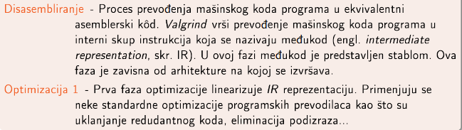
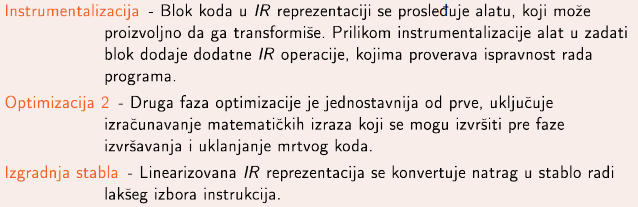
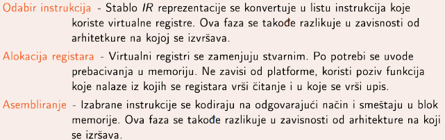

31. Analiza binarnog koda. Valgrind i Valgrind alati

- svi valgrind alati rade na istoj osnovi
- alat za dinamičku analizu koda se kreira kao dodatak, pisan u C-u, na jezgro Valgrinda
- Alat Valgrind = Jezgro Valgrind-a + alat koji se dodaje
- jezgro valgrinda - omogućava izvršavanje klijentskog programa, kao i snimanje izveštaja koji su nastali prilikom analize programa
- informacije koje se emituju se mogu iskoristiti za uklanjanje grešaka, optimizaciju koda, i još stvari

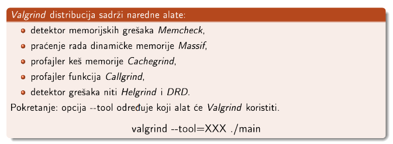

32. Analiza binarnog koda. Valgrind, Memcheck i Massif.

Valgrind
- detektuje memorijske greške korisničkog program
- ne vrši analizu izvornog koda već mašinskog
- radi za bilo koji jezik
- zbog translacije se izvršava 20-100 puta sporije
- alat dodaje izlaz za greške
- valgrind --tool=memcheck ./main
- detektuje:
    - upisivanje podataka van opsega hipa i steka
    - pristup oslobođenoj memoriji
    - duplo odlobađanje blokova
    - neuparenog korišćenja funkcija malloc/new/new[] i free/delete/delete[]
    - curenje memorije
    - korišćenje neinicijalizovane memorije
    - preklapanje parametara prosleđenih funkcijama
- Ako je opcija --leak-check uključena, za svaki neoslobođeni blok Memcheck određuje da li je moguće pristupiti tom bloku preko pokazivača
- Ako je uključena opcija --leak-check=yes, Memcheck će prikazati detaljan izveštaj
o svakom definitivno ili moguće izgubljenom bloku, kao i o tome gde je on alociran
- Memcheck smatra da je curenje memorije greška samo ako je uključena opcija --leak-check=full
- Definitivno i moguće izgubljeni blokovi se smatraju za pravu ½grešku, dok indirektno izgubljeni i još uvek dostupni blokovi se ne smatraju kao greška.

Massif
- alat za analizu hip memorije korisničkog programa
- memchek ne može da detektuje neke tipove curenja memorije, npr ako pokazivač i dalje postoji ali se memorija više ne koristi
- massif otkriva koja se memorija ne koristi
- daje informaciju koliko se hipa koristi, koji deo programa je odgovoran za alokaciju memorije
- program radi veoma sporo, a statistika je na kraju ispisana u fajl massif.out.<pid>, ili definisan sa --massif-out-file
- ms_print massif.ou.1234 - da bi dobili čitljiv format, proizvodi graf koji pokazuje trošenje memorje tokom izvršavanja, detaljne informacije o različitim tačkama programa koje su odgovorne o alokaciji memorije
- meri samo hip memoriju, tj memoriju alocirano sa malloc, calloc, realloc, memalign, new, new[] is sl
- ne meri memoriju alociranu sistemskim poivima kao što su mmap, mremap i brk

33. Analiza binarnog koda. Valgrind, Cachegrind i Callgrind.

Cachegrind
- alat koji omogućava softversko profajliranje keš memorije tako što
simulira i prati pristup keš memoriji mašine na kojoj se program, koji se analizira,
izvršava
- moše se koristiti i za profajliranje izvršavanja grana
- simulira memoriju mašine, ima prvi nivo keša podeljen u dve odvojene nezavisne sekcije
    - l1 sekcija - instukcije
    - D1 sekcija - podaci
- drugi nivo keša koji simulira je objedinjen L2
- ukoliko mašina ima više od dva nivo keša, onda se simulira pristup prvom i poslednjem nivou keša
- generalno, simulira l1, D1 i LL (poslednji nivo keša)
- prikupljaju se naredni statistički poaci o programu koji se analizira:
    - lr - ukupno izvršenih instrukcija
    - l1mr - broj promašaja čitanja instrukcija iz keš memorije nivoa l1
    - ILmr - broj promašaja čitanja instrukcija iz keš memorije nivoa LL
    - Dr - ukupan broj čitanja memorije
    - D1mr - broj promašaja čitanja nivoa keš memorije D1
    - DLmr - broj promašaja čitanja nivoa keš memorije LL
    - Dw - ukupan broj pisanja u memoriju
    - D1mw - broj promašaja pisanja u nivo keš memorije D1
    DLmw - broj promašaja pisanja u nivo keš memorije LL
- statistike se prikupljaju na nivou celog programa, i pojedinačno na nivou funkcija
- na modernim mašinama L1 promašaj košta oko 10 procesorskih ciklusa, LL promašaj košta oko 200 procesorskih ciklusa
- na izlaz idu sumarne infomacije, a detalji se ispisuju u fajl cachegrind.out.<pid>
- alat grupiše sve troškove po fajlovima i funkcijama kojima ti troškovi pripadaju
- gobalne statistike se računaju prilikom prikaza rezultat, time se štedi vreme, jer se kešu pristupa čest pa bi nekoliko instrukcija sabiranja značajno usporilo
- krajnji fajl je čitljiv, ali cg_annotate lepše prikazuje
- cg_merge sumira u jednu datoteku izveštaje dobijene višestrukim izvršavanjem nad istim programom
- cg_diff - pravi razliku između više izlata cachegrinda

Callgrind
- generiše listu poziva funkcija korisničkog programa u vidu grafa
- sakupljeni podaci:
    - broj izvršenih instrukcija
    - odnos izvršenih instukcija sa linijom u izvršnom kodu
    - odnos pozivaoc/pozvan između funkcija
    - broj poziva
- može da vrši analiu keš memorije i profajliranje grana sličnno cachegrindu

- za callgrind i cachegrin se program kompajlira sa optimizacijama, a ne u debug modu kao za ostale valgrind alate

- podaci se po završetku zapisuju u fajl
- podržane komanda
    - callgrind_annotate - prikazuje listu funkcija
    - callgrind_control - interaktivna kontrola i nadgledanje programa prilikom izvršavanja, mogu se dobiti informacije o stanjnu na steku, može se u svakom trenutku generisati profil

- Alat Cachegrind sakuplja podatke, odnosno broji događaje koji se dešavaju direktno u jednoj funkciji. Ovaj mehanizam sakupljanja podataka se naziva ekskluzivnim.
- Alat Callgrind proširuje ovu funkcionalnost tako što propagira cenu funkcije preko njenih granica. Na primer, ako funkcija foo poziva funkciju bar, cena funkcije bar se dodaje funkciji foo. Kada se ovaj mehanizam primeni na celu funkciju, dobija se slika takozvanih inkluzivnih poziva, gde cena svake funkcije uključuje i cene svih
funkcija koje ona poziva, direktno ili indirektno.

- može se odrediti koja funkcija ima najveću cenu poziva
- pozivaoc/pozvan cena je izuzetno korisna za profilisanje funkcija koje imaju više poziva iz raznih funkcija, i gde imamo priliku optimizacije našeg programa menjajući kod u funkciji koja je pozivaoc, tačnije redukovanjem broja poziva

34. Analiza binarnog koda. Valgrind, Helgrind i DRD.

Helgrind
- otkriva greške sinhronizacije prilikom upotrebe modela niti POSIX

DRD
- detektuje gerške u C i C++ programima koji koriste više niti
- radi za sve programe koji koriste niti POSIX standarda ili koji koriste koncepte koji su nadograđeni na ovaj standard

DRD i Halgrind
- koriste različite algoritme za otkrivanje grešaka
- ne otkrivaju iste tipove grešaka, iako imaju dosta poklapanja
- greška u otključavanju muteksa - ako je muteks nevažeći, nije zaključan ili je zaključan od strane druge niti
- greške u radu sa zaključanim muteksom - uništaanje nevažećeg ili zaključanog muteksa, dealokacija memorije koja sadrži zaključan muteks
- greške prilikom korišćenja funkcije pthread_cond_wait - prosleđivanje nezaključanog, nevažećeg ili muteksa koga je zaključala druga nit
- greške sa pthread barrier - nevažeća ili dupla inicijalizacija, čekanje na objekat koji nije nikada inicijalizovan...
- mrtvo blokiranje kao posledica problema u redosledu zaključavanja
- pristup memoriji bez adekvatnog zaključavanja i sinhornizacije
- DRD - zadržavanje katanca i lažno deljenje

35. Statička analiza. Svrha, ciljevi i važnost pregleda koda.

Statička analiza koda
- analiza koda bez njegovog izvršavanja sa ciljem pronalaženja grešaka
- u obliku pregleda ili automatiovana

Pregled koda
- obuhvataju ljudske kontrole koda najčešće pre nego što kod uđe u glavni repozitorijum
- otkrivanje grešaka
- cilj: povećati kvalitet koda, smanjiti broj grešaka, dokumentovati kod
- ne garantuje da će se naći sve greške

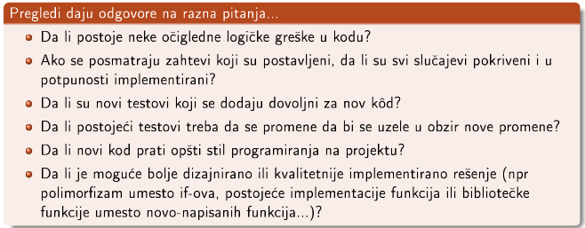

- vidi se konzistentnsot, mala/velika slova, razmaci, čitljivost, da li je promenljiva inicijalizovana, ponovljena izračunavanja, formatiranje, da li može da se koristi neka bibliotečka funkcija

36. Statička analiza. Vrste pregleda koda.

- manje ili više formalno

Formalni pregledi koda
- grupni sastanak 3-6 osoba na kojima se diskutuje o kodu i rade pregledi, često i odštampanog koda
- dosta skupo i vremenski zahtevno
- pronalazi najveći broj defekata u kodu

Neformalni pregledi
- pregledi preko ramena
    - najneformalniji
    - programer objašnjava pregledaču šta je u kodu i zašto
    - ne mora uživo, može deljenje ekrana
    - najjednostavniji, najmanj zatevan, lakša razmena ideja nego pisano
    - nemoguće ispratiti šta je pregledano, moguće propustiti neku izmenu, nema ponovnih pregleda nakon ispravke greške, pa se možda pogrešno ispravi
- pregledi preko mejla
    - izmena stigne mejlom pregledačima
    - lakše ako je pregledač na drugoj lokaciji
    - može pre ili nakon što kod uđe u repozitorijum
    - dugo bila najčešća, ali prevaziđena
- pregledi preko alata za pregled koda
    - sastavni deo većine agilnih metodologija razvoja softvera
    - pregled od strane jednog ili više (iskusnih) programera pre nego kod uđe u repozitorijum
    - alati za podršku: Phabricator, Gerrit, Collaborator, Gitlab
- programiranje u paru
    - specijalna vrsta pregleda
    - ne može uvek
    - kvalitetniji kod, ali i dalje mogu da se previde greške

37. Statička analiza. Uticaj pregleda koda. Uloga pregleda koda u agilnom razvoju. Osnovna pravila efikasnog pregledanja.

Uticaj pregleda koda:
- ako zahtevamo pregled koda pre ulaska u repozitorijum, onda se mora pregledati
- ako znamo da će neko pregledati naš kod potrudićemo se da bude dobar 
- proverava ono što mašina ne može, sprečava loše odluke i loša rešenja
- mentorisanje novih programera
- iskusniji programeri mogu da uvide nove ideje mlađih kolega
- programer može lakše da savlada ceo kod i usvoji nove tehnike
- izlažu programera novim idejama

Agilni razvoj
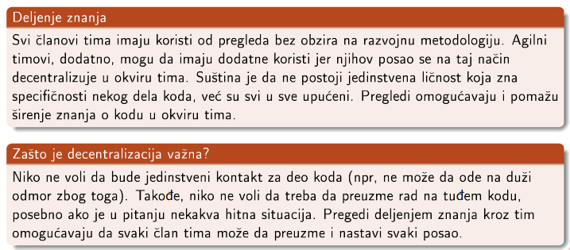

- 11 pravila efikasnog pregledanja:
    1. Pregledaj manje od 200-400 linija koda od jednom
    2. Imaj za cilj brzinu pregledanja koja je manja od 300-500 linija po satu
    3. Planiraj dovoljno vremena za odgovarajuće, sporo pregledanje, ali nikako više od 60 do 90 mintua
    4. Postaraj se da autori obeleže kod pre nego što pregled počne
    5. Napravi ciljeve pregledanja koda koji se mogu kvantifikovati i prati metrike kako bi mogao da unaprediš svoj proces pregledanja
    6. Koristi liste provera koje treba da uradiš, jer se na taj način značajno popravlja rezultat pregleda i za autora i za pregledača
    7. Proveri da su uočeni defekti stvarno i popravljeni
    8. Neguj dobru kulturu pregleda koda u kojoj se pronalaženje defekata gleda pozitivno
    9. Budi svesan efekta *Velikog brata* (Programer može steći utisak da ga neko stalno posmatra, pogotovo ako radi sa alatima za pregledanje. Može da misli da će statistike biti iskorišćene protiv njega i može se fokusirati na poboljšanje statistika umesto na poboljšanje koda)
    10. Ukoliko ne možeš da postigneš pregled celog koda, pogledaj bar njegov deo (zbog benefita koji donosi *ego* efekat - svako ulaže dodatni trud kada zna da će njegov kod neko pregledati)
    11. Usvoji proces pregleda koda koji koristi alate za pregled koda

38. Simboličko izvršavanje. Istorija, alati, stablo izvršavanja

Simboličko izvršavanje
- izvršavamo program simbolima
- pratimo simbolička stanja umesto konkretnih ulaza
- puto putanja se izvršava simultano, kada ivršavanje neke utanje može da se nastavi na više načina pravimo nove putanje i dodajemo uslove nad simboličkim vrednostima
- izvršavanjem jedne putanje simuliramo veliki broj testova s obzirom da razmatramo sve ulaze koji prolaze kroz tu istu putanju

Istorija
- tehnika nastala 70ih godina prošlog veka
- radovi *Symbolic execution and program testing*, *SELECT - a formal system for testing and debugging programs by symbolic execution*, *A program testing system*, *Program testing techniques using simulated execution*
- praktčno se koristi tek od 2005
- u početku nije bilo jasno kako rešiti neke probleme koji su se javili
- Alati koji su napravili proboj
    - DART - Godfroid and Sen, uvođenje dinamičkog izvršavanja u simboličko izvršavanje
    - EXE - Cadar, Genesh, Pawlowski, Dilll, Engles, STP podrška za teoriju nizova

Alati

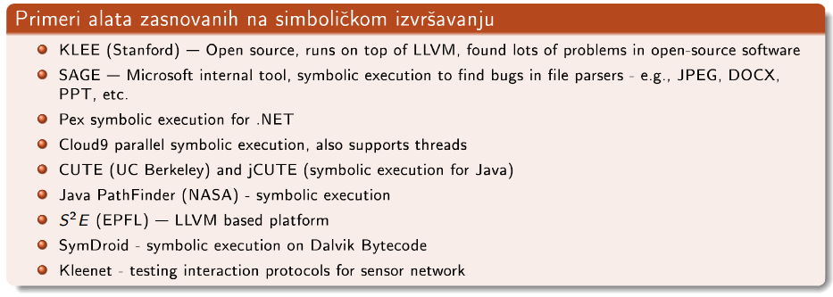

Stablo izvršavanja
- izvršavanje programa nad simboličkim vrednostima
- simbolička stanja preslikavaju promenljive u simboličke vrednosti
- uslov putanje - formula bez kvantifikatora nad simboličkim ulazima koja sadrži sve odluke koje su do te prilike donete
- sve putanje programa formiraju stablo izvršavanja

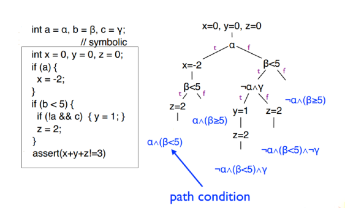
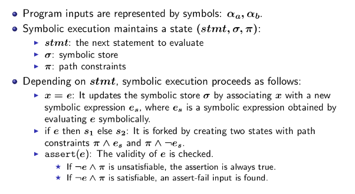

39. Simboličko izvršavanje. Primene.

- pronalaženje grešaka
- 30% grešaka u razvoju Windows7 Majkrosoft je našao simboličkim izvršavanjem
- generisanje test primera
- otkrivanje nedostužnih putanja
- generisanje invarijantni programa, automatske ispravke programa

40. Simboličko izvršavanje. Izazovi.

- teorijski: možemo generisati sve moguće putanje kroz koje program može da prođe za vreme konkretnog izvršavanja programa na nekim konkretnim ulazima, pod pretpostavkom da se svako konkretno izvršavanje zaustavlja
- teško izvodljivo u praksi

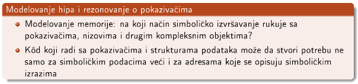
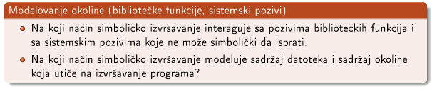
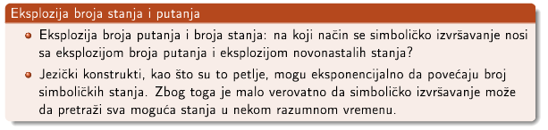
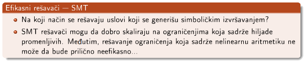
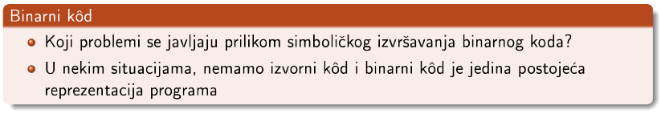
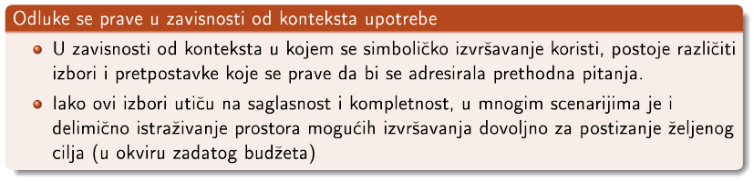

- Lažno pozitivno, lažno upozorenje - prijavi da može da izazove grešku a zapravo može
- Lažno negativno - kaže da je kod u redu a nije
- Saglasno - nema lažno negativne, ako kaže da je ispravan onda je ispravan
- Kompletnost - nema lažno pozitivnih, ako kaže da je neispravan onda je neispravan

41. Simboličko izvršavanje. Konkoličko izvršavanje.

- mešanje konkretnog i simboličkog izvršavanje
- omogućava praktičnu upotrebu simboličkog izvršavanja

Vrste izvršavanja:
- dinamičko simboličko izvršvanje
    - simboličko izvršavanje vođeno konkretniim vrednostima
    - pored simboličkog skladišta, uslova putanja čuva se i konkretno skladište
    - izvršavanje počinje proizvljnim ulazom
    - program se izvršava i konkretno i simbolički tako što se simultano ažuriraju oba skladišta i uslovi putanje
    - Kada god konkretno izvršavanje krene nekom konkretnom granom, simboličko izvršavanje se usmerava prema istoj grani i uslovi putanje se ažuriraju u skladu sa uslovom koji je zadovoljen da bi se tom granom krenulo
    - simboličko izvršavanje je vođeno specifičnim konkretnim izvršavanjem
    - izvršavanje ne mora da poziva rešavač ograničenja da odluči da li ja neka grana dostupna, tj da li je formula koja odgovra uslovima putanje zadovoljena, to se direktno proverava konkretnim izvršavanjem
    - Da bi se istražile različite putanje, uslovi putanje koji su zadati sa jednim ili više grananja se mogu negirati, i tako dobijena formula se može dati SMT rešavaču da pronađe nove ulaze koji će onda ići tom novom putanjom
    - ponavljati onoliko puta koliko je to potrebno da se dostigne odgovarajuća pokrivenost
- selektivno simboličko izvršvanje
    - neko želi da istraži samo neke delove koda u potpunosti, tj simbolički, a da pritom nije zainteresovan za neke druge delove koda
    - selektivno simboličko izvršavanje prepliće konkretno i simboličko izvršavanje održavajući pritom analizu smislenom

42. Simboličko izvršavanje. Strategije obilaska puteva. Pretraga u dubinu, širinu i odabir slučajnog
puta.

- tražimo uslov koji će biti negiran da bi se omogućila pretrage nove putaje
- važno je efikasno vršti ovu pretragu jer broj grana može biti veoma velik
- alati koji koriste dinamičko simoličko izvršavanje - alati za rasplinuto testiranje bele kutije
- početni ulaz je bitan

Heuristike vođene ciljevima
- obilazak svih putanja je preskup
- heuristike za izbor putanja - pomažu ostvarivanju specifičnih ciljeva
- pronalaženje univerzalno optimalne strategije je otvoren istraživački problem

Tehnike zasnovane na strukturi koda
- BFS
    - prate se putanje paralelno
    - veće memorijsko zauzeće
    - dosta vremena dok se putanja završi do kraja
    - omogućava brzo istraživanje skroz različitih putanja i ranu detekciju interesantnog ponašanja sistema
    - ako se traži kompletno istraživanje jedne ili više putanja BFS zahteva jako puno vremena
- DFS
    - prati putanju dok je moguće, onda backtracking na najdublju neistraženu granu
    - prioritet: smanjiti upotrebu memoriju
    - često biva uhvaćena putanja koja sadrži petlje ili rekurzivne puteve

- Random pretraga
    - koristi se pseudorandom i čuva se seed
    - sledeća putanja se bira random metodom, random metodom restartuj pretragu ukoliko se ništa novo ne dešava već neko vreme, ako imamo putanje jednakih prioriteta naredna se bira random
    - random izbor putanje sa težinama, KLEE dodeljuje težine putanjama koje zavise od njihove dužine i arnosti njihovog grananja, favorizuju se grane koje su manje puta bile izražene

43. Simboličko izvršavanje. Strategije obilaska puteva. Izvršavanje vođeno pokrivenošću koda. Simboličko izvršavanje najkraćeg rastojanja.

Izvršavanje vođeno pokrivenošću koda
- izaberi putanju koja će najverovatnije da izvrši neku novu instrukciju
- pokušaj da posetiš instrukcije koje ranije nisu bile izvršavane, ukoliko takve putanje nema, izaberi onu putanju u kojoj su instrukcije izvršvane najmanji broj puta
- dobra strana: greške su u delovima koda koji se retko izvršavaju, a ova strategija pokušava da dopre do njih
- KLEE - za svako stanje izračunava se težina koja se koristi prilikom random izbora stanja sa kojim se izvršavanje nastavlja. Težina se izračunava razmatranjem koliko daleko se nalazi instrukcija koja nije pokrivena, da li je novi kod otkriven iz tog stanja
relativno skoro, kao i iz kojih stanja se došlo do datog stanja

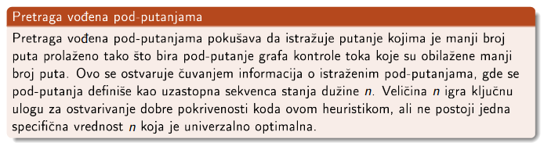

Simboličko izvršavanje najkraćeg rastojanja
- cilj nije povećavanje pokrivenosti koda
- cilj je pronalaženje ulazni parametara koji će uzrokovati izvršavanje neke izabrane tačke u programu
- heuristika zasnovana na metrikama za evaluaciju najkraćeg rastojanja do ciljne tačke
- rastojanje se računa kao dužina najkaće putanje u grafu interproceduralne kontrole toka i putanjama koje imaju najkaću distanu se daje prioritet

44. Simboličko izvršavanje. Strategije obilaska puteva. Generacijska pretraga. Kombinovana strategija.

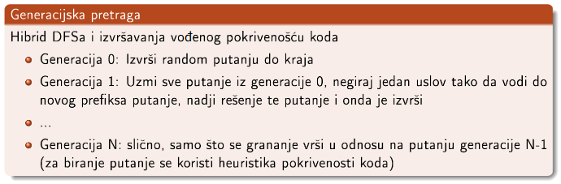

Kombinovana strategija:
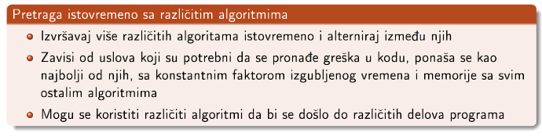

45. Simboličko izvršavanje. Strategije obilaska puteva. Tehnike izvršavanja unazad.

SBE - Symbolic Backwards Execution
- analiza se izvršava u obrnutom smeru, izvršavanje kreće od ciljne tačke prema tački ulaza u program
- cilj: napraviti test primer koji uzrokuje izvršavanje specifične linije koda, obično assert ili throw naredbe
- korisni za debagovanje ili regresiono testiranje
- ograničenja putanje se skupljaju po grananjima unazd
- više putanja se istražuje odjednom kao kod običnog simboličkog izvršavanja
- putanje se povrmeno proveravaju da li su dostižne, ako se utvrdi da je nedostižna onda se odbacuje i radi se backtracking

CCBSE - Call-chain backwards symbolic execution
- tehnika započinje utvrđivanjem validne putanje u okviru funkcije gde je ciljna linija locirana
- kada se putanja pronađe: pomeramo se na funkciju pozivaoca ove funkcije i pokušavamo da rekonstruišemo validnu putanju od njenog ulaza do poziva funkcije u kojoj je ciljna linija koda
- proces se rekurzivno nastavlja dok ne dođemo do main funckije

SBE vs CCSBE
- u okviru svake funkcije za CCSBE izvršava obično simboličko izvršavanje, a SBE izvršava unazad

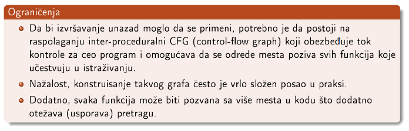

46. Simboličko izvršavanje. Modelovanje memorije. Puna simbolička memorija.